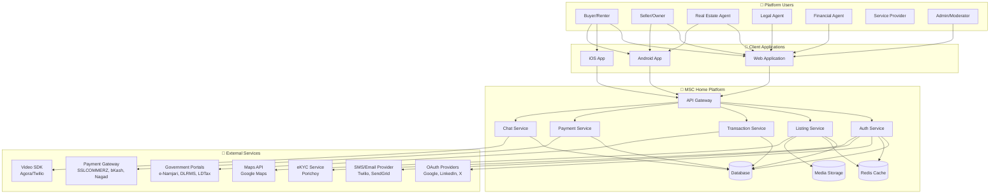

# Software Requirements Specification
# MSC Home Rental & Real Estate Platform

---

**Document ID:** SRS-MSC-HOME-2026-v1.0  
**Project Name:** MSC Home - Verified Real Estate Marketplace  
**Client:** MSC Home Platform  
**Prepared By:** CodeStorm Hub Development Team  
**Document Owner:** Product Manager, MSC Home  
**Date:** January 3, 2026  
**Status:** CLIENT REVIEW  
**Version:** 1.0

---

## Document Control

| Version | Date | Author | Changes | Approver |
|---------|------|--------|---------|----------|
| 0.1 | Dec 2025 | Dev Team | Initial draft | - |
| 0.9 | Jan 2, 2026 | Dev Team | Complete requirements | - |
| 1.0 | Jan 3, 2026 | Dev Team | Client-ready version | Pending |

---

## Executive Summary

MSC Home Rental & Real Estate Platform is a comprehensive digital solution designed to **revolutionize Bangladesh's real estate market** by providing a secure, verified, and transparent environment for property transactions. This platform addresses critical pain points in the current market: **low trust, hidden property details, unfair pricing, difficulty verifying legal documents, and loan affordability constraints**.

### Business Objectives

1. **Build Trust:** Establish a verified marketplace where buyers and sellers can transact with confidence through identity verification, professional badges, and listing authentication
2. **Increase Transparency:** Provide complete property information with accuracy scoring, document vaults, and cost transparency
3. **Streamline Transactions:** Support the complete transaction workflow from property search to deal closure with integrated legal and financial support
4. **Bangladesh-Specific Integration:** Native support for Bayna, Dalil, Namjari, and government portal workflows
5. **Enable Secure Payments:** Multi-gateway integration with buyer protection mechanisms to ensure financial security

### Key Platform Features

- **✅ Verified Marketplace:** Multi-tier verification system including identity verification, professional badges (URA-certified agents), listing authentication, and ownership verification
- **🏘️ Complete Transaction Workflow:** End-to-end process from property search to handover with step-by-step tracking, document management, and milestone validation
- **🇧🇩 Bangladesh-Specific Integration:** Native support for Bayna (sale agreement), Dalil (registered deed), Namjari (mutation), and government portal link-outs
- **💳 Secure Payment System:** Multi-gateway integration (SSLCOMMERZ, bKash, Nagad) with OTP/3DS verification and buyer protection
- **💬 Communication Suite:** In-platform chat, audio/video calls, appointment scheduling, and inquiry management
- **🤝 Professional Network:** Connect buyers, sellers, URA-certified agents, legal advisors, and financial institutions

### Target Users

| User Type | Description | Key Needs |
|-----------|-------------|-----------|
| **Property Buyers** | Individuals seeking to purchase property | Trust, transparency, legal support, financing options |
| **Property Renters** | Individuals seeking rental properties | Verified listings, clear terms, secure deposits |
| **Property Sellers** | Owners selling property | Serious buyers, fast transactions, legal assistance |
| **Landlords** | Property owners offering rentals | Reliable tenants, lease management, income tracking |
| **Real Estate Agents** | URA-certified professionals | Lead generation, credibility, fast communication |
| **Legal Advisors** | Lawyers specializing in property law | Service discovery, case management, reputation building |
| **Financial Institutions** | Banks and NBFIs offering loans | Qualified leads, document verification, loan processing |
| **Service Providers** | Architects, designers, surveyors | Project opportunities, portfolio showcase, client reviews |

### Technical Scope

The platform encompasses:

- **Web Application:** Responsive design supporting all modern browsers (Chrome, Firefox, Safari, Edge)
- **Mobile Applications:** Native Android and iOS apps with offline capabilities
- **Admin Dashboard:** Comprehensive tools for user management, verification, moderation, and analytics
- **Integration Ecosystem:** Payment gateways, maps, eKYC providers, SMS/email services, government portals

### Success Metrics & ROI

Based on market research with **97.6% demand for advanced search**, **78.3% prioritizing trustworthiness**, and **95.2% wanting post-transaction ratings**, the platform targets:

- **Year 1:** 10,000 verified listings, 50,000 registered users, 1,000 completed transactions
- **Trust Score:** 90% of users rate platform security as "Excellent" or "Good"
- **Transaction Velocity:** Average time from offer to handover reduced by 40% vs. traditional methods
- **Verification Rate:** 80% of active agents achieve verified badge status

### Investment & Timeline

- **Development Phase:** 6-9 months (MVP: 4 months, Full: 6-9 months)
- **Estimated Investment:** [To be determined based on scope]
- **Go-Live Strategy:** Phased rollout starting with Dhaka metropolitan area, expanding to major cities

### Compliance & Standards

This SRS document aligns with:
- ✅ **IEEE 830-1998** Software Requirements Specifications
- ✅ **ISO/IEC/IEEE 29148:2018** Requirements Engineering Standard
- ✅ **OWASP Top 10** Security Best Practices
- ✅ **WCAG 2.1 Level AA** Accessibility Guidelines (recommended for core flows)
- ✅ **PCI DSS Awareness** Payment Card Industry Data Security Standard considerations

---

> **Note to Stakeholders:** This document consolidates requirements based on extensive market research, user studies, and Bangladesh real estate industry best practices. All requirements have been validated for technical feasibility and business value. Your feedback and approval are critical to ensure alignment with business objectives.

---

## Document Conventions

### Requirement Notation

This SRS uses the **RFC 2119 standard** for requirement priority levels:

- **SHALL / MUST:** Absolute requirement, mandatory for system operation
  - Example: "The system SHALL validate email format before account creation"
  
- **SHOULD:** Strong recommendation, flexibility exists for valid reasons
  - Example: "The system SHOULD display property images in carousel format"
  
- **MAY:** Optional feature, nice-to-have enhancement
  - Example: "The system MAY allow users to save favorite searches"

### Priority Levels

- **P0 (MVP Must-Have):** Critical for initial product launch, blocking feature
- **P1 (Near-Term):** Important for competitive advantage, deliver within 3 months post-MVP
- **P2 (Future Enhancement):** Nice-to-have features, roadmap beyond 6 months

### Requirement Numbering

| Prefix | Type | Example |
|--------|------|---------|
| **FR-** | Functional Requirement | FR-001, FR-002, FR-003 |
| **NFR-** | Non-Functional Requirement | NFR-SEC-001, NFR-PERF-001 |
| **BR-** | Business Rule | BR-001, BR-002 |
| **US-** | User Story | US-B1 (Buyer), US-S1 (Seller), US-L1 (Legal), US-A1 (Admin) |

### Diagram Notation

All diagrams use **Mermaid.js** notation and are numbered sequentially:
- **Figure X.Y:** Section number (X) and diagram sequence (Y)
- Each diagram includes descriptive title and context

### Typography

- **Bold text:** Key terms, requirement identifiers, section headers
- *Italic text:* Emphasis, real-world scenarios, examples
- `Code format`: System identifiers, API endpoints, database fields, technical values

---

## Table of Contents

### 1. Introduction
- 1.1 Purpose
- 1.2 Scope
- 1.3 Intended Audience
- 1.4 Definitions, Acronyms, and Abbreviations
- 1.5 References
- 1.6 Document Overview

### 2. Overall Product Description
- 2.1 Product Perspective
- 2.2 Problem Statement
- 2.3 Product Vision & Goals
- 2.4 Research Validation & Market Signals
- 2.5 Product Positioning

### 3. System Context & Stakeholders
- 3.1 Stakeholder Identification
- 3.2 Primary User Actors
- 3.3 Secondary User Actors
- 3.4 External Systems & Dependencies
- 3.5 Roles & Permissions (RBAC + ABAC)

### 4. User Personas
- 4.1 Buyer Persona (Sumaiya Akter - First-time Buyer)
- 4.2 Seller Persona (Rakib Hasan - Experienced Seller)
- 4.3 Agent Persona (Rafiq Ahmed - URA-Certified Agent)
- 4.4 Legal Agent Persona (Advocate Tahmina Sultana)
- 4.5 Financial Agent Persona

### 5. System Features & Module Overview
- 5.1 Authentication & Account Management
- 5.2 User Profile & Professional Mode
- 5.3 Verification & Trust System
- 5.4 Property Marketplace & Listings
- 5.5 Search & Discovery
- 5.6 Communication & Appointments
- 5.7 Offers, Orders & Transactions
- 5.8 Payment Integration
- 5.9 Legal Support Services
- 5.10 Financial Support Services
- 5.11 Reputation & Reviews
- 5.12 Admin & Moderation
- 5.13 Additional Modules (P1/P2)

### 6. Assumptions, Constraints & Dependencies
- 6.1 Assumptions
- 6.2 Constraints
- 6.3 External Dependencies

### 7. Functional Requirements (FR-1 to FR-93)
- 7.1 Authentication & Account (FR-1 to FR-4)
- 7.2 User Profile & Professional Data (FR-5 to FR-7)
- 7.3 Verification & Trust (FR-8 to FR-11)
- 7.4 Listings & Media (FR-12 to FR-18)
- 7.5 Search & Discovery (FR-19 to FR-22)
- 7.6 Communication & Appointments (FR-23 to FR-26)
- 7.7 Offers, Orders, Transactions (FR-27 to FR-32)
- 7.8 Payments (FR-33 to FR-35)
- 7.9 Legal Support (FR-36 to FR-38)
- 7.10 Financial Support (FR-39 to FR-40)
- 7.11 Reviews & Reputation (FR-41 to FR-43)
- 7.12 Notifications (FR-44 to FR-45)
- 7.13 Community + Content (FR-46 to FR-49) [P2]
- 7.14 Admin/Moderation (FR-50 to FR-51)
- 7.15 Transparency & Guides (FR-52 to FR-55)
- 7.16 Safety & Disputes (FR-56 to FR-57)
- 7.17 Real Estate Projects (FR-58 to FR-59)
- 7.18 Monetization (FR-60 to FR-61)
- 7.19 Service Provider Marketplace (FR-62 to FR-65)
- 7.20 Government Land Portals (FR-66 to FR-69)
- 7.21 Payment Gateway Integration (FR-70 to FR-74)
- 7.22 Operational & Safety (FR-75 to FR-93)

### 8. Business Rules (BR-1 to BR-43)
- 8.1 Verification Rules
- 8.2 Accuracy Score Rules
- 8.3 Cost Transparency Rules
- 8.4 Offer & Transaction Rules
- 8.5 Payment Rules
- 8.6 Buyer Protection & Disputes
- 8.7 Review Rules
- 8.8 Service Provider Rules
- 8.9 Payment Gateway Validation
- 8.10 Listing Lifecycle & Moderation
- 8.11 Document Vault Access
- 8.12 Messaging Safety
- 8.13 Notification Rules
- 8.14 Cancellation & Refund Rules

### 9. User Stories & Real-World Scenarios
- 9.1 Buyer Stories (US-B1 to US-B7)
- 9.2 Seller/Agent Stories (US-S1 to US-S5)
- 9.3 Legal Agent Stories (US-L1)
- 9.4 Admin/Verifier Stories (US-A1 to US-A2)
- 9.5 User Story Summary Matrix

### 10. Data Requirements & Entity Model
- 10.1 Core Entities (MVP)
- 10.2 Bangladesh-Specific Document Types
- 10.3 Additional Entities

### 11. Entity Relationship Diagrams
- 11.1 Core Marketplace ERD
- 11.2 Extended Operational ERD
- 11.3 Auth & Social Login ERD
- 11.4 Community & Content ERD

### 12. Transaction Flow & State Machines
- 12.1 Offer State Machine
- 12.2 Transaction State Machine (Buy/Sell)
- 12.3 Transaction State Machine (Rent)
- 12.4 Bangladesh Transaction Step Workflow

### 13. System Diagrams
- 13.1 Listing Lifecycle State Diagram
- 13.2 Verification Flow Sequence Diagram
- 13.3 Payment Flow with OTP/3DS
- 13.4 System Context & External Integrations
- 13.5 Hosted Checkout + IPN + Validation
- 13.6 Dispute Lifecycle State Diagram
- 13.7 Document Vault Access Decision Flow
- 13.8 Notification Delivery Sequence
- 13.9 Portal Tracking Assistance Flow
- 13.10 Use Case Diagram
- 13.11 High-Level Architecture Diagram
- 13.12 Data Flow Diagram
- 13.13 Component Interaction Diagram
- 13.14 Deployment Architecture Diagram

### 14. Non-Functional Requirements (NFR)
- 14.1 Security Requirements
- 14.2 Performance Requirements
- 14.3 Scalability Requirements
- 14.4 Reliability & Availability
- 14.5 Privacy & Data Protection
- 14.6 Accessibility & Localization
- 14.7 Observability & Monitoring

### 15. Appendices
- 15.1 Glossary of Terms
- 15.2 Acronyms & Abbreviations
- 15.3 Technical Standards & Compliance
- 15.4 External References
- 15.5 Requirements Traceability Matrix
- 15.6 Approval & Sign-Off

---

## 1. Introduction

### 1.1 Purpose

This Software Requirements Specification (SRS) document defines comprehensive, implementable requirements for **MSC Home Rental & Real Estate Platform**, a verified property marketplace for Bangladesh. The platform encompasses:

- **Core Marketplace:** Property listings, search, and discovery
- **Trust & Verification:** Identity, professional, and listing verification system
- **Transaction Management:** Complete workflow from offer to handover
- **Communication Tools:** Chat, audio/video, appointment booking
- **Legal & Financial Support:** Integrated professional services
- **Secure Payments:** Multi-gateway integration with buyer protection
- **Bangladesh-Specific Features:** Bayna, Dalil, Namjari tracking and government portal integration

This document serves as the **authoritative source** for all system requirements and provides a foundation for:
- Development team implementation
- Quality assurance testing and validation
- Client approval and sign-off
- Future enhancements and change requests

### 1.2 Scope

**MSC Home Platform** addresses critical pain points in Bangladesh's real estate market by providing a comprehensive digital solution that transforms how properties are bought, sold, and rented.

#### In Scope (MVP & P1)

✅ **User Management**
- Account creation with email/phone + OTP verification
- Social OAuth login (Google, LinkedIn, X/Twitter)
- Professional mode switching for business users
- Multi-tier verification system (identity, professional, company, listing)

✅ **Marketplace Features**
- Property listing creation with media and document vault
- Advanced search with filters (location, price, verified-only)
- Map-based property discovery
- Listing accuracy score calculation
- Favorites and saved searches

✅ **Communication**
- Real-time chat between buyers and sellers
- Appointment booking with time slot management
- Audio/video calls (integrated SDK)
- Purpose capture for all communications

✅ **Transaction Management**
- Offer submission and negotiation workflow
- Transaction step tracking (12-step Bangladesh workflow)
- Document proof uploads per milestone
- Order and payment management

✅ **Payment Integration**
- Multi-gateway support (SSLCOMMERZ, bKash, Nagad)
- OTP/3DS verification
- IPN webhook processing
- Payment validation and reconciliation
- Buyer protection mechanisms

✅ **Professional Services**
- Legal agent directory and booking
- Financial agent directory and loan requests
- Service provider marketplace (architects, designers)

✅ **Reputation System**
- Post-transaction ratings and reviews
- Response time tracking for professionals
- Verified badge display

✅ **Admin & Moderation**
- Verification queue management
- Listing moderation
- Dispute resolution
- User management and audit logs

✅ **Bangladesh-Specific Integration**
- Government portal link-outs (e-Namjari, DLRMS, LDTax)
- Portal reference capture
- Status tracking assistance
- Support for Bayna, Dalil, Namjari workflows

#### Out of Scope (P2 / Future Enhancements)

❌ **Community Features** (Deferred to P2)
- Groups, pages, posts, and social feed
- Content publishing (blogs, videos)
- User-generated content moderation

❌ **Advanced Features** (Future Roadmap)
- AI-powered property valuation
- Automated document verification
- Blockchain-based deed registry
- Virtual reality property tours
- Predictive analytics for market trends

#### Geographic Scope

- **Phase 1:** Dhaka metropolitan area
- **Phase 2:** Major cities (Chittagong, Sylhet, Rajshahi, Khulna)
- **Phase 3:** National coverage

### 1.3 Intended Audience

This document is intended for:

| Audience | Purpose | Relevant Sections |
|----------|---------|-------------------|
| **Business Stakeholders** | Understand business value, features, and ROI | Executive Summary, Section 2, Section 4, Section 9 |
| **Product Managers** | Product roadmap, feature prioritization | Section 5, Section 7, Section 8 |
| **Development Team** | Technical implementation guidance | Section 7, Section 10, Section 11, Section 13, Section 14 |
| **QA/Testing Team** | Test case creation and validation | Section 7, Section 8, Section 9, Appendix 15.5 |
| **UI/UX Designers** | User flows, wireframes, mockups | Section 4, Section 9, Section 13 |
| **Legal/Compliance** | Regulatory requirements, data privacy | Section 3.5, Section 14.5, Section 15.3 |
| **Client Representatives** | Approval and sign-off | Executive Summary, All Sections, Appendix 15.6 |

### 1.4 Definitions, Acronyms, and Abbreviations

**Key Functional Terms:**

- **Accuracy Score:** Completeness percentage of a listing calculated from required and optional fields, displayed to users to indicate listing quality
- **Verified Badge:** Visual indicator on user profiles and listings showing successful completion of verification process
- **Professional Mode:** Account type for business users (agents, lawyers, financial advisors) with enhanced features and verification requirements
- **Document Vault:** Secure storage system for sensitive property documents with access control and audit logging
- **Access Grant:** Time-bound permission allowing specific users to view sensitive documents
- **Transaction Timeline:** Chronological record of all steps in a property transaction from offer to handover
- **Step Proof:** Evidence document (deed copy, payment receipt, etc.) uploaded to verify completion of a transaction milestone

**Bangladesh Property Terms:**

- **Bayna / Baina Nama:** Sale agreement or agreement to sell, a legally binding preliminary document in Bangladesh property transactions executed before final deed registration
- **Dalil:** Registered deed document obtained from Sub-Registrar office, serves as legal proof of property ownership transfer
- **Namjari (Mutation):** Legal process of updating ownership records in government land records after property transfer, essential for tax and ownership verification
- **Khatian:** Official land record document showing ownership details, plot number (Dag), area, and boundaries
- **Mouza:** Administrative land unit in Bangladesh used for property identification and record-keeping
- **Dag:** Plot number within a Mouza, forms part of the unique property identification system
- **DCR (Dhaka City Corporation Receipt):** Property tax receipt from city corporation for urban properties
- **Katha:** Traditional land measurement unit (1 Katha = 720 square feet in Bangladesh)
- **Decimal:** Land measurement unit (1 Decimal = 435.6 square feet)
- **Shotok:** Smallest land measurement unit (1 Shotok = 7.26 square feet)

**Technical Acronyms:**

- **API:** Application Programming Interface
- **RBAC:** Role-Based Access Control - permission system based on user roles
- **ABAC:** Attribute-Based Access Control - permission system based on user attributes and relationships
- **KYC:** Know Your Customer - identity verification process
- **eKYC:** Electronic KYC - digital identity verification using government databases
- **OTP:** One-Time Password - temporary password sent via SMS/Email for verification
- **3DS:** 3-Domain Secure - additional security layer for online card payments
- **IPN:** Instant Payment Notification - real-time payment status update from payment gateway
- **CDN:** Content Delivery Network - distributed server network for fast content delivery
- **TLS:** Transport Layer Security - encryption protocol for secure communications
- **JWT:** JSON Web Token - secure method for transmitting information between parties

**Regulatory & Compliance:**

- **URA:** Urban Development Authority (e.g., RAJUK in Dhaka) - regulatory body for real estate agents and property development
- **TIN:** Taxpayer Identification Number - tax identification for individuals and businesses
- **BIN:** Business Identification Number - unique identifier for registered businesses
- **NID:** National Identity Document - government-issued identity card
- **PCI DSS:** Payment Card Industry Data Security Standard
- **WCAG:** Web Content Accessibility Guidelines
- **OWASP:** Open Web Application Security Project

**Priority Indicators:**

- **P0:** Must-have for MVP launch
- **P1:** Important for competitive advantage, deliver within 3 months post-MVP
- **P2:** Nice-to-have features, long-term roadmap

*See Appendix 15.1 for complete glossary with detailed definitions.*

### 1.5 References

**Standards & Guidelines:**
1. IEEE Std 830-1998 - IEEE Recommended Practice for Software Requirements Specifications
2. ISO/IEC/IEEE 29148:2018 - Systems and software engineering — Life cycle processes — Requirements engineering
3. RFC 2119 - Key words for use in RFCs to Indicate Requirement Levels
4. WCAG 2.1 - Web Content Accessibility Guidelines (W3C)
5. OWASP Top 10 - Top 10 Web Application Security Risks

**External Systems Documentation:**
6. SSLCOMMERZ Developer Documentation: https://developer.sslcommerz.com/
7. bKash Merchant Integration Guide: https://developer.bkash.com/
8. Nagad Merchant API Documentation: https://developer.nagad.com.bd/
9. Google Maps Platform Documentation: https://developers.google.com/maps
10. Porichoy eKYC Documentation: https://porichoy.gov.bd/

**Government Portals:**
11. Bangladesh Land Mutation Portal: https://mutation.land.gov.bd/
12. DLRMS (Land Record System): https://dlrms.land.gov.bd/
13. Land Development Tax Portal: https://portal.ldtax.gov.bd/
14. Bangladesh National Portal: https://bangladesh.gov.bd/

**Internal Documents:**
15. MSC Home Product Roadmap (Internal)
16. Market Research Report - Bangladesh Real Estate (Internal)
17. User Interview Findings (Internal)
18. Technical Architecture Document (Internal)

### 1.6 Document Overview

This SRS is organized into 15 major sections:

**Sections 1-2** provide context: purpose, scope, problem statement, and product vision.

**Sections 3-5** define stakeholders, user personas, and system module overview for understanding who uses the system and what it does.

**Section 6** establishes assumptions, constraints, and dependencies that influence system design.

**Sections 7-8** specify all functional requirements (FR-1 to FR-93) and business rules (BR-1 to BR-43) - the core of this document.

**Section 9** provides detailed user stories with real-world scenarios, acceptance criteria, and test data.

**Sections 10-13** present data models, entity relationships, and comprehensive diagrams (ERD, state machines, sequence, architecture).

**Section 14** defines non-functional requirements covering security, performance, reliability, privacy, and accessibility.

**Section 15** includes appendices: glossary, standards compliance, traceability matrix, and approval forms.

Diagrams are numbered as **Figure X.Y** where X is section number and Y is diagram sequence within that section.

---

## 2. Overall Product Description

### 2.1 Product Perspective

MSC Home Rental & Real Estate Platform is a **new, standalone digital marketplace** designed specifically for the Bangladesh real estate market. While similar platforms exist globally (e.g., Zillow in the USA, 99acres in India), MSC Home is uniquely positioned to address Bangladesh-specific challenges and workflows.

**System Context:**

MSC Home operates as a **multi-sided marketplace platform** connecting:
- Property buyers/renters (demand side)
- Property sellers/landlords (supply side)
- Real estate agents (facilitators)
- Legal advisors (professional services)
- Financial institutions (enablers)
- Government systems (regulatory integration)

The platform serves as the **central hub** for all real estate activities, integrating with external systems while maintaining core transaction data and user relationships internally.

**Key Differentiators:**

1. **Verification-First Approach:** Multi-tier verification system (identity, professional, listing, ownership) creates a trusted ecosystem
2. **Bangladesh Legal Process Integration:** Native support for Bayna, Dalil, Namjari workflows with government portal assistance
3. **Complete Transaction Workflow:** End-to-end process management from initial interest to property handover
4. **Buyer Protection:** Secure payment handling with dispute resolution mechanisms
5. **Professional Network:** Integrated legal and financial services marketplace

**Figure 2.1: System Context Diagram**



### 2.2 Problem Statement

Bangladesh's real estate market faces **significant trust and efficiency challenges** that prevent optimal outcomes for all parties:

**Critical Problems Identified:**

1. **Low Trust & Transparency**
   - Hidden property defects and incomplete information
   - Fraudulent listings and identity misrepresentation
   - Unfair pricing with hidden costs
   - Difficulty verifying property ownership and legal documents
   - *Impact:* Buyers avoid online platforms, preferring word-of-mouth despite inefficiency

2. **Complex Legal Processes**
   - Bayna, Dalil, Namjari workflows are confusing for first-time buyers
   - Difficulty finding reliable legal advisors
   - Lack of step-by-step guidance for document requirements
   - Manual tracking of government portal submissions
   - *Impact:* Transactions delayed by 30-60 days due to legal confusion

3. **Financial Constraints**
   - Limited visibility into loan options and eligibility
   - Difficulty connecting with financial institutions
   - Lack of transparency on interest rates and terms
   - No integrated loan application workflow
   - *Impact:* 40% of potential buyers abandon purchase due to financing challenges

4. **Communication Inefficiencies**
   - Multiple platforms (phone, Facebook, WhatsApp) create fragmented communication
   - No centralized record of discussions and agreements
   - Difficulty scheduling property visits
   - Slow response times from agents
   - *Impact:* Average 7-10 days from initial inquiry to property visit

5. **Incomplete Online Information**
   - Listings lack critical details (legal status, utility costs, possession date)
   - Poor quality photos or no photos
   - No virtual tour options
   - Missing floor plans and area measurements
   - *Impact:* 85% of online inquiries require 3+ follow-up calls for basic information

**Quantified Pain Points (Market Research Data):**

From survey of 83 respondents in Dhaka metropolitan area (slides OCR data):

| Pain Point | Percentage | Implication |
|------------|------------|-------------|
| Demand for advanced search | 97.6% | Search is table-stakes feature |
| Importance of trustworthiness | 78.3% | Verification must be core, not optional |
| Interest in affordable loans | 90.4% | Financial integration is critical |
| Interest in secure payments | 69.9% | Payment gateway integration required |
| Desire to rate buyers/sellers | 95.2% | Reputation system is essential |

**Feature Preference Breakdown:**

- Secure payments: 69.9%
- Affordable loans: 37.3%
- Legal support: 27.7%
- Virtual tours: 24.1%

### 2.3 Product Vision & Goals

**Vision Statement:**

> "To become Bangladesh's most trusted real estate marketplace where every transaction is transparent, verified, and secure - empowering buyers, sellers, and professionals with the tools and confidence to close deals efficiently."

**Product Goals (Year 1):**

🎯 **Goal 1: Establish Trust**
- **Target:** 80% of active listings achieve "Verified" status
- **Measure:** Verification completion rate, user trust score surveys
- **Benefit:** Buyers can confidently transact online without fear of fraud

🎯 **Goal 2: Accelerate Transactions**
- **Target:** Reduce average time from offer to handover by 40% (from 90 days to 54 days)
- **Measure:** Transaction timeline analytics, milestone completion tracking
- **Benefit:** Faster liquidity for sellers, faster occupancy for buyers

🎯 **Goal 3: Increase Market Participation**
- **Target:** 10,000 verified listings, 50,000 registered users, 1,000 completed transactions
- **Measure:** Platform analytics, conversion funnel metrics
- **Benefit:** Network effects create more choices and competitive pricing

🎯 **Goal 4: Empower Professionals**
- **Target:** 500 verified real estate agents, 100 legal advisors, 50 financial partners
- **Measure:** Professional verification rate, service booking volume
- **Benefit:** Quality professionals gain credibility and lead generation

🎯 **Goal 5: Simplify Legal Compliance**
- **Target:** 90% of users rate legal process guidance as "Helpful" or "Very Helpful"
- **Measure:** User satisfaction surveys, support ticket volume
- **Benefit:** First-time buyers navigate Bayna/Dalil/Namjari confidently

**Long-Term Vision (3-5 Years):**

- Expand to all major cities in Bangladesh
- Integrate with government land registry for automated deed verification
- Offer AI-powered property valuation and market analytics
- Launch property financing products in partnership with banks
- Establish MSC Home as the authoritative source for Bangladesh real estate data

### 2.4 Research Validation & Market Signals

This SRS is grounded in **comprehensive market research** conducted across multiple channels:

**Research Methodology:**

1. **User Surveys:** 83 respondents in Dhaka metropolitan area
2. **In-Depth Interviews:** 12 interviews (6 buyers, 4 sellers, 2 agents)
3. **Journey Mapping:** Buyer and seller journey analysis
4. **Competitive Analysis:** 5 existing BD platforms evaluated
5. **Government Portal Analysis:** e-Namjari, DLRMS, LDTax workflow documentation

**Key Findings:**

📊 **Search & Discovery (97.6% demand for advanced search)**
- Users expect filters: location, price range, property type, size, verified-only
- Map-based search is highly desirable (mentioned in 11/12 interviews)
- Saved searches with alerts are expected (mentioned in 8/12 interviews)
- **Implication:** Search must be comprehensive, fast (<2s), and support multiple filter combinations

📊 **Trust & Verification (78.3% prioritize trustworthiness)**
- Users want to see:
  - Identity verification badges
  - Professional certifications (URA for agents, BAR for lawyers)
  - Property ownership verification
  - Listing accuracy scores
- Willingness to upload NID for verification: 72% (with privacy assurances)
- **Implication:** Multi-tier verification system is non-negotiable for MVP

📊 **Financial Support (90.4% interest in affordable loans)**
- Primary concern: "Can I afford this property?"
- Users want:
  - Loan eligibility calculator
  - Direct connection to banks/NBFIs
  - Comparison of loan terms
  - Pre-qualification without hard credit pull
- **Implication:** Financial agent directory and loan request workflow must be P0

📊 **Secure Payments (69.9% interest)**
- Trust concerns about large transactions
- Preference for familiar gateways (bKash: 45%, card/e-banking: 35%, Nagad: 20%)
- Desire for payment proof linked to transaction
- **Implication:** Multi-gateway support with OTP/3DS and buyer protection required

📊 **Post-Transaction Reputation (95.2% desire ratings)**
- Near-universal demand for rating system
- Users want to rate:
  - Sellers (honesty, responsiveness)
  - Agents (professionalism, transparency)
  - Legal/financial advisors (quality of service)
- **Implication:** Review system is essential for trust flywheel

**Buyer & Seller Journey Insights:**

*From interview transcripts and journey mapping:*

**Buyer Pain Points:**
1. "I don't know if the property is actually available or already sold" → **Solution:** Real-time listing status
2. "Legal process is very confusing, I need step-by-step help" → **Solution:** Transaction timeline with Bayna/Dalil/Namjari guidance
3. "I can't tell if the agent is trustworthy" → **Solution:** Verification badges, ratings, response time metrics
4. "Hidden costs surprise me at the end" → **Solution:** Cost transparency fields, "Not provided" labels

**Seller Pain Points:**
1. "I get many inquiries but most are not serious" → **Solution:** Verified buyer badges, offer submission workflow
2. "Managing multiple conversations is chaotic" → **Solution:** Centralized chat with appointment management
3. "I need to find a good lawyer but don't know where to start" → **Solution:** Legal agent directory with reviews
4. "Transaction takes too long due to document delays" → **Solution:** Document vault with upload reminders

### 2.5 Product Positioning

**Market Position:**

MSC Home is positioned as a **premium, trust-focused real estate marketplace** differentiated from competitors by:

| Dimension | MSC Home | Typical Competitors |
|-----------|----------|-------------------|
| **Trust** | Multi-tier verification (identity, professional, listing, ownership) | Minimal or no verification |
| **Legal Support** | Integrated legal agents, step-by-step Bayna/Dalil/Namjari guidance | External referrals only |
| **Financial Support** | Loan agent directory, request workflow | None or simple listings |
| **Transaction Management** | Complete 12-step workflow with proof uploads | Basic contact forms |
| **Payment** | Secure multi-gateway with buyer protection | No integrated payments |
| **Communication** | In-platform chat + audio/video + appointments | Phone numbers only |
| **Government Integration** | e-Namjari, DLRMS, LDTax link-outs and tracking | No integration |

**Competitive Advantages:**

1. **Verification-First:** Only platform with comprehensive verification (users, professionals, listings)
2. **Bangladesh-Native:** Purpose-built for BD legal processes (Bayna, Dalil, Namjari)
3. **End-to-End:** Complete transaction management from search to handover
4. **Professional Ecosystem:** Integrated legal, financial, and service provider marketplace
5. **Buyer Protection:** Secure payments with dispute resolution

**Target Market Segments:**

**Primary:** Urban professionals in Dhaka (age 25-45, income 50k-200k BDT/month, first-time or second-time buyers)

**Secondary:** Real estate agents seeking digital tools and lead generation

**Tertiary:** Legal and financial professionals seeking client acquisition

---

## 3. System Context & Stakeholders

### 3.1 Stakeholder Identification

**Internal Stakeholders:**

| Stakeholder | Interest | Influence | Engagement Strategy |
|-------------|----------|-----------|---------------------|
| **Product Owner** | Product-market fit, user satisfaction, revenue | High | Weekly reviews, roadmap prioritization |
| **Development Team** | Technical feasibility, code quality, timelines | High | Daily standups, sprint planning, technical reviews |
| **UX/UI Designers** | User experience, design consistency, accessibility | Medium-High | Design reviews, usability testing, feedback loops |
| **QA Team** | Quality assurance, bug-free releases, test coverage | Medium-High | Test planning, regression testing, UAT coordination |
| **Operations Team** | Platform stability, monitoring, incident response | Medium | SLA definition, runbook creation, on-call rotation |
| **Customer Support** | User issue resolution, feedback collection | Medium | Ticketing system, escalation procedures, knowledge base |

**External Stakeholders:**

| Stakeholder | Interest | Influence | Engagement Strategy |
|-------------|----------|-----------|---------------------|
| **Property Buyers/Renters** | Find trustworthy properties, secure transactions | High | User surveys, feedback forms, feature voting |
| **Property Sellers/Landlords** | Attract serious buyers, fast sales, good prices | High | Agent feedback, listing analytics, success stories |
| **Real Estate Agents** | Lead generation, credibility, efficiency tools | High | Partner program, training, dedicated support |
| **Legal Advisors** | Client acquisition, service delivery, reputation | Medium | Professional onboarding, case management tools |
| **Financial Institutions** | Loan origination, qualified leads, compliance | Medium | Partnership agreements, API integration, reporting |
| **Government Bodies** | Compliance, tax collection, land record accuracy | Low-Medium | Portal integration planning, data privacy assurance |
| **Payment Gateways** | Transaction volume, technical integration | Medium | Technical documentation, reconciliation processes |
| **Investors/Board** | ROI, growth metrics, market share | High | Monthly reports, KPI dashboards, strategic reviews |

### 3.2 Primary User Actors

**Figure 3.1: Primary User Actors**

| Actor | Description | Key Goals | Pain Points Addressed |
|-------|-------------|-----------|----------------------|
| **👤 Buyer** | Individual seeking to purchase property | Find verified listings, secure transactions, legal support, financing options | Trust, transparency, legal complexity, financing access |
| **🏠 Renter** | Individual seeking rental property | Find verified rentals, clear lease terms, secure deposits | Trust, hidden costs, lease clarity |
| **💼 Seller** | Property owner selling real estate | Attract serious buyers, verify buyer authenticity, fast transactions, legal support | Time waste on unserious inquiries, legal delays, fraud risk |
| **🏢 Landlord** | Property owner offering rentals | Find reliable tenants, manage leases, collect rent securely | Tenant verification, payment collection, lease management |
| **🎯 Real Estate Agent** | URA-certified professional (or equivalent) | Lead generation, credibility building, efficient communication, high conversion | Credibility, lead quality, communication chaos, manual workflows |
| **⚖️ Legal Agent** | Lawyer/law firm specializing in property law | Client acquisition, showcase expertise, case management, reputation building | Client discovery, service visibility, case tracking |
| **💰 Financial Agent** | Bank/NBFI representative or loan consultant | Qualified lead generation, loan processing efficiency, borrower verification | Lead quality, document collection delays, verification overhead |
| **🔧 Service Provider** | Architect, designer, surveyor, electrician, etc. | Project opportunities, portfolio showcase, client reviews, payment security | Client discovery, credibility, payment disputes |

### 3.3 Secondary User Actors

**Figure 3.2: Secondary User Actors (Administrative & Support)**

| Actor | Description | Key Responsibilities | System Access Level |
|-------|-------------|---------------------|-------------------|
| **👨‍💼 Admin** | Platform administrator | User management, system configuration, analytics, dispute resolution (final authority) | Full system access, all data visibility |
| **✅ Verifier** | Verification specialist | Review identity/professional/listing verification requests, approve/reject with audit trail | Verification queues, document access, user profiles |
| **🛡️ Moderator** | Content moderator | Review reported listings/users/messages, enforce platform policies, handle abuse cases | Moderation queues, user actions (warn/suspend/ban) |
| **💬 Customer Support** | Support agent | Assist users with platform issues, answer questions, escalate disputes | User profiles (read), limited admin functions, support ticketing |
| **🔍 Field Verifier** | On-site property inspector (P1 feature) | Conduct physical property inspections, upload verification photos and reports | Mobile app, listing updates, photo uploads |
| **🏛️ Credential Issuer** | Financial/non-financial institution representative (P1 feature) | Issue credential reports for professionals (e.g., bank solvency letters, employer letters) | Credential upload interface, verification status updates |

### 3.4 External Systems & Dependencies

**Figure 3.3: External System Dependencies**

**Authentication & Communication:**
- **OAuth Providers:** Google, LinkedIn, X/Twitter (social login)
- **SMS Provider:** Twilio, AWS SNS, or local provider (OTP delivery)
- **Email Service:** SendGrid, AWS SES (notifications, password reset)
- **Video SDK:** Agora, Twilio, or Jitsi (audio/video calls) [P1]

**Payment & Financial:**
- **Payment Gateway Aggregator:** SSLCOMMERZ (supports cards, e-banking, mobile wallets)
- **Mobile Wallets:** bKash, Nagad (direct integrations or via SSLCOMMERZ)
- **Banking APIs:** Partner banks for loan applications [P1]

**Maps & Location:**
- **Maps Provider:** Google Maps Platform (geocoding, map display, directions)
- **Location Services:** Device GPS, IP geolocation

**Verification & Identity:**
- **eKYC Provider:** Porichoy (National ID verification) [P1, optional]
- **Professional Registries:** URA certificate database (manual verification MVP, API integration P1)

**Government Portals (Link-out only, no API integration):**
- **e-Namjari:** https://mutation.land.gov.bd/ (mutation application and status)
- **DLRMS:** https://dlrms.land.gov.bd/ (land records and maps)
- **LDTax Portal:** https://portal.ldtax.gov.bd/ (land development tax)

**Infrastructure & Storage:**
- **Cloud Provider:** AWS, Google Cloud, or Azure (hosting, compute, storage)
- **Object Storage:** AWS S3, Google Cloud Storage (media files, documents)
- **CDN:** CloudFlare, AWS CloudFront (static asset delivery)
- **Database:** PostgreSQL (primary), Redis (cache), Elasticsearch (search)

### 3.5 Roles & Permissions (RBAC + ABAC)

MSC Home implements a **hybrid access control model**:
- **RBAC (Role-Based Access Control):** Coarse-grained permissions based on user role
- **ABAC (Attribute-Based Access Control):** Fine-grained permissions based on resource ownership, participation, and explicit grants

**3.5.1 Role Catalog**

| Role | Description | Access Level |
|------|-------------|--------------|
| **Guest** | Not logged in | Public listings, search (no sensitive data) |
| **User (Consumer)** | Registered buyer/renter/seller (non-professional) | Own profile, listings, offers, transactions, documents |
| **Professional** | Verified or unverified business user | Professional profile, enhanced features, service listings |
| ↳ Real Estate Agent | URA-certified agent (or equivalent) | Multiple listings, inquiry management, appointment calendar |
| ↳ Developer/Company | Real estate development company | Project listings, unit inventory, progress updates |
| ↳ Legal Agent | Lawyer/law firm | Legal service listings, case management, consultation bookings |
| ↳ Financial Agent | Bank/NBFI/loan consultant | Loan service listings, application management, document requests |
| ↳ Service Provider | Architect, designer, surveyor, etc. | Service listings, portfolio, booking management, invoicing |
| **Verifier** | Verification specialist | Verification queues, document review, approve/reject |
| **Moderator** | Content moderator | Moderation queues, reported content, user actions |
| **Customer Support** | Support agent | User assistance, limited admin functions, dispute viewing |
| **Admin** | Platform administrator | Full system access, all administrative functions |

**3.5.2 RBAC Permissions Matrix**

**Figure 3.4: Role-Based Access Control Matrix**

| Action | Guest | User | Professional | Verifier | Support | Admin |
|--------|:-----:|:----:|:------------:|:--------:|:-------:|:-----:|
| **General Access** |
| Browse public listings | ✅ | ✅ | ✅ | ✅ | ✅ | ✅ |
| View listing details (public info) | ✅ | ✅ | ✅ | ✅ | ✅ | ✅ |
| Register account | ✅ | - | - | - | - | - |
| Login | ❌ | ✅ | ✅ | ✅ | ✅ | ✅ |
| **Profile & Verification** |
| View own profile | ❌ | ✅ | ✅ | ✅ | ✅ | ✅ |
| Edit own profile | ❌ | ✅ | ✅ | ❌ | ❌ | ✅ |
| Switch to professional mode | ❌ | ✅ | - | ❌ | ❌ | ✅ |
| Submit verification request | ❌ | ✅ | ✅ | ❌ | ❌ | ✅ |
| Approve/reject verification | ❌ | ❌ | ❌ | ✅ | ✅* | ✅ |
| **Listings** |
| Create listing | ❌ | ✅ | ✅ | ❌ | ❌ | ✅ |
| Edit own listing | ❌ | ✅ | ✅ | ❌ | ❌ | ✅ |
| Delete own listing | ❌ | ✅ | ✅ | ❌ | ❌ | ✅ |
| Publish listing (after review) | ❌ | ✅* | ✅* | ✅* | ✅* | ✅ |
| View listing analytics | ❌ | ✅* | ✅* | ❌ | ❌ | ✅ |
| **Documents** |
| Upload documents to own vault | ❌ | ✅ | ✅ | ❌ | ❌ | ✅ |
| View own documents | ❌ | ✅ | ✅ | ❌ | ❌ | ✅ |
| Request document access | ❌ | ✅ | ✅ | ❌ | ❌ | ✅ |
| Grant document access | ❌ | ✅* | ✅* | ❌ | ❌ | ✅ |
| View restricted documents | ❌ | ✅* | ✅* | ✅ | ✅* | ✅ |
| **Communication** |
| Send chat message | ❌ | ✅ | ✅ | ✅ | ✅ | ✅ |
| Book appointment | ❌ | ✅ | ✅ | ❌ | ❌ | ✅ |
| Accept/decline appointment | ❌ | ✅* | ✅* | ❌ | ❌ | ✅ |
| Initiate audio/video call | ❌ | ✅ | ✅ | ✅ | ✅ | ✅ |
| Block user | ❌ | ✅ | ✅ | ✅ | ✅ | ✅ |
| **Transactions** |
| Submit offer | ❌ | ✅ | ✅ | ❌ | ❌ | ✅ |
| Accept/counter/reject offer | ❌ | ✅* | ✅* | ❌ | ❌ | ✅ |
| View transaction timeline | ❌ | ✅* | ✅* | ✅* | ✅* | ✅ |
| Upload step proofs | ❌ | ✅* | ✅* | ❌ | ❌ | ✅ |
| Place order | ❌ | ✅ | ✅ | ❌ | ❌ | ✅ |
| **Payments** |
| Initiate payment | ❌ | ✅ | ✅ | ❌ | ❌ | ✅ |
| View payment receipts | ❌ | ✅* | ✅* | ❌ | ✅* | ✅ |
| Process refund | ❌ | ❌ | ❌ | ❌ | ✅* | ✅ |
| **Disputes** |
| Open dispute | ❌ | ✅* | ✅* | ❌ | ❌ | ✅ |
| Upload dispute evidence | ❌ | ✅* | ✅* | ❌ | ❌ | ✅ |
| Resolve dispute | ❌ | ❌ | ❌ | ✅* | ✅* | ✅ |
| **Reviews** |
| Submit review | ❌ | ✅* | ✅* | ❌ | ❌ | ✅ |
| Respond to review | ❌ | ✅* | ✅* | ❌ | ❌ | ✅ |
| Delete review | ❌ | ❌ | ❌ | ❌ | ❌ | ✅ |
| **Admin Functions** |
| View all users | ❌ | ❌ | ❌ | ❌ | ✅ | ✅ |
| Suspend/ban user | ❌ | ❌ | ❌ | ❌ | ❌ | ✅ |
| View audit logs | ❌ | ❌ | ❌ | ❌ | ✅* | ✅ |
| Modify system configuration | ❌ | ❌ | ❌ | ❌ | ❌ | ✅ |

**Legend:**
- ✅ = Allowed by role
- ❌ = Not allowed by role
- ✅* = Allowed with ABAC checks (see 3.5.3)
- - = Not applicable

**3.5.3 ABAC (Attribute-Based Access Control) Rules**

For actions marked with ✅* in the matrix above, additional runtime checks are required:

**Ownership Checks:**
```
ALLOW IF (user.id == resource.owner_id)
```
Examples:
- Edit own listing
- View own documents
- View own transaction timeline

**Participation Checks:**
```
ALLOW IF (user.id IN resource.participants)
```
Examples:
- View transaction timeline (buyer OR seller)
- View chat thread (participant in thread)
- View payment receipt (payer OR payee)

**Access Grant Checks:**
```
ALLOW IF (EXISTS active_grant WHERE 
  grant.user_id == user.id 
  AND grant.resource_id == resource.id 
  AND grant.expires_at > NOW()
  AND grant.revoked_at IS NULL)
```
Examples:
- View sensitive documents (explicit grant from owner)
- Download document (grant includes download permission)

**Relationship Checks:**
```
ALLOW IF (resource.status == 'COMPLETED' 
  AND user.id IN [resource.buyer_id, resource.seller_id])
```
Examples:
- Submit review (only after transaction completed)
- Respond to review (only if review is about you)

**Admin/Role Escalation:**
```
ALLOW IF (user.role IN ['admin', 'verifier', 'support'] 
  AND action IN allowed_admin_actions[user.role])
```
Examples:
- Verifier can approve verification requests
- Support can view user profiles for assistance
- Admin can perform any action

**Time-Based Restrictions:**
```
ALLOW IF (NOW() - resource.created_at <= time_window)
```
Examples:
- Edit offer within 24 hours of submission
- Cancel order within cancellation window
- Open dispute within 30 days of transaction completion

**Business Rule Gates:**
```
ALLOW IF (business_rule_satisfied(user, resource, action))
```
Examples:
- Submit offer only if buyer is verified (BR-10)
- Publish listing only after verification approval (BR-28)
- Enable review only after transaction completion (BR-20)

**3.5.4 Permission Enforcement Architecture**

```
Request → Authentication → RBAC Check → ABAC Check → Business Rules → Allow/Deny
```

1. **Authentication:** Verify user identity (JWT token validation)
2. **RBAC Check:** Does user role allow this action type?
3. **ABAC Check:** Does user meet resource-specific requirements?
4. **Business Rules:** Do business constraints allow this action?
5. **Audit Log:** Record allowed/denied access attempts for security and compliance

**Implementation Notes:**
- All permission checks must be performed server-side (never trust client)
- Failed authorization attempts must be logged with user ID, resource ID, action, and timestamp
- Rate limiting must be applied to prevent brute-force permission probing
- Sensitive resources (documents, payments, personal data) must have extra audit logging

---

## 4. User Personas

User personas represent the primary users of the MSC Home platform. These personas are based on market research, user interviews, and journey mapping conducted in Dhaka metropolitan area.

### 4.1 Buyer Persona: Sumaiya Akter - First-Time Buyer

**Figure 4.1: First-Time Property Buyer Persona**

| Attribute | Details |
|-----------|---------|
| **Demographics** | |
| Name | Sumaiya Akter |
| Age | 28 years old |
| Occupation | Software Engineer at tech company |
| Location | Currently renting in Banani, Dhaka |
| Income | BDT 80,000/month (BDT 960,000/year) |
| Education | Bachelor's in Computer Science |
| Family Status | Single, planning to marry in 2 years |
| **Technology Profile** | |
| Digital Literacy | High (uses smartphone, laptop daily) |
| Preferred Devices | Android phone, laptop for browsing |
| Social Media | Active on Facebook, Instagram, LinkedIn |
| Online Shopping | Comfortable with Daraz, foodpanda, bKash |

**Background:**

Sumaiya has been working for 4 years and has saved BDT 15 Lakh for a down payment. She wants to buy a 2-3 bedroom apartment in Gulshan, Banani, or Baridhara area (close to her workplace) within a budget of BDT 70-85 Lakh. This will be her first major financial decision and property purchase.

**Goals & Motivations:**

🎯 **Primary Goals:**
1. Find a verified, legitimate property listing (no fraud)
2. Understand the complete legal process (Bayna, Dalil, Namjari)
3. Secure a home loan to cover 60% of the property cost
4. Complete the transaction within 60-90 days
5. Avoid hidden costs and surprise expenses

💡 **Motivations:**
- Build asset instead of paying rent
- Investment for future family
- Financial independence and security
- Pride of homeownership

**Pain Points & Fears:**

😟 **Major Concerns:**
1. **Trust & Fraud:** "How do I know the property actually belongs to the seller? What if it's a scam?"
2. **Legal Complexity:** "I don't understand Bayna, Dalil, Namjari. What if I miss an important step?"
3. **Hidden Costs:** "The listing says 75 Lakh but I've heard there are many hidden costs. What's the real price?"
4. **Loan Eligibility:** "Will I qualify for a loan? What's the interest rate? Can I afford the EMI?"
5. **Time Waste:** "I don't want to visit 20 properties only to find they're fake or already sold."

**Behavioral Characteristics:**

✅ **What Sumaiya Does:**
- Researches extensively online before making decisions
- Reads reviews and ratings before trusting services
- Prefers transparent pricing and clear terms
- Asks many questions to sellers/agents
- Seeks recommendations from friends and colleagues
- Wants step-by-step guidance for complex processes
- Values quick responses (expects reply within 2-3 hours)

❌ **What Sumaiya Avoids:**
- Listings without photos or details
- Sellers who are vague or hide information
- Platforms without verified profiles
- Unresponsive agents (delays frustrate her)
- Complicated processes without clear instructions

**Technology Usage:**

📱 **Daily Habits:**
- Checks phone 50+ times per day
- Prefers mobile apps over websites
- Uses bKash for payments frequently
- Expects real-time notifications
- Likes chat over phone calls (initial contact)
- Watches YouTube tutorials for learning

**MSC Home Feature Priorities:**

| Feature | Importance | Reason |
|---------|------------|--------|
| Verified Listings | ⭐⭐⭐⭐⭐ Critical | Eliminates fraud risk |
| Advanced Search with Filters | ⭐⭐⭐⭐⭐ Critical | Saves time, finds exact needs |
| Legal Support Directory | ⭐⭐⭐⭐⭐ Critical | Needs guidance for first purchase |
| Loan Assistance | ⭐⭐⭐⭐⭐ Critical | Can't afford without loan |
| Document Vault | ⭐⭐⭐⭐ High | Wants to verify ownership docs |
| Chat with Seller/Agent | ⭐⭐⭐⭐ High | Prefers chat for initial questions |
| Transaction Timeline | ⭐⭐⭐⭐ High | Wants to track progress |
| Reviews & Ratings | ⭐⭐⭐⭐ High | Trusts peer reviews |

**Quote:**

> "I want to buy my first home, but I'm terrified of making a mistake. I need a platform that shows me verified properties, guides me through the legal steps, and helps me get a loan. Most importantly, I want to know that the seller is genuine and the property is real. If I can see verified badges and ownership documents, I'll feel much more confident."

---

### 4.2 Seller Persona: Rakib Hasan - Experienced Seller

**Figure 4.2: Experienced Property Seller Persona**

| Attribute | Details |
|-----------|---------|
| **Demographics** | |
| Name | Rakib Hasan |
| Age | 42 years old |
| Occupation | Business owner (import/export) |
| Location | Dhanmondi, Dhaka (owns 2 properties) |
| Income | BDT 300,000+/month |
| Education | MBA from local university |
| Family Status | Married, 2 children |
| **Property Portfolio** | |
| Properties Owned | 3 (1 residential, 2 investment) |
| Properties Sold | 4 (in last 10 years) |
| Current Listing | 2,000 sqft apartment in Dhanmondi |
| Asking Price | BDT 95 Lakh |

**Background:**

Rakib is an experienced property investor who buys and sells real estate as part of his investment strategy. He purchased the current Dhanmondi apartment 5 years ago for BDT 70 Lakh and is now selling due to business expansion needs. He has sold properties before through personal networks and agents but wants a faster, more efficient process this time.

**Goals & Motivations:**

🎯 **Primary Goals:**
1. Sell property within 45-60 days (faster than usual 90-120 days)
2. Attract only serious, verified buyers (avoid time wasters)
3. Get fair market price (BDT 90-95 Lakh)
4. Handle legal paperwork professionally with minimal hassle
5. Build credibility for future property sales

💡 **Motivations:**
- Need capital for business expansion
- Reduce holding costs (maintenance, taxes)
- Professional transaction process
- Maintain good reputation in market

**Pain Points & Frustrations:**

😟 **Major Concerns:**
1. **Unserious Inquiries:** "I get 20 calls but only 2-3 are genuine buyers. Most just want information or are not financially ready."
2. **Time Waste:** "People schedule property visits and don't show up. Very frustrating."
3. **Low Offers:** "Buyers offer 70-75 Lakh for a property worth 95 Lakh. They think every price is negotiable by 20-30%."
4. **Legal Delays:** "Finding a good lawyer and coordinating Bayna, Dalil, Namjari takes too long. Documents get delayed."
5. **Communication Chaos:** "Managing inquiries on phone, WhatsApp, Facebook Messenger is chaotic. I lose track of who said what."

**Behavioral Characteristics:**

✅ **What Rakib Does:**
- Lists properties on multiple platforms (Facebook, property portals)
- Hires agents but also handles direct inquiries
- Responds quickly to serious buyers only
- Maintains all property documents organized
- Prefers buyers with pre-approved loans
- Values professional, respectful communication
- Willing to negotiate 5-10% but not 20-30%

❌ **What Rakib Avoids:**
- Buyers who don't provide identity or background
- Last-minute negotiation tactics
- Buyers who delay decisions for weeks
- Working with unreliable legal advisors

**Technology Usage:**

📱 **Daily Habits:**
- Uses smartphone for business (calls, WhatsApp, email)
- Prefers web dashboard over mobile apps for detailed work
- Comfortable with digital payments (bKash, bank transfers)
- Uses Facebook for property promotion
- Expects organized communication tools

**MSC Home Feature Priorities:**

| Feature | Importance | Reason |
|---------|------------|--------|
| Verified Buyer Badges | ⭐⭐⭐⭐⭐ Critical | Filter out unserious inquiries |
| Professional Listing Tools | ⭐⭐⭐⭐⭐ Critical | Showcase property professionally |
| Inquiry Management Dashboard | ⭐⭐⭐⭐⭐ Critical | Organize all conversations |
| Offer Management | ⭐⭐⭐⭐⭐ Critical | Handle negotiations formally |
| Legal Agent Directory | ⭐⭐⭐⭐ High | Find reliable lawyers quickly |
| Transaction Timeline | ⭐⭐⭐⭐ High | Track progress to closure |
| Document Vault | ⭐⭐⭐⭐ High | Share docs securely with verified buyers |
| Analytics | ⭐⭐⭐ Medium | Track views, inquiries, engagement |

**Quote:**

> "I've sold properties before, and it's always chaotic. Too many unserious inquiries, too much back-and-forth on WhatsApp, and legal paperwork takes forever. I need a professional platform where I can list my property with all details, verify that buyers are genuine, manage offers systematically, and complete the transaction efficiently. If the platform can help me find a good lawyer and track the entire Bayna-Dalil-Namjari process, that would be perfect."

---

### 4.3 Agent Persona: Rafiq Ahmed - URA-Certified Real Estate Agent

**Figure 4.3: Professional Real Estate Agent Persona**

| Attribute | Details |
|-----------|---------|
| **Demographics** | |
| Name | Rafiq Ahmed |
| Age | 35 years old |
| Occupation | Real Estate Agent (7 years experience) |
| Company | Rafiq Properties Ltd. |
| Location | Office in Dhanmondi, serves Dhaka metro |
| Income | BDT 150,000-250,000/month (commission-based) |
| Education | Bachelor's in Business Administration |
| Certifications | URA-certified agent (RAJUK) |
| **Professional Profile** | |
| Active Listings | 15-20 properties at any time |
| Transactions/Year | 25-30 (mix of buy/sell/rent) |
| Specialization | Residential apartments (Gulshan, Banani, Dhanmondi) |
| Team Size | 3 junior agents, 1 admin assistant |

**Background:**

Rafiq started as a junior agent 7 years ago and now runs his own real estate agency. He has built a strong reputation through word-of-mouth and repeat clients. He is URA-certified (a credential he proudly displays) and specializes in mid-to-high-end residential properties. He currently manages 15-20 active listings and closes 25-30 transactions per year. His income is entirely commission-based (typically 1-2% of property value).

**Goals & Motivations:**

🎯 **Primary Goals:**
1. Increase lead generation by 50% (from 100 to 150 qualified leads/month)
2. Reduce time-to-close from 90 days to 60 days average
3. Build credibility through verified badge and client reviews
4. Improve response time and client satisfaction
5. Grow team and scale operations

💡 **Motivations:**
- Earn higher commissions through more transactions
- Establish "trusted agent" brand reputation
- Leverage technology to be more efficient
- Provide excellent service to build repeat business
- Eventually open multiple branch offices

**Pain Points & Challenges:**

😟 **Major Concerns:**
1. **Lead Quality:** "I get many inquiries, but only 20-30% are serious buyers. Lot of time wasted on unqualified leads."
2. **Credibility:** "Buyers don't trust agents. They think we hide information or inflate prices. I need a way to prove I'm genuine and URA-certified."
3. **Communication Overload:** "Managing 50+ conversations on phone, WhatsApp, email is chaos. I miss important follow-ups."
4. **Competition:** "Many unverified, unprofessional agents undercut prices and give false promises. Hard to compete."
5. **Transaction Delays:** "Legal paperwork and buyer loan approval delays close deals by weeks."

**Behavioral Characteristics:**

✅ **What Rafiq Does:**
- Responds to inquiries within 1-2 hours (understands speed matters)
- Maintains detailed property listings with photos, videos, floor plans
- Schedules property visits efficiently (back-to-back to save time)
- Guides buyers through legal process (Bayna, Dalil, Namjari)
- Maintains relationships with lawyers and financial institutions
- Asks for reviews from satisfied clients
- Invests in online advertising (Facebook, Google ads)

❌ **What Rafiq Avoids:**
- Making false promises about properties
- Working with unreliable sellers or buyers
- Delayed responses (knows clients will move on)
- Unprofessional communication

**Technology Usage:**

📱 **Daily Habits:**
- Uses smartphone constantly (calls, WhatsApp, email)
- Uses laptop for creating listings and managing documents
- Comfortable with CRM-style tools
- Uses Google Maps extensively for property locations
- Familiar with digital payments
- Wants mobile app + web dashboard combination

**MSC Home Feature Priorities:**

| Feature | Importance | Reason |
|---------|------------|--------|
| Verified Agent Badge (URA) | ⭐⭐⭐⭐⭐ Critical | Builds instant credibility |
| Lead Management Dashboard | ⭐⭐⭐⭐⭐ Critical | Organize all inquiries and follow-ups |
| Quick Response Metrics | ⭐⭐⭐⭐⭐ Critical | Showcase responsiveness to win clients |
| Multiple Listing Management | ⭐⭐⭐⭐⭐ Critical | Efficiently manage 15-20 properties |
| Appointment Calendar | ⭐⭐⭐⭐⭐ Critical | Schedule visits without conflicts |
| Chat + Video Call | ⭐⭐⭐⭐ High | Engage prospects instantly |
| Reviews & Ratings | ⭐⭐⭐⭐ High | Build reputation and trust |
| Transaction Timeline | ⭐⭐⭐⭐ High | Keep deals moving forward |
| Analytics Dashboard | ⭐⭐⭐ Medium | Track performance and optimize |

**Quote:**

> "I'm a URA-certified agent with 7 years of experience, but buyers don't know that until they meet me. I need a platform that shows my verified badge, my reviews, and my response time upfront. If I can manage all my listings, inquiries, and appointments in one place, and if the platform helps me close deals faster with legal and financial support, I can double my business. The key is credibility and efficiency - that's what will make me choose MSC Home over other platforms."

---

### 4.4 Legal Agent Persona: Advocate Tahmina Sultana

**Figure 4.4: Property Law Specialist Persona**

| Attribute | Details |
|-----------|---------|
| **Demographics** | |
| Name | Advocate Tahmina Sultana |
| Age | 38 years old |
| Occupation | Practicing Lawyer (Property Law Specialist) |
| Firm | Sultana & Associates Law Firm |
| Location | Office in Motijheel, Dhaka |
| Experience | 12 years (5 years property law focus) |
| Education | LLB, LLM (Dhaka University) |
| Certifications | BAR Council of Bangladesh |
| **Professional Profile** | |
| Property Cases/Year | 40-50 (title verification, deed preparation, disputes) |
| Client Types | Individual buyers/sellers, real estate agents, developers |
| Specialization | Title search, Bayna preparation, deed registration, mutation assistance |
| Fee Structure | Fixed (BDT 10,000-25,000) or hourly (BDT 2,000-3,000/hr) |

**Background:**

Advocate Tahmina has been practicing law for 12 years and specialized in property law 5 years ago after seeing high demand. She handles 40-50 property cases per year, providing services like title verification, document preparation, deed registration assistance, and dispute resolution. Most of her clients come through referrals from real estate agents and past clients. She wants to expand her client base and streamline her case management.

**Goals & Motivations:**

🎯 **Primary Goals:**
1. Acquire 20-30 new clients per year through online platform
2. Showcase expertise and BAR certification to build trust
3. Streamline client onboarding and document collection
4. Provide transparent pricing and service timelines
5. Build strong online reputation through reviews

💡 **Motivations:**
- Grow law firm revenue by 30-40%
- Reduce client acquisition cost (currently relies on referrals)
- Provide excellent service to build repeat business
- Establish "trusted property lawyer" brand in Dhaka

**Pain Points & Challenges:**

😟 **Major Concerns:**
1. **Client Discovery:** "Most clients find me through agent referrals. I have no direct online presence to attract clients."
2. **Service Visibility:** "Buyers don't know what legal services they need or how much it costs. No transparency."
3. **Document Collection:** "Clients delay providing documents. Each follow-up call wastes time."
4. **Case Tracking:** "Managing 40-50 cases with emails and phone calls is inefficient. Need better system."
5. **Payment Collection:** "Some clients delay payment or dispute fees. Need formal invoicing."

**MSC Home Feature Priorities:**

| Feature | Importance | Reason |
|---------|------------|--------|
| Legal Agent Directory | ⭐⭐⭐⭐⭐ Critical | Get discovered by buyers/sellers |
| BAR Verification Badge | ⭐⭐⭐⭐⭐ Critical | Prove legitimacy instantly |
| Service Listings | ⭐⭐⭐⭐⭐ Critical | Showcase services and pricing |
| Case Management | ⭐⭐⭐⭐ High | Track cases and documents |
| Document Vault Integration | ⭐⭐⭐⭐ High | Receive client documents securely |
| Reviews & Ratings | ⭐⭐⭐⭐ High | Build reputation |
| Booking System | ⭐⭐⭐⭐ High | Manage consultation appointments |
| Invoicing | ⭐⭐⭐ Medium | Professional payment requests |

**Quote:**

> "Property buyers need legal support, but they don't know where to find reliable lawyers. If MSC Home creates a verified directory where I can showcase my BAR certification, services, and client reviews, I can attract clients directly instead of relying only on agent referrals. Case management and document vault features would also help me work more efficiently."

---

### 4.5 Financial Agent Persona

**Figure 4.5: Home Loan Consultant Persona**

| Attribute | Details |
|-----------|---------|
| Name | Fahim Rahman |
| Age | 32 years old |
| Occupation | Senior Loan Officer at major bank |
| Institution | ABC Bank Limited (Home Loan Division) |
| Experience | 8 years in banking, 5 years home loans |
| Target Clients | First-time buyers, salaried individuals |

**Goals:**
- Generate 30-40 qualified loan leads per month
- Reduce loan processing time from 30 days to 20 days
- Achieve 70%+ loan approval rate (pre-qualified leads)

**Pain Points:**
- Unqualified leads waste time (many applicants don't meet criteria)
- Document collection from applicants is slow
- Buyers don't understand loan eligibility criteria
- Competition from other banks

**MSC Home Feature Priorities:**
- Financial Agent Directory ⭐⭐⭐⭐⭐
- Loan Request Workflow ⭐⭐⭐⭐⭐
- Document Collection System ⭐⭐⭐⭐
- Pre-Qualification Calculator ⭐⭐⭐⭐
- Lead Quality Filters ⭐⭐⭐⭐

---

## 5. System Features & Module Overview

This section provides a high-level overview of all system modules and their key capabilities. Detailed functional requirements are specified in Section 7.

### 5.1 Authentication & Account Management

**Purpose:** Secure user registration, login, and account lifecycle management

**Key Capabilities:**
- Multi-channel registration (email, phone, social OAuth)
- Social login providers: Google (P0), LinkedIn (P1), X/Twitter (P1)
- OTP-based verification for phone/email
- Password reset with OTP or email link
- Professional mode switching for business users
- Session management with device tracking
- Account linking and merge capabilities

**User Value:** Convenient, secure access with multiple login options; seamless transition from consumer to professional account

**Technical Components:**
- Authentication service with JWT tokens
- OAuth integration modules
- OTP provider integration
- Session management with Redis cache
- Device fingerprinting (optional P1)

---

### 5.2 User Profile & Professional Mode

**Purpose:** User profile management with role-specific data capture

**Key Capabilities:**
- Basic profile: Name, photo, contact, bio
- Consumer profile extensions: Preferences, saved searches
- Professional profile extensions:
  - Real estate agents: URA certificate, office details, service areas
  - Legal agents: BAR certificate, firm details, specializations
  - Financial agents: Institution credentials, loan products
  - Service providers: Portfolio, service catalog, pricing
- Profile visibility controls (public/registered/private)
- Profile completeness scoring
- Professional badge display

**User Value:** Comprehensive profiles build trust; professionals showcase credentials and expertise

**Technical Components:**
- User service with profile management APIs
- Document storage for credential uploads
- Profile completion calculator
- Badge rendering engine

---

### 5.3 Verification & Trust System

**Purpose:** Multi-tier verification to establish trust and prevent fraud

**Key Capabilities:**

**Verification Tiers:**
1. **Identity Verification (P0):**
   - NID/Passport upload with selfie
   - Optional eKYC integration (Porichoy)
   - Manual verification by admin/verifier
   
2. **Professional Verification (P0/P1):**
   - URA certificate for real estate agents
   - BAR certificate for lawyers
   - Institution credentials for financial agents
   - Company registration for businesses
   
3. **Listing Verification (P0):**
   - Ownership document verification
   - Property information validation
   - Optional field inspection (P1)
   
4. **Credential Reports (P1):**
   - Financial institution reports (bank statements, solvency)
   - Non-financial reports (employer letters, training certificates)

**Verification Workflow:**
- User submits request with documents
- Admin/verifier reviews in queue
- Approve/reject with reason and audit trail
- Verified badge displayed on profile and listings

**User Value:** Verified badges build instant trust; users can transact confidently knowing parties are authenticated

**Technical Components:**
- Verification service with workflow engine
- Document analysis tools (P1: AI-assisted)
- Admin queue management interface
- Audit logging system
- Badge management system

---

### 5.4 Property Marketplace & Listings

**Purpose:** Comprehensive property listing creation, management, and discovery

**Key Capabilities:**

**Listing Creation:**
- Property type selection (apartment, land, commercial, project)
- Location with map pin (Google Maps integration)
- Detailed specifications (size, bedrooms, amenities, etc.)
- Pricing with negotiability flag
- Media uploads (photos, videos, virtual tour links, floor plans)
- Document vault for sensitive documents

**Listing Features:**
- Accuracy score calculation and display
- Verification status badge
- Draft/submit/publish workflow
- Listing moderation queue for admin
- Edit and update capabilities
- Pause/archive options
- View counter and analytics (P1)

**Property Type Matrix:**
| Type | Required Fields | Required Docs | Target Users |
|------|----------------|---------------|--------------|
| Apartment (Buy/Sell) | Address, size, price, bedrooms, floor | Ownership proof, allotment | Buyers, investors |
| Apartment (Rent) | Rent, deposit, lease duration, rules | Landlord proof | Renters |
| Land (Buy/Sell) | Mouza, dag, khatian, size, location | Dalil, mutation, tax receipts | Investors, developers |
| Commercial/Project | Project details, units, pricing, timeline | Project approvals, company docs | Investors, businesses |

**User Value:** Sellers create comprehensive, trustworthy listings; buyers find detailed information to make informed decisions

**Technical Components:**
- Listing service with CRUD APIs
- Media storage (S3/CDN)
- Document vault with access control
- Accuracy score calculator
- Map integration (Google Maps API)
- Unit converter (sqft ↔ katha/decimal/shotok)

---

### 5.5 Search & Discovery

**Purpose:** Fast, accurate property discovery with multiple search modes

**Key Capabilities:**

**Search Modes:**
1. **Advanced Search (P0):**
   - Location filters (area, city, radius)
   - Price range slider
   - Property type multi-select
   - Size range (sqft/katha)
   - Bedrooms/bathrooms filters
   - Verified-only toggle
   - Amenity checkboxes
   - Possession status filter
   
2. **Map-Based Search (P1):**
   - Interactive map with property pins
   - Draw search area with polygon
   - Nearby amenities display
   - Street view integration
   
3. **Saved Searches (P1):**
   - Save filter combinations
   - Email/SMS alerts for new matches
   - Search history tracking

**Search Features:**
- Autocomplete for locations
- Sort options (price, date, relevance, accuracy score)
- Listing preview cards with key info
- Compare up to 4 listings side-by-side (P1)
- Pagination with infinite scroll option

**Performance Targets:**
- Search results < 2 seconds (P95)
- Supports 100+ concurrent searches
- Elasticsearch backend for fast full-text search

**User Value:** Buyers find exactly what they need quickly; saves hours compared to browsing randomly

**Technical Components:**
- Search service with Elasticsearch
- Map service (Google Maps API)
- Redis cache for popular searches
- Recommendation engine (P1: ML-based)
- Alert system for saved searches

---

### 5.6 Communication & Appointments

**Purpose:** Facilitate direct communication between parties with chat, calls, and appointment scheduling

**Key Capabilities:**

**Chat (P0):**
- Real-time messaging between buyers and sellers/agents
- Thread-based conversations per listing or service
- Message status (sent/delivered/read)
- File sharing (images, documents)
- Block and report features
- Unread message counter
- Chat history search

**Appointments (P0):**
- Book appointment with time slot selection
- Purpose selection (property visit, consultation, document review)
- Accept/reschedule/decline by recipient
- Calendar view for agents/professionals
- Availability management
- Appointment reminders (24 hours, 2 hours before)
- No-show tracking

**Audio/Video Calls (P1):**
- Integrated video SDK (Agora/Twilio/Jitsi)
- Consent-based calling (recipient must accept)
- Call history and duration tracking
- Abuse reporting
- Recording support (P1, with consent)

**Response Metrics (P1):**
- Track agent response time
- Calculate response rate (7-day, 30-day)
- Display "Quick Responder" badge for fast agents
- Auto-reminders for pending responses
- Response SLA alerts

**User Value:** Centralized communication eliminates chaos; appointment system reduces no-shows; response metrics help choose reliable agents

**Technical Components:**
- Chat service with WebSocket support
- Notification service integration
- Appointment service with calendar APIs
- Video SDK integration
- Abuse detection system
- Response time analytics engine

---

### 5.7 Offers, Orders & Transactions

**Purpose:** Formal offer management and complete transaction workflow tracking

**Key Capabilities:**

**Offer Management (P0):**
- Submit offer with proposed price and terms
- Offer negotiation (accept/counter/reject/withdraw)
- Offer history and timeline
- Counter-offer limits (max 5 rounds)
- Offer expiry timestamps
- Accepted offer creates transaction

**Transaction Tracking (P0):**
- 12-step Bangladesh workflow:
  1. Offer Accepted → Deal Initiated
  2. Document Collection Started
  3. Ownership & Information Verification
  4. Bayna Agreement Signed
  5. Legal Review Completed
  6. Payment/Token Money
  7. Dalil Registration Completed
  8. Namjari Application Submitted
  9. Namjari Approved/Khatian Updated
  10. Land Tax Payment Completed
  11. Handover Completed
  12. Transaction Closed & Reviews Enabled

**Step Proof Upload:**
- Each step requires evidence document
- Both parties can upload proofs
- Admin/verifier can review proofs
- Step completion validation
- Timeline view for all parties

**Order Management (P0):**
- Create order for property or service
- Order states: DRAFT → PENDING_PAYMENT → PAID → COMPLETED → CANCELLED
- Link order to transaction timeline
- Payment integration hooks
- Cancellation policies by order state

**User Value:** Formal offer process prevents miscommunication; transaction timeline keeps everyone aligned; step tracking reduces delays

**Technical Components:**
- Offer service with state machine
- Transaction service with workflow engine
- Document vault integration
- Order service with payment hooks
- Notification triggers for each step
- Government portal link-out integration

---

### 5.8 Payment Integration

**Purpose:** Secure, multi-gateway payment processing with buyer protection

**Key Capabilities:**

**Payment Gateways (P0):**
- SSLCOMMERZ aggregator (cards, e-banking, mobile wallets)
- bKash direct integration
- Nagad direct integration
- Support hosted checkout and embedded checkout

**Payment Flow:**
1. User initiates payment from order
2. System creates payment intent with idempotency key
3. Redirect to gateway hosted checkout
4. User completes OTP/3DS verification
5. Gateway sends IPN to webhook endpoint
6. System validates payment via gateway API
7. Order status updated to PAID
8. Transaction step updated
9. Receipt generated and emailed

**Security Features:**
- TLS 1.2+ for all communications
- Gateway signature verification
- Idempotent payment processing
- Amount/currency/transaction ID reconciliation
- Risk flag handling (HOLD status for manual review)
- Audit logging for all payment events

**Buyer Protection (P1):**
- Dispute opening within configurable window
- Evidence upload (chat logs, documents, proofs)
- Admin review and resolution
- Refund processing support
- Platform hold mode (optional, gateway-dependent)

**User Value:** Secure payments with familiar gateways build confidence; buyer protection reduces fraud risk

**Technical Components:**
- Payment service with gateway adapters
- IPN webhook listener
- Payment validation service
- Reconciliation reporting
- Dispute management system
- Refund processing engine

---

### 5.9 Legal Support Services

**Purpose:** Connect users with verified legal agents for property law services

**Key Capabilities:**

**Legal Agent Directory (P0):**
- Browse verified lawyers by specialization
- Filter by location, rating, price range
- View BAR certificate verification badge
- See service offerings and pricing
- Read client reviews and ratings
- Check availability calendar

**Service Listings:**
- Title search and verification
- Bayna agreement preparation
- Deed registration assistance
- Mutation/Namjari guidance
- Property dispute resolution
- Fixed-price or hourly rate options

**Booking & Case Management (P1):**
- Book legal service with case details
- Upload required documents via document vault
- Track case status (New → In Review → In Progress → Completed)
- Receive legal reports and deliverables
- Communicate via chat
- Rate service after completion

**User Value:** Buyers/sellers easily find trusted lawyers; legal agents gain client acquisition channel; transparent pricing reduces confusion

**Technical Components:**
- Professional directory service
- Service listing management
- Booking service
- Case management workflow
- Document vault integration
- Review and rating system

---

### 5.10 Financial Support Services

**Purpose:** Connect users with banks/NBFIs for home loans and financing

**Key Capabilities:**

**Financial Agent Directory (P0):**
- Browse loan officers and institutions
- Filter by loan type, interest rate, tenure
- View institution credentials
- See loan products and eligibility criteria
- Read client reviews

**Loan Request Workflow (P1):**
- Submit loan assistance request
- Provide income, employment, credit details
- Upload supporting documents
- Financial agent reviews and responds
- Track application status
- Pre-qualification calculator (P1)

**Loan Products:**
- Home purchase loans (up to 80% of property value)
- Home construction loans
- Plot purchase loans
- Refinancing options

**User Value:** Buyers find financing options easily; financial institutions get pre-qualified leads; transparent eligibility criteria save time

**Technical Components:**
- Professional directory service
- Loan request workflow
- Document collection system
- Application status tracking
- Integration with bank APIs (P2)

---

### 5.11 Reputation & Reviews

**Purpose:** Build trust through post-transaction ratings and reviews

**Key Capabilities:**

**Review System (P0):**
- Mutual ratings after transaction completion (buyer ↔ seller)
- Listing reviews (property quality, accuracy)
- Agent/professional reviews (service quality)
- Legal/financial service reviews
- 5-star rating system with category breakdowns:
  - Overall rating
  - Communication
  - Professionalism
  - Transparency
  - Timeliness

**Review Features:**
- Written review (min 50 characters)
- Optional photo uploads
- Recommend flag (Yes/No)
- Professional response (within 30 days)
- Report fake/spam reviews
- Review moderation by admin

**Reputation Metrics:**
- Average rating calculation
- Total review count
- Rating distribution (5-star: X%, 4-star: Y%, ...)
- Response rate to reviews
- Badge eligibility: "Top Rated" (4.5+ with 10+ reviews)

**User Value:** Peer reviews build trust; professionals build credibility; transparency improves market quality

**Technical Components:**
- Review service with CRUD APIs
- Rating calculation engine
- Moderation queue
- Badge assignment rules
- Review display widgets

---

### 5.12 Admin & Moderation

**Purpose:** Platform management, user support, verification, and content moderation

**Key Capabilities:**

**Admin Console (P0):**
- User management (view, edit, suspend, ban)
- Verification queue management
- Listing moderation queue
- Transaction monitoring
- Dispute resolution workflow
- Payment reconciliation reports
- System configuration
- Analytics dashboard

**Verification Management:**
- Review pending verification requests
- View uploaded documents with zoom/download
- Approve/reject with reason codes
- Request additional information
- Audit trail for all decisions
- Performance metrics (processing time, approval rate)

**Content Moderation:**
- Review reported listings, users, messages
- Moderation actions: warn, mute, suspend, ban
- Evidence snapshots and audit logs
- Appeal handling
- Abuse pattern detection (P1)

**Dispute Resolution:**
- View open disputes with evidence
- Investigate transaction timelines
- Propose resolution (refund, continue, cancel)
- Execute refunds
- Notify all parties
- Track resolution outcomes

**Analytics & Reporting:**
- User growth metrics
- Listing statistics
- Transaction funnel analysis
- Payment reconciliation
- Verification turnaround time
- Support ticket volume

**User Value:** Admin maintains platform quality; fast verification builds trust; fair dispute resolution protects all parties

**Technical Components:**
- Admin portal (web application)
- User management service
- Verification service
- Moderation service
- Dispute service
- Analytics service (P1: data warehouse)
- Audit logging system

---

### 5.13 Additional Modules (P1/P2)

**5.13.1 Service Provider Marketplace (P1)**

**Purpose:** Connect property service providers with customers

**Key Capabilities:**
- Service provider profiles (architects, designers, electricians, surveyors)
- Service catalog with portfolio
- Booking and order management
- Provider payout tracking
- Service-specific reviews

**User Value:** One-stop shop for all property-related services

---

**5.13.2 Contacts & Networking (P2)**

**Purpose:** Professional networking features

**Key Capabilities:**
- Follow/connect with users
- Connection requests and approvals
- Contact lists and privacy controls
- Block/unblock functionality
- "People you may know" suggestions

**User Value:** Build professional network; stay connected with agents, lawyers

---

**5.13.3 Community Features (P2)**

**Purpose:** Social engagement and knowledge sharing

**Key Capabilities:**
- Groups (create, join, post)
- Pages (for companies, projects)
- Posts with like/comment/share
- Content moderation queue
- Feed algorithm

**User Value:** Community support; knowledge sharing; market trends discussion

---

**5.13.4 Content Hub (P2)**

**Purpose:** Educational content and resources

**Key Capabilities:**
- Blog publishing (moderated)
- Video uploads (moderated)
- Content categories and search
- Author profiles
- Content analytics

**User Value:** Learn about real estate market; understand legal processes; investment tips

---

**5.13.5 Monetization & Billing (P1)**

**Purpose:** Platform revenue generation

**Key Capabilities:**
- Subscription plans for agents/developers
- Featured listing promotions (pay-per-duration)
- Premium badge display
- Analytics access tiers
- Billing and invoicing

**User Value:** Free for basic users; professionals get enhanced features and visibility

---

**5.13.6 Government Portal Integration (P0 Link-Out, P2 API)**

**Purpose:** Assist users with Bangladesh government land portals

**Key Capabilities (P0 - Link-Out Model):**
- Deep links to official portals (e-Namjari, DLRMS, LDTax)
- Portal reference capture (application numbers, holding IDs)
- User-entered status snapshots
- Evidence attachment (screenshots, PDFs)
- Help text and guidance

**Future Capabilities (P2 - API Integration):**
- Automated status checking (if APIs available)
- Pre-fill form data
- Digital signature integration
- Payment tracking

**Important Note:** MVP approach is **link-out only** with manual user data entry. No scraping, captcha solving, or unauthorized automation.

**User Value:** Guided government portal usage reduces confusion; reference tracking keeps process organized

---

**Module Summary Table:**

| Module | Priority | Development Time | Dependencies |
|--------|----------|------------------|--------------|
| Auth & Account | P0 | 3 weeks | OAuth providers, SMS service |
| User Profile | P0 | 2 weeks | Auth |
| Verification | P0 | 4 weeks | Profile, Admin |
| Listings | P0 | 5 weeks | Profile, Maps API, Storage |
| Search | P0 | 4 weeks | Listings, Elasticsearch |
| Communication | P0 | 4 weeks | Auth, Notifications |
| Offers & Transactions | P0 | 5 weeks | Listings, Payments |
| Payment Integration | P0 | 4 weeks | Gateway APIs |
| Legal Support | P0 | 3 weeks | Professional profiles |
| Financial Support | P0 | 3 weeks | Professional profiles |
| Reviews | P0 | 2 weeks | Transactions |
| Admin & Moderation | P0 | 4 weeks | All modules |
| Service Marketplace | P1 | 4 weeks | Professional profiles |
| Community Features | P2 | 6 weeks | Social feed engine |
| Content Hub | P2 | 4 weeks | CMS, Moderation |

**Total MVP Estimate:** 16-20 weeks (4-5 months) with 5-7 developers

---

© 2026 CodeStorm Hub. All rights reserved. This document is confidential and proprietary.

---

## 6. Assumptions, Constraints, and Dependencies

### 6.1 Assumptions

The following assumptions form the foundation of this specification:

1. **User Consent**: All users consent to document upload and verification processes as required by the platform
2. **Partner Availability**: Legal and financial service partners exist and are available for integration
3. **Payment Security**: Payment gateway providers support OTP, 3D Secure, or equivalent confirmation mechanisms
4. **MVP Approach**: For the Minimum Viable Product (MVP), some legal and verification steps MAY be **manual but trackable** within the system
5. **Government Portal Availability**: Bangladesh government land portals (DLRMS, e-Namjari, LDTax) remain accessible for user reference and link-outs
6. **User Digital Literacy**: Users possess basic digital literacy to navigate the platform and upload documents
7. **Network Connectivity**: Users have stable internet connectivity to access platform features

**Business Rationale**: These assumptions enable practical MVP development while maintaining security and compliance standards. Manual verification fallbacks ensure the platform can launch while automated systems mature.

---

### 6.2 Constraints

The system SHALL operate within the following constraints:

#### 6.2.1 Security Constraints
- **Personal Information Security**: The system SHALL implement mandatory encryption and access controls for all personal information
- **Verified Badge Requirement**: The system SHALL support verified badges for users and listings meeting verification criteria
- **Document Protection**: The system SHALL protect sensitive identity and document data with least-privilege access, encryption at rest and in transit, and full auditing

#### 6.2.2 Feature Constraints
- **Offer/Negotiation Support**: The system SHALL provide offer submission and negotiation features as core functionality
- **Verification Requirements**: The system SHALL require role-based document verification before granting verified status

#### 6.2.3 External System Constraints
- **Government Portal Integration**: The system SHALL treat Bangladesh government land portals (DLRMS, e-Namjari, LDTax) as **external systems** only
  - The platform SHALL provide link-outs to official portals
  - The platform SHALL store only user-entered references and evidence
  - The platform SHALL NOT attempt automated scraping, CAPTCHA solving, or unauthorized API access
  
#### 6.2.4 Compliance Constraints
- **Data Protection**: The system SHALL comply with Bangladesh Personal Data Protection Act requirements
- **Financial Regulations**: Payment processing SHALL comply with Bangladesh Bank guidelines for electronic transactions
- **Real Estate Regulations**: Verification processes SHALL align with Urban Development Authority (URA) and local registration requirements

**Business Rationale**: These constraints ensure the platform operates within legal and ethical boundaries while maintaining user trust through transparent data handling and respect for government systems.

---

### 6.3 Dependencies

The system depends on the following external services and providers:

#### 6.3.1 Critical Dependencies (P0 - MVP Required)
| Dependency | Purpose | Fallback Strategy |
|------------|---------|-------------------|
| **Maps Provider** | Location services, map displays | Google Maps API (primary); OpenStreetMap (fallback) |
| **OTP Provider** | SMS/Email verification | Multiple SMS gateway providers (Twilio, Bulk SMS BD) |
| **Payment Gateway** | Transaction processing | SSLCOMMERZ (primary aggregator supporting 20+ banks) |
| **Media Storage/CDN** | Photo/document storage | AWS S3 + CloudFront; Azure Blob Storage (fallback) |

#### 6.3.2 High-Priority Dependencies (P1 - Near-term)
| Dependency | Purpose | Fallback Strategy |
|------------|---------|-------------------|
| **e-KYC Provider** | NID verification | Porichoy API (primary); manual verification (fallback) |
| **Video SDK** | Audio/video calls | Agora (primary); Twilio/Jitsi (fallback) |
| **Email Service** | Notifications | SendGrid (primary); AWS SES (fallback) |

#### 6.3.3 Optional Dependencies (P2 - Future Enhancement)
- **Analytics Platform**: User behavior tracking and insights
- **AI/ML Services**: Property valuation assistance, fraud detection
- **Blockchain Services**: Immutable transaction record keeping (future consideration)

#### 6.3.4 Government/External Portal Dependencies
The following portals are referenced but NOT integrated directly:
- **DLRMS** (Digital Land Records Management System): Land record access
- **e-Namjari**: Online mutation application tracking
- **LDTax Portal**: Land development tax payment and tracking
- **Sub-Registrar Offices**: Deed registration reference data

**Business Rationale**: Multiple fallback options for critical services ensure system availability. Manual fallbacks for verification ensure the platform can operate during early stages or if automated providers face downtime.

---


---

## 6. Assumptions, Constraints, and Dependencies

### 6.1 Assumptions

The following assumptions form the foundation of this specification:

1. **User Consent**: All users consent to document upload and verification processes as required by the platform
2. **Partner Availability**: Legal and financial service partners exist and are available for integration
3. **Payment Security**: Payment gateway providers support OTP, 3D Secure, or equivalent confirmation mechanisms
4. **MVP Approach**: For the Minimum Viable Product (MVP), some legal and verification steps MAY be **manual but trackable** within the system
5. **Government Portal Availability**: Bangladesh government land portals (DLRMS, e-Namjari, LDTax) remain accessible for user reference and link-outs
6. **User Digital Literacy**: Users possess basic digital literacy to navigate the platform and upload documents
7. **Network Connectivity**: Users have stable internet connectivity to access platform features

**Business Rationale**: These assumptions enable practical MVP development while maintaining security and compliance standards. Manual verification fallbacks ensure the platform can launch while automated systems mature.

---

### 6.2 Constraints

The system SHALL operate within the following constraints:

#### 6.2.1 Security Constraints
- **Personal Information Security**: The system SHALL implement mandatory encryption and access controls for all personal information
- **Verified Badge Requirement**: The system SHALL support verified badges for users and listings meeting verification criteria
- **Document Protection**: The system SHALL protect sensitive identity and document data with least-privilege access, encryption at rest and in transit, and full auditing

#### 6.2.2 Feature Constraints
- **Offer/Negotiation Support**: The system SHALL provide offer submission and negotiation features as core functionality
- **Verification Requirements**: The system SHALL require role-based document verification before granting verified status

#### 6.2.3 External System Constraints
- **Government Portal Integration**: The system SHALL treat Bangladesh government land portals (DLRMS, e-Namjari, LDTax) as **external systems** only
  - The platform SHALL provide link-outs to official portals
  - The platform SHALL store only user-entered references and evidence
  - The platform SHALL NOT attempt automated scraping, CAPTCHA solving, or unauthorized API access
  
#### 6.2.4 Compliance Constraints
- **Data Protection**: The system SHALL comply with Bangladesh Personal Data Protection Act requirements
- **Financial Regulations**: Payment processing SHALL comply with Bangladesh Bank guidelines for electronic transactions
- **Real Estate Regulations**: Verification processes SHALL align with Urban Development Authority (URA) and local registration requirements

**Business Rationale**: These constraints ensure the platform operates within legal and ethical boundaries while maintaining user trust through transparent data handling and respect for government systems.

---

### 6.3 Dependencies

The system depends on the following external services and providers:

#### 6.3.1 Critical Dependencies (P0 - MVP Required)
| Dependency | Purpose | Fallback Strategy |
|------------|---------|-------------------|
| **Maps Provider** | Location services, map displays | Google Maps API (primary); OpenStreetMap (fallback) |
| **OTP Provider** | SMS/Email verification | Multiple SMS gateway providers (Twilio, Bulk SMS BD) |
| **Payment Gateway** | Transaction processing | SSLCOMMERZ (primary aggregator supporting 20+ banks) |
| **Media Storage/CDN** | Photo/document storage | AWS S3 + CloudFront; Azure Blob Storage (fallback) |

#### 6.3.2 High-Priority Dependencies (P1 - Near-term)
| Dependency | Purpose | Fallback Strategy |
|------------|---------|-------------------|
| **e-KYC Provider** | NID verification | Porichoy API (primary); manual verification (fallback) |
| **Video SDK** | Audio/video calls | Agora (primary); Twilio/Jitsi (fallback) |
| **Email Service** | Notifications | SendGrid (primary); AWS SES (fallback) |

#### 6.3.3 Optional Dependencies (P2 - Future Enhancement)
- **Analytics Platform**: User behavior tracking and insights
- **AI/ML Services**: Property valuation assistance, fraud detection
- **Blockchain Services**: Immutable transaction record keeping (future consideration)

#### 6.3.4 Government/External Portal Dependencies
The following portals are referenced but NOT integrated directly:
- **DLRMS** (Digital Land Records Management System): Land record access
- **e-Namjari**: Online mutation application tracking
- **LDTax Portal**: Land development tax payment and tracking
- **Sub-Registrar Offices**: Deed registration reference data

**Business Rationale**: Multiple fallback options for critical services ensure system availability. Manual fallbacks for verification ensure the platform can operate during early stages or if automated providers face downtime.

---

## 7. Functional Requirements

> **Priority Levels**:
> - **P0 (MVP Must-Have)**: Critical features required for platform launch
> - **P1 (Near-term)**: Important features for market competitiveness within 3-6 months
> - **P2 (Future)**: Enhancement features for long-term platform growth

---

### 7.1 Authentication & Account Management

#### FR-1: User Registration (P0)
**Requirement**: The system SHALL allow users to register via email/password and/or phone/password combinations.

**Details**:
- The system SHALL support a single unified user profile
- Users MAY switch between Social User and Professional Mode after registration
- The system SHALL validate email format and phone number format (Bangladesh: +880)
- The system SHALL enforce minimum password strength requirements (8 characters, mixed case, numbers)
- The system SHALL send verification codes via email and/or SMS

**Business Value**: Flexible registration options accommodate user preferences and increase conversion rates. Unified profiles simplify user experience while supporting role transitions.

**Acceptance Criteria**:
- User can complete registration with email + password
- User can complete registration with phone + password
- System validates all inputs before account creation
- Verification code sent within 30 seconds
- User receives welcome notification upon successful registration

---

#### FR-1a: Social OAuth Login (P0 - Google; P1 - LinkedIn/X)
**Requirement**: The system SHALL support OAuth authentication with major social platforms.

**Supported Providers**:
1. **Google OAuth (P0)**: Required for MVP
2. **LinkedIn OAuth (P1)**: Professional networking alignment
3. **X/Twitter OAuth (P1)**: Social media integration

**Details**:
- The system SHALL store OAuth provider name, provider_user_id, and verified email/phone claims
- The system SHALL request minimum necessary permissions from OAuth providers
- The system SHALL handle OAuth errors gracefully with user-friendly messages

**Business Value**: Social login reduces registration friction by 40-60% (industry standard) and increases user acquisition. LinkedIn integration specifically targets real estate professionals.

**Acceptance Criteria**:
- User can authenticate with Google account (P0)
- System retrieves and stores verified email from OAuth provider
- Failed OAuth attempts show clear error messages
- OAuth tokens stored securely with encryption

---

#### FR-1b: Account Linking & Merge Rules (P0)
**Requirement**: The system SHALL prevent duplicate accounts by linking OAuth providers to existing accounts with matching verified credentials.

**Details**:
- **Scenario 1 - New OAuth Login with Existing Email**: If a user signs in with OAuth and an existing account has the same verified email/phone, the system SHALL offer to **link** the OAuth provider to the existing account (not create duplicate)
- **Scenario 2 - Adding OAuth to Existing Account**: If a logged-in user adds OAuth authentication, the system SHALL link the provider to their current account
- **Scenario 3 - Legacy Duplicate Resolution**: If duplicate accounts exist (from legacy data), Admin SHALL have the ability to merge accounts with full audit logging

**Business Value**: Account linking prevents user confusion, maintains data integrity, and ensures users don't lose transaction history when switching authentication methods.

**Acceptance Criteria**:
- System detects matching email/phone during OAuth login
- User prompted to link or create new account with clear explanation
- Linked accounts show all authentication methods in profile
- Admin merge operation logs all affected records
- Merged account retains all transaction history and verification status

---

#### FR-2: Login/Logout (P0)
**Requirement**: The system SHALL provide secure login/logout functionality with password recovery options.

**Details**:
- The system SHALL support login via email/password OR phone/password OR OAuth
- The system SHALL implement "forgot password" flow with OTP-based or email link-based reset
- The system SHALL enforce session timeout after 30 days of inactivity (configurable)
- The system SHALL provide "Remember Me" option for 90-day persistent sessions
- The system SHALL log all login attempts (successful and failed) for security auditing

**Business Value**: Secure authentication protects user accounts while password recovery reduces support burden.

**Acceptance Criteria**:
- User can login with any registered authentication method
- Failed login attempts rate-limited after 5 attempts
- Password reset OTP expires after 10 minutes
- Logout clears all session data
- Login attempts logged with timestamp, IP address, and device info

---

#### FR-3: Professional Mode Switch (P0)
**Requirement**: The system SHALL allow social users to switch to Professional Mode, triggering profile completion and verification workflows.

**Details**:
- **Switching to Professional Mode triggers**:
  1. Professional profile completion form
  2. Professional verification document submission (see FR-8 to FR-11)
  3. Role-specific requirements based on profession type:
     - **URA-Certified Agent**: URA certificate, agent license
     - **Lawyer**: BAR Council certificate, practicing license
     - **Financial Officer**: Employment letter, institution credentials
     - **Real Estate Developer**: Company registration (BIN/TIN), trade license
- The system SHALL allow users to switch back to Social Mode (verification status retained)
- The system SHALL display different interfaces based on current mode

**Business Value**: Flexible role switching allows users to participate as both buyers/sellers and professionals, increasing platform engagement and network effects.

**Acceptance Criteria**:
- Social user can initiate Professional Mode switch
- System presents role-specific requirement checklist
- Incomplete professional profiles marked with completion percentage
- User can access professional features only after verification approval
- Mode switching logged in user activity audit trail

---

#### FR-4: OTP Login (P0)
**Requirement**: The system SHALL support One-Time Password (OTP) login via mobile phone for Bangladesh market requirements.

**Details**:
- The system SHALL send 6-digit OTP via SMS to registered phone numbers
- OTP SHALL have a Time-To-Live (TTL) of 10 minutes
- The system SHALL rate-limit OTP requests to prevent abuse:
  - Maximum 3 OTP requests per phone number per hour
  - Maximum 5 OTP requests per IP address per hour
- The system SHALL support OTP resend with 60-second cooldown
- OTP verification SHALL also be used for step-up security (payments, document access)

**Business Value**: OTP login is critical for Bangladesh market where phone-based authentication is preferred. Reduces dependency on email and increases accessibility.

**Acceptance Criteria**:
- User receives OTP within 30 seconds
- OTP valid for 10 minutes only
- Expired OTP shows clear error message
- Resend option available after 60 seconds
- Rate limits enforced server-side (not bypassable)

---

