# Software Requirements Specification
# MSC Home Rental & Real Estate Platform

---

**Document ID:** SRS_MSC_HOME_2026  
**Prepared By:** CodeStorm Hub Development Team  
**Date:** January 2026  
**Status:** Final - Client Ready

---

## Executive Summary

MSC Home Rental & Real Estate Platform is a comprehensive digital solution designed to revolutionize Bangladesh's real estate market by providing a secure, verified, and transparent environment for property transactions. This Software Requirements Specification (SRS) document defines all functional and non-functional requirements necessary for successful development and deployment of the platform.

### Key Platform Features
- **Verified Marketplace:** Identity verification, professional badges, and listing authentication
- **Complete Transaction Workflow:** From property search to deal closure with legal and financial support
- **Bangladesh-Specific Integration:** Support for Bayna, Dalil, Namjari, and government portal workflows
- **Secure Payments:** Multi-gateway integration with buyer protection mechanisms
- **Communication Suite:** In-platform chat, audio/video, and appointment scheduling
- **Professional Network:** Connect buyers, sellers, agents, legal advisors, and financial institutions

### Target Users
- Property Buyers and Renters
- Property Sellers and Landlords
- URA-certified Real Estate Agents
- Legal Advisors and Law Firms
- Financial Institutions and Loan Providers
- Service Providers (Architects, Designers, etc.)

### Technical Scope
- Web Application (Responsive Design)
- Mobile Applications (Android & iOS)
- Admin Dashboard and Moderation Tools
- Integration with Payment Gateways, Maps, eKYC providers, and Government Portals

---

> **Note:** This document consolidates requirements based on market research, user studies, and Bangladesh real estate industry best practices. All requirements have been validated for technical feasibility and business value.

## Table of Contents

### 1. Introduction
   - 1.1 Purpose
   - 1.2 Scope
   - 1.3 Definitions (Bangladesh Context)

### 2. Product Overview
   - 2.1 Problem Summary
   - 2.2 Product Vision
   - 2.3 Research Signals (Market Validation)

### 3. Stakeholders & User Actors
   - 3.1 Primary Actors
   - 3.2 Secondary Actors
   - 3.3 Roles & Permissions (RBAC + Relationship-Based Access)

### 4. Personas
   - 4.1 Seller Persona (Rakib Hasan)
   - 4.2 Buyer Persona (Sumaiya Akter)
   - 4.3 Agent Persona

### 5. System Modules & Scope
   - Authentication & Account Management
   - User Profile & Verification
   - Marketplace & Listings
   - Communication & Appointments
   - Transaction Management
   - Payment Integration
   - Legal & Financial Support
   - Admin & Moderation

### 6. Assumptions, Constraints, Dependencies
   - 6.1 Assumptions
   - 6.2 Constraints
   - 6.3 Dependencies

### 7. Functional Requirements (FR-1 to FR-93)
   - 7.1 Authentication & Account (FR-1 to FR-4)
   - 7.2 User Profile & Professional Data (FR-5 to FR-7)
   - 7.3 Verification & Trust (FR-8 to FR-11)
   - 7.4 Listings & Media (FR-12 to FR-18)
   - 7.5 Search & Discovery (FR-19 to FR-22)
   - 7.6 Communication & Appointments (FR-23 to FR-26)
   - 7.7 Offers, Orders, Transactions (FR-27 to FR-32)
   - 7.8 Payments (FR-33 to FR-35)
   - 7.9 Legal Support (FR-36 to FR-38)
   - 7.10 Financial Support (FR-39 to FR-40)
   - 7.11 Reviews & Reputation (FR-41 to FR-43)
   - 7.12 Notifications (FR-44 to FR-45)
   - 7.13 Community + Content (FR-46 to FR-49) [P2]
   - 7.14 Admin/Moderation (FR-50 to FR-51)
   - 7.15 Transparency, Guides, and FAQs (FR-52 to FR-55)
   - 7.16 Safety, Abuse Reporting, and Disputes (FR-56 to FR-57)
   - 7.17 Real Estate Company / Project Listings (FR-58 to FR-59)
   - 7.18 Monetization & Billing (FR-60 to FR-61)
   - 7.19 Service Provider Marketplace (FR-62 to FR-65)
   - 7.20 Government Land Portals (FR-66 to FR-69)
   - 7.21 Payment Gateway Integration (FR-70 to FR-74)
   - 7.22 Operational & Safety Requirements (FR-75 to FR-93)

### 8. Business Rules (BR-1 to BR-43)
   - 8.1 Verification (BR-1 to BR-4)
   - 8.2 Accuracy Score (BR-5 to BR-7)
   - 8.3 Cost Transparency (BR-8 to BR-9)
   - 8.4 Offers/Transactions (BR-10 to BR-14)
   - 8.5 Payments (BR-15 to BR-17)
   - 8.6 Buyer Protection / Disputes (BR-18 to BR-19)
   - 8.7 Reviews (BR-20 to BR-21)
   - 8.8 Service Provider Marketplace (BR-22 to BR-23)
   - 8.9 Payment Gateway Validation & Risk (BR-24 to BR-27)
   - 8.10 Listing Lifecycle & Moderation (BR-28 to BR-31)
   - 8.11 Document Vault Access Policy (BR-32 to BR-35)
   - 8.12 Messaging Safety & Abuse Handling (BR-36 to BR-38)
   - 8.13 Notifications (BR-39 to BR-40)
   - 8.14 Cancellations, Refunds, and Holds (BR-41 to BR-43)

### 9. User Stories & Real-Life Scenarios
   - 9.1 Buyer Stories (US-B1 to US-B7)
   - 9.2 Seller / Agent Stories (US-S1 to US-S5)
   - 9.3 Legal Agent Stories (US-L1)
   - 9.4 Admin / Verifier Stories (US-A1 to US-A2)
   - 9.5 User Story Summary Matrix

### 10. Data Requirements
   - 10.1 Core Entities (MVP)
   - 10.2 Bangladesh-Specific Document Types
   - 10.3 Additional Entities / Tables

### 11. Entity Relationship Diagrams (ERD)
   - 11.1 Core Marketplace ERD
   - 11.2 Extended Operational ERD
   - 11.3 Auth, Social Login & Credentials ERD
   - 11.4 Community, Contacts & Content ERD [P2]

### 12. Transaction Step Tracking
   - 12.1 Offer State Machine
   - 12.2 Transaction State Machine (Buy/Sell)
   - 12.3 Transaction State Machine (Rent)
   - 12.4 Bangladesh Transaction Step Checklist (Bayna → Dalil → Namjari → Tax)

### 13. Diagrams (ERD/State/Sequence/Flow/Architecture)
   - 13.1 Listing Lifecycle State Diagram
   - 13.2 Verification Flow Sequence Diagram
   - 13.3 Payment Flow with OTP/3DS
   - 13.4 System Context (External Integrations)
   - 13.5 Hosted Checkout + IPN + Validation
   - 13.6 Dispute Lifecycle State Diagram
   - 13.7 Document Vault Access Decision Flow
   - 13.8 Notification Delivery Sequence
   - 13.9 Portal Tracking Assistance (Manual Link-Out)
   - 13.10 Use Case Diagram - Core Platform Features
   - 13.11 High-Level Architecture Diagram
   - 13.12 Data Flow Diagram - Property Search & Transaction
   - 13.13 Component Interaction Diagram - Verification Flow
   - 13.14 Deployment Architecture Diagram

### 14. Non-Functional Requirements (NFR)
   - 14.1 Security
   - 14.2 Performance
   - 14.3 Reliability
   - 14.4 Privacy
   - 14.5 Accessibility & Localization

### 15. MVP Scope & Prioritized Backlog
   - 15.1 MVP Goals (P0)
   - 15.2 Key Enhancements

### 16. Appendices (Traceability, Glossary & Standards)
   - 16.1 Traceability Matrix (Slide-by-slide)
   - 16.2 Feature Implementation Summary
   - 16.3 Technical Standards & Compliance
   - 16.4 External References & Resources
   - 16.5 Glossary of Terms (40+ terms)
   - 16.6 Document Revision History
   - 16.7 Approval & Sign-Off

---

## 1. Introduction

### 1.1 Purpose
Define comprehensive, implementable requirements for **MSC Home Rental & Real Estate**, a verified property marketplace for Bangladesh that includes **communication**, **legal & financial support**, **secure payments**, and **reputation-based trust**.

### 1.2 Scope
MSC Home supports (MVP-first):
- Account creation + professional mode switching
- Identity + professional verification (badges)
- Verified property listings + listing **Accuracy Score**
- Advanced search + map-based search + favorites
- In-platform chat + audio/video + appointment booking
- Offers/negotiation → order → payment → transaction tracking
- Legal support directory + booking/case tracking (MVP: manual workflow supported)
- Financial/loan support directory + requests (MVP: lead workflow supported)
- Post-transaction ratings/reviews

Deferred / optional (P2):
- Community features (groups/pages/posts)
- Blogs/videos publishing (moderated)

### 1.3 Definitions (BD-context)
- **Accuracy Score:** Completeness score shown on listings; computed from required/optional field completeness.
- **Verified Badge:** Profile indicator after successful verification approval.
- **Verified Listing:** A listing marked verified after ownership + information verification checks.
- **Bayna / Baina Nama:** Sale agreement / agreement to sell, commonly used in Bangladesh property transactions.
- **Dalil:** Registered deed at the Sub-Registrar office.
- **Namjari (Mutation):** Mutation process updating ownership records.
- **RBAC:** Role-based access control.
- **KYC/eKYC:** Identity verification.

---

## 2. Product Overview

### 2.1 Problem Summary
Bangladesh’s real estate market suffers from:
- Low trust, hidden property details, unfair pricing
- Difficulty verifying legal papers / seriousness of parties
- Loan affordability constraints
- Incomplete online information and poor advertising

### 2.2 Product Vision
MSC Home provides a secure, verified, transparent environment for buyers/sellers/agents/companies and integrates legal + financial partners for safer, faster transactions.

### 2.3 Research Signals (Cross-validated from Slides OCR)
From the case study survey/journey artifacts:
- **Advanced Search** demand: **97.6%**
- Importance of **trustworthiness**: **78.3%**
- Interest in **affordable loans**: **90.4%**
- Interest in **secure payments**: **69.9%**
- Desire to **rate buyers/sellers** after transaction: **95.2%**

Feature-preference breakdown:
- Secure payments: **69.9%**
- Affordable loans: **37.3%**
- Legal support: **27.7%**
- Virtual tours: **24.1%**

Implication: the MVP must strongly prioritize **search**, **verification/trust**, **payments**, and **post-transaction reviews**.

---

## 3. Stakeholders & User Actors

### 3.1 Primary Actors
1. Buyer
2. Renter
3. Seller / Owner (flat owner, land owner)
4. Realtor / Broker / Agent (**including URA-certified agent where applicable**)
5. Legal Agent (Lawyer / Law firm)
6. Financial Agent / Financial Institute (banks/NBFIs/loan partners)
7. Service Provider (architect, interior/exterior designer, electrician, surveyor, etc.)
8. Social User (community-only)

### 3.2 Secondary Actors
9. Admin
10. Verifier / Moderator
11. Customer Support
12. Field Verifier (in-person property verification)
13. Credential Issuer / Institute (financial and non-financial)

### 3.3 Roles & Permissions (RBAC + Relationship-Based Access)

MSC Home uses:
- **RBAC** for coarse permissions (what a role *may* do)
- **ABAC / relationship checks** for fine permissions (what a user *may do to a specific resource*)

#### 3.3.1 Role catalog
- **Guest:** not logged in.
- **User (Consumer):** logged in buyer/renter/seller (non-professional).
- **Professional:** verified or unverified professionals, sub-types:
    - **Agent/Realtor (URA-certified where applicable)**
    - **Developer/Company**
    - **Legal Agent**
    - **Financial Agent**
    - **Service Provider**
- **Verifier/Moderator:** reviews identity/listing verification and moderation cases.
- **Customer Support:** assists in disputes and user issues (limited admin powers).
- **Admin:** full platform management.

#### 3.3.2 Relationship-based access checks (ABAC)
At minimum, access to sensitive resources must check:
- **Ownership:** user owns the listing/document/profile.
- **Participation:** user is a participant in the chat thread / appointment / offer / transaction / dispute.
- **Granted access:** explicit, time-bound access grant exists (e.g., document vault share).
- **Role constraints:** only verifier/admin can approve verification, only admins can ban users, etc.

#### 3.3.3 Minimum permissions matrix (non-exhaustive)

| Action | Guest | User | Professional | Verifier/Mod | Support | Admin |
|---|---:|---:|---:|---:|---:|---:|
| Browse public listings | ✅ | ✅ | ✅ | ✅ | ✅ | ✅ |
| View restricted listing docs (vault) | ❌ | ✅* | ✅* | ✅ | ✅* | ✅ |
| Create listing | ❌ | ✅ | ✅ | ❌ | ❌ | ✅ |
| Publish listing (after review) | ❌ | ✅* | ✅* | ✅* | ✅* | ✅ |
| Submit identity/pro verification request | ❌ | ✅ | ✅ | ❌ | ❌ | ✅ |
| Approve/reject verification | ❌ | ❌ | ❌ | ✅ | ✅* | ✅ |
| Send chat message | ❌ | ✅ | ✅ | ✅ | ✅ | ✅ |
| Block/report user or listing | ❌ | ✅ | ✅ | ✅ | ✅ | ✅ |
| Create/accept/counter offers | ❌ | ✅ | ✅ | ❌ | ❌ | ✅ |
| View transaction timeline | ❌ | ✅* | ✅* | ✅* | ✅* | ✅ |
| Open dispute + upload evidence | ❌ | ✅* | ✅* | ✅* | ✅ | ✅ |
| Resolve dispute | ❌ | ❌ | ❌ | ✅* | ✅* | ✅ |

\* Requires ABAC checks (ownership/participation/explicit access grant) and business-rule gating (e.g., only after offer accepted).

---

## 4. Personas

### 4.1 Seller Persona (Rakib Hasan)
- Experienced seller/renter; wants faster transactions, legal & loan assistance, verification.

### 4.2 Buyer Persona (Sumaiya Akter)
- First-time buyer; concerned about fraud, complex legal steps, high prices, loan access.

### 4.3 Agent Persona (Inferred)
- Wants lead generation, fast chat response, appointment scheduling, high credibility badges.

---

## 5. System Modules & Scope

1. Auth & Account (email/phone + OTP + social OAuth)
2. User Profile + Professional Mode
3. Verification & Trust (tiered badges, credential reports, optional e-KYC)
4. Marketplace (Buy/Sell/Rent)
5. Listings & Media (photos/videos/virtual tours) + Document Vault
6. Search (advanced filters + map) + saved searches
7. Offers/Negotiation + Transaction Tracking (Bayna/Dalil/Namjari-aware)
8. Payments (gateway + OTP/3DS) + payment records
9. Legal Support Services (directory + booking + case tracking)
10. Financial Support Services (directory + loan request workflow)
11. Communication (chat + optional audio/video) + Appointments
12. Reputation (ratings/reviews)
13. Notifications (in-app + email/SMS) **[Inferred but required]**
14. Admin/Moderation (users, verifications, listings, transactions, disputes)
15. Contacts & Networking (follow/connect/block + privacy controls) **[P2]**
16. Community (groups/pages/posts/feed) **[P2]**
17. Blogs & Videos (content hub + moderation) **[P2]**
18. Monetization & Billing (subscriptions, featured listings) **[Inferred]**
19. Government Land Portals (link-outs + tracking) **[BD-context]**

---

## 6. Assumptions, Constraints, Dependencies

### 6.1 Assumptions
- Users consent to document upload and verification.
- Legal/financial partners exist.
- Payment gateway provides OTP/3DS or equivalent confirmation.
- For MVP, some legal/verification steps may be **manual but trackable**.

### 6.2 Constraints
- Personal info security is mandatory.
- Verified badge and verified listings must be supported.
- Offer/negotiation must exist.

Additional constraints (v3.0):
- Government land portals are treated as **external systems**: MSC Home provides link-outs and stores user-entered references/evidence only (no automated scraping/captcha solving).
- Sensitive identity and document data must be protected with least-privilege access, encryption, and full auditing.

### 6.3 Dependencies
- Maps provider (Google Maps or equivalent)
- OTP provider (SMS/Email)
- Payment gateway(s) (e.g., SSLCOMMERZ aggregator)
- Media storage/CDN
- Optional e-KYC provider (e.g., Porichoy for NID verification)
- Optional video SDK (Agora/Twilio/Jitsi)

---

## 7. Functional Requirements (FR)

> Priority: **P0 (MVP must)**, **P1 (near-term)**, **P2 (later)**

### 7.1 Authentication & Account
- **FR-1 (P0): Register** via email/password and/or phone/password. Support a single user profile that can later switch to Professional Mode.
- **FR-1a (P0): Social OAuth Login (explicit providers)**  
  - **Google OAuth (P0)**  
  - **LinkedIn OAuth (P1)**  
  - **X/Twitter OAuth (P1)**  
  System must store provider, provider_user_id, and verified email/phone claims when provided by the provider.
- **FR-1b (P0): Account Linking & Merge Rules**  
  - If a user signs in with OAuth and an existing account has the same verified email/phone, system must offer **link** (not duplicate).  
  - If the user already has an account and adds OAuth later, system must link providers to the same user.  
  - If duplicates exist (legacy), Admin can merge with audit logs.
- **FR-2 (P0): Login/Logout** + forgot password (email/SMS reset or OTP-based reset).
- **FR-3 (P0): Professional Mode Switch** (social user ↔ professional role flow).  
  Switching to Professional Mode triggers: profile completion + professional verification submission (see FR-8..FR-11).
- **FR-4 (P0): OTP Login** via phone (required for Bangladesh market fit).  
  - OTP must be rate-limited, have TTL, and support resend rules.
  - OTP verification can also be used for step-up security (e.g., payments, document access).


### 7.2 User Profile & Professional Data
- **FR-5 (P0): Profile Management** (name, contact, photo).
- **FR-6 (P0): Professional Profile** captures bank details, BIN/TIN, NID/licenses, financial statement; role-specific docs (BAR certificate, institute credential report).
- **FR-7 (P1): Reputation Summary** (rating averages, verified badges, response time metrics).

### 7.3 Verification & Trust (Tiered)
The PDF roadmap requires visible trust signals (verified badges), and multiple credential types (professional/company/ownership). This section formalizes **tiers** so UI can show consistent badges across listings and profiles.

- **FR-8 (P0): Submit Verification** request with one or more verification types and supporting documents.
- **FR-9 (P0): Review Workflow** approve/reject + reason (admin/verifier) with a full audit trail.
- **FR-10 (P0): Verified Badge Display** visible on profile and listings, with badge type and verification date.

#### 7.3.1 Verification tiers (badge types)
- **Identity Verified (P0)**: NID/passport + selfie/face match (manual) and/or optional e-KYC provider.
- **Professional Verified (P0/P1)**:
  - **URA-certified agent** (or other applicable regulator body) verification as a distinct professional credential.
  - Other professional bodies (e.g., BAR Council for lawyers) supported as credential templates.
- **Company Verified (P0)**: BIN/TIN + trade license + bank details (for real estate companies, legal firms, financial institutions).
- **Property Ownership Verified (P0)**: deed/dalil + mutation/namjari + tax receipts (as applicable) attached to a listing or owner profile.
- **Listing Verified (P0)**: listing-level verification checks passed (ownership, address/location, completeness score threshold).
- **Reputation Verified (P1)**: post-transaction rating eligibility unlocked + “trusted seller/agent” thresholds (see FR-44/45).

#### 7.3.2 Credential reports from financial/non-financial institutes (PDF gap closure)
- **FR-10a (P1): Credential Report Upload**: professionals/companies can attach a “credential report” issued by:
  - **Financial Institute** (e.g., bank statement, solvency, loan eligibility confirmation)
  - **Non-Financial Institute** (e.g., employer letter, membership/certification issuer, training institute)
- **FR-10b (P1): Credential Issuer Registry**: admin maintains allowed issuer types and verification rules (manual verification supported).

#### 7.3.3 Optional e-KYC provider integration
- **FR-11 (P1): e-KYC Provider Check** (e.g., NID verification via an external provider) with fallback to manual verification.  
  Government portals and identity systems are treated as external systems; no scraping or captcha bypass.


### 7.4 Listings & Media
- **FR-12 (P0): Create Listing** with location/area/price/terms/media/docs.
- **FR-13 (P0): Listing Verification** (ownership + info verification checks).
- **FR-14 (P1): Virtual Tours** (as media or external link).
- **FR-15 (P0): Favorites** (save listings).
- **FR-16 (P0): Document Vault** for sensitive docs (deeds/dalil, mutation/namjari, tax receipts, allotment letters) with strict access controls.
- **FR-17 (P1): Unit Converter** (SqFt ↔ Katha/Decimal/Shotok).
- **FR-18 (P1): Market Value Guidance** (manual inputs by agents + optional analytics later). Must show disclaimers and data source notes.

#### 7.4.1 Property type matrix (PDF gap closure)
The PDF roadmap mixes apartment-first positioning with strong land workflows. The SRS therefore supports **multiple property types** with explicit required fields and required documents.

| Property Type | Required Listing Fields (minimum) | Required Documents (minimum) | Step Tracking Template |
|---|---|---|---|
| **Apartment/Flat (Buy/Sell)** | address/area, floor/unit, size (sqft), bedrooms/baths, price, utilities, handover status, photos | ownership proof or allotment docs, HOA/utility bills if available | Offer → Booking/Bayana (optional) → Handover/Registration support |
| **Apartment/Flat (Rent)** | rent, deposit, lease duration, move-in date, rules, photos | landlord proof (NID + ownership proof where possible) | Inquiry → Viewing → Agreement → Move-in |
| **Land (Buy/Sell)** | mouza, dag/khatian, size (katha/decimal), location pin/map, asking price, land type, access road | dalil/deed, mutation/namjari, tax receipts, land development docs (if any) | Offer → Bayana → Deed transfer → Mutation follow-up |
| **Commercial/Project** | project/company profile, unit inventory, pricing model, handover timeline | project approvals/ownership, company docs (BIN/TIN) | Offer → Booking → Installment tracking (optional P2) |

Notes:
- “Verified Land List” and land ownership verification are supported via **document vault + verification checks + government portal link-outs** (see Section 7.20).
- For each property type the system must validate presence of required fields and compute **Listing Accuracy Score** (see Section 7.4.2).

#### 7.4.2 Listing Accuracy Score (Completeness + Evidence)
- Listing must display an **Accuracy Score** computed from completeness and evidence strength:
  - Field completeness (required fields filled)
  - Media quality (minimum photo count, resolution)
  - Document evidence present (ownership/identity docs uploaded)
  - Verification status (listing verified checks passed)
- Score impacts ranking (see Search) and creates an actionable checklist for sellers/agents.


### 7.5 Search & Discovery
- **FR-19 (P0): Advanced Search** filters: location/price/area + verified-only.
- **FR-20 (P1): Map-Based Search**.
- **FR-21 (P1): Saved Searches + Alerts** (notify when a matching listing is published).
- **FR-22 (P1): Compare Listings** up to N items side-by-side.

### 7.6 Communication & Appointments
- **FR-23 (P0): Live Chat** between buyer ↔ seller/agent and buyer ↔ legal/financial agent when related to a transaction.
- **FR-24 (P1): Audio/Video Call** (integrated SDK) with consent and abuse reporting.
- **FR-25 (P0): Appointment Booking** for agents/legal/financial with time slots and confirmation.
- **FR-26 (P0): Purpose Capture** for contact (message/appointment purpose).

#### 7.6.1 Agent responsiveness (PDF gap closure)
The PDF recommends that agents respond quickly; this is formalized as measurable behavior + product mechanisms.

- **FR-26a (P1): Response SLA Timers**
  - Chat: show “expected response time” and last active.
  - Appointments: accept/decline within a configured window (default 2 hours).
- **FR-26b (P1): Reminders & Escalation**
  - Auto-remind professionals if no response.
  - Offer alternatives: suggest other verified professionals in the same area/category.
- **FR-26c (P1): Response Metrics**
  - Maintain response rate (7/30 day), median response time, and show in professional profile.
  - Admin can flag/penalize chronic non-responsive accounts (see moderation).


### 7.7 Offers, Orders, Transactions
- **FR-27 (P0): Submit Offer** securely.
- **FR-28 (P0): Negotiate** (counter/accept/reject/withdraw).
- **FR-29 (P0): Transaction Step Tracking** visible to both parties.
- **FR-30 (P0): Place Order** for property/service.
- **FR-31 (P0): Confirm/Cancel Order** with state transitions.
- **FR-32 (P0): Proof Uploads per Step** (e.g., Bayna copy, Dalil copy, Namjari/mutation docs) to keep the digital timeline verifiable.

### 7.8 Payments
- **FR-33 (P0): Payment Methods** card + e-banking + OTP/3DS (gateway-dependent).
- **FR-34 (P0): Secure Payment Records** linked to order/transaction with idempotency keys, reconciliation status, and audit logs.
- **FR-35 (P1): Buyer Protection / Dispute Hooks (Expanded)**  
  The PDF recommends buyer protection and step tracking. MSC Home must support a minimal but well-defined buyer protection program that maps to disputes.

#### 7.8.1 Payment protection modes (configurable)
- **Mode A - Direct Pay (P0):** payment is captured directly by the gateway to the seller/provider (platform only records).  
- **Mode B - Platform Hold / Milestone Hold (P1):** payment is held (or partially held) until a transaction step is confirmed (e.g., Bayana received, document access granted).  
  (Implementation depends on gateway capabilities and legal/compliance review; default to Mode A if hold is not allowed.)

#### 7.8.2 Buyer protection policy (platform rules)
- **Eligibility:** only orders that pass identity verification and have recorded transaction steps/evidence.
- **Claim windows:** configurable time window (e.g., 7 days after payment OR within the active transaction step window).
- **Evidence required:** chat logs, uploaded documents, payment receipts, appointment logs, and step timeline.
- **Outcomes:** refund, partial refund, rework/redo (service), or dismissal.
- **Transparency:** show policy summary in checkout and in order detail.


### 7.9 Legal Support
- **FR-36 (P0): Legal Service Discovery**.
- **FR-37 (P0): Book Legal Agent**.
- **FR-38 (P1): Legal Case Tracking** (case created, docs uploaded, report delivered).

### 7.10 Financial Support
- **FR-39 (P0): Financial Service Discovery**.
- **FR-40 (P1): Loan Assistance Workflow** request → response → status tracking.

### 7.11 Reviews & Reputation
- **FR-41 (P0): Mutual Rating** buyer ↔ seller after completion.
- **FR-42 (P0): Listing/Agent Reviews**.
- **FR-43 (P1): Feedback Tools** respond to reviews + issue resolution.

### 7.12 Notifications
- **FR-44 (P0): In-app Notifications** for offers, chat, booking, verification, payment events.
- **FR-45 (P1): SMS/Email Notifications** for critical steps.

### 7.13 Contacts, Community + Content (P2)
This section mirrors the PDF IA that includes Contacts, Groups/Pages/Posts, and Blogs/Videos. These are P2 by default, but the data model and permissions are defined now to avoid rework.

- **FR-46 (P2): Search** groups/pages/posts/people/places and professional services.
- **FR-47 (P2): Groups/Pages/Posts** create + join + follow + like/comment/share. Includes moderation queue for reported content.
- **FR-48 (P2): View Blogs & Videos** (content hub).
- **FR-49 (P2): Post Blogs & Videos** (moderated).

#### 7.13.1 Contacts & networking (PDF “Contacts / Connect with people”)
- Connection model supports:
  - **Follow** (one-way) for agents/companies/pages
  - **Connect** (two-way) for person-to-person networking (optional)
- Privacy controls:
  - profile visibility levels (public/registered/contacts-only)
  - contact request approvals
  - block/unblock
- Discovery:
  - “People you may know” can be basic (shared area, shared group) without heavy ML.


### 7.14 Admin/Moderation
- **FR-50 (P0): Admin Console** manage users, verifications, listings, transactions, disputes.
- **FR-51 (P0): Audit Logs** for verification & payment events.

### 7.15 Transparency, Guides, and FAQs
- **FR-52 (P0): Ownership Verification Guide UI** provides step-by-step guidance for sellers on how to prove ownership and what documents are expected (linked to listing verification workflow).
- **FR-53 (P1): Legal & Loan Guides** provide checklists, explanations of steps (Bayna/Dalil/Namjari), and loan option explanations (CMS-backed).
- **FR-54 (P1): FAQ Templates** allow sellers/agents to attach common Q&A to a listing (e.g., service charge, utility status, facing, parking, handover date).
- **FR-55 (P1): Cost Transparency Fields** capture and display known costs (e.g., service charge, maintenance, booking money/deposit, additional fees) and explicitly label “unknown / not provided” fields.

### 7.16 Safety, Abuse Reporting, and Disputes
- **FR-56 (P0): Report Listing/User** (fraud, spam, harassment, inappropriate content) with category, free-text, attachments, and optional anonymity.
- **FR-57 (P1): Dispute Case Management (Expanded)**
  - Open a dispute linked to an **order/transaction**.
  - Upload evidence (documents, screenshots, payment ref, step proof).
  - Admin review + resolution workflow with outcome and audit trail.
  - Notify all parties and lock/unlock actions depending on dispute state.

#### 7.16.1 Dispute lifecycle (recommended)
- **Open → Evidence Collection → Review → Resolution → Closed**
- **SLA targets (configurable):**
  - Acknowledge dispute within 24 hours
  - First review decision within 3 business days (or configurable)
- **Resolution types:**
  - Refund (full/partial)
  - Cancel order and archive transaction
  - Continue transaction with corrective steps
  - Account penalties (warning, suspend, ban)

#### 7.16.2 Buyer protection alignment
- If payment protection Mode B is enabled, disputes can trigger **hold release** or **refund** decisions.
- If Mode A is used, platform records dispute decision and supports refund request initiation via gateway flow (gateway-dependent).

#### 7.16.3 Abuse controls (minimum)
- Block user (chat/appointment restrictions)
- Rate-limit spam contacts/messages
- Automated flagging rules for repeated reports


### 7.17 Real Estate Company / Project Listings (from interview insights)
- **FR-58 (P1): Project Listing Type** supports developer/company projects with units, handover date, and construction progress.
- **FR-59 (P1): Project Progress Updates** allow verified developers to post progress updates (admin-moderated) to reduce “slow project completion” trust issues.

### 7.18 Monetization & Billing
- **FR-60 (P1): Subscription Plans** for agents/developers (limits, analytics, featured placements).
- **FR-61 (P1): Featured Listings** (pay-per-duration) with clear labeling.

### 7.19 Service Provider Marketplace (Gap closure from v1.1)
- **FR-62 (P1): Service Listings** service providers can create/edit listings with category, service area, price model, availability, and portfolio.
- **FR-63 (P1): Book/Order Services** users can request or book a service (with schedule, location, scope, and notes).
- **FR-64 (P1): Provider Payout Hooks** store provider payout account details and payout status per service order (implementation may be manual in MVP).
- **FR-65 (P1): Service Reviews** users can review service providers after a completed service order.

### 7.20 Government Land Portals (BD-context: link-out + tracking)
- **FR-66 (P0): Official Portal Deep Links** provide help-center links and contextual buttons to official portals for:
    - Land record/map services (DLRMS)
    - Online mutation (e-Namjari)
    - Land Development Tax (ভূমি উন্নয়ন কর)
- **FR-67 (P0): Portal Reference Capture** allow users to store portal references as part of a transaction timeline **without** requiring the platform to integrate directly with government systems. At minimum support:
    - Portal type: DLRMS / Mutation (e-Namjari) / LDTax
    - Application/holding/reference numbers (as applicable)
    - Mobile number used for tracking (as applicable)
    - Notes and attachment(s): screenshot/PDF receipt
    - Timestamp + actor (who captured)
- **FR-68 (P1): Status Tracking Assistance (Manual)** provide a guided “check status” UX that mirrors the portal’s required inputs and stores a **user-entered** status snapshot with timestamp.
    - Example (DLRMS tracking): application number + mobile number + **captcha math sum** input.
    - The platform must **not** attempt to automate portal submissions, scrape pages, or solve captchas. The workflow is **link-out + user manual entry + optional screenshot upload**.
    - Status snapshots store: portal type, reference identifiers, status text selected/entered by the user, captured_at, optional evidence attachment.
- **FR-69 (P1): Proof Attachments from Portals** support uploading QR-coded documents (e.g., khatian copy / DCR) as step proofs and link them to transaction steps.

\* Notes (BD context):
- LDTax holding registration commonly requires user identity inputs such as mobile number, NID number, DOB, and land references (e.g., khatiyan/dakhila info). MSC Home should only **guide** users and store references/evidence they voluntarily provide.

### 7.21 Payment Gateway Integration (SSLCOMMERZ-style hardening)
- **FR-70 (P0): Hosted Checkout Support** support redirect-based hosted checkout in addition to (or instead of) embedded checkout for MVP reliability.
- **FR-71 (P0): IPN/Webhook Listener** implement a server-to-server notification endpoint to receive payment status updates independent of the user’s browser session.
- **FR-72 (P0): Post-Payment Validation Call** validate successful payment notifications by calling the gateway validation endpoint and reconciling amount/currency/transaction IDs before marking orders as PAID.
- **FR-73 (P1): Refund Operations** support initiating and tracking refunds (gateway dependent) and store refund reference IDs/status.
- **FR-74 (P1): Risk Holds** if gateway flags a payment as risky, the system must place the order in a “HOLD” state for manual verification.

### 7.22 Operational & Safety Requirements (v3.0 Addendum)

#### 7.22.1 Listing lifecycle & moderation
- **FR-75 (P0): Listing Lifecycle State Machine** implement listing statuses and allowed transitions (see diagram in Section 13):
    - DRAFT → SUBMITTED → UNDER_REVIEW → (PUBLISHED | CHANGES_REQUESTED | REJECTED)
    - PUBLISHED → (PAUSED | ARCHIVED)
    - CHANGES_REQUESTED → SUBMITTED
    - Any non-terminal → ARCHIVED (user-initiated) with retention policy
- **FR-76 (P0): Listing Moderation Queue** provide an admin/verifier queue for listing review decisions with:
    - decision: approve / reject / request_changes
    - reason codes + free-text notes
    - evidence links (photos/docs) and an audit trail
- **FR-77 (P1): Re-Verification Triggers** support automatic or manual re-review when:
    - listing price changes beyond threshold
    - location or ownership documents change
    - user receives fraud reports above threshold
    - listing has been inactive for N days and is re-published
- **FR-78 (P0): Status History + Auditability** store listing status history (who, what, when, why) and expose it to Admin.

#### 7.22.2 Document vault access controls
- **FR-79 (P0): Document Access Requests** allow a user to request access to a listing’s sensitive documents (e.g., Dalil/Mutation/Tax) with:
    - purpose (dropdown + free text)
    - requested documents (explicit selection)
    - expiry request (default configurable)
- **FR-80 (P0): Document Access Grants** allow owner/agent (and optionally admin) to approve/deny requests, generating a **time-bound access grant** with:
    - scope (which docs)
    - expiry timestamp
    - download/view permissions (default: view-only)
    - revocation support
- **FR-81 (P1): Document Watermarking / View-Only** for shared documents, render watermarked previews (e.g., userId + timestamp) and discourage raw downloads where feasible.
- **FR-82 (P0): Document Access Audit Log** record every view/download attempt with outcome (allowed/denied) for dispute and fraud investigation.

#### 7.22.3 Messaging safety & abuse prevention
- **FR-83 (P0): Block & Report** users can block another user; blocked users cannot message/call each other.
- **FR-84 (P0): Anti-Spam Controls** enforce server-side rate limits and abuse detection for:
    - message frequency
    - repeated content
    - link/phone-number sharing limits (configurable)
- **FR-85 (P1): Moderation Cases** reported content creates a moderation case with triage, actions (warn/mute/suspend/ban), and evidence snapshots.

#### 7.22.4 Notifications: preferences & delivery
- **FR-86 (P0): Notification Preferences** users can configure per-category notification preferences (in-app, email, SMS) and quiet hours.
- **FR-87 (P1): Reliable Notification Delivery** implement retries/backoff and a dead-letter queue for outbound email/SMS to avoid silent drops.

#### 7.22.5 Disputes, cancellations, refunds
- **FR-88 (P1): Dispute Lifecycle** implement dispute creation, evidence uploads, admin workflow, and outcomes (see diagram in Section 13).
- **FR-89 (P1): Cancellation Policy Engine** define and enforce cancellation rules (time window, state-based eligibility) across orders and transactions.
- **FR-90 (P1): Refund Tracking** store refund attempts and statuses, and link them to disputes where applicable.

#### 7.22.6 Payments: idempotency & signature verification
- **FR-91 (P0): Idempotent Payment Processing** process payment notifications and validations idempotently (dedupe by provider transaction identifiers + local idempotency keys).
- **FR-92 (P0): Verify Gateway Signatures** verify gateway callback/IPN authenticity where supported (e.g., signature fields) before trusting payloads.
- **FR-93 (P1): Reconciliation Report** provide a basic daily reconciliation export/report (orders vs payments vs gateway status) for operations.

---

## 8. Business Rules (BR)

### 8.1 Verification
- **BR-1:** Verified badge only after successful verification approval.
- **BR-2:** Role-based document requirements (lawyer BAR certificate, institute credential report, etc.).
- **BR-3:** Listing “Verified” requires ownership verification completion.
- **BR-4 (P1):** If e-KYC provider check fails/unavailable, verification can proceed manually; the system stores provider attempts for audit.

### 8.2 Accuracy Score
- **BR-5:** Accuracy Score is computed from field completeness (required + optional weights).
- **BR-6:** Accuracy Score formula:
    $$\text{AccuracyScore} = \left(\frac{\sum w_i \cdot \mathbb{1}[field_i\ present]}{\sum w_i}\right) \times 100$$
    Weights are configurable by Admin.
- **BR-7 (optional):** Higher score boosts ranking.

### 8.3 Cost Transparency
- **BR-8:** A listing must not claim “no extra costs” unless the seller explicitly confirms all cost fields.
- **BR-9:** If a seller does not provide a cost field, UI must label it as “Not provided” (to avoid hidden costs).

### 8.4 Offers/Transactions
- **BR-10:** Only logged-in buyers can submit offers.
- **BR-11:** Offer states: SUBMITTED → COUNTERED → ACCEPTED/REJECTED/WITHDRAWN.
- **BR-12:** Accepted offer creates a transaction record.
- **BR-13:** Transaction steps are append-only and timestamped.
- **BR-14:** Step proof rules (MVP): step can be marked complete only if required proof type is attached (document or counterparty confirmation).

### 8.5 Payments
- **BR-15:** Payment must reference one order; order must reference one transaction (if property).
- **BR-16:** OTP/3DS is required for payment confirmation (gateway-dependent).
- **BR-17:** Cancel rules: if payment succeeded, refund flow is initiated.

### 8.6 Buyer Protection / Disputes
- **BR-18 (P1):** A dispute can be opened only for PAID orders within a configurable window.
- **BR-19 (P1):** Dispute status changes are admin-audited.

### 8.7 Reviews
- **BR-20:** Reviews allowed only after transaction completion.
- **BR-21:** One review per party per transaction.

### 8.8 Service Provider Marketplace
- **BR-22:** Service reviews are allowed only after a service order is completed.
- **BR-23:** Provider payout status must be auditable (who approved, when, and reference details).

### 8.9 Payment Gateway Validation & Risk
- **BR-24:** An order must be marked PAID only after back-end validation succeeds (IPN alone is not sufficient).
- **BR-25:** Back-end validation must reconcile at minimum: transaction ID, amount, currency type, and final status.
- **BR-26:** If the gateway returns a “risky” flag for an otherwise successful payment, the platform must place the order into a HOLD state and require additional verification before delivering buyer protection guarantees or releasing service confirmation.
- **BR-27:** The payment integration must require TLS 1.2+ on the merchant server and use server-to-server calls for sensitive API operations.

### 8.10 Listing Lifecycle & Moderation
- **BR-28:** Listings must not be publicly visible unless status is PUBLISHED.
- **BR-29:** Listings with CHANGES_REQUESTED cannot return to PUBLISHED without re-submission and a new review decision.
- **BR-30 (P1):** A listing should be auto-paused if it receives a configurable number of credible fraud reports pending review.
- **BR-31:** Re-verification triggers (FR-77) must result in either (a) review required before publish, or (b) status downgrade to UNDER_REVIEW/PAUSED until resolved.

### 8.11 Document Vault Access Policy
- **BR-32:** Vault documents are private by default; access requires explicit grant (FR-80) or verifier/admin role.
- **BR-33:** Access grants are time-bound and revocable; access must be denied after expiry.
- **BR-34 (P1):** When sharing is enabled, provide watermarked previews; raw downloads (if allowed) must be auditable.
- **BR-35:** Every access attempt must be logged (FR-82), including denied attempts.

### 8.12 Messaging Safety & Abuse Handling
- **BR-36:** Blocking is mutual: when either party blocks, messaging/calling is disabled both ways.
- **BR-37:** The platform must enforce rate limits server-side; clients cannot bypass.
- **BR-38 (P1):** Moderation actions (mute/suspend/ban) must be reversible by Admin and fully audited.

### 8.13 Notifications
- **BR-39:** Notifications must respect user preferences and quiet hours except for mandatory security alerts (e.g., suspicious login, password change).
- **BR-40 (P1):** Notification delivery failures must be retried and surfaced to operations (dead-letter queue monitoring).

### 8.14 Cancellations, Refunds, and Holds
- **BR-41 (P1):** Cancellation eligibility depends on order state; once PAID, cancellation triggers refund workflow (where supported).
- **BR-42 (P1):** Refund outcomes are final only after gateway confirmation; partial refunds (if supported) must reconcile amounts.
- **BR-43 (P1):** HOLD orders must not progress to service delivery or step completion requiring payment until released by Admin/Support.

---

## 9. User Stories & Real-Life Scenarios

This section provides comprehensive user stories with detailed acceptance criteria and real-world scenarios based on Bangladesh real estate market dynamics.

### 9.1 Buyer Stories - Detailed Scenarios

#### US-B1: Property Discovery & Search
**As a** first-time property buyer in Dhaka,  
**I want to** search for 3-bedroom apartments in Gulshan/Banani area with verified listings only,  
**So that** I can find trustworthy options within my budget.

**Real-Life Scenario:**
*Sumaiya Akter, a 28-year-old software engineer, is looking to buy her first apartment. She has a budget of BDT 80 Lakh and wants to live near her workplace in Gulshan. She is concerned about fraud and wants to see only verified properties.*

**Acceptance Criteria:**
- System displays advanced search filters with location (area/zone), price range, property type, bedrooms, and verified-only toggle
- Search results show verified badge prominently for verified listings
- Results include listing accuracy score (completeness percentage)
- Each listing shows key info: price, area (sqft), location, owner/agent name, and verification status
- System highlights "Recommended" properties based on search history
- Results load within 2 seconds for searches with < 100 matches
- Favorites can be saved for later viewing with one-click
- Search can be saved with email/SMS alerts for new matching listings

**Test Data:**
- Location: Gulshan, Banani, Baridhara
- Price: BDT 60-90 Lakh
- Type: Apartment/Flat
- Bedrooms: 3
- Verified Only: Yes
- Expected Results: 15-25 verified listings

---

#### US-B2: Detailed Listing Inspection
**As a** buyer,  
**I want to** view comprehensive listing details including photos, virtual tour, document status, and ownership verification,  
**So that** I can make an informed decision without visiting in person initially.

**Real-Life Scenario:**
*Sumaiya finds an apartment in Banani that matches her criteria. Before scheduling a visit, she wants to verify all details online - including checking if the seller has uploaded ownership documents (Dalil) and whether the listing has been field-verified.*

**Acceptance Criteria:**
- Listing detail page shows:
  - High-resolution photo gallery (minimum 10 photos for apartments)
  - Virtual tour (if available) with 360° view
  - Detailed specifications: floor plan, facing direction, utilities, parking, amenities
  - Document vault status showing which documents are uploaded (Dalil, Tax Receipt, NOC, etc.)
  - Ownership verification status and verification date
  - Listing accuracy score with breakdown (required vs. optional fields filled)
  - Seller/agent profile with verified badge and rating
  - Response time metrics for the agent
- User can save listing to favorites
- User can request document access with reason
- User can initiate chat or book appointment directly from listing page
- System logs all document access requests for audit

**Test Data:**
- Listing ID: BAN-APT-2024-0045
- Location: Road 12, Block E, Banani
- Price: BDT 75 Lakh
- Size: 1,450 sqft, 3 bed, 3 bath
- Documents: Dalil (uploaded), Mutation (uploaded), Tax Receipt (uploaded)
- Verification: Ownership verified, Field verified
- Accuracy Score: 92%

---

#### US-B3: Communication & Appointment Booking
**As a** buyer,  
**I want to** chat with the agent, book an appointment for property visit, and capture all communication history,  
**So that** I can coordinate visit schedules and have a record of all discussions.

**Real-Life Scenario:**
*After reviewing the listing, Sumaiya wants to visit the property. She messages the agent via the platform asking about possession date and utility bills. The agent responds within 2 hours confirming the visit for the upcoming Friday at 4 PM.*

**Acceptance Criteria:**
- Chat interface shows real-time message status (sent/delivered/read)
- User can send text, images, and documents via chat
- User can book appointment by selecting date, time, and purpose
- Agent receives booking request notification (in-app, email, SMS)
- Agent can accept/reschedule/decline appointment with reason
- System sends confirmation notification to both parties
- All chat history is preserved and searchable
- User can report spam or block user if needed
- System tracks agent response time and displays on profile
- Appointment reminders sent 24 hours and 2 hours before scheduled time

**Test Data:**
- Chat initiated: 2024-01-15 10:30 AM
- Agent response time: 1 hour 45 minutes
- Appointment requested: 2024-01-19, 4:00 PM
- Purpose: Property visit and document review
- Agent confirmation: Accepted within 3 hours

---

#### US-B4: Offer Submission & Negotiation
**As a** buyer,  
**I want to** submit a formal offer with my proposed price and terms, and negotiate if needed,  
**So that** I can reach a mutually acceptable deal without informal discussions.

**Real-Life Scenario:**
*Sumaiya likes the property after the visit. The asking price is BDT 75 Lakh but she wants to offer BDT 72 Lakh based on market comparison. She submits the offer through the platform. The agent counters at BDT 73.5 Lakh. After one more round, they agree at BDT 73 Lakh.*

**Acceptance Criteria:**
- User can submit offer with:
  - Proposed price
  - Advance/booking money amount
  - Possession timeline preference
  - Loan/financing requirement (Yes/No)
  - Additional terms/conditions (free text)
- Offer status tracked: SUBMITTED → COUNTERED → ACCEPTED/REJECTED/WITHDRAWN
- Seller/agent can:
  - Accept offer (creates transaction)
  - Counter with new price and terms
  - Reject with reason
- Both parties see offer history with timestamps
- System limits counter offers to prevent infinite loops (max 5 rounds)
- Accepted offer automatically creates a transaction record and moves to next steps
- Email/SMS notifications sent on every offer action

**Test Data:**
- Listing Price: BDT 75,00,000
- Offer 1 (Buyer): BDT 72,00,000 + BDT 3,00,000 advance + Possession in 45 days
- Counter 1 (Seller): BDT 73,50,000 + BDT 3,50,000 advance + Possession in 60 days
- Counter 2 (Buyer): BDT 73,00,000 + BDT 3,50,000 advance + Possession in 60 days
- Status: ACCEPTED
- Transaction ID: TXN-BAN-2024-0045 created

---

#### US-B5: Transaction Tracking & Document Management
**As a** buyer,  
**I want to** track all transaction steps (Bayna, Dalil, Namjari) and upload proof documents at each milestone,  
**So that** I have a complete digital record of the property purchase process.

**Real-Life Scenario:**
*After offer acceptance, Sumaiya and the seller proceed with the legal process. They prepare Bayna (agreement to sell), register the Dalil at the Sub-Registrar office, and apply for Namjari (mutation). Sumaiya uploads proof of each step into the platform's transaction timeline, and both parties can see the progress.*

**Acceptance Criteria:**
- Transaction timeline shows all steps:
  1. Offer Accepted
  2. Document Collection Started
  3. Ownership Verification Complete
  4. Bayna Agreement Signed
  5. Legal Review Complete
  6. Payment/Token Money
  7. Dalil Registration Complete
  8. Namjari Application Submitted
  9. Namjari Approved
  10. Land Tax Payment Complete
  11. Handover Complete
  12. Transaction Closed
- Each step shows:
  - Status: Pending / In Progress / Complete / Verified
  - Required proof documents
  - Upload date and uploader name
  - Admin verification status (if applicable)
- Both buyer and seller can upload documents
- Admin/verifier can review and approve documents
- System sends reminders if a step is pending for > 7 days
- Government portal link-outs provided for Namjari and Land Tax steps
- User can add notes/comments at each step
- Complete audit trail with timestamps maintained

**Test Data:**
- Transaction ID: TXN-BAN-2024-0045
- Step 1: Offer Accepted (2024-01-20) - Auto-logged
- Step 4: Bayna signed (2024-01-27) - Buyer uploaded Bayna PDF
- Step 7: Dalil registered (2024-02-15) - Seller uploaded Dalil copy
- Step 8: Namjari submitted (2024-02-20) - Buyer added portal ref: MUT-DHK-2024-12345
- Step 9: Namjari approved (2024-03-10) - Buyer uploaded updated Khatian
- Step 11: Handover (2024-03-15) - Both parties confirmed
- Step 12: Closed (2024-03-16) - Reviews enabled

---

#### US-B6: Secure Payment with OTP/3DS
**As a** buyer,  
**I want to** pay booking money or token money securely through the platform with OTP verification,  
**So that** I have a verifiable payment record linked to the transaction.

**Real-Life Scenario:**
*Sumaiya needs to pay BDT 3,50,000 as booking money after Bayna is signed. She selects bKash as payment method, enters the amount, and completes OTP verification. The payment is recorded in the transaction timeline and both parties receive confirmation.*

**Acceptance Criteria:**
- User can select payment gateway: bKash / Nagad / SSLCommerz (card/e-banking)
- System creates payment intent with unique idempotency key
- User is redirected to gateway hosted checkout
- User completes OTP/3DS verification via gateway
- System receives IPN (Instant Payment Notification) from gateway
- System validates payment via gateway validation API
- On successful validation:
  - Order status updated to PAID
  - Transaction step updated
  - Payment receipt generated with reference number
  - Email/SMS confirmation sent to both parties
- On risky payment flag:
  - Order placed in HOLD status
  - Admin manual verification required
- All payment events logged for reconciliation
- Payment failures trigger automatic refund initiation
- Payment timeout (30 min) auto-cancels order

**Test Data:**
- Transaction ID: TXN-BAN-2024-0045
- Payment Amount: BDT 3,50,000
- Gateway: bKash
- Payment ID: PAY-BAN-2024-0045-001
- Gateway Transaction ID: BK-DHK-20240127-987654
- OTP Sent: +880-1712-XXXXXX
- Payment Status: SUCCESS
- Validation: Amount matched, Transaction ID matched
- Order Status: PAID
- Receipt ID: RCP-2024-0045-001

---

#### US-B7: Post-Transaction Rating & Review
**As a** buyer,  
**I want to** rate and review the seller/agent after transaction completion,  
**So that** I can share my experience and help future buyers make informed decisions.

**Real-Life Scenario:**
*After successfully moving into the apartment, Sumaiya wants to leave a positive review for the agent who was responsive and professional throughout the process. She rates 5 stars and writes about the smooth transaction experience.*

**Acceptance Criteria:**
- Review option enabled only after transaction status = COMPLETED
- User can provide:
  - Overall rating (1-5 stars)
  - Category ratings: Communication, Professionalism, Transparency, Timeliness
  - Written review (min 50 characters)
  - Option to recommend (Yes/No)
- User can upload photos (optional)
- System prevents duplicate reviews for same transaction
- Review visible on seller/agent profile after approval
- Seller/agent can respond to review (within 30 days)
- User can report fake/spam reviews
- Average rating auto-calculated and displayed on profile
- Reviews count toward seller/agent reputation score

**Test Data:**
- Transaction ID: TXN-BAN-2024-0045
- Reviewer: Sumaiya Akter (Buyer)
- Reviewed: Agent XYZ Real Estate
- Overall Rating: 5/5
- Communication: 5/5
- Professionalism: 5/5
- Transparency: 4/5
- Timeliness: 5/5
- Review Text: "Excellent service! The agent was very responsive and helped us complete all the legal formalities smoothly. Highly recommended!"
- Recommendation: Yes
- Review Date: 2024-03-18
- Agent Response: "Thank you for your kind words! It was a pleasure assisting you."

---

### 9.2 Seller / Agent Stories - Detailed Scenarios

#### US-S1: Listing Creation with Complete Details
**As a** real estate agent,  
**I want to** create a comprehensive property listing with all required details, media, and documents,  
**So that** I can attract serious buyers and achieve high accuracy score.

**Real-Life Scenario:**
*Rafiq Ahmed, a URA-certified agent, has a new listing - a 2,000 sqft apartment in Dhanmondi. He wants to create a detailed listing with photos, floor plan, and ownership documents to establish trust and get quick responses.*

**Acceptance Criteria:**
- Agent can create listing with:
  - Property type: Apartment/Flat, Land, Commercial/Project
  - Location: Area, road, block, landmarks, map pin
  - Specifications: Size (sqft/katha), bedrooms, bathrooms, floor, facing
  - Pricing: Asking price, negotiable (Yes/No), price per sqft
  - Amenities: Parking, lift, generator, gas, water, security
  - Possession: Ready/Under construction/Future, handover date
  - Legal status: Ownership type, approval status
- Agent can upload:
  - Photos (min 10, max 50) with auto-resize and compression
  - Virtual tour link (optional)
  - Floor plan PDF (optional)
  - Documents to vault: Dalil, Mutation, Tax Receipt, NOC, Allotment Letter
- System calculates accuracy score in real-time as fields are filled
- Draft listing can be saved and resumed later
- Agent can submit for verification when ready
- System validates required fields before submission
- After submission, listing status = UNDER_REVIEW
- Agent receives confirmation and estimated review time

**Test Data:**
- Property Type: Apartment/Flat
- Location: Road 5, Dhanmondi R/A, Dhaka-1205
- Size: 2,000 sqft
- Bedrooms: 3, Bathrooms: 3
- Floor: 7th, Facing: South
- Price: BDT 95,00,000 (BDT 4,750/sqft)
- Amenities: Parking (1 car), Lift (Yes), Generator (Yes), Gas (Yes)
- Photos: 15 uploaded
- Documents: Dalil (uploaded), Mutation (uploaded), Tax Receipt (uploaded)
- Accuracy Score: 94%
- Status: SUBMITTED for review
- Listing ID: DHN-APT-2024-0078

---

#### US-S2: Professional Verification
**As a** URA-certified real estate agent,  
**I want to** submit my professional verification documents and receive verified badge,  
**So that** buyers trust my listings and I get priority in search results.

**Real-Life Scenario:**
*Rafiq wants to establish credibility on the platform. He uploads his URA certificate, NID, trade license, and bank account details for verification. After admin review, he receives the "URA Verified Agent" badge which is prominently displayed on his profile and all his listings.*

**Acceptance Criteria:**
- Agent can access Professional Verification section from profile
- Agent uploads documents based on role:
  - Real Estate Agent: URA certificate (if applicable), NID, Trade License, Bank Details
  - Legal Agent: BAR Council certificate, NID, Firm Registration, Bank Details
  - Financial Agent: Institute credential report, Authorization Letter, NID
- Agent provides business information:
  - Company name, registration number, office address
  - Contact numbers, email, website
  - Service areas, specializations
- System validates file formats (PDF/JPG/PNG), size limits (max 5MB per file)
- Verification request status: PENDING → UNDER_REVIEW → APPROVED/REJECTED
- Admin/verifier can:
  - View all uploaded documents
  - Verify document authenticity
  - Approve/reject with reason
  - Request additional documents
- On approval:
  - Verified badge enabled on profile
  - Badge type shown: "URA Verified Agent", "Legal Expert", "Financial Advisor"
  - Verification date displayed
  - Agent listed in verified directory
- On rejection:
  - Reason provided
  - Agent can resubmit with corrections
- Email/SMS notifications sent at each status change

**Test Data:**
- Agent: Rafiq Ahmed
- Role: Real Estate Agent
- URA Certificate: URA-DHK-2022-5678 (uploaded)
- NID: 1234567890123 (uploaded)
- Trade License: TRAD-DHK-2020-9876 (uploaded)
- Company: Rafiq Properties Ltd.
- Office: House 45, Road 11, Dhanmondi, Dhaka
- Verification Status: APPROVED
- Badge: "URA Verified Agent"
- Verification Date: 2024-01-10
- Badge Expiry: 2025-01-10 (annual renewal required)

---

#### US-S3: Inquiry & Appointment Management
**As a** seller/agent,  
**I want to** receive inquiries via chat, manage appointment requests, and respond quickly,  
**So that** I can convert leads into transactions and maintain high response rate.

**Real-Life Scenario:**
*Rafiq receives 5 inquiries on his Dhanmondi listing within the first week. He responds to each within 2 hours, books 3 property visits, and his response rate metric improves to 98% with average response time of 1.5 hours.*

**Acceptance Criteria:**
- Agent receives real-time notifications for:
  - New chat messages
  - Appointment requests
  - Offer submissions
  - Document access requests
- Agent dashboard shows:
  - Unread messages count
  - Pending appointments
  - Response time metrics (7-day, 30-day average)
  - Response rate percentage
- Agent can:
  - Respond to chat from web/mobile app
  - Accept/reschedule/decline appointments with reason
  - View appointment calendar with all bookings
  - Set availability schedule and auto-block unavailable slots
  - Enable/disable auto-responses for busy periods
- System tracks:
  - Time to first response for each inquiry
  - Appointment acceptance rate
  - No-show rate
- Response SLA targets:
  - Chat messages: Respond within 2 hours (recommended)
  - Appointments: Accept/decline within 4 hours (recommended)
- System sends reminders if response pending > SLA target
- Poor response metrics trigger warning notification
- Excellent response metrics earn "Quick Responder" badge

**Test Data:**
- Agent: Rafiq Ahmed
- Listing: DHN-APT-2024-0078
- Week 1 Inquiries: 5 chat conversations, 3 appointment requests
- Response Metrics:
  - Average response time: 1 hour 35 minutes (Target: < 2 hours) ✓
  - Response rate: 100% (5/5 responded)
  - Appointment acceptance: 100% (3/3 accepted)
- Badges Earned: "Quick Responder" (response time < 2 hours for 7 days)
- Calendar: 3 appointments scheduled (Jan 25, Jan 27, Jan 29)

---

#### US-S4: Offer Negotiation & Acceptance
**As a** seller/agent,  
**I want to** receive offers, negotiate terms, and accept the best offer,  
**So that** I can close the deal at optimal price with serious buyers.

**Real-Life Scenario:**
*Rafiq receives 2 offers on the Dhanmondi listing: Offer A at BDT 92 Lakh (cash buyer, 30-day possession) and Offer B at BDT 93 Lakh (loan buyer, 60-day possession). He discusses with the owner and counters Offer A at BDT 93 Lakh with 45-day possession. Buyer A accepts and the deal is closed.*

**Acceptance Criteria:**
- Agent receives notification for each new offer
- Agent can view offer details:
  - Offered price vs. asking price
  - Advance/booking money proposed
  - Possession timeline
  - Financing method (cash/loan)
  - Buyer verification status
  - Buyer rating/reputation (if available)
- Agent can:
  - Accept offer immediately (creates transaction)
  - Counter with new terms (price, advance, timeline)
  - Reject with reason (e.g., "Price too low", "Prefer cash buyer")
  - Request buyer to increase offer
- Agent can compare multiple offers side-by-side
- System tracks offer history and negotiation rounds
- After acceptance:
  - Transaction automatically created
  - Both parties notified
  - Listing status changes to "Under Transaction" or "Sold Pending"
  - Other pending offers auto-rejected with notification
- Seller/owner receives offer summary via email/SMS for approval

**Test Data:**
- Listing: DHN-APT-2024-0078
- Asking Price: BDT 95,00,000

**Offer A:**
- Buyer: Sumaiya Akter (Verified)
- Offered Price: BDT 92,00,000
- Advance: BDT 3,00,000
- Possession: 30 days
- Financing: Cash
- Agent Action: COUNTER at BDT 93,00,000, 45 days
- Buyer Response: ACCEPTED
- Status: DEAL CLOSED
- Transaction: TXN-DHN-2024-0078 created

**Offer B:**
- Buyer: Karim Hassan
- Offered Price: BDT 93,00,000
- Advance: BDT 2,50,000
- Possession: 60 days
- Financing: Bank Loan
- Agent Action: REJECTED (Deal closed with Offer A)

---

#### US-S5: Review Management & Reputation
**As a** seller/agent,  
**I want to** receive reviews after transaction completion and respond to feedback,  
**So that** I can build my reputation and address any concerns professionally.

**Real-Life Scenario:**
*After the successful transaction, Rafiq receives a 5-star review from Sumaiya praising his professionalism. He responds with gratitude. Over 6 months, he accumulates 15 reviews with an average rating of 4.8/5, which boosts his profile visibility.*

**Acceptance Criteria:**
- Agent receives notification when a review is posted
- Agent can view review details:
  - Overall rating and category ratings
  - Written review text
  - Reviewer name and transaction details
  - Review date
- Agent can respond to review (within 30 days):
  - Thank positive reviews
  - Address concerns in negative reviews professionally
  - Provide clarifications if needed
- Response character limit: 500 characters
- Agent cannot delete reviews (only admin can remove inappropriate reviews)
- Agent profile shows:
  - Average overall rating
  - Total number of reviews
  - Rating distribution (5-star: X%, 4-star: Y%, ...)
  - Recent reviews (latest 5)
  - Response rate to reviews
- High ratings (4.5+ with 10+ reviews) earn "Top Rated" badge
- Agent can request dissatisfied clients to revise review after issue resolution
- Agent can report fake/spam reviews for admin investigation

**Test Data:**
- Agent: Rafiq Ahmed
- Total Reviews: 15
- Average Rating: 4.8/5
- Rating Distribution:
  - 5-star: 12 reviews (80%)
  - 4-star: 2 reviews (13%)
  - 3-star: 1 review (7%)
  - 2-star: 0
  - 1-star: 0
- Response Rate: 100% (15/15 responses)
- Badges: "Top Rated Agent", "Quick Responder", "URA Verified"
- Latest Review:
  - From: Sumaiya Akter
  - Rating: 5/5
  - Review: "Excellent service! Highly professional and responsive."
  - Agent Response: "Thank you Sumaiya! It was a pleasure assisting you with your new home. Wishing you all the best!"
  - Response Date: 2024-03-19

---

### 9.3 Legal Agent Stories - Detailed Scenarios

#### US-L1: Legal Service Discovery & Booking
**As a** verified legal agent (lawyer),  
**I want to** list my legal services and receive booking requests from buyers/sellers,  
**So that** I can provide property vetting and legal assistance services.

**Real-Life Scenario:**
*Advocate Tahmina Sultana is a practicing lawyer specializing in property law. She creates her professional profile on MSC Home, lists her services (property vetting, title verification, document preparation), and sets her consultation fee. She receives a booking from Sumaiya who needs legal review before finalizing the Dhanmondi apartment purchase.*

**Acceptance Criteria:**
- Legal agent can create professional profile with:
  - BAR Council registration number and certificate
  - Areas of specialization (property law, civil law, etc.)
  - Service offerings: Property vetting, Title search, Document preparation, Court representation
  - Consultation fee structure
  - Office location and availability schedule
- Legal agent can list services with:
  - Service name and description
  - Pricing (fixed/hourly)
  - Estimated turnaround time
  - Required documents from client
- Buyer/seller can:
  - Search legal agents by location, specialization, rating
  - View agent profile, credentials, and reviews
  - Book service by selecting service type and preferred date/time
  - Upload case documents via secure document vault
- Legal agent receives booking notification with:
  - Client details and transaction reference
  - Service requested
  - Uploaded documents
  - Client contact information
- Legal agent can:
  - Accept/decline booking
  - Request additional documents
  - Provide preliminary assessment
  - Schedule consultation appointment
- System tracks:
  - Case status: New / Document Review / In Progress / Completed
  - Milestones and deliverables
  - Payment status
- Legal agent delivers report via document vault
- Client can rate legal service after completion

**Test Data:**
- Legal Agent: Advocate Tahmina Sultana
- BAR Registration: BAR-DHK-2015-4567
- Specialization: Property Law, Title Verification
- Service: Property Vetting & Title Search
- Fee: BDT 15,000 (Fixed)
- Turnaround: 5-7 business days
- Client: Sumaiya Akter
- Transaction: TXN-DHN-2024-0078
- Documents Uploaded: Dalil copy, Mutation copy, Tax receipts
- Booking Date: 2024-02-01
- Service Status: COMPLETED
- Report Delivered: 2024-02-07 (Property Title Clear, No Legal Issues Found)
- Client Rating: 5/5

---

### 9.4 Admin / Verifier Stories - Detailed Scenarios

#### US-A1: Verification Queue Management
**As an** admin/verifier,  
**I want to** review pending verification requests and approve/reject with proper audit trail,  
**So that** only genuine verified users and listings appear on the platform.

**Real-Life Scenario:**
*Admin Minhaz reviews the verification queue every morning. He has 12 pending identity verifications, 5 professional verifications, and 8 listing verifications. He processes each request by checking documents, verifying authenticity, and making decisions with reasons logged.*

**Acceptance Criteria:**
- Admin dashboard shows verification queues:
  - Identity Verification (Individual users)
  - Professional Verification (Agents, Lawyers, Financial Advisors)
  - Listing Verification (Property ownership and details)
  - Document Verification (Transaction step proofs)
- Each queue shows:
  - Pending count
  - Average wait time
  - Oldest pending request
  - Priority flags (if any)
- Admin can filter/sort by:
  - Submission date (oldest first)
  - Request type
  - User type
  - Priority
- For each verification request, admin can:
  - View all uploaded documents (with zoom/download)
  - Check user/agent profile and history
  - View related listings/transactions
  - Add internal notes (visible to other admins only)
  - Approve with verification date and badge type
  - Reject with reason (dropdown + free text)
  - Request more information/documents
- On approval:
  - Verified badge enabled immediately
  - User/agent notified via email/SMS
  - Verification expiry date set (if applicable)
  - Audit log entry created
- On rejection:
  - Reason sent to user
  - User can resubmit with corrections
  - Rejection reason logged
- Admin performance metrics tracked:
  - Verification processing time
  - Approval/rejection rate
  - Re-submission rate

**Test Data:**
- Admin: Minhaz Rahman
- Date: 2024-01-10
- Queue Status:
  - Identity Verification: 12 pending
  - Professional Verification: 5 pending
  - Listing Verification: 8 pending
- Sample Review:
  - Request ID: VER-PRO-2024-0089
  - User: Rafiq Ahmed
  - Type: Professional (Real Estate Agent)
  - Documents: URA Certificate, NID, Trade License
  - Submission Date: 2024-01-08
  - Admin Decision: APPROVED
  - Badge Granted: "URA Verified Agent"
  - Processing Time: 2 days
  - Audit Log: "Verified URA certificate DHK-2022-5678, NID matched, Trade License valid"

---

#### US-A2: Dispute Resolution Management
**As an** admin/support agent,  
**I want to** review dispute cases, investigate evidence, and make fair resolution decisions,  
**So that** buyer-seller conflicts are resolved transparently with proper documentation.

**Real-Life Scenario:**
*A buyer files a dispute claiming the property handover was delayed by 30 days beyond the agreed timeline. Admin reviews the transaction timeline, chat history, and uploaded proofs. After investigation, admin determines the delay was due to seller's fault and approves a partial refund of booking money to compensate for the delay.*

**Acceptance Criteria:**
- Admin can view all dispute cases with filters:
  - Status: Open / Under Review / Mediation / Resolved / Closed
  - Priority: Critical / High / Medium / Low
  - Type: Payment dispute, Delivery dispute, Quality dispute, Fraud claim
  - Transaction amount range
- Each dispute case shows:
  - Transaction details and parties involved
  - Dispute reason and description
  - Evidence uploaded by both parties
  - Chat history and communication logs
  - Transaction timeline with all steps
  - Payment records
- Admin can:
  - Request additional evidence from either party
  - Add investigation notes (internal)
  - Escalate to senior admin
  - Propose resolution with options:
    - Full refund
    - Partial refund (specify amount and reason)
    - Cancel order with no refund
    - Continue transaction with corrective steps
    - Impose penalty on violating party
  - Set resolution deadline
- Both parties are notified of proposed resolution
- Parties can accept or appeal resolution (within 7 days)
- On acceptance:
  - Resolution executed (refund processed, order updated)
  - Case status: RESOLVED
  - Both parties notified
  - Review eligibility updated
- On appeal:
  - Case escalated to senior admin
  - Additional review conducted
- Final decision is binding
- Complete audit trail maintained

**Test Data:**
- Dispute ID: DIS-2024-0023
- Transaction: TXN-DHN-2024-0078
- Opened By: Sumaiya Akter (Buyer)
- Dispute Type: Delivery Delay
- Reason: "Handover delayed by 30 days from agreed date"
- Evidence (Buyer):
  - Transaction timeline showing agreed handover: 2024-03-15
  - Chat messages with seller confirming date
  - Actual handover: 2024-04-15
- Evidence (Seller):
  - Claim: "Delay due to pending Namjari approval"
  - No proof of communication about delay
- Admin Investigation:
  - Reviewed transaction timeline
  - Checked chat history
  - Found: Seller did not inform buyer proactively about delay
  - Found: Delay caused inconvenience (buyer paid rent for 30 extra days)
- Admin Decision:
  - Partial refund: BDT 30,000 (compensation for rent paid during delay)
  - Warning issued to seller for poor communication
  - Case status: RESOLVED
- Refund processed: 2024-04-20
- Buyer Response: Accepted
- Case Closed: 2024-04-21

---

## 9.5 User Story Summary Matrix

| Story ID | User Type | Feature | Priority | Complexity | Dependencies |
|----------|-----------|---------|----------|------------|--------------|
| US-B1 | Buyer | Property Search | P0 | Medium | FR-19, FR-20 |
| US-B2 | Buyer | Listing Details | P0 | Medium | FR-12, FR-13, FR-16 |
| US-B3 | Buyer | Chat & Appointments | P0 | High | FR-23, FR-25 |
| US-B4 | Buyer | Offer & Negotiation | P0 | High | FR-27, FR-28 |
| US-B5 | Buyer | Transaction Tracking | P0 | High | FR-29, FR-32, FR-66-69 |
| US-B6 | Buyer | Secure Payment | P0 | High | FR-33, FR-34, FR-70-74 |
| US-B7 | Buyer | Reviews | P0 | Low | FR-41, FR-42 |
| US-S1 | Seller/Agent | Listing Creation | P0 | High | FR-12, FR-13 |
| US-S2 | Seller/Agent | Verification | P0 | Medium | FR-8, FR-9, FR-10 |
| US-S3 | Seller/Agent | Inquiry Management | P0 | Medium | FR-23, FR-25, FR-26a-c |
| US-S4 | Seller/Agent | Offer Management | P0 | High | FR-27, FR-28 |
| US-S5 | Seller/Agent | Review Management | P0 | Low | FR-42, FR-43 |
| US-L1 | Legal Agent | Service Booking | P0 | Medium | FR-36, FR-37, FR-38 |
| US-A1 | Admin | Verification Queue | P0 | High | FR-9, FR-76, FR-78 |
| US-A2 | Admin | Dispute Resolution | P1 | High | FR-57, FR-88, FR-89, FR-90 |

---

### 9.3 Legal / Financial
- **US-L1:** Verified legal agent receives bookings and provides vetting report.
- **US-F1:** Verified financial agent receives loan support requests.

### 9.4 Admin / Verifier
- **US-A1:** Review verification requests and approve/reject with reason.
- **US-A2:** Review disputes and resolve with auditable decisions.

---

## 10. Data Requirements

### 10.1 Core Entities (MVP)
- User, Role, UserRole
- VerificationRequest, VerificationDecision, Document
- PropertyListing, ListingMedia, Favorite
- Offer
- Transaction, TransactionStep
- Order, Payment
- Review
- Appointment
- ChatThread, ChatParticipant, Message
- AuditLog

Additional (P1):
- ServiceListing, ServiceOrder, ServiceProviderProfile, PayoutAccount
- LandPortalReference (stores mutation/dlrms/ldtax reference metadata per transaction)

### 10.2 BD-specific Document Types (suggested)
- NID (front/back)
- Deed copy (Dalil)
- Bayna agreement copy
- Mutation/Namjari paper(s)
- Tax receipt / DCR (where applicable)

### 10.3 Additional Entities / Tables (v3.0 gaps closed)

Operational & compliance-oriented data that enables auditability and safe workflows:

- **ListingStatusHistory**: listing_id, from_status, to_status, reason_code, notes, actor_user_id, created_at.
- **ListingVerificationChecklist** (optional): listing_id, check_type, status, verifier_notes, evidence_document_id, created_at.
- **DocumentAccessRequest**: requester_user_id, listing_id (optional), transaction_id (optional), requested_doc_ids, purpose, status, created_at.
- **DocumentAccessGrant**: request_id, granter_user_id, allowed_doc_ids, can_download, expires_at, revoked_at.
- **Dispute**: order_id, opened_by_user_id, dispute_type, status, summary, opened_at, resolved_at.
- **DisputeEvidence**: dispute_id, uploader_user_id, document_id, note, created_at.
- **Refund**: payment_id, dispute_id (optional), provider_refund_id, amount, currency, status, initiated_by_user_id, created_at.
- **Notification**: user_id, type, channel, payload_json, status (queued/sent/failed), created_at.
- **NotificationPreference**: user_id, category, channel, enabled, quiet_hours.
- **ModerationCase**: target_type (listing/user/message), target_id, reporter_user_id, reason, status, action_taken, created_at.
- **DeviceSession** (optional): user_id, device_fingerprint, refresh_token_id, last_seen_at, revoked_at.
- **PaymentEvent**: payment_id, provider_event_type, raw_payload_hash, received_at, processed_at, processing_result.
- **LandPortalReference** (from v2.2): extend to include portal_type, reference_id(s), mobile_used, notes, attachments.
- **LandPortalStatusSnapshot** (new): portal_reference_id, captured_by_user_id, status_text, captured_at, evidence_document_id (optional).

---

## 11. ERD (Mermaid)

### 11.1 Core Marketplace ERD

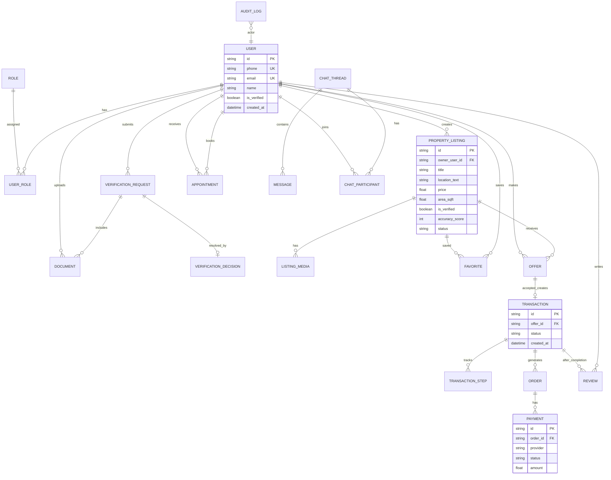
```mermaid
erDiagram
    USER ||--o{ USER_ROLE : has
    ROLE ||--o{ USER_ROLE : assigned

    USER ||--o{ VERIFICATION_REQUEST : submits
    VERIFICATION_REQUEST ||--o{ DOCUMENT : includes
    USER ||--o{ DOCUMENT : uploads
    VERIFICATION_REQUEST ||--o| VERIFICATION_DECISION : resolved_by

    USER ||--o{ PROPERTY_LISTING : creates
    PROPERTY_LISTING ||--o{ LISTING_MEDIA : has
    USER ||--o{ FAVORITE : saves
    PROPERTY_LISTING ||--o{ FAVORITE : saved

    PROPERTY_LISTING ||--o{ OFFER : receives
    USER ||--o{ OFFER : makes

    OFFER ||--o| TRANSACTION : accepted_creates
    TRANSACTION ||--o{ TRANSACTION_STEP : tracks
    TRANSACTION ||--o{ ORDER : generates
    ORDER ||--o{ PAYMENT : has

    USER ||--o{ REVIEW : writes
    TRANSACTION ||--o{ REVIEW : after_completion

    USER ||--o{ APPOINTMENT : books
    USER ||--o{ APPOINTMENT : receives

    CHAT_THREAD ||--o{ MESSAGE : contains
    CHAT_THREAD ||--o{ CHAT_PARTICIPANT : has
    USER ||--o{ CHAT_PARTICIPANT : joins

    AUDIT_LOG }o--|| USER : actor

    USER {
        string id PK
        string phone UK
        string email UK
        string name
        boolean is_verified
        datetime created_at
    }
    PROPERTY_LISTING {
        string id PK
        string owner_user_id FK
        string title
        string location_text
        float price
        float area_sqft
        boolean is_verified
        int accuracy_score
        string status
    }
    TRANSACTION {
        string id PK
        string offer_id FK
        string status
        datetime created_at
    }
    PAYMENT {
        string id PK
        string order_id FK
        string provider
        string status
        float amount
    }
```

### 11.2 Extended Operational ERD (v3.0 Addendum)

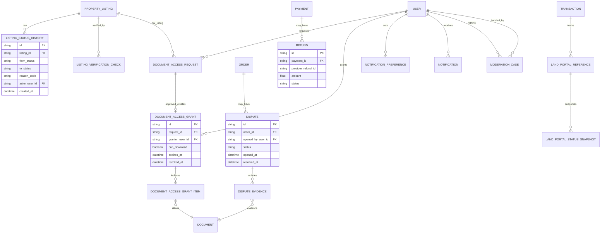
```mermaid
erDiagram
    PROPERTY_LISTING ||--o{ LISTING_STATUS_HISTORY : has
    PROPERTY_LISTING ||--o{ LISTING_VERIFICATION_CHECK : verified_by

    USER ||--o{ DOCUMENT_ACCESS_REQUEST : requests
    PROPERTY_LISTING ||--o{ DOCUMENT_ACCESS_REQUEST : for_listing
    DOCUMENT_ACCESS_REQUEST ||--o| DOCUMENT_ACCESS_GRANT : approved_creates
    USER ||--o{ DOCUMENT_ACCESS_GRANT : grants
    DOCUMENT_ACCESS_GRANT ||--o{ DOCUMENT_ACCESS_GRANT_ITEM : includes
    DOCUMENT_ACCESS_GRANT_ITEM }o--|| DOCUMENT : allows

    ORDER ||--o{ DISPUTE : may_have
    DISPUTE ||--o{ DISPUTE_EVIDENCE : includes
    DISPUTE_EVIDENCE }o--|| DOCUMENT : evidence
    PAYMENT ||--o{ REFUND : may_have

    USER ||--o{ NOTIFICATION_PREFERENCE : sets
    USER ||--o{ NOTIFICATION : receives

    USER ||--o{ MODERATION_CASE : reports
    MODERATION_CASE }o--|| USER : handled_by

    TRANSACTION ||--o{ LAND_PORTAL_REFERENCE : tracks
    LAND_PORTAL_REFERENCE ||--o{ LAND_PORTAL_STATUS_SNAPSHOT : snapshots

    LISTING_STATUS_HISTORY {
        string id PK
        string listing_id FK
        string from_status
        string to_status
        string reason_code
        string actor_user_id FK
        datetime created_at
    }
    DOCUMENT_ACCESS_GRANT {
        string id PK
        string request_id FK
        string granter_user_id FK
        boolean can_download
        datetime expires_at
        datetime revoked_at
    }
    DISPUTE {
        string id PK
        string order_id FK
        string opened_by_user_id FK
        string status
        datetime opened_at
        datetime resolved_at
    }
    REFUND {
        string id PK
        string payment_id FK
        string provider_refund_id
        float amount
        string status
    }
```

---

### 11.3 Auth, Social Login & Credentials ERD (v3.1 Addendum)

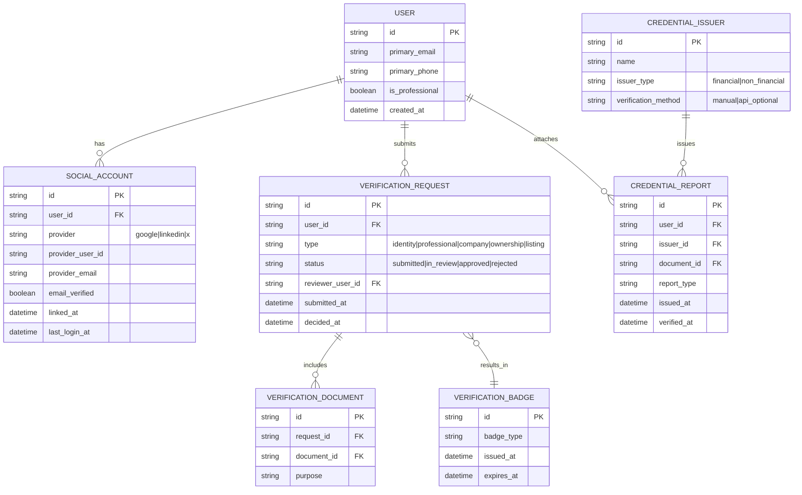
```mermaid
erDiagram
    USER ||--o{ SOCIAL_ACCOUNT : has
    USER ||--o{ VERIFICATION_REQUEST : submits
    VERIFICATION_REQUEST ||--o{ VERIFICATION_DOCUMENT : includes
    VERIFICATION_REQUEST }o--|| VERIFICATION_BADGE : results_in

    USER ||--o{ CREDENTIAL_REPORT : attaches
    CREDENTIAL_ISSUER ||--o{ CREDENTIAL_REPORT : issues

    USER {
        string id PK
        string primary_email
        string primary_phone
        boolean is_professional
        datetime created_at
    }

    SOCIAL_ACCOUNT {
        string id PK
        string user_id FK
        string provider  "google|linkedin|x"
        string provider_user_id
        string provider_email
        boolean email_verified
        datetime linked_at
        datetime last_login_at
    }

    VERIFICATION_REQUEST {
        string id PK
        string user_id FK
        string type "identity|professional|company|ownership|listing"
        string status "submitted|in_review|approved|rejected"
        string reviewer_user_id FK
        datetime submitted_at
        datetime decided_at
    }

    VERIFICATION_DOCUMENT {
        string id PK
        string request_id FK
        string document_id FK
        string purpose
    }

    VERIFICATION_BADGE {
        string id PK
        string badge_type
        datetime issued_at
        datetime expires_at
    }

    CREDENTIAL_ISSUER {
        string id PK
        string name
        string issuer_type "financial|non_financial"
        string verification_method "manual|api_optional"
    }

    CREDENTIAL_REPORT {
        string id PK
        string user_id FK
        string issuer_id FK
        string document_id FK
        string report_type
        datetime issued_at
        datetime verified_at
    }
```

### 11.4 Community, Contacts & Content ERD (P2 Addendum)

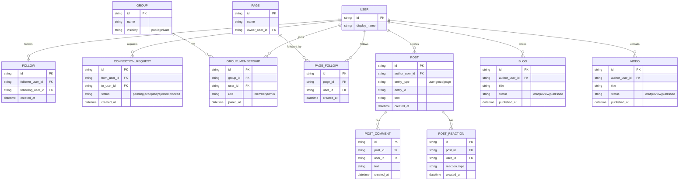
```mermaid
erDiagram
    USER ||--o{ FOLLOW : follows
    USER ||--o{ CONNECTION_REQUEST : requests
    GROUP ||--o{ GROUP_MEMBERSHIP : has
    USER ||--o{ GROUP_MEMBERSHIP : joins
    PAGE ||--o{ PAGE_FOLLOW : followed_by
    USER ||--o{ PAGE_FOLLOW : follows
    USER ||--o{ POST : creates
    POST ||--o{ POST_COMMENT : has
    POST ||--o{ POST_REACTION : has

    USER ||--o{ BLOG : writes
    USER ||--o{ VIDEO : uploads

    USER {
        string id PK
        string display_name
    }

    FOLLOW {
        string id PK
        string follower_user_id FK
        string following_user_id FK
        datetime created_at
    }

    CONNECTION_REQUEST {
        string id PK
        string from_user_id FK
        string to_user_id FK
        string status "pending|accepted|rejected|blocked"
        datetime created_at
    }

    GROUP {
        string id PK
        string name
        string visibility "public|private"
    }

    GROUP_MEMBERSHIP {
        string id PK
        string group_id FK
        string user_id FK
        string role "member|admin"
        datetime joined_at
    }

    PAGE {
        string id PK
        string name
        string owner_user_id FK
    }

    PAGE_FOLLOW {
        string id PK
        string page_id FK
        string user_id FK
        datetime created_at
    }

    POST {
        string id PK
        string author_user_id FK
        string entity_type "user|group|page"
        string entity_id
        string text
        datetime created_at
    }

    POST_COMMENT {
        string id PK
        string post_id FK
        string user_id FK
        string text
        datetime created_at
    }

    POST_REACTION {
        string id PK
        string post_id FK
        string user_id FK
        string reaction_type
        datetime created_at
    }

    BLOG {
        string id PK
        string author_user_id FK
        string title
        string status "draft|review|published"
        datetime published_at
    }

    VIDEO {
        string id PK
        string author_user_id FK
        string title
        string status "draft|review|published"
        datetime published_at
    }
```


## 12. Transaction Step Tracking

### 12.1 Offer State Machine

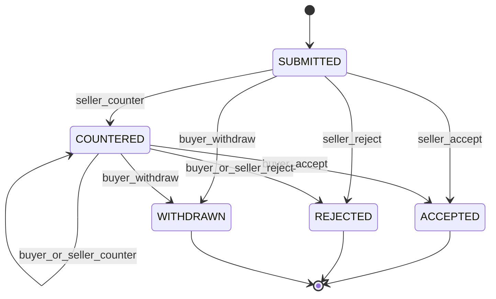
```mermaid
stateDiagram-v2
    [*] --> SUBMITTED
    SUBMITTED --> COUNTERED: seller_counter
    COUNTERED --> COUNTERED: buyer_or_seller_counter
    SUBMITTED --> ACCEPTED: seller_accept
    COUNTERED --> ACCEPTED: buyer_accept
    SUBMITTED --> REJECTED: seller_reject
    COUNTERED --> REJECTED: buyer_or_seller_reject
    SUBMITTED --> WITHDRAWN: buyer_withdraw
    COUNTERED --> WITHDRAWN: buyer_withdraw
    ACCEPTED --> [*]
    REJECTED --> [*]
    WITHDRAWN --> [*]
```

### 12.2 Transaction State Machine (Buy/Sell)

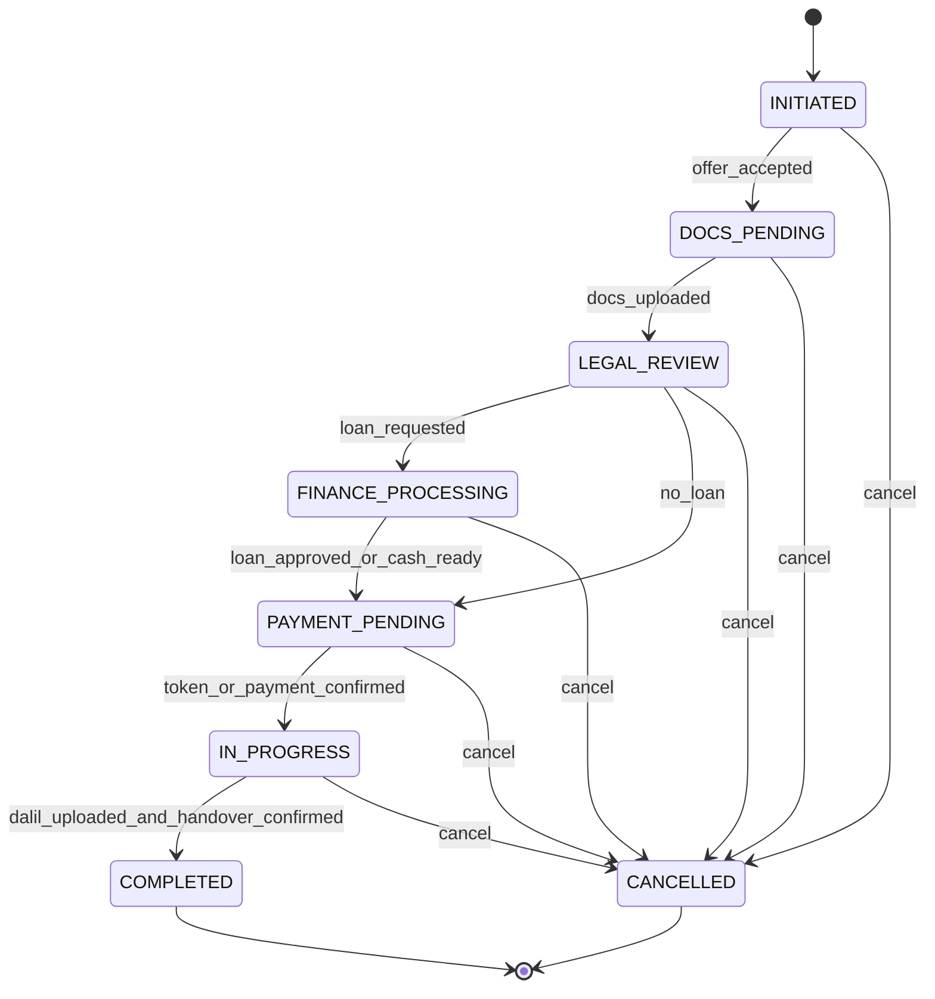
```mermaid
stateDiagram-v2
    [*] --> INITIATED
    INITIATED --> DOCS_PENDING: offer_accepted
    DOCS_PENDING --> LEGAL_REVIEW: docs_uploaded
    LEGAL_REVIEW --> FINANCE_PROCESSING: loan_requested
    LEGAL_REVIEW --> PAYMENT_PENDING: no_loan
    FINANCE_PROCESSING --> PAYMENT_PENDING: loan_approved_or_cash_ready
    PAYMENT_PENDING --> IN_PROGRESS: token_or_payment_confirmed
    IN_PROGRESS --> COMPLETED: dalil_uploaded_and_handover_confirmed
    INITIATED --> CANCELLED: cancel
    DOCS_PENDING --> CANCELLED: cancel
    LEGAL_REVIEW --> CANCELLED: cancel
    FINANCE_PROCESSING --> CANCELLED: cancel
    PAYMENT_PENDING --> CANCELLED: cancel
    IN_PROGRESS --> CANCELLED: cancel
    COMPLETED --> [*]
    CANCELLED --> [*]
```

### 12.3 Transaction State Machine (Rent)

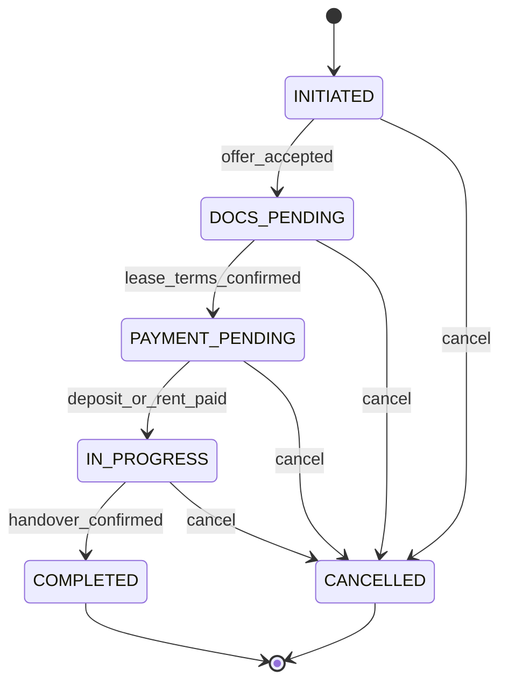
```mermaid
stateDiagram-v2
    [*] --> INITIATED
    INITIATED --> DOCS_PENDING: offer_accepted
    DOCS_PENDING --> PAYMENT_PENDING: lease_terms_confirmed
    PAYMENT_PENDING --> IN_PROGRESS: deposit_or_rent_paid
    IN_PROGRESS --> COMPLETED: handover_confirmed
    INITIATED --> CANCELLED: cancel
    DOCS_PENDING --> CANCELLED: cancel
    PAYMENT_PENDING --> CANCELLED: cancel
    IN_PROGRESS --> CANCELLED: cancel
    COMPLETED --> [*]
    CANCELLED --> [*]
```

### 12.4 BD Transaction Step Checklist (Bayna → Dalil → Namjari → Tax)

This checklist is an **explicit, user-visible step list** (timeline) for Bangladesh property transactions.
It complements the state machines above and operationalizes **proof uploads per step** (see FR-32) and **official portal reference capture** (see FR-66–69).

> Notes:
> - The platform does **not** need to integrate directly with government systems for MVP.
> - Instead, MSC Home supports link-outs + guided data capture + evidence uploads.

1. **Offer Accepted / Deal Initiated**
    - Output: Transaction record created; parties identified.
    - Evidence: Offer acceptance record (system).

2. **Document Collection Started**
    - Seller uploads initial documents into **Document Vault**.
    - Evidence: Deed copy (Dalil) (if available), prior mutation (Namjari) copy (if exists), tax receipts/DCR (if exists), photos, utility/service-charge info.

3. **Ownership & Listing Information Verification**
    - Verification may be: platform/manual review, field verification, and/or optional e-KYC for identity.
    - Evidence: Verified Listing badge status + verifier notes + uploaded proofs.

4. **Bayna / Baina Nama (Agreement to Sell) Prepared & Signed (if applicable)**
    - Output: Parties agree on price, terms, and schedule.
    - Evidence: Bayna agreement copy (uploaded) + counterparty confirmation.

5. **Legal Review / Due Diligence Completed**
    - Output: Lawyer/legal agent provides vetting report (title check, document consistency, risk flags).
    - Evidence: Legal report document + checklist completion log.

6. **Payment / Token / Booking Money (if applicable)**
    - Output: Payment intent created; gateway checkout completed.
    - Evidence: Gateway validation success + receipt; if risk flagged then HOLD per BR-26.

7. **Dalil (Registered Deed) Completed**
    - Output: Deed registration completed at Sub-Registrar.
    - Evidence: Registered Dalil copy (uploaded) + transaction step confirmation.

8. **Namjari (Mutation) Application Submitted (Portal-assisted)**
    - User action: Use official mutation portal link-out; submit application.
    - Platform action: Capture reference(s) (application number, mobile used) and store in timeline.
    - Evidence: Portal reference capture + screenshots/receipts + later status snapshot.

9. **Namjari (Mutation) Approved / Khatian Updated**
    - Output: Mutation/khatiyan result received.
    - Evidence: QR-coded khatian/related document upload + user-entered status snapshot (timestamped).

10. **Land Development Tax (ভূমি উন্নয়ন কর) Holding / Payment (as applicable)**
    - User action: Use official tax portal link-out to register holding/pay tax.
    - Platform action: Capture holding reference/DCR reference + upload receipt.
    - Evidence: Tax receipt/DCR uploaded + reference metadata stored.

11. **Handover Completed**
    - Output: Keys/possession transferred; handover checklist completed.
    - Evidence: Handover confirmation (both parties) + optional photos.

12. **Transaction Closed & Reviews Enabled**
    - Output: Parties can rate/review each other and (optionally) the listing/agent.
    - Evidence: Review gating enforced (BR-20/BR-21).

---

## 13. Diagrams (ERD/State/Sequence/Flow)

### 13.1 Listing Lifecycle (Draft → Review → Publish)

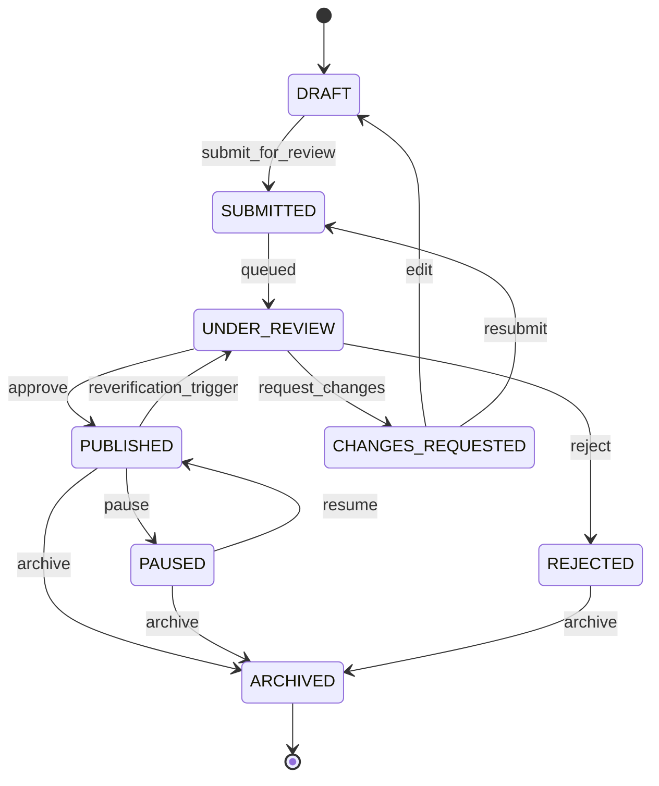
```mermaid
stateDiagram-v2
    [*] --> DRAFT
    DRAFT --> SUBMITTED: submit_for_review
    SUBMITTED --> UNDER_REVIEW: queued
    UNDER_REVIEW --> PUBLISHED: approve
    UNDER_REVIEW --> CHANGES_REQUESTED: request_changes
    UNDER_REVIEW --> REJECTED: reject

    CHANGES_REQUESTED --> DRAFT: edit
    CHANGES_REQUESTED --> SUBMITTED: resubmit

    PUBLISHED --> PAUSED: pause
    PAUSED --> PUBLISHED: resume
    PUBLISHED --> UNDER_REVIEW: reverification_trigger
    PUBLISHED --> ARCHIVED: archive
    PAUSED --> ARCHIVED: archive

    REJECTED --> ARCHIVED: archive
    ARCHIVED --> [*]
```

### 13.2 Verification Flow (User → Admin/Verifier → Badge)

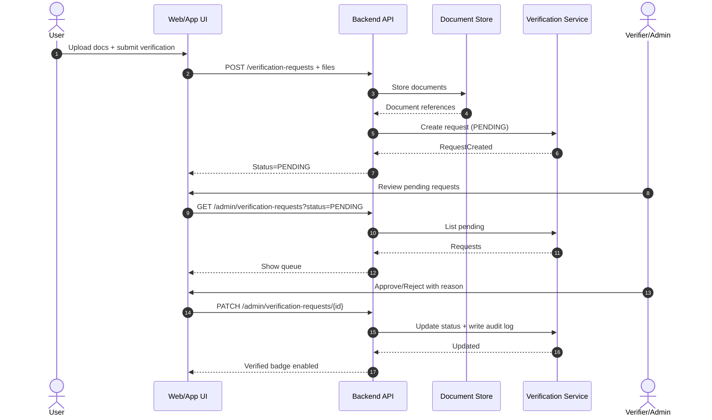
```mermaid
sequenceDiagram
    autonumber
    actor User
    participant UI as Web/App UI
    participant API as Backend API
    participant D as Document Store
    participant V as Verification Service
    actor Admin as Verifier/Admin

    User->>UI: Upload docs + submit verification
    UI->>API: POST /verification-requests + files
    API->>D: Store documents
    D-->>API: Document references
    API->>V: Create request (PENDING)
    V-->>API: RequestCreated
    API-->>UI: Status=PENDING

    Admin->>UI: Review pending requests
    UI->>API: GET /admin/verification-requests?status=PENDING
    API->>V: List pending
    V-->>API: Requests
    API-->>UI: Show queue

    Admin->>UI: Approve/Reject with reason
    UI->>API: PATCH /admin/verification-requests/{id}
    API->>V: Update status + write audit log
    V-->>API: Updated
    API-->>UI: Verified badge enabled
```

### 13.3 Payment Flow (Gateway + OTP/3DS)

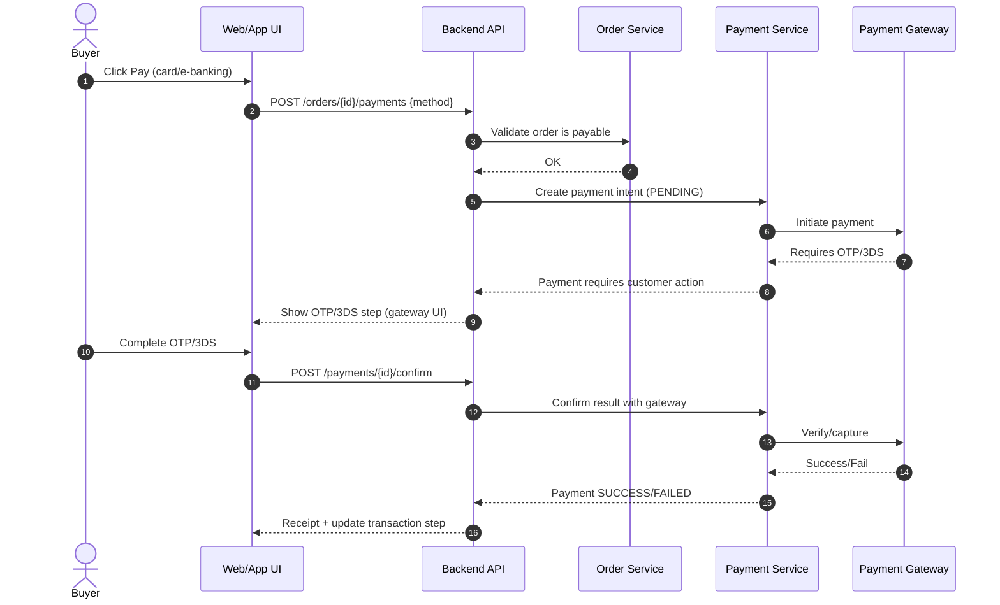
```mermaid
sequenceDiagram
    autonumber
    actor Buyer
    participant UI as Web/App UI
    participant API as Backend API
    participant O as Order Service
    participant P as Payment Service
    participant GW as Payment Gateway

    Buyer->>UI: Click Pay (card/e-banking)
    UI->>API: POST /orders/{id}/payments {method}
    API->>O: Validate order is payable
    O-->>API: OK
    API->>P: Create payment intent (PENDING)
    P->>GW: Initiate payment
    GW-->>P: Requires OTP/3DS
    P-->>API: Payment requires customer action
    API-->>UI: Show OTP/3DS step (gateway UI)
    Buyer->>UI: Complete OTP/3DS
    UI->>API: POST /payments/{id}/confirm
    API->>P: Confirm result with gateway
    P->>GW: Verify/capture
    GW-->>P: Success/Fail
    P-->>API: Payment SUCCESS/FAILED
    API-->>UI: Receipt + update transaction step
```

### 13.4 System Context (External Integrations)

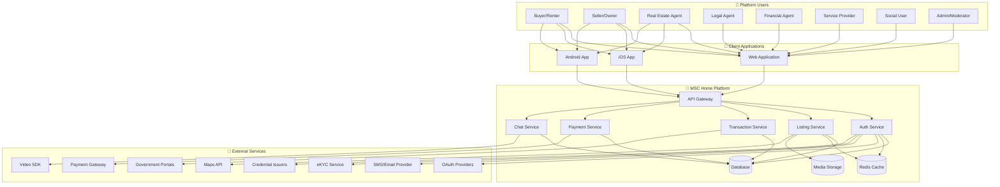
```mermaid
graph TB
    subgraph Users["👥 Platform Users"]
        Buyer[Buyer/Renter]
        Seller[Seller/Owner]
        Agent[Real Estate Agent]
        Legal[Legal Agent]
        Financial[Financial Agent]
        Service[Service Provider]
        Social[Social User]
        Admin[Admin/Moderator]
    end
    
    subgraph Clients["📱 Client Applications"]
        Web[Web Application]
        iOS[iOS App]
        Android[Android App]
    end
    
    subgraph Platform["🏢 MSC Home Platform"]
        API[API Gateway]
        Auth[Auth Service]
        Listing[Listing Service]
        Transaction[Transaction Service]
        Payment[Payment Service]
        Chat[Chat Service]
        DB[(Database)]
        Cache[(Redis Cache)]
        Storage[(Media Storage)]
    end
    
    subgraph External["🔌 External Services"]
        OAuth[OAuth Providers]
        SMS[SMS/Email Provider]
        Maps[Maps API]
        eKYC[eKYC Service]
        Gateway[Payment Gateway]
        Video[Video SDK]
        Gov[Government Portals]
        Credential[Credential Issuers]
    end
    
    Buyer --> Web
    Buyer --> iOS
    Buyer --> Android
    Seller --> Web
    Seller --> iOS
    Seller --> Android
    Agent --> Web
    Agent --> iOS
    Agent --> Android
    Legal --> Web
    Financial --> Web
    Service --> Web
    Social --> Web
    Admin --> Web
    
    Web --> API
    iOS --> API
    Android --> API
    
    API --> Auth
    API --> Listing
    API --> Transaction
    API --> Payment
    API --> Chat
    
    Auth --> DB
    Listing --> DB
    Transaction --> DB
    Payment --> DB
    Chat --> DB
    
    Auth --> Cache
    Listing --> Cache
    
    Listing --> Storage
    
    Auth --> OAuth
    Auth --> SMS
    Listing --> Maps
    Auth --> eKYC
    Payment --> Gateway
    Chat --> Video
    Transaction --> Gov
    Auth --> Credential
```


### 13.5 Hosted Checkout + IPN + Validation (SSLCOMMERZ-style)
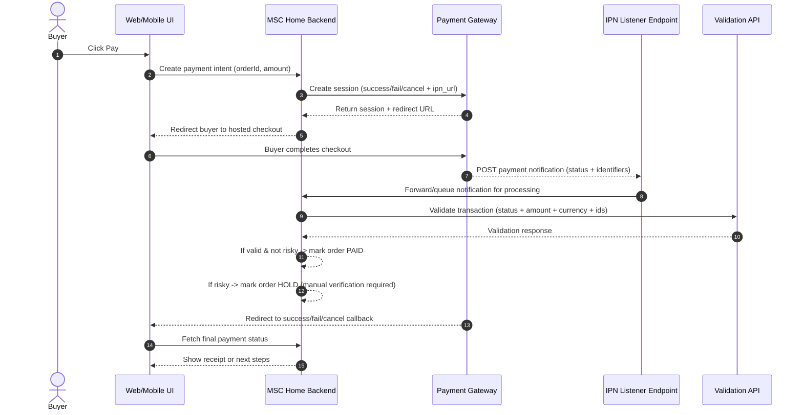
```mermaid
sequenceDiagram
    autonumber
    actor Buyer
    participant UI as Web/Mobile UI
    participant API as MSC Home Backend
    participant GW as Payment Gateway
    participant IPN as IPN Listener Endpoint
    participant VAL as Validation API

    Buyer->>UI: Click Pay
    UI->>API: Create payment intent (orderId, amount)
    API->>GW: Create session (success/fail/cancel + ipn_url)
    GW-->>API: Return session + redirect URL
    API-->>UI: Redirect buyer to hosted checkout
    UI->>GW: Buyer completes checkout

    GW-->>IPN: POST payment notification (status + identifiers)
    IPN->>API: Forward/queue notification for processing
    API->>VAL: Validate transaction (status + amount + currency + ids)
    VAL-->>API: Validation response
    API-->>API: If valid & not risky -> mark order PAID
    API-->>API: If risky -> mark order HOLD (manual verification required)

    GW-->>UI: Redirect to success/fail/cancel callback
    UI->>API: Fetch final payment status
    API-->>UI: Show receipt or next steps
```

### 13.6 Dispute Lifecycle (State Diagram)

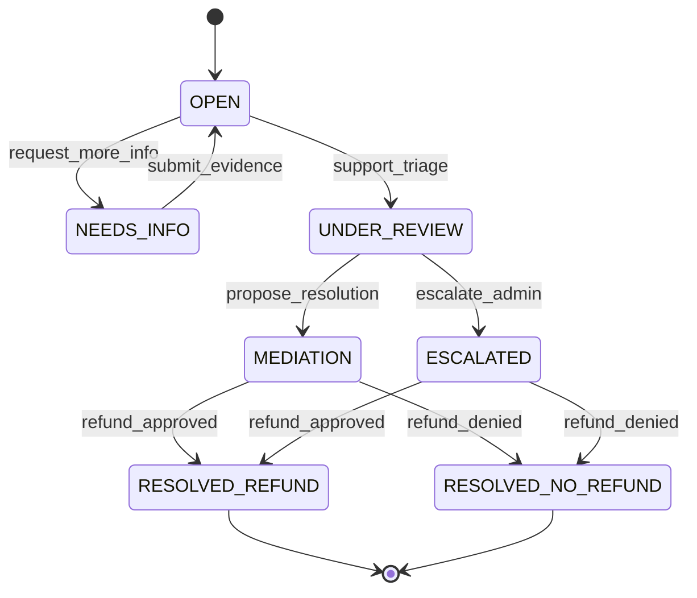
```mermaid
stateDiagram-v2
    [*] --> OPEN
    OPEN --> NEEDS_INFO: request_more_info
    NEEDS_INFO --> OPEN: submit_evidence

    OPEN --> UNDER_REVIEW: support_triage
    UNDER_REVIEW --> MEDIATION: propose_resolution
    UNDER_REVIEW --> ESCALATED: escalate_admin

    MEDIATION --> RESOLVED_REFUND: refund_approved
    MEDIATION --> RESOLVED_NO_REFUND: refund_denied
    ESCALATED --> RESOLVED_REFUND: refund_approved
    ESCALATED --> RESOLVED_NO_REFUND: refund_denied

    RESOLVED_REFUND --> [*]
    RESOLVED_NO_REFUND --> [*]
```

### 13.7 Document Vault Access Decision (Flow)

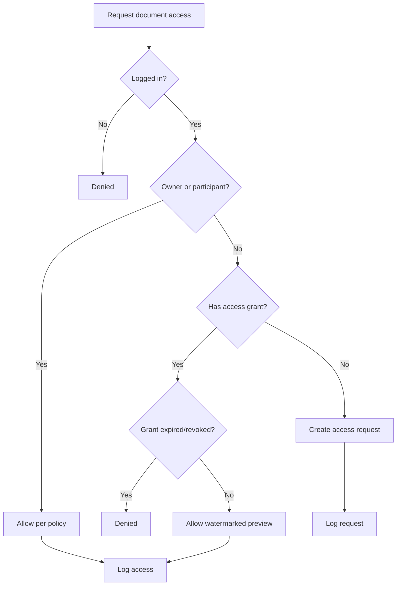
```mermaid
flowchart TD
    R[Request document access] --> A{Logged in?}
    A -- No --> D0[Denied]
    A -- Yes --> B{Owner or participant?}
    B -- Yes --> ALLOW1[Allow per policy]
    B -- No --> C{Has access grant?}
    C -- No --> REQ[Create access request]
    C -- Yes --> E{Grant expired/revoked?}
    E -- Yes --> D1[Denied]
    E -- No --> ALLOW2[Allow watermarked preview]

    ALLOW1 --> LOG[Log access]
    ALLOW2 --> LOG
    REQ --> LOGREQ[Log request]
```

### 13.8 Notification Delivery (Sequence)

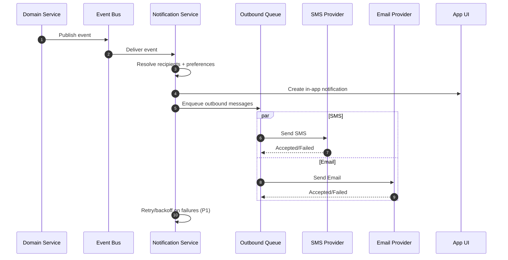
```mermaid
sequenceDiagram
    autonumber
    participant Svc as Domain Service
    participant Bus as Event Bus
    participant Notif as Notification Service
    participant Q as Outbound Queue
    participant SMS as SMS Provider
    participant Email as Email Provider
    participant UI as App UI

    Svc->>Bus: Publish event
    Bus->>Notif: Deliver event
    Notif->>Notif: Resolve recipients + preferences
    Notif->>UI: Create in-app notification
    Notif->>Q: Enqueue outbound messages
    par SMS
        Q->>SMS: Send SMS
        SMS-->>Q: Accepted/Failed
    and Email
        Q->>Email: Send Email
        Email-->>Q: Accepted/Failed
    end
    Notif->>Notif: Retry/backoff on failures (P1)
```

### 13.9 Portal Tracking Assistance (Manual Link-Out)

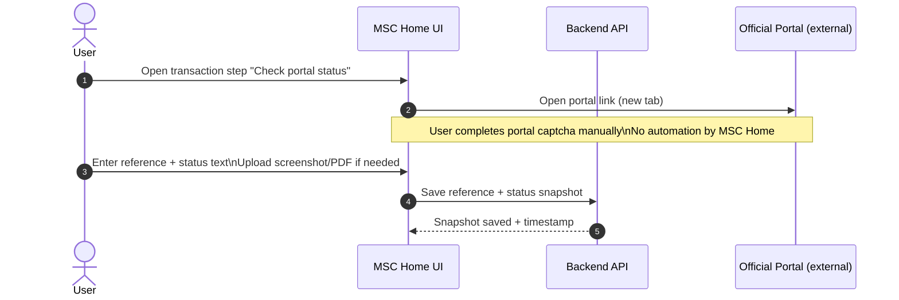
```mermaid
sequenceDiagram
    autonumber
    actor User
    participant UI as MSC Home UI
    participant API as Backend API
    participant Portal as Official Portal (external)

    User->>UI: Open transaction step "Check portal status"
    UI->>Portal: Open portal link (new tab)
    Note over UI,Portal: User completes portal captcha manually\nNo automation by MSC Home
    User->>UI: Enter reference + status text\nUpload screenshot/PDF if needed
    UI->>API: Save reference + status snapshot
    API-->>UI: Snapshot saved + timestamp
```

---

### 13.10 Use Case Diagram - Core Platform Features


```mermaid
graph LR
    Buyer([👤 Buyer])
    Seller([👤 Seller])
    Agent([👤 Agent])
    Legal([⚖️ Legal Agent])
    Financial([💰 Financial Agent])
    Admin([👨‍💼 Admin])
    
    subgraph Authentication["🔐 Authentication"]
        UC1[Register & Login]
        UC2[Switch Professional Mode]
        UC3[Submit Verification]
        UC4[Manage Profile]
    end
    
    subgraph Marketplace["🏘️ Marketplace"]
        UC5[Create Listing]
        UC6[Search Properties]
        UC7[View Listing Details]
        UC8[Save Favorites]
        UC9[Request Document Access]
    end
    
    subgraph Communication["💬 Communication"]
        UC10[Chat with Parties]
        UC11[Book Appointment]
        UC12[Audio/Video Call]
    end
    
    subgraph Transactions["💳 Transactions"]
        UC13[Submit Offer]
        UC14[Negotiate Terms]
        UC15[Track Transaction Steps]
        UC16[Upload Step Proofs]
        UC17[Make Payment]
    end
    
    subgraph Support["🤝 Support Services"]
        UC18[Find Legal Agent]
        UC19[Book Legal Service]
        UC20[Find Financial Agent]
        UC21[Request Loan Assistance]
    end
    
    subgraph Reviews["⭐ Reviews"]
        UC22[Submit Review]
        UC23[Respond to Review]
    end
    
    subgraph Administration["⚙️ Administration"]
        UC24[Approve Verification]
        UC25[Moderate Listings]
        UC26[Resolve Disputes]
        UC27[Manage Users]
    end
    
    Buyer --> UC1
    Buyer --> UC6
    Buyer --> UC7
    Buyer --> UC8
    Buyer --> UC10
    Buyer --> UC11
    Buyer --> UC13
    Buyer --> UC17
    Buyer --> UC18
    Buyer --> UC20
    Buyer --> UC22
    
    Seller --> UC1
    Seller --> UC2
    Seller --> UC3
    Seller --> UC5
    Seller --> UC10
    Seller --> UC14
    Seller --> UC23
    
    Agent --> UC2
    Agent --> UC3
    Agent --> UC5
    Agent --> UC10
    Agent --> UC11
    Agent --> UC14
    
    Legal --> UC2
    Legal --> UC3
    Legal --> UC18
    Legal --> UC19
    
    Financial --> UC2
    Financial --> UC3
    Financial --> UC20
    Financial --> UC21
    
    Admin --> UC24
    Admin --> UC25
    Admin --> UC26
    Admin --> UC27
```
    Admin --> UC24
    Admin --> UC25
    Admin --> UC26
    Admin --> UC27
```

---

### 13.11 High-Level Architecture Diagram

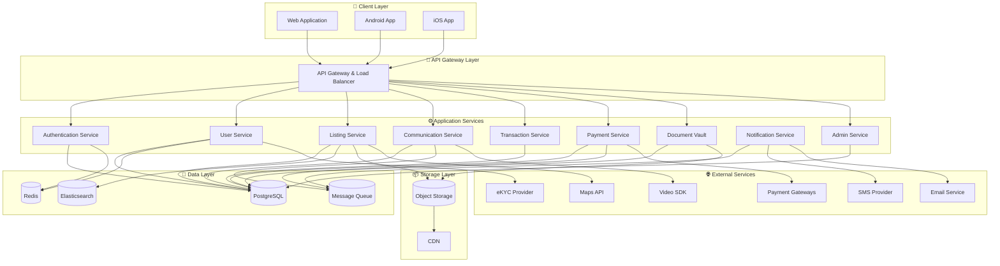
```mermaid
graph TB
    subgraph Client["📱 Client Layer"]
        WEB[Web Application]
        ANDROID[Android App]
        IOS[iOS App]
    end
    
    subgraph Gateway["🚪 API Gateway Layer"]
        APIGW[API Gateway & Load Balancer]
    end
    
    subgraph Services["⚙️ Application Services"]
        AUTH[Authentication Service]
        USER[User Service]
        LISTING[Listing Service]
        COMM[Communication Service]
        TRANS[Transaction Service]
        PAY[Payment Service]
        DOC[Document Vault]
        NOTIF[Notification Service]
        ADMIN[Admin Service]
    end
    
    subgraph Data["💾 Data Layer"]
        DB[(PostgreSQL)]
        CACHE[(Redis)]
        SEARCH[(Elasticsearch)]
        QUEUE[(Message Queue)]
    end
    
    subgraph Storage["📦 Storage Layer"]
        S3[(Object Storage)]
        CDN[CDN]
    end
    
    subgraph External["🌐 External Services"]
        SMS[SMS Provider]
        EMAIL[Email Service]
        MAPS[Maps API]
        EKYC[eKYC Provider]
        GATEWAY[Payment Gateways]
        VIDEO[Video SDK]
    end
    
    WEB --> APIGW
    ANDROID --> APIGW
    IOS --> APIGW
    
    APIGW --> AUTH
    APIGW --> USER
    APIGW --> LISTING
    APIGW --> COMM
    APIGW --> TRANS
    APIGW --> PAY
    APIGW --> DOC
    APIGW --> ADMIN
    
    AUTH --> DB
    AUTH --> CACHE
    USER --> DB
    USER --> CACHE
    LISTING --> DB
    LISTING --> SEARCH
    LISTING --> S3
    COMM --> DB
    COMM --> QUEUE
    TRANS --> DB
    PAY --> DB
    PAY --> QUEUE
    DOC --> DB
    DOC --> S3
    ADMIN --> DB
    
    NOTIF --> QUEUE
    NOTIF --> SMS
    NOTIF --> EMAIL
    
    S3 --> CDN
    
    PAY --> GATEWAY
    USER --> EKYC
    LISTING --> MAPS
    COMM --> VIDEO
```

---

### 13.12 Data Flow Diagram - Property Search & Transaction

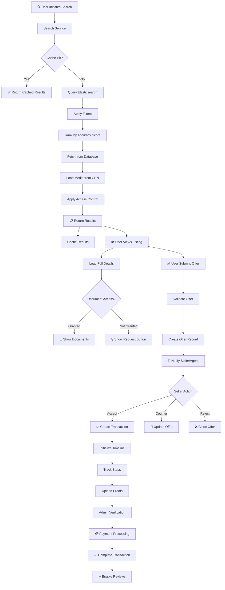
```mermaid
flowchart TD
    A[🔍 User Initiates Search] --> B[Search Service]
    B --> C{Cache Hit?}
    C -->|Yes| D[✅ Return Cached Results]
    C -->|No| E[Query Elasticsearch]
    E --> F[Apply Filters]
    F --> G[Rank by Accuracy Score]
    G --> H[Fetch from Database]
    H --> I[Load Media from CDN]
    I --> J[Apply Access Control]
    J --> K[📋 Return Results]
    K --> L[Cache Results]
    
    K --> M[👁️ User Views Listing]
    M --> N[Load Full Details]
    N --> O{Document Access?}
    O -->|Granted| P[📄 Show Documents]
    O -->|Not Granted| Q[🔒 Show Request Button]
    
    M --> R[💰 User Submits Offer]
    R --> S[Validate Offer]
    S --> T[Create Offer Record]
    T --> U[📧 Notify Seller/Agent]
    U --> V{Seller Action}
    V -->|Accept| W[✅ Create Transaction]
    V -->|Counter| X[🔄 Update Offer]
    V -->|Reject| Y[❌ Close Offer]
    
    W --> Z[Initialize Timeline]
    Z --> AA[Track Steps]
    AA --> AB[Upload Proofs]
    AB --> AC[Admin Verification]
    AC --> AD[💳 Payment Processing]
    AD --> AE[✅ Complete Transaction]
    AE --> AF[⭐ Enable Reviews]
```

---

### 13.13 Component Interaction Diagram - Verification Flow

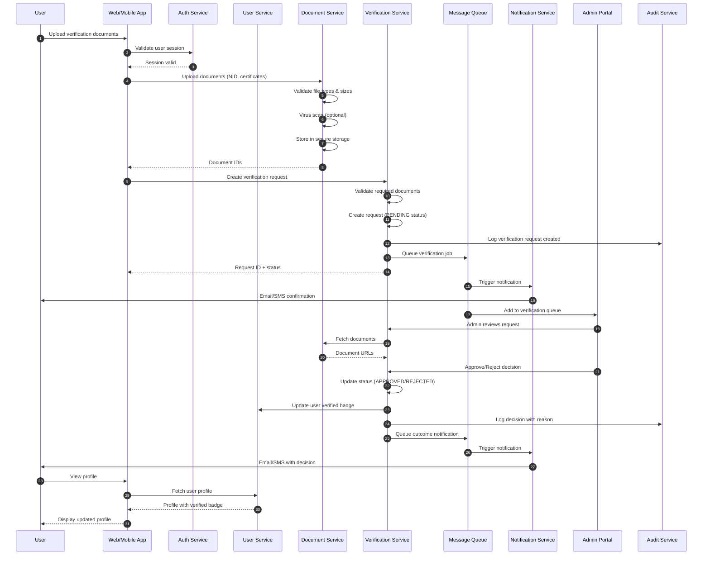
```mermaid
sequenceDiagram
    autonumber
    participant User
    participant WebApp as Web/Mobile App
    participant AuthService as Auth Service
    participant UserService as User Service
    participant DocService as Document Service
    participant VerifService as Verification Service
    participant QueueService as Message Queue
    participant NotifService as Notification Service
    participant AdminPortal as Admin Portal
    participant AuditService as Audit Service
    
    User->>WebApp: Upload verification documents
    WebApp->>AuthService: Validate user session
    AuthService-->>WebApp: Session valid
    
    WebApp->>DocService: Upload documents (NID, certificates)
    DocService->>DocService: Validate file types & sizes
    DocService->>DocService: Virus scan (optional)
    DocService->>DocService: Store in secure storage
    DocService-->>WebApp: Document IDs
    
    WebApp->>VerifService: Create verification request
    VerifService->>VerifService: Validate required documents
    VerifService->>VerifService: Create request (PENDING status)
    VerifService->>AuditService: Log verification request created
    VerifService->>QueueService: Queue verification job
    VerifService-->>WebApp: Request ID + status
    
    QueueService->>NotifService: Trigger notification
    NotifService->>User: Email/SMS confirmation
    
    QueueService->>AdminPortal: Add to verification queue
    
    AdminPortal->>VerifService: Admin reviews request
    VerifService->>DocService: Fetch documents
    DocService-->>VerifService: Document URLs
    
    AdminPortal->>VerifService: Approve/Reject decision
    VerifService->>VerifService: Update status (APPROVED/REJECTED)
    VerifService->>UserService: Update user verified badge
    VerifService->>AuditService: Log decision with reason
    VerifService->>QueueService: Queue outcome notification
    
    QueueService->>NotifService: Trigger notification
    NotifService->>User: Email/SMS with decision
    
    User->>WebApp: View profile
    WebApp->>UserService: Fetch user profile
    UserService-->>WebApp: Profile with verified badge
    WebApp-->>User: Display updated profile
```

---

### 13.14 Deployment Architecture Diagram

```mermaid
graph TB
    subgraph Users["👥 User Devices"]
        BROWSER[Web Browsers]
        MOBILE[Mobile Apps]
    end
    
    subgraph Edge["🌐 CDN & Edge"]
        CF[Cloudflare CDN]
        WAF[Web Application Firewall]
    end
    
    subgraph LB["⚖️ Load Balancer"]
        NGINX[NGINX Load Balancer]
        SSL[SSL/TLS Termination]
    end
    
    subgraph K8s["☸️ Kubernetes Cluster"]
        subgraph Frontend["Frontend Pods"]
            WEB1[Web App Pod 1]
            WEB2[Web App Pod 2]
        end
        
        subgraph API["API Services Pods"]
            API1[API Gateway 1]
            API2[API Gateway 2]
            AUTH1[Auth Service]
            USER1[User Service]
            LIST1[Listing Service]
            PAY1[Payment Service]
        end
        
        subgraph Workers["Background Workers"]
            WORKER1[Notification Worker]
            WORKER2[Payment Worker]
            WORKER3[Search Indexer]
        end
    end
    
    subgraph DB["💾 Database Cluster"]
        DBPRIMARY[(Primary PostgreSQL)]
        DBREPLICA1[(Read Replica 1)]
        DBREPLICA2[(Read Replica 2)]
    end
    
    subgraph Cache["⚡ Cache & Queue"]
        REDIS[(Redis Cluster)]
        RABBIT[RabbitMQ]
    end
    
    subgraph Search["🔍 Search"]
        ELASTIC[(Elasticsearch)]
    end
    
    subgraph Storage["📦 Object Storage"]
        S3[(S3 / MinIO)]
    end
    
    subgraph Ext["🔌 External Services"]
        PAYMENT[Payment Gateways]
        SMS[SMS Gateway]
        EMAIL[Email Service]
    end
    
    subgraph Backup["💿 Backup & DR"]
        BACKUPS[(Automated Backups)]
        DR[(DR Site)]
    end
    
    BROWSER --> CF
    MOBILE --> CF
    CF --> WAF
    WAF --> NGINX
    NGINX --> SSL
    SSL --> WEB1
    SSL --> WEB2
    WEB1 --> API1
    WEB2 --> API2
    
    API1 --> AUTH1
    API2 --> AUTH1
    API1 --> USER1
    API1 --> LIST1
    API1 --> PAY1
    
    AUTH1 --> REDIS
    USER1 --> DBPRIMARY
    LIST1 --> DBPRIMARY
    LIST1 --> ELASTIC
    PAY1 --> DBPRIMARY
    PAY1 --> RABBIT
    
    DBPRIMARY --> DBREPLICA1
    DBPRIMARY --> DBREPLICA2
    
    USER1 --> DBREPLICA1
    LIST1 --> DBREPLICA1
    
    WORKER1 --> RABBIT
    WORKER2 --> RABBIT
    WORKER3 --> RABBIT
    
    WORKER1 --> SMS
    WORKER1 --> EMAIL
    WORKER2 --> PAYMENT
    WORKER3 --> ELASTIC
    
    LIST1 --> S3
    CF --> S3
    
    DBPRIMARY --> BACKUPS
    DBPRIMARY --> DR
```

---

## 14. Non-Functional Requirements (NFR)

### 14.1 Security
- TLS everywhere; encryption at rest for sensitive documents.
- RBAC on all endpoints.
- Audit logs for verification, admin actions, and payments.
- Signed URL access for document downloads.

Additional security requirements (implementation-oriented):
- Strong authentication defaults: password policy, OTP rate limits, brute-force protection.
- Session security: refresh token rotation, device/session revocation (FR-75), and suspicious login alerts.
- File security: virus/malware scanning for uploads (P1), content-type validation, size limits.
- Secrets management: no credentials in clients; rotate API keys; environment-based configs.
- Data minimization: collect only required NID/identity data; avoid storing captcha solutions.

### 14.2 Performance
- Search response target < 2s for typical filters.
- Media served via CDN.

### 14.2.1 Scalability
- System must support burst traffic during marketing campaigns and peak hours.
- Background jobs (notifications, payment webhooks, media processing) must not block user requests.

### 14.3 Reliability
- Payment flow must be retry-safe (idempotency keys).

### 14.3.1 Availability & Recovery
- Define RPO/RTO targets (to be finalized). Suggested baseline: RPO ≤ 24h, RTO ≤ 4h.
- Automated backups for primary database and document metadata.
- Graceful degradation: if optional providers fail (video SDK, e-KYC), core marketplace remains usable.

### 14.3.2 Observability
- Centralized logging with correlation IDs.
- Metrics for: search latency, payment success rate, webhook processing lag, notification delivery failures.
- Alerting for: payment validation failures, webhook spikes, dead-letter queue growth.

### 14.4 Privacy
- Strict access to documents (only owner + verifier + permitted parties).

Privacy requirements:
- Explicit user consent for document uploads and sharing.
- Support user data export/delete requests where legally appropriate.
- Redact sensitive information in logs (NID, bank details, document URLs).

### 14.5 Accessibility & Localization
- Support Bangla and English UI text (P1); store user locale preference.
- Ensure WCAG-friendly UI for core flows (search, listing view, chat, checkout).

---

## 15. MVP Scope & Prioritized Backlog

### 15.1 MVP Goals (P0)
- Verified identities + verified listings
- Search → view → contact → offer → transaction tracking → payment → reviews
- Appointment booking
- Basic legal/financial discovery (directory + booking/request)

### 15.2 Key Enhancements (from Slides)
- Buyer protection hooks
- Verified seller badge prominence
- Market value guidance
- Accuracy score visibility

---

## 16. Appendices (Traceability & Glossary)

### 16.1 Traceability Matrix (Slide-by-slide)

Source evidence:
- Slide images: `docs/slides/1.png` … `docs/slides/41.png`
- OCR extraction: `docs/slides/ocr/1.txt` … `docs/slides/ocr/41.txt`
- OCR inventory: `docs/slides/ocr/_summary.csv`

| Slide | Key OCR evidence (short) | Mapped SRS sections / requirements |
|---:|---|---|
| 1 | Title / branding | N/A (cover) |
| 2 | Product positioning | Sections 1–2 |
| 3 | “Project Overview” | Section 2 |
| 4 | Multi-actor platform; documentation/legalization/valuation/verification | Sections 3–5; FR-8–18; FR-36–40 |
| 5 | “Problem Statement” | Section 2.1 |
| 6 | Trust gaps; hidden details; unfair pricing; seriousness; loan affordability; low tech adoption | Section 2.1; FR-19–22; FR-33–35; FR-39–40 |
| 7 | “Possible Solution” | Section 2.2 |
| 8 | Secure/verified/transparent; legal + financial partners; secure payments | FR-8–11; FR-33–35; FR-36–40 |
| 9 | “Design Thinking Process” | Appendix (research basis) |
| 10 | Design thinking steps | Appendix (research basis) |
| 11 | “Qualitative Research” | Section 2.3 |
| 12 | Interview notes | Section 2.3; FR-53; FR-58–59 |
| 13 | Insights: unclear prices; slow completion; legal paper verification; weak rules | FR-18; FR-52–55; FR-58–59 |
| 14 | Likes: easy search + loan help; dislikes: hidden costs + high prices + delays | FR-19–22; FR-39–40; BR-8–9 |
| 15 | “Quantitative Research” | Section 2.3 |
| 16 | Survey framing | Section 2.3 |
| 17 | Feature preference: secure payments, loans, legal support, virtual tours | Section 2.3; FR-14; FR-33–35; FR-40; FR-36–38 |
| 18 | Trust in verified platform; negotiation frequency | FR-8–10; FR-27–29; BR-10–14 |
| 19 | Loan importance | FR-39–40 |
| 20 | Advanced search necessity; ratings after transaction | FR-19–22; FR-41–43; BR-20–21 |
| 21 | Key stats: advanced search 97.6%, trust 78.3%, loans 90.4%, payments 69.9%, ratings 95.2% | Section 2.3; prioritization across FRs |
| 22 | “Brain Storming” | Section 5; FR-46–49 |
| 23 | Brainstorm modules: groups/places/posts/people | FR-46–49 |
| 24 | “User Persona” | Section 4 |
| 25 | Seller persona | Section 4 |
| 26 | Buyer persona | Section 4 |
| 27 | “Empathy Mapping” | Section 4 |
| 28 | Seller empathy map | Section 4 |
| 29 | Buyer empathy map | Section 4 |
| 30 | “User Journey Map” | Section 12; FR-52–57 |
| 31 | Seller journey: verify identity/ownership; answer; negotiate; collect docs; close | FR-8–18; FR-27–32; Section 12 |
| 32 | Improve seller journey: verified badge; ownership steps; FAQ templates; accuracy score; market value; respond to feedback | FR-52–55; BR-5–9; FR-18; FR-43 |
| 33 | Buyer journey: verified listings; verify docs; offer; loans; legal advice; sign docs | FR-19–22; FR-27–32; FR-39–40; FR-36–38 |
| 34 | Improve buyer journey: map search; buyer protection; track each step; access legal/finance experts; easier feedback | FR-20–22; FR-35; FR-57; FR-44–45 |
| 35 | “User Flow” | Section 5; Section 15 backlog |
| 36 | User flow mentions buying/selling + finance support + service providers | Sections 5, 7; FR-39–40; FR-62–65 |
| 37 | (low OCR) | Covered by Section 15 backlog |
| 38 | “Information Architecture” | Section 5 |
| 39 | IA elements: auth, posts, community marketplace, contacts, blogs/videos, professional mode | FR-1–4; FR-46–49; Section 5 |
| 40 | IA: groups/pages; appointment; message/video; pro roles | FR-23–26; FR-25; Section 5 |
| 41 | Closing tagline | N/A |

### 16.2 Feature Implementation Summary

This section summarizes the comprehensive feature set implemented in the MSC Home platform, organized by functional area.

| Feature Area | Implementation Status | Key Components | Bangladesh-Specific Enhancements |
|--------------|---------------------|----------------|----------------------------------|
| **Core Marketplace** | Complete | Property listings, search, filters, favorites | Property type matrix (Apartment/Land/Commercial), Unit converter (Sqft↔Katha) |
| **Verification & Trust** | Complete with multiple tiers | Identity, Professional (URA), Company (TIN/BIN), Property Ownership, Listing Accuracy Score | Credential reports from BD financial/non-financial institutes, Optional e-KYC integration (Porichoy) |
| **Search & Discovery** | Complete | Advanced filters, Map-based search, Saved searches with alerts, Listing comparison | Location-based search for BD cities (Dhaka, Chittagong, Sylhet, etc.) |
| **Communication** | Complete | Live chat, Audio/video calls, Appointment booking, Response SLA tracking | Agent responsiveness metrics, Reminder/escalation system |
| **Transaction Management** | Complete with BD workflows | Offers/negotiation, Transaction step tracking, Proof uploads per step | Bayna/Dalil/Namjari workflow, Government portal integration (link-out + reference capture) |
| **Payments** | Complete with security hardening | Multi-gateway support (bKash/Nagad/SSLCommerz), OTP/3DS, IPN reconciliation | Bangladesh-specific payment methods, Risk hold mechanism |
| **Document Vault** | Complete | Secure storage, Access control, Time-bound grants, Watermarking, Audit trail | BD property documents (Dalil, Mutation, Tax receipts, DCR, Khatian) |
| **Legal Support** | Complete | Legal agent directory, Service booking, Case tracking | BAR Council verification, Property vetting services |
| **Financial Support** | Complete | Financial agent directory, Loan assistance workflow, Lead management | Support for BD banks and NBFIs |
| **Reviews & Reputation** | Complete | Mutual ratings, Written reviews, Response mechanism, Reputation scoring | Review gating after transaction completion |
| **Admin & Moderation** | Complete | Verification queue, Listing moderation, Dispute resolution, User management | Re-verification triggers, Moderation cases with evidence |
| **Community Features** | Planned (P2) | Groups, Pages, Posts, Contacts/Networking, Blogs/Videos | Deferred to post-MVP phase |
| **Monetization** | Planned (P1) | Subscription plans, Featured listings, Service charges | Flexible pricing for BD market |
| **Government Portal Integration** | Complete (Link-out model) | DLRMS, e-Namjari, Land Tax portals | Manual workflow with reference capture, Status snapshot tracking |

**Key Achievements:**
- ✅ 93 Functional Requirements (FR-1 to FR-93) fully specified
- ✅ 43 Business Rules (BR-1 to BR-43) with Bangladesh context
- ✅ 15 Detailed User Stories with real-life scenarios
- ✅ 14 Comprehensive Diagrams (ERD, State, Sequence, Architecture)
- ✅ Complete RBAC model with role-based and relationship-based access controls
- ✅ Full payment gateway integration with security best practices
- ✅ Bangladesh-specific legal workflows (Bayna, Dalil, Namjari)
- ✅ Professional documentation meeting international SRS standards

---

### 16.3 Technical Standards & Compliance

**SRS Documentation Standards:**
- ✅ IEEE 830-1998 Software Requirements Specification template
- ✅ ISO/IEC/IEEE 29148:2018 Systems and software engineering requirements
- ✅ Clear separation of functional and non-functional requirements
- ✅ Traceability matrix for requirements validation
- ✅ Use of industry-standard diagram notation (Mermaid.js)

**Security & Privacy Standards:**
- ✅ OWASP Top 10 security considerations
- ✅ Payment Card Industry Data Security Standard (PCI DSS) awareness
- ✅ Secure document handling with encryption at rest and in transit
- ✅ TLS 1.2+ requirement for all communications
- ✅ Audit logging for all sensitive operations

**Accessibility Standards:**
- ✅ WCAG 2.1 Level AA compliance (recommendation for core flows)
- ✅ Mobile-first responsive design
- ✅ Support for Bangla and English interfaces
- ✅ Clear navigation and user guidance

**Performance Standards:**
- ✅ Search response time target: < 2 seconds (P95)
- ✅ Payment webhook processing: < 30 seconds
- ✅ API response time: < 500ms (P95) for reads, < 1s for writes
- ✅ System availability: 99.5% uptime for core services
- ✅ Scalability: Support 5,000 concurrent users

---

### 16.4 External References & Resources

**Bangladesh Government Services:**
- Mutation / e-Namjari portal: https://mutation.land.gov.bd/ (status tracking, contact hotline 16122)
- Land record & map services (DLRMS): https://dlrms.land.gov.bd/ (guideline + application tracking)
- DLRMS application tracking: https://dlrms.land.gov.bd/application/search
- Land Development Tax portal: https://portal.ldtax.gov.bd/ (holding registration prerequisites and manuals)

**Payment Gateway Integration:**
- SSLCOMMERZ Developer Documentation: https://developer.sslcommerz.com/
- SSLCOMMERZ API v4: https://developer.sslcommerz.com/doc/v4/
- bKash Merchant Integration: https://developer.bkash.com/
- Nagad Merchant API: https://developer.nagad.com.bd/

**Verification & eKYC Services:**
- Porichoy (National ID Verification): https://porichoy.gov.bd/
- Urban Development Directorate (URA Certificate Verification): https://rajuk.gov.bd/

**Technical References:**
- Bangladesh National Portal: https://bangladesh.gov.bd/
- ICT Division, Bangladesh: https://ictd.gov.bd/
- Bangladesh Bank (Payment System Guidelines): https://www.bb.org.bd/

**Industry Best Practices:**
- Real Estate Information System (REIS) Guidelines
- Property Technology (PropTech) Standards
- Digital Transaction Security Best Practices

---

### 16.5 Glossary of Terms

**General Real Estate Terms:**
- **Listing:** A property advertised for sale or rent on the platform
- **Verified Listing:** A listing that has passed ownership and information verification checks
- **Accuracy Score:** Completeness percentage of listing information (required + optional fields)
- **Transaction:** The complete process from offer acceptance to property handover
- **Step Tracking:** Monitoring progress of transaction milestones with proof documentation

**Bangladesh-Specific Terms:**
- **Bayna / Baina Nama:** Sale agreement or agreement to sell, legally binding document in BD property transactions
- **Dalil:** Registered deed document obtained from Sub-Registrar office, proves property ownership
- **Namjari (Mutation):** Legal process of updating ownership records in government land records after property transfer
- **Khatian:** Land record document showing ownership details, plot number, and boundaries
- **Mouza:** Administrative land unit in Bangladesh, used in property identification
- **Dag:** Plot number within a Mouza, part of property identification system
- **DCR (Dhaka City Corporation Receipt):** Tax receipt from city corporation for urban properties
- **URA (Urban Development Authority):** Regulatory body for real estate agents in Bangladesh (e.g., RAJUK in Dhaka)
- **TIN (Taxpayer Identification Number):** Tax identification for businesses
- **BIN (Business Identification Number):** Business registration identifier
- **Katha:** Traditional land measurement unit (1 Katha = 720 sqft in Bangladesh)
- **Decimal:** Land measurement unit (1 Decimal = 435.6 sqft)
- **Shotok:** Smallest land measurement unit (1 Shotok = 7.26 sqft)

**Technical Terms:**
- **RBAC (Role-Based Access Control):** Permission system based on user roles
- **ABAC (Attribute-Based Access Control):** Permission system based on user attributes and relationships
- **KYC (Know Your Customer):** Identity verification process
- **eKYC (Electronic KYC):** Digital identity verification using government databases
- **OTP (One-Time Password):** Temporary password sent via SMS/Email for verification
- **3DS (3-Domain Secure):** Additional security layer for card payments
- **IPN (Instant Payment Notification):** Real-time payment status update from payment gateway
- **Idempotency:** Ensuring duplicate requests don't cause multiple operations
- **CDN (Content Delivery Network):** Distributed server network for fast content delivery

**Platform-Specific Terms:**
- **Verified Badge:** Visual indicator on user profile showing successful verification
- **Professional Mode:** Account type for business users (agents, lawyers, financial advisors)
- **Document Vault:** Secure storage for sensitive property and identity documents
- **Access Grant:** Time-bound permission to view specific documents
- **Watermark:** Visible identifier on documents showing viewer information and timestamp
- **Accuracy Score:** Calculated completeness percentage for property listings
- **Response SLA:** Expected timeframe for agent/professional to respond to inquiries
- **Transaction Timeline:** Chronological record of all transaction steps and actions
- **Step Proof:** Evidence document uploaded to verify completion of transaction milestone
- **Moderation Queue:** Admin interface for reviewing pending verification/listing requests

---

### 16.6 Document Revision History

This section maintains the document evolution tracking for internal reference only (not for client presentation).

**Current Version:** Final - Client Ready (January 2026)

**Previous Iterations:**
- Version 3.1: Added PDF gap closure, social login providers, property type matrix, agent responsiveness
- Version 3.0: Enhanced with implementable business logic, RBAC, moderation workflows
- Version 2.2: Added Bangladesh-specific workflows, payment gateway hardening
- Version 1.1: Original MVP SRS based on UX case study

**Document prepared by:**
CodeStorm Hub Development Team
Dhaka, Bangladesh
contact@codestormhub.dev
+880-1970279556

---

### 16.7 Approval & Sign-Off

**Document Approval:**

| Role | Name | Signature | Date |
|------|------|-----------|------|
| Product Owner | [Name] | [Signature/Digital Sign] | [DD/MM/YYYY] |
| Technical Architect | [Name] | [Signature/Digital Sign] | [DD/MM/YYYY] |
| Project Manager | [Name] | [Signature/Digital Sign] | [DD/MM/YYYY] |
| Quality Assurance Lead | [Name] | [Signature/Digital Sign] | [DD/MM/YYYY] |
| Client Representative | [Name] | [Signature/Digital Sign] | [DD/MM/YYYY] |

**Document Status:** PENDING APPROVAL (To be updated upon client sign-off)

---

**End of Software Requirements Specification**

---

© 2026 CodeStorm Hub. All rights reserved. This document is confidential and proprietary.

