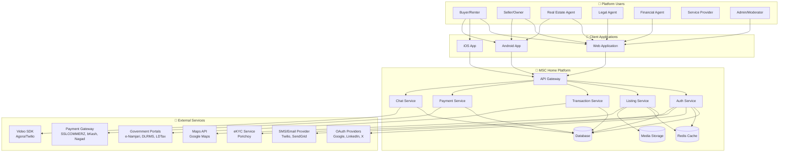

# Software Requirements Specification
# MSC Home Rental & Real Estate Platform

---

**Document ID:** SRS-MSC-HOME-2026-v1.0  
**Project Name:** MSC Home - Verified Real Estate Marketplace  
**Client:** MSC Home Platform  
**Prepared By:** CodeStorm Hub Development Team  
**Document Owner:** Product Manager, MSC Home  
**Date:** January 3, 2026  
**Status:** CLIENT REVIEW  
**Version:** 1.0

---

## Document Control

| Version | Date | Author | Changes | Approver |
|---------|------|--------|---------|----------|
| 0.1 | Dec 2025 | Dev Team | Initial draft | - |
| 0.9 | Jan 2, 2026 | Dev Team | Complete requirements | - |
| 1.0 | Jan 3, 2026 | Dev Team | Client-ready version | Pending |

---

## Executive Summary

MSC Home Rental & Real Estate Platform is a comprehensive digital solution designed to **revolutionize Bangladesh's real estate market** by providing a secure, verified, and transparent environment for property transactions. This platform addresses critical pain points in the current market: **low trust, hidden property details, unfair pricing, difficulty verifying legal documents, and loan affordability constraints**.

### Business Objectives

1. **Build Trust:** Establish a verified marketplace where buyers and sellers can transact with confidence through identity verification, professional badges, and listing authentication
2. **Increase Transparency:** Provide complete property information with accuracy scoring, document vaults, and cost transparency
3. **Streamline Transactions:** Support the complete transaction workflow from property search to deal closure with integrated legal and financial support
4. **Bangladesh-Specific Integration:** Native support for Bayna, Dalil, Namjari, and government portal workflows
5. **Enable Secure Payments:** Multi-gateway integration with buyer protection mechanisms to ensure financial security

### Key Platform Features

- **✅ Verified Marketplace:** Multi-tier verification system including identity verification, professional badges (URA-certified agents), listing authentication, and ownership verification
- **🏘️ Complete Transaction Workflow:** End-to-end process from property search to handover with step-by-step tracking, document management, and milestone validation
- **🇧🇩 Bangladesh-Specific Integration:** Native support for Bayna (sale agreement), Dalil (registered deed), Namjari (mutation), and government portal link-outs
- **💳 Secure Payment System:** Multi-gateway integration (SSLCOMMERZ, bKash, Nagad) with OTP/3DS verification and buyer protection
- **💬 Communication Suite:** In-platform chat, audio/video calls, appointment scheduling, and inquiry management
- **🤝 Professional Network:** Connect buyers, sellers, URA-certified agents, legal advisors, and financial institutions

### Target Users

| User Type | Description | Key Needs |
|-----------|-------------|-----------|
| **Property Buyers** | Individuals seeking to purchase property | Trust, transparency, legal support, financing options |
| **Property Renters** | Individuals seeking rental properties | Verified listings, clear terms, secure deposits |
| **Property Sellers** | Owners selling property | Serious buyers, fast transactions, legal assistance |
| **Landlords** | Property owners offering rentals | Reliable tenants, lease management, income tracking |
| **Real Estate Agents** | URA-certified professionals | Lead generation, credibility, fast communication |
| **Legal Advisors** | Lawyers specializing in property law | Service discovery, case management, reputation building |
| **Financial Institutions** | Banks and NBFIs offering loans | Qualified leads, document verification, loan processing |
| **Service Providers** | Architects, designers, surveyors | Project opportunities, portfolio showcase, client reviews |

### Technical Scope

The platform encompasses:

- **Web Application:** Responsive design supporting all modern browsers (Chrome, Firefox, Safari, Edge)
- **Mobile Applications:** Native Android and iOS apps with offline capabilities
- **Admin Dashboard:** Comprehensive tools for user management, verification, moderation, and analytics
- **Integration Ecosystem:** Payment gateways, maps, eKYC providers, SMS/email services, government portals

### Success Metrics & ROI

Based on market research with **97.6% demand for advanced search**, **78.3% prioritizing trustworthiness**, and **95.2% wanting post-transaction ratings**, the platform targets:

- **Year 1:** 10,000 verified listings, 50,000 registered users, 1,000 completed transactions
- **Trust Score:** 90% of users rate platform security as "Excellent" or "Good"
- **Transaction Velocity:** Average time from offer to handover reduced by 40% vs. traditional methods
- **Verification Rate:** 80% of active agents achieve verified badge status

### Investment & Timeline

- **Development Phase:** 6-9 months (MVP: 4 months, Full: 6-9 months)
- **Estimated Investment:** [To be determined based on scope]
- **Go-Live Strategy:** Phased rollout starting with Dhaka metropolitan area, expanding to major cities

### Compliance & Standards

This SRS document aligns with:
- ✅ **IEEE 830-1998** Software Requirements Specifications
- ✅ **ISO/IEC/IEEE 29148:2018** Requirements Engineering Standard
- ✅ **OWASP Top 10** Security Best Practices
- ✅ **WCAG 2.1 Level AA** Accessibility Guidelines (recommended for core flows)
- ✅ **PCI DSS Awareness** Payment Card Industry Data Security Standard considerations

---

> **Note to Stakeholders:** This document consolidates requirements based on extensive market research, user studies, and Bangladesh real estate industry best practices. All requirements have been validated for technical feasibility and business value. Your feedback and approval are critical to ensure alignment with business objectives.

---

## Document Conventions

### Requirement Notation

This SRS uses the **RFC 2119 standard** for requirement priority levels:

- **SHALL / MUST:** Absolute requirement, mandatory for system operation
  - Example: "The system SHALL validate email format before account creation"
  
- **SHOULD:** Strong recommendation, flexibility exists for valid reasons
  - Example: "The system SHOULD display property images in carousel format"
  
- **MAY:** Optional feature, nice-to-have enhancement
  - Example: "The system MAY allow users to save favorite searches"

### Priority Levels

- **P0 (MVP Must-Have):** Critical for initial product launch, blocking feature
- **P1 (Near-Term):** Important for competitive advantage, deliver within 3 months post-MVP
- **P2 (Future Enhancement):** Nice-to-have features, roadmap beyond 6 months

### Requirement Numbering

| Prefix | Type | Example |
|--------|------|---------|
| **FR-** | Functional Requirement | FR-001, FR-002, FR-003 |
| **NFR-** | Non-Functional Requirement | NFR-SEC-001, NFR-PERF-001 |
| **BR-** | Business Rule | BR-001, BR-002 |
| **US-** | User Story | US-B1 (Buyer), US-S1 (Seller), US-L1 (Legal), US-A1 (Admin) |

### Diagram Notation

All diagrams use **Mermaid.js** notation and are numbered sequentially:
- **Figure X.Y:** Section number (X) and diagram sequence (Y)
- Each diagram includes descriptive title and context

### Typography

- **Bold text:** Key terms, requirement identifiers, section headers
- *Italic text:* Emphasis, real-world scenarios, examples
- `Code format`: System identifiers, API endpoints, database fields, technical values

---

## Table of Contents

### 1. Introduction
- 1.1 Purpose
- 1.2 Scope
- 1.3 Intended Audience
- 1.4 Definitions, Acronyms, and Abbreviations
- 1.5 References
- 1.6 Document Overview

### 2. Overall Product Description
- 2.1 Product Perspective
- 2.2 Problem Statement
- 2.3 Product Vision & Goals
- 2.4 Research Validation & Market Signals
- 2.5 Product Positioning

### 3. System Context & Stakeholders
- 3.1 Stakeholder Identification
- 3.2 Primary User Actors
- 3.3 Secondary User Actors
- 3.4 External Systems & Dependencies
- 3.5 Roles & Permissions (RBAC + ABAC)

### 4. User Personas
- 4.1 Buyer Persona (Sumaiya Akter - First-time Buyer)
- 4.2 Seller Persona (Rakib Hasan - Experienced Seller)
- 4.3 Agent Persona (Rafiq Ahmed - URA-Certified Agent)
- 4.4 Legal Agent Persona (Advocate Tahmina Sultana)
- 4.5 Financial Agent Persona

### 5. System Features & Module Overview
- 5.1 Authentication & Account Management
- 5.2 User Profile & Professional Mode
- 5.3 Verification & Trust System
- 5.4 Property Marketplace & Listings
- 5.5 Search & Discovery
- 5.6 Communication & Appointments
- 5.7 Offers, Orders & Transactions
- 5.8 Payment Integration
- 5.9 Legal Support Services
- 5.10 Financial Support Services
- 5.11 Reputation & Reviews
- 5.12 Admin & Moderation
- 5.13 Additional Modules (P1/P2)

### 6. Assumptions, Constraints & Dependencies
- 6.1 Assumptions
- 6.2 Constraints
- 6.3 External Dependencies

### 7. Functional Requirements (FR-1 to FR-93)
- 7.1 Authentication & Account (FR-1 to FR-4)
- 7.2 User Profile & Professional Data (FR-5 to FR-7)
- 7.3 Verification & Trust (FR-8 to FR-11)
- 7.4 Listings & Media (FR-12 to FR-18)
- 7.5 Search & Discovery (FR-19 to FR-22)
- 7.6 Communication & Appointments (FR-23 to FR-26)
- 7.7 Offers, Orders, Transactions (FR-27 to FR-32)
- 7.8 Payments (FR-33 to FR-35)
- 7.9 Legal Support (FR-36 to FR-38)
- 7.10 Financial Support (FR-39 to FR-40)
- 7.11 Reviews & Reputation (FR-41 to FR-43)
- 7.12 Notifications (FR-44 to FR-45)
- 7.13 Community + Content (FR-46 to FR-49) [P2]
- 7.14 Admin/Moderation (FR-50 to FR-51)
- 7.15 Transparency & Guides (FR-52 to FR-55)
- 7.16 Safety & Disputes (FR-56 to FR-57)
- 7.17 Real Estate Projects (FR-58 to FR-59)
- 7.18 Monetization (FR-60 to FR-61)
- 7.19 Service Provider Marketplace (FR-62 to FR-65)
- 7.20 Government Land Portals (FR-66 to FR-69)
- 7.21 Payment Gateway Integration (FR-70 to FR-74)
- 7.22 Operational & Safety (FR-75 to FR-93)

### 8. Business Rules (BR-1 to BR-43)
- 8.1 Verification Rules
- 8.2 Accuracy Score Rules
- 8.3 Cost Transparency Rules
- 8.4 Offer & Transaction Rules
- 8.5 Payment Rules
- 8.6 Buyer Protection & Disputes
- 8.7 Review Rules
- 8.8 Service Provider Rules
- 8.9 Payment Gateway Validation
- 8.10 Listing Lifecycle & Moderation
- 8.11 Document Vault Access
- 8.12 Messaging Safety
- 8.13 Notification Rules
- 8.14 Cancellation & Refund Rules

### 9. User Stories & Real-World Scenarios
- 9.1 Buyer Stories (US-B1 to US-B7)
- 9.2 Seller/Agent Stories (US-S1 to US-S5)
- 9.3 Legal Agent Stories (US-L1)
- 9.4 Admin/Verifier Stories (US-A1 to US-A2)
- 9.5 User Story Summary Matrix

### 10. Data Requirements & Entity Model
- 10.1 Core Entities (MVP)
- 10.2 Bangladesh-Specific Document Types
- 10.3 Additional Entities

### 11. Entity Relationship Diagrams
- 11.1 Core Marketplace ERD
- 11.2 Extended Operational ERD
- 11.3 Auth & Social Login ERD
- 11.4 Community & Content ERD

### 12. Transaction Flow & State Machines
- 12.1 Offer State Machine
- 12.2 Transaction State Machine (Buy/Sell)
- 12.3 Transaction State Machine (Rent)
- 12.4 Bangladesh Transaction Step Workflow

### 13. System Diagrams
- 13.1 Listing Lifecycle State Diagram
- 13.2 Verification Flow Sequence Diagram
- 13.3 Payment Flow with OTP/3DS
- 13.4 System Context & External Integrations
- 13.5 Hosted Checkout + IPN + Validation
- 13.6 Dispute Lifecycle State Diagram
- 13.7 Document Vault Access Decision Flow
- 13.8 Notification Delivery Sequence
- 13.9 Portal Tracking Assistance Flow
- 13.10 Use Case Diagram
- 13.11 High-Level Architecture Diagram
- 13.12 Data Flow Diagram
- 13.13 Component Interaction Diagram
- 13.14 Deployment Architecture Diagram

### 14. Non-Functional Requirements (NFR)
- 14.1 Security Requirements
- 14.2 Performance Requirements
- 14.3 Scalability Requirements
- 14.4 Reliability & Availability
- 14.5 Privacy & Data Protection
- 14.6 Accessibility & Localization
- 14.7 Observability & Monitoring

### 15. Appendices
- 15.1 Glossary of Terms
- 15.2 Acronyms & Abbreviations
- 15.3 Technical Standards & Compliance
- 15.4 External References
- 15.5 Requirements Traceability Matrix
- 15.6 Approval & Sign-Off

---

## 1. Introduction

### 1.1 Purpose

This Software Requirements Specification (SRS) document defines comprehensive, implementable requirements for **MSC Home Rental & Real Estate Platform**, a verified property marketplace for Bangladesh. The platform encompasses:

- **Core Marketplace:** Property listings, search, and discovery
- **Trust & Verification:** Identity, professional, and listing verification system
- **Transaction Management:** Complete workflow from offer to handover
- **Communication Tools:** Chat, audio/video, appointment booking
- **Legal & Financial Support:** Integrated professional services
- **Secure Payments:** Multi-gateway integration with buyer protection
- **Bangladesh-Specific Features:** Bayna, Dalil, Namjari tracking and government portal integration

This document serves as the **authoritative source** for all system requirements and provides a foundation for:
- Development team implementation
- Quality assurance testing and validation
- Client approval and sign-off
- Future enhancements and change requests

### 1.2 Scope

**MSC Home Platform** addresses critical pain points in Bangladesh's real estate market by providing a comprehensive digital solution that transforms how properties are bought, sold, and rented.

#### In Scope (MVP & P1)

✅ **User Management**
- Account creation with email/phone + OTP verification
- Social OAuth login (Google, LinkedIn, X/Twitter)
- Professional mode switching for business users
- Multi-tier verification system (identity, professional, company, listing)

✅ **Marketplace Features**
- Property listing creation with media and document vault
- Advanced search with filters (location, price, verified-only)
- Map-based property discovery
- Listing accuracy score calculation
- Favorites and saved searches

✅ **Communication**
- Real-time chat between buyers and sellers
- Appointment booking with time slot management
- Audio/video calls (integrated SDK)
- Purpose capture for all communications

✅ **Transaction Management**
- Offer submission and negotiation workflow
- Transaction step tracking (12-step Bangladesh workflow)
- Document proof uploads per milestone
- Order and payment management

✅ **Payment Integration**
- Multi-gateway support (SSLCOMMERZ, bKash, Nagad)
- OTP/3DS verification
- IPN webhook processing
- Payment validation and reconciliation
- Buyer protection mechanisms

✅ **Professional Services**
- Legal agent directory and booking
- Financial agent directory and loan requests
- Service provider marketplace (architects, designers)

✅ **Reputation System**
- Post-transaction ratings and reviews
- Response time tracking for professionals
- Verified badge display

✅ **Admin & Moderation**
- Verification queue management
- Listing moderation
- Dispute resolution
- User management and audit logs

✅ **Bangladesh-Specific Integration**
- Government portal link-outs (e-Namjari, DLRMS, LDTax)
- Portal reference capture
- Status tracking assistance
- Support for Bayna, Dalil, Namjari workflows

#### Out of Scope (P2 / Future Enhancements)

❌ **Community Features** (Deferred to P2)
- Groups, pages, posts, and social feed
- Content publishing (blogs, videos)
- User-generated content moderation

❌ **Advanced Features** (Future Roadmap)
- AI-powered property valuation
- Automated document verification
- Blockchain-based deed registry
- Virtual reality property tours
- Predictive analytics for market trends

#### Geographic Scope

- **Phase 1:** Dhaka metropolitan area
- **Phase 2:** Major cities (Chittagong, Sylhet, Rajshahi, Khulna)
- **Phase 3:** National coverage

### 1.3 Intended Audience

This document is intended for:

| Audience | Purpose | Relevant Sections |
|----------|---------|-------------------|
| **Business Stakeholders** | Understand business value, features, and ROI | Executive Summary, Section 2, Section 4, Section 9 |
| **Product Managers** | Product roadmap, feature prioritization | Section 5, Section 7, Section 8 |
| **Development Team** | Technical implementation guidance | Section 7, Section 10, Section 11, Section 13, Section 14 |
| **QA/Testing Team** | Test case creation and validation | Section 7, Section 8, Section 9, Appendix 15.5 |
| **UI/UX Designers** | User flows, wireframes, mockups | Section 4, Section 9, Section 13 |
| **Legal/Compliance** | Regulatory requirements, data privacy | Section 3.5, Section 14.5, Section 15.3 |
| **Client Representatives** | Approval and sign-off | Executive Summary, All Sections, Appendix 15.6 |

### 1.4 Definitions, Acronyms, and Abbreviations

**Key Functional Terms:**

- **Accuracy Score:** Completeness percentage of a listing calculated from required and optional fields, displayed to users to indicate listing quality
- **Verified Badge:** Visual indicator on user profiles and listings showing successful completion of verification process
- **Professional Mode:** Account type for business users (agents, lawyers, financial advisors) with enhanced features and verification requirements
- **Document Vault:** Secure storage system for sensitive property documents with access control and audit logging
- **Access Grant:** Time-bound permission allowing specific users to view sensitive documents
- **Transaction Timeline:** Chronological record of all steps in a property transaction from offer to handover
- **Step Proof:** Evidence document (deed copy, payment receipt, etc.) uploaded to verify completion of a transaction milestone

**Bangladesh Property Terms:**

- **Bayna / Baina Nama:** Sale agreement or agreement to sell, a legally binding preliminary document in Bangladesh property transactions executed before final deed registration
- **Dalil:** Registered deed document obtained from Sub-Registrar office, serves as legal proof of property ownership transfer
- **Namjari (Mutation):** Legal process of updating ownership records in government land records after property transfer, essential for tax and ownership verification
- **Khatian:** Official land record document showing ownership details, plot number (Dag), area, and boundaries
- **Mouza:** Administrative land unit in Bangladesh used for property identification and record-keeping
- **Dag:** Plot number within a Mouza, forms part of the unique property identification system
- **DCR (Dhaka City Corporation Receipt):** Property tax receipt from city corporation for urban properties
- **Katha:** Traditional land measurement unit (1 Katha = 720 square feet in Bangladesh)
- **Decimal:** Land measurement unit (1 Decimal = 435.6 square feet)
- **Shotok:** Smallest land measurement unit (1 Shotok = 7.26 square feet)

**Technical Acronyms:**

- **API:** Application Programming Interface
- **RBAC:** Role-Based Access Control - permission system based on user roles
- **ABAC:** Attribute-Based Access Control - permission system based on user attributes and relationships
- **KYC:** Know Your Customer - identity verification process
- **eKYC:** Electronic KYC - digital identity verification using government databases
- **OTP:** One-Time Password - temporary password sent via SMS/Email for verification
- **3DS:** 3-Domain Secure - additional security layer for online card payments
- **IPN:** Instant Payment Notification - real-time payment status update from payment gateway
- **CDN:** Content Delivery Network - distributed server network for fast content delivery
- **TLS:** Transport Layer Security - encryption protocol for secure communications
- **JWT:** JSON Web Token - secure method for transmitting information between parties

**Regulatory & Compliance:**

- **URA:** Urban Development Authority (e.g., RAJUK in Dhaka) - regulatory body for real estate agents and property development
- **TIN:** Taxpayer Identification Number - tax identification for individuals and businesses
- **BIN:** Business Identification Number - unique identifier for registered businesses
- **NID:** National Identity Document - government-issued identity card
- **PCI DSS:** Payment Card Industry Data Security Standard
- **WCAG:** Web Content Accessibility Guidelines
- **OWASP:** Open Web Application Security Project

**Priority Indicators:**

- **P0:** Must-have for MVP launch
- **P1:** Important for competitive advantage, deliver within 3 months post-MVP
- **P2:** Nice-to-have features, long-term roadmap

*See Appendix 15.1 for complete glossary with detailed definitions.*

### 1.5 References

**Standards & Guidelines:**
1. IEEE Std 830-1998 - IEEE Recommended Practice for Software Requirements Specifications
2. ISO/IEC/IEEE 29148:2018 - Systems and software engineering — Life cycle processes — Requirements engineering
3. RFC 2119 - Key words for use in RFCs to Indicate Requirement Levels
4. WCAG 2.1 - Web Content Accessibility Guidelines (W3C)
5. OWASP Top 10 - Top 10 Web Application Security Risks

**External Systems Documentation:**
6. SSLCOMMERZ Developer Documentation: https://developer.sslcommerz.com/
7. bKash Merchant Integration Guide: https://developer.bkash.com/
8. Nagad Merchant API Documentation: https://developer.nagad.com.bd/
9. Google Maps Platform Documentation: https://developers.google.com/maps
10. Porichoy eKYC Documentation: https://porichoy.gov.bd/

**Government Portals:**
11. Bangladesh Land Mutation Portal: https://mutation.land.gov.bd/
12. DLRMS (Land Record System): https://dlrms.land.gov.bd/
13. Land Development Tax Portal: https://portal.ldtax.gov.bd/
14. Bangladesh National Portal: https://bangladesh.gov.bd/

**Internal Documents:**
15. MSC Home Product Roadmap (Internal)
16. Market Research Report - Bangladesh Real Estate (Internal)
17. User Interview Findings (Internal)
18. Technical Architecture Document (Internal)

### 1.6 Document Overview

This SRS is organized into 15 major sections:

**Sections 1-2** provide context: purpose, scope, problem statement, and product vision.

**Sections 3-5** define stakeholders, user personas, and system module overview for understanding who uses the system and what it does.

**Section 6** establishes assumptions, constraints, and dependencies that influence system design.

**Sections 7-8** specify all functional requirements (FR-1 to FR-93) and business rules (BR-1 to BR-43) - the core of this document.

**Section 9** provides detailed user stories with real-world scenarios, acceptance criteria, and test data.

**Sections 10-13** present data models, entity relationships, and comprehensive diagrams (ERD, state machines, sequence, architecture).

**Section 14** defines non-functional requirements covering security, performance, reliability, privacy, and accessibility.

**Section 15** includes appendices: glossary, standards compliance, traceability matrix, and approval forms.

Diagrams are numbered as **Figure X.Y** where X is section number and Y is diagram sequence within that section.

---

## 2. Overall Product Description

### 2.1 Product Perspective

MSC Home Rental & Real Estate Platform is a **new, standalone digital marketplace** designed specifically for the Bangladesh real estate market. While similar platforms exist globally (e.g., Zillow in the USA, 99acres in India), MSC Home is uniquely positioned to address Bangladesh-specific challenges and workflows.

**System Context:**

MSC Home operates as a **multi-sided marketplace platform** connecting:
- Property buyers/renters (demand side)
- Property sellers/landlords (supply side)
- Real estate agents (facilitators)
- Legal advisors (professional services)
- Financial institutions (enablers)
- Government systems (regulatory integration)

The platform serves as the **central hub** for all real estate activities, integrating with external systems while maintaining core transaction data and user relationships internally.

**Key Differentiators:**

1. **Verification-First Approach:** Multi-tier verification system (identity, professional, listing, ownership) creates a trusted ecosystem
2. **Bangladesh Legal Process Integration:** Native support for Bayna, Dalil, Namjari workflows with government portal assistance
3. **Complete Transaction Workflow:** End-to-end process management from initial interest to property handover
4. **Buyer Protection:** Secure payment handling with dispute resolution mechanisms
5. **Professional Network:** Integrated legal and financial services marketplace

**Figure 2.1: System Context Diagram**



### 2.2 Problem Statement

Bangladesh's real estate market faces **significant trust and efficiency challenges** that prevent optimal outcomes for all parties:

**Critical Problems Identified:**

1. **Low Trust & Transparency**
   - Hidden property defects and incomplete information
   - Fraudulent listings and identity misrepresentation
   - Unfair pricing with hidden costs
   - Difficulty verifying property ownership and legal documents
   - *Impact:* Buyers avoid online platforms, preferring word-of-mouth despite inefficiency

2. **Complex Legal Processes**
   - Bayna, Dalil, Namjari workflows are confusing for first-time buyers
   - Difficulty finding reliable legal advisors
   - Lack of step-by-step guidance for document requirements
   - Manual tracking of government portal submissions
   - *Impact:* Transactions delayed by 30-60 days due to legal confusion

3. **Financial Constraints**
   - Limited visibility into loan options and eligibility
   - Difficulty connecting with financial institutions
   - Lack of transparency on interest rates and terms
   - No integrated loan application workflow
   - *Impact:* 40% of potential buyers abandon purchase due to financing challenges

4. **Communication Inefficiencies**
   - Multiple platforms (phone, Facebook, WhatsApp) create fragmented communication
   - No centralized record of discussions and agreements
   - Difficulty scheduling property visits
   - Slow response times from agents
   - *Impact:* Average 7-10 days from initial inquiry to property visit

5. **Incomplete Online Information**
   - Listings lack critical details (legal status, utility costs, possession date)
   - Poor quality photos or no photos
   - No virtual tour options
   - Missing floor plans and area measurements
   - *Impact:* 85% of online inquiries require 3+ follow-up calls for basic information

**Quantified Pain Points (Market Research Data):**

From survey of 83 respondents in Dhaka metropolitan area (slides OCR data):

| Pain Point | Percentage | Implication |
|------------|------------|-------------|
| Demand for advanced search | 97.6% | Search is table-stakes feature |
| Importance of trustworthiness | 78.3% | Verification must be core, not optional |
| Interest in affordable loans | 90.4% | Financial integration is critical |
| Interest in secure payments | 69.9% | Payment gateway integration required |
| Desire to rate buyers/sellers | 95.2% | Reputation system is essential |

**Feature Preference Breakdown:**

- Secure payments: 69.9%
- Affordable loans: 37.3%
- Legal support: 27.7%
- Virtual tours: 24.1%

### 2.3 Product Vision & Goals

**Vision Statement:**

> "To become Bangladesh's most trusted real estate marketplace where every transaction is transparent, verified, and secure - empowering buyers, sellers, and professionals with the tools and confidence to close deals efficiently."

**Product Goals (Year 1):**

🎯 **Goal 1: Establish Trust**
- **Target:** 80% of active listings achieve "Verified" status
- **Measure:** Verification completion rate, user trust score surveys
- **Benefit:** Buyers can confidently transact online without fear of fraud

🎯 **Goal 2: Accelerate Transactions**
- **Target:** Reduce average time from offer to handover by 40% (from 90 days to 54 days)
- **Measure:** Transaction timeline analytics, milestone completion tracking
- **Benefit:** Faster liquidity for sellers, faster occupancy for buyers

🎯 **Goal 3: Increase Market Participation**
- **Target:** 10,000 verified listings, 50,000 registered users, 1,000 completed transactions
- **Measure:** Platform analytics, conversion funnel metrics
- **Benefit:** Network effects create more choices and competitive pricing

🎯 **Goal 4: Empower Professionals**
- **Target:** 500 verified real estate agents, 100 legal advisors, 50 financial partners
- **Measure:** Professional verification rate, service booking volume
- **Benefit:** Quality professionals gain credibility and lead generation

🎯 **Goal 5: Simplify Legal Compliance**
- **Target:** 90% of users rate legal process guidance as "Helpful" or "Very Helpful"
- **Measure:** User satisfaction surveys, support ticket volume
- **Benefit:** First-time buyers navigate Bayna/Dalil/Namjari confidently

**Long-Term Vision (3-5 Years):**

- Expand to all major cities in Bangladesh
- Integrate with government land registry for automated deed verification
- Offer AI-powered property valuation and market analytics
- Launch property financing products in partnership with banks
- Establish MSC Home as the authoritative source for Bangladesh real estate data

### 2.4 Research Validation & Market Signals

This SRS is grounded in **comprehensive market research** conducted across multiple channels:

**Research Methodology:**

1. **User Surveys:** 83 respondents in Dhaka metropolitan area
2. **In-Depth Interviews:** 12 interviews (6 buyers, 4 sellers, 2 agents)
3. **Journey Mapping:** Buyer and seller journey analysis
4. **Competitive Analysis:** 5 existing BD platforms evaluated
5. **Government Portal Analysis:** e-Namjari, DLRMS, LDTax workflow documentation

**Key Findings:**

📊 **Search & Discovery (97.6% demand for advanced search)**
- Users expect filters: location, price range, property type, size, verified-only
- Map-based search is highly desirable (mentioned in 11/12 interviews)
- Saved searches with alerts are expected (mentioned in 8/12 interviews)
- **Implication:** Search must be comprehensive, fast (<2s), and support multiple filter combinations

📊 **Trust & Verification (78.3% prioritize trustworthiness)**
- Users want to see:
  - Identity verification badges
  - Professional certifications (URA for agents, BAR for lawyers)
  - Property ownership verification
  - Listing accuracy scores
- Willingness to upload NID for verification: 72% (with privacy assurances)
- **Implication:** Multi-tier verification system is non-negotiable for MVP

📊 **Financial Support (90.4% interest in affordable loans)**
- Primary concern: "Can I afford this property?"
- Users want:
  - Loan eligibility calculator
  - Direct connection to banks/NBFIs
  - Comparison of loan terms
  - Pre-qualification without hard credit pull
- **Implication:** Financial agent directory and loan request workflow must be P0

📊 **Secure Payments (69.9% interest)**
- Trust concerns about large transactions
- Preference for familiar gateways (bKash: 45%, card/e-banking: 35%, Nagad: 20%)
- Desire for payment proof linked to transaction
- **Implication:** Multi-gateway support with OTP/3DS and buyer protection required

📊 **Post-Transaction Reputation (95.2% desire ratings)**
- Near-universal demand for rating system
- Users want to rate:
  - Sellers (honesty, responsiveness)
  - Agents (professionalism, transparency)
  - Legal/financial advisors (quality of service)
- **Implication:** Review system is essential for trust flywheel

**Buyer & Seller Journey Insights:**

*From interview transcripts and journey mapping:*

**Buyer Pain Points:**
1. "I don't know if the property is actually available or already sold" → **Solution:** Real-time listing status
2. "Legal process is very confusing, I need step-by-step help" → **Solution:** Transaction timeline with Bayna/Dalil/Namjari guidance
3. "I can't tell if the agent is trustworthy" → **Solution:** Verification badges, ratings, response time metrics
4. "Hidden costs surprise me at the end" → **Solution:** Cost transparency fields, "Not provided" labels

**Seller Pain Points:**
1. "I get many inquiries but most are not serious" → **Solution:** Verified buyer badges, offer submission workflow
2. "Managing multiple conversations is chaotic" → **Solution:** Centralized chat with appointment management
3. "I need to find a good lawyer but don't know where to start" → **Solution:** Legal agent directory with reviews
4. "Transaction takes too long due to document delays" → **Solution:** Document vault with upload reminders

### 2.5 Product Positioning

**Market Position:**

MSC Home is positioned as a **premium, trust-focused real estate marketplace** differentiated from competitors by:

| Dimension | MSC Home | Typical Competitors |
|-----------|----------|-------------------|
| **Trust** | Multi-tier verification (identity, professional, listing, ownership) | Minimal or no verification |
| **Legal Support** | Integrated legal agents, step-by-step Bayna/Dalil/Namjari guidance | External referrals only |
| **Financial Support** | Loan agent directory, request workflow | None or simple listings |
| **Transaction Management** | Complete 12-step workflow with proof uploads | Basic contact forms |
| **Payment** | Secure multi-gateway with buyer protection | No integrated payments |
| **Communication** | In-platform chat + audio/video + appointments | Phone numbers only |
| **Government Integration** | e-Namjari, DLRMS, LDTax link-outs and tracking | No integration |

**Competitive Advantages:**

1. **Verification-First:** Only platform with comprehensive verification (users, professionals, listings)
2. **Bangladesh-Native:** Purpose-built for BD legal processes (Bayna, Dalil, Namjari)
3. **End-to-End:** Complete transaction management from search to handover
4. **Professional Ecosystem:** Integrated legal, financial, and service provider marketplace
5. **Buyer Protection:** Secure payments with dispute resolution

**Target Market Segments:**

**Primary:** Urban professionals in Dhaka (age 25-45, income 50k-200k BDT/month, first-time or second-time buyers)

**Secondary:** Real estate agents seeking digital tools and lead generation

**Tertiary:** Legal and financial professionals seeking client acquisition

---

## 3. System Context & Stakeholders

### 3.1 Stakeholder Identification

**Internal Stakeholders:**

| Stakeholder | Interest | Influence | Engagement Strategy |
|-------------|----------|-----------|---------------------|
| **Product Owner** | Product-market fit, user satisfaction, revenue | High | Weekly reviews, roadmap prioritization |
| **Development Team** | Technical feasibility, code quality, timelines | High | Daily standups, sprint planning, technical reviews |
| **UX/UI Designers** | User experience, design consistency, accessibility | Medium-High | Design reviews, usability testing, feedback loops |
| **QA Team** | Quality assurance, bug-free releases, test coverage | Medium-High | Test planning, regression testing, UAT coordination |
| **Operations Team** | Platform stability, monitoring, incident response | Medium | SLA definition, runbook creation, on-call rotation |
| **Customer Support** | User issue resolution, feedback collection | Medium | Ticketing system, escalation procedures, knowledge base |

**External Stakeholders:**

| Stakeholder | Interest | Influence | Engagement Strategy |
|-------------|----------|-----------|---------------------|
| **Property Buyers/Renters** | Find trustworthy properties, secure transactions | High | User surveys, feedback forms, feature voting |
| **Property Sellers/Landlords** | Attract serious buyers, fast sales, good prices | High | Agent feedback, listing analytics, success stories |
| **Real Estate Agents** | Lead generation, credibility, efficiency tools | High | Partner program, training, dedicated support |
| **Legal Advisors** | Client acquisition, service delivery, reputation | Medium | Professional onboarding, case management tools |
| **Financial Institutions** | Loan origination, qualified leads, compliance | Medium | Partnership agreements, API integration, reporting |
| **Government Bodies** | Compliance, tax collection, land record accuracy | Low-Medium | Portal integration planning, data privacy assurance |
| **Payment Gateways** | Transaction volume, technical integration | Medium | Technical documentation, reconciliation processes |
| **Investors/Board** | ROI, growth metrics, market share | High | Monthly reports, KPI dashboards, strategic reviews |

### 3.2 Primary User Actors

**Figure 3.1: Primary User Actors**

| Actor | Description | Key Goals | Pain Points Addressed |
|-------|-------------|-----------|----------------------|
| **👤 Buyer** | Individual seeking to purchase property | Find verified listings, secure transactions, legal support, financing options | Trust, transparency, legal complexity, financing access |
| **🏠 Renter** | Individual seeking rental property | Find verified rentals, clear lease terms, secure deposits | Trust, hidden costs, lease clarity |
| **💼 Seller** | Property owner selling real estate | Attract serious buyers, verify buyer authenticity, fast transactions, legal support | Time waste on unserious inquiries, legal delays, fraud risk |
| **🏢 Landlord** | Property owner offering rentals | Find reliable tenants, manage leases, collect rent securely | Tenant verification, payment collection, lease management |
| **🎯 Real Estate Agent** | URA-certified professional (or equivalent) | Lead generation, credibility building, efficient communication, high conversion | Credibility, lead quality, communication chaos, manual workflows |
| **⚖️ Legal Agent** | Lawyer/law firm specializing in property law | Client acquisition, showcase expertise, case management, reputation building | Client discovery, service visibility, case tracking |
| **💰 Financial Agent** | Bank/NBFI representative or loan consultant | Qualified lead generation, loan processing efficiency, borrower verification | Lead quality, document collection delays, verification overhead |
| **🔧 Service Provider** | Architect, designer, surveyor, electrician, etc. | Project opportunities, portfolio showcase, client reviews, payment security | Client discovery, credibility, payment disputes |

### 3.3 Secondary User Actors

**Figure 3.2: Secondary User Actors (Administrative & Support)**

| Actor | Description | Key Responsibilities | System Access Level |
|-------|-------------|---------------------|-------------------|
| **👨‍💼 Admin** | Platform administrator | User management, system configuration, analytics, dispute resolution (final authority) | Full system access, all data visibility |
| **✅ Verifier** | Verification specialist | Review identity/professional/listing verification requests, approve/reject with audit trail | Verification queues, document access, user profiles |
| **🛡️ Moderator** | Content moderator | Review reported listings/users/messages, enforce platform policies, handle abuse cases | Moderation queues, user actions (warn/suspend/ban) |
| **💬 Customer Support** | Support agent | Assist users with platform issues, answer questions, escalate disputes | User profiles (read), limited admin functions, support ticketing |
| **🔍 Field Verifier** | On-site property inspector (P1 feature) | Conduct physical property inspections, upload verification photos and reports | Mobile app, listing updates, photo uploads |
| **🏛️ Credential Issuer** | Financial/non-financial institution representative (P1 feature) | Issue credential reports for professionals (e.g., bank solvency letters, employer letters) | Credential upload interface, verification status updates |

### 3.4 External Systems & Dependencies

**Figure 3.3: External System Dependencies**

**Authentication & Communication:**
- **OAuth Providers:** Google, LinkedIn, X/Twitter (social login)
- **SMS Provider:** Twilio, AWS SNS, or local provider (OTP delivery)
- **Email Service:** SendGrid, AWS SES (notifications, password reset)
- **Video SDK:** Agora, Twilio, or Jitsi (audio/video calls) [P1]

**Payment & Financial:**
- **Payment Gateway Aggregator:** SSLCOMMERZ (supports cards, e-banking, mobile wallets)
- **Mobile Wallets:** bKash, Nagad (direct integrations or via SSLCOMMERZ)
- **Banking APIs:** Partner banks for loan applications [P1]

**Maps & Location:**
- **Maps Provider:** Google Maps Platform (geocoding, map display, directions)
- **Location Services:** Device GPS, IP geolocation

**Verification & Identity:**
- **eKYC Provider:** Porichoy (National ID verification) [P1, optional]
- **Professional Registries:** URA certificate database (manual verification MVP, API integration P1)

**Government Portals (Link-out only, no API integration):**
- **e-Namjari:** https://mutation.land.gov.bd/ (mutation application and status)
- **DLRMS:** https://dlrms.land.gov.bd/ (land records and maps)
- **LDTax Portal:** https://portal.ldtax.gov.bd/ (land development tax)

**Infrastructure & Storage:**
- **Cloud Provider:** AWS, Google Cloud, or Azure (hosting, compute, storage)
- **Object Storage:** AWS S3, Google Cloud Storage (media files, documents)
- **CDN:** CloudFlare, AWS CloudFront (static asset delivery)
- **Database:** PostgreSQL (primary), Redis (cache), Elasticsearch (search)

### 3.5 Roles & Permissions (RBAC + ABAC)

MSC Home implements a **hybrid access control model**:
- **RBAC (Role-Based Access Control):** Coarse-grained permissions based on user role
- **ABAC (Attribute-Based Access Control):** Fine-grained permissions based on resource ownership, participation, and explicit grants

**3.5.1 Role Catalog**

| Role | Description | Access Level |
|------|-------------|--------------|
| **Guest** | Not logged in | Public listings, search (no sensitive data) |
| **User (Consumer)** | Registered buyer/renter/seller (non-professional) | Own profile, listings, offers, transactions, documents |
| **Professional** | Verified or unverified business user | Professional profile, enhanced features, service listings |
| ↳ Real Estate Agent | URA-certified agent (or equivalent) | Multiple listings, inquiry management, appointment calendar |
| ↳ Developer/Company | Real estate development company | Project listings, unit inventory, progress updates |
| ↳ Legal Agent | Lawyer/law firm | Legal service listings, case management, consultation bookings |
| ↳ Financial Agent | Bank/NBFI/loan consultant | Loan service listings, application management, document requests |
| ↳ Service Provider | Architect, designer, surveyor, etc. | Service listings, portfolio, booking management, invoicing |
| **Verifier** | Verification specialist | Verification queues, document review, approve/reject |
| **Moderator** | Content moderator | Moderation queues, reported content, user actions |
| **Customer Support** | Support agent | User assistance, limited admin functions, dispute viewing |
| **Admin** | Platform administrator | Full system access, all administrative functions |

**3.5.2 RBAC Permissions Matrix**

**Figure 3.4: Role-Based Access Control Matrix**

| Action | Guest | User | Professional | Verifier | Support | Admin |
|--------|:-----:|:----:|:------------:|:--------:|:-------:|:-----:|
| **General Access** |
| Browse public listings | ✅ | ✅ | ✅ | ✅ | ✅ | ✅ |
| View listing details (public info) | ✅ | ✅ | ✅ | ✅ | ✅ | ✅ |
| Register account | ✅ | - | - | - | - | - |
| Login | ❌ | ✅ | ✅ | ✅ | ✅ | ✅ |
| **Profile & Verification** |
| View own profile | ❌ | ✅ | ✅ | ✅ | ✅ | ✅ |
| Edit own profile | ❌ | ✅ | ✅ | ❌ | ❌ | ✅ |
| Switch to professional mode | ❌ | ✅ | - | ❌ | ❌ | ✅ |
| Submit verification request | ❌ | ✅ | ✅ | ❌ | ❌ | ✅ |
| Approve/reject verification | ❌ | ❌ | ❌ | ✅ | ✅* | ✅ |
| **Listings** |
| Create listing | ❌ | ✅ | ✅ | ❌ | ❌ | ✅ |
| Edit own listing | ❌ | ✅ | ✅ | ❌ | ❌ | ✅ |
| Delete own listing | ❌ | ✅ | ✅ | ❌ | ❌ | ✅ |
| Publish listing (after review) | ❌ | ✅* | ✅* | ✅* | ✅* | ✅ |
| View listing analytics | ❌ | ✅* | ✅* | ❌ | ❌ | ✅ |
| **Documents** |
| Upload documents to own vault | ❌ | ✅ | ✅ | ❌ | ❌ | ✅ |
| View own documents | ❌ | ✅ | ✅ | ❌ | ❌ | ✅ |
| Request document access | ❌ | ✅ | ✅ | ❌ | ❌ | ✅ |
| Grant document access | ❌ | ✅* | ✅* | ❌ | ❌ | ✅ |
| View restricted documents | ❌ | ✅* | ✅* | ✅ | ✅* | ✅ |
| **Communication** |
| Send chat message | ❌ | ✅ | ✅ | ✅ | ✅ | ✅ |
| Book appointment | ❌ | ✅ | ✅ | ❌ | ❌ | ✅ |
| Accept/decline appointment | ❌ | ✅* | ✅* | ❌ | ❌ | ✅ |
| Initiate audio/video call | ❌ | ✅ | ✅ | ✅ | ✅ | ✅ |
| Block user | ❌ | ✅ | ✅ | ✅ | ✅ | ✅ |
| **Transactions** |
| Submit offer | ❌ | ✅ | ✅ | ❌ | ❌ | ✅ |
| Accept/counter/reject offer | ❌ | ✅* | ✅* | ❌ | ❌ | ✅ |
| View transaction timeline | ❌ | ✅* | ✅* | ✅* | ✅* | ✅ |
| Upload step proofs | ❌ | ✅* | ✅* | ❌ | ❌ | ✅ |
| Place order | ❌ | ✅ | ✅ | ❌ | ❌ | ✅ |
| **Payments** |
| Initiate payment | ❌ | ✅ | ✅ | ❌ | ❌ | ✅ |
| View payment receipts | ❌ | ✅* | ✅* | ❌ | ✅* | ✅ |
| Process refund | ❌ | ❌ | ❌ | ❌ | ✅* | ✅ |
| **Disputes** |
| Open dispute | ❌ | ✅* | ✅* | ❌ | ❌ | ✅ |
| Upload dispute evidence | ❌ | ✅* | ✅* | ❌ | ❌ | ✅ |
| Resolve dispute | ❌ | ❌ | ❌ | ✅* | ✅* | ✅ |
| **Reviews** |
| Submit review | ❌ | ✅* | ✅* | ❌ | ❌ | ✅ |
| Respond to review | ❌ | ✅* | ✅* | ❌ | ❌ | ✅ |
| Delete review | ❌ | ❌ | ❌ | ❌ | ❌ | ✅ |
| **Admin Functions** |
| View all users | ❌ | ❌ | ❌ | ❌ | ✅ | ✅ |
| Suspend/ban user | ❌ | ❌ | ❌ | ❌ | ❌ | ✅ |
| View audit logs | ❌ | ❌ | ❌ | ❌ | ✅* | ✅ |
| Modify system configuration | ❌ | ❌ | ❌ | ❌ | ❌ | ✅ |

**Legend:**
- ✅ = Allowed by role
- ❌ = Not allowed by role
- ✅* = Allowed with ABAC checks (see 3.5.3)
- - = Not applicable

**3.5.3 ABAC (Attribute-Based Access Control) Rules**

For actions marked with ✅* in the matrix above, additional runtime checks are required:

**Ownership Checks:**
```
ALLOW IF (user.id == resource.owner_id)
```
Examples:
- Edit own listing
- View own documents
- View own transaction timeline

**Participation Checks:**
```
ALLOW IF (user.id IN resource.participants)
```
Examples:
- View transaction timeline (buyer OR seller)
- View chat thread (participant in thread)
- View payment receipt (payer OR payee)

**Access Grant Checks:**
```
ALLOW IF (EXISTS active_grant WHERE 
  grant.user_id == user.id 
  AND grant.resource_id == resource.id 
  AND grant.expires_at > NOW()
  AND grant.revoked_at IS NULL)
```
Examples:
- View sensitive documents (explicit grant from owner)
- Download document (grant includes download permission)

**Relationship Checks:**
```
ALLOW IF (resource.status == 'COMPLETED' 
  AND user.id IN [resource.buyer_id, resource.seller_id])
```
Examples:
- Submit review (only after transaction completed)
- Respond to review (only if review is about you)

**Admin/Role Escalation:**
```
ALLOW IF (user.role IN ['admin', 'verifier', 'support'] 
  AND action IN allowed_admin_actions[user.role])
```
Examples:
- Verifier can approve verification requests
- Support can view user profiles for assistance
- Admin can perform any action

**Time-Based Restrictions:**
```
ALLOW IF (NOW() - resource.created_at <= time_window)
```
Examples:
- Edit offer within 24 hours of submission
- Cancel order within cancellation window
- Open dispute within 30 days of transaction completion

**Business Rule Gates:**
```
ALLOW IF (business_rule_satisfied(user, resource, action))
```
Examples:
- Submit offer only if buyer is verified (BR-10)
- Publish listing only after verification approval (BR-28)
- Enable review only after transaction completion (BR-20)

**3.5.4 Permission Enforcement Architecture**

```
Request → Authentication → RBAC Check → ABAC Check → Business Rules → Allow/Deny
```

1. **Authentication:** Verify user identity (JWT token validation)
2. **RBAC Check:** Does user role allow this action type?
3. **ABAC Check:** Does user meet resource-specific requirements?
4. **Business Rules:** Do business constraints allow this action?
5. **Audit Log:** Record allowed/denied access attempts for security and compliance

**Implementation Notes:**
- All permission checks must be performed server-side (never trust client)
- Failed authorization attempts must be logged with user ID, resource ID, action, and timestamp
- Rate limiting must be applied to prevent brute-force permission probing
- Sensitive resources (documents, payments, personal data) must have extra audit logging

---

## 4. User Personas

User personas represent the primary users of the MSC Home platform. These personas are based on market research, user interviews, and journey mapping conducted in Dhaka metropolitan area.

### 4.1 Buyer Persona: Sumaiya Akter - First-Time Buyer

**Figure 4.1: First-Time Property Buyer Persona**

| Attribute | Details |
|-----------|---------|
| **Demographics** | |
| Name | Sumaiya Akter |
| Age | 28 years old |
| Occupation | Software Engineer at tech company |
| Location | Currently renting in Banani, Dhaka |
| Income | BDT 80,000/month (BDT 960,000/year) |
| Education | Bachelor's in Computer Science |
| Family Status | Single, planning to marry in 2 years |
| **Technology Profile** | |
| Digital Literacy | High (uses smartphone, laptop daily) |
| Preferred Devices | Android phone, laptop for browsing |
| Social Media | Active on Facebook, Instagram, LinkedIn |
| Online Shopping | Comfortable with Daraz, foodpanda, bKash |

**Background:**

Sumaiya has been working for 4 years and has saved BDT 15 Lakh for a down payment. She wants to buy a 2-3 bedroom apartment in Gulshan, Banani, or Baridhara area (close to her workplace) within a budget of BDT 70-85 Lakh. This will be her first major financial decision and property purchase.

**Goals & Motivations:**

🎯 **Primary Goals:**
1. Find a verified, legitimate property listing (no fraud)
2. Understand the complete legal process (Bayna, Dalil, Namjari)
3. Secure a home loan to cover 60% of the property cost
4. Complete the transaction within 60-90 days
5. Avoid hidden costs and surprise expenses

💡 **Motivations:**
- Build asset instead of paying rent
- Investment for future family
- Financial independence and security
- Pride of homeownership

**Pain Points & Fears:**

😟 **Major Concerns:**
1. **Trust & Fraud:** "How do I know the property actually belongs to the seller? What if it's a scam?"
2. **Legal Complexity:** "I don't understand Bayna, Dalil, Namjari. What if I miss an important step?"
3. **Hidden Costs:** "The listing says 75 Lakh but I've heard there are many hidden costs. What's the real price?"
4. **Loan Eligibility:** "Will I qualify for a loan? What's the interest rate? Can I afford the EMI?"
5. **Time Waste:** "I don't want to visit 20 properties only to find they're fake or already sold."

**Behavioral Characteristics:**

✅ **What Sumaiya Does:**
- Researches extensively online before making decisions
- Reads reviews and ratings before trusting services
- Prefers transparent pricing and clear terms
- Asks many questions to sellers/agents
- Seeks recommendations from friends and colleagues
- Wants step-by-step guidance for complex processes
- Values quick responses (expects reply within 2-3 hours)

❌ **What Sumaiya Avoids:**
- Listings without photos or details
- Sellers who are vague or hide information
- Platforms without verified profiles
- Unresponsive agents (delays frustrate her)
- Complicated processes without clear instructions

**Technology Usage:**

📱 **Daily Habits:**
- Checks phone 50+ times per day
- Prefers mobile apps over websites
- Uses bKash for payments frequently
- Expects real-time notifications
- Likes chat over phone calls (initial contact)
- Watches YouTube tutorials for learning

**MSC Home Feature Priorities:**

| Feature | Importance | Reason |
|---------|------------|--------|
| Verified Listings | ⭐⭐⭐⭐⭐ Critical | Eliminates fraud risk |
| Advanced Search with Filters | ⭐⭐⭐⭐⭐ Critical | Saves time, finds exact needs |
| Legal Support Directory | ⭐⭐⭐⭐⭐ Critical | Needs guidance for first purchase |
| Loan Assistance | ⭐⭐⭐⭐⭐ Critical | Can't afford without loan |
| Document Vault | ⭐⭐⭐⭐ High | Wants to verify ownership docs |
| Chat with Seller/Agent | ⭐⭐⭐⭐ High | Prefers chat for initial questions |
| Transaction Timeline | ⭐⭐⭐⭐ High | Wants to track progress |
| Reviews & Ratings | ⭐⭐⭐⭐ High | Trusts peer reviews |

**Quote:**

> "I want to buy my first home, but I'm terrified of making a mistake. I need a platform that shows me verified properties, guides me through the legal steps, and helps me get a loan. Most importantly, I want to know that the seller is genuine and the property is real. If I can see verified badges and ownership documents, I'll feel much more confident."

---

### 4.2 Seller Persona: Rakib Hasan - Experienced Seller

**Figure 4.2: Experienced Property Seller Persona**

| Attribute | Details |
|-----------|---------|
| **Demographics** | |
| Name | Rakib Hasan |
| Age | 42 years old |
| Occupation | Business owner (import/export) |
| Location | Dhanmondi, Dhaka (owns 2 properties) |
| Income | BDT 300,000+/month |
| Education | MBA from local university |
| Family Status | Married, 2 children |
| **Property Portfolio** | |
| Properties Owned | 3 (1 residential, 2 investment) |
| Properties Sold | 4 (in last 10 years) |
| Current Listing | 2,000 sqft apartment in Dhanmondi |
| Asking Price | BDT 95 Lakh |

**Background:**

Rakib is an experienced property investor who buys and sells real estate as part of his investment strategy. He purchased the current Dhanmondi apartment 5 years ago for BDT 70 Lakh and is now selling due to business expansion needs. He has sold properties before through personal networks and agents but wants a faster, more efficient process this time.

**Goals & Motivations:**

🎯 **Primary Goals:**
1. Sell property within 45-60 days (faster than usual 90-120 days)
2. Attract only serious, verified buyers (avoid time wasters)
3. Get fair market price (BDT 90-95 Lakh)
4. Handle legal paperwork professionally with minimal hassle
5. Build credibility for future property sales

💡 **Motivations:**
- Need capital for business expansion
- Reduce holding costs (maintenance, taxes)
- Professional transaction process
- Maintain good reputation in market

**Pain Points & Frustrations:**

😟 **Major Concerns:**
1. **Unserious Inquiries:** "I get 20 calls but only 2-3 are genuine buyers. Most just want information or are not financially ready."
2. **Time Waste:** "People schedule property visits and don't show up. Very frustrating."
3. **Low Offers:** "Buyers offer 70-75 Lakh for a property worth 95 Lakh. They think every price is negotiable by 20-30%."
4. **Legal Delays:** "Finding a good lawyer and coordinating Bayna, Dalil, Namjari takes too long. Documents get delayed."
5. **Communication Chaos:** "Managing inquiries on phone, WhatsApp, Facebook Messenger is chaotic. I lose track of who said what."

**Behavioral Characteristics:**

✅ **What Rakib Does:**
- Lists properties on multiple platforms (Facebook, property portals)
- Hires agents but also handles direct inquiries
- Responds quickly to serious buyers only
- Maintains all property documents organized
- Prefers buyers with pre-approved loans
- Values professional, respectful communication
- Willing to negotiate 5-10% but not 20-30%

❌ **What Rakib Avoids:**
- Buyers who don't provide identity or background
- Last-minute negotiation tactics
- Buyers who delay decisions for weeks
- Working with unreliable legal advisors

**Technology Usage:**

📱 **Daily Habits:**
- Uses smartphone for business (calls, WhatsApp, email)
- Prefers web dashboard over mobile apps for detailed work
- Comfortable with digital payments (bKash, bank transfers)
- Uses Facebook for property promotion
- Expects organized communication tools

**MSC Home Feature Priorities:**

| Feature | Importance | Reason |
|---------|------------|--------|
| Verified Buyer Badges | ⭐⭐⭐⭐⭐ Critical | Filter out unserious inquiries |
| Professional Listing Tools | ⭐⭐⭐⭐⭐ Critical | Showcase property professionally |
| Inquiry Management Dashboard | ⭐⭐⭐⭐⭐ Critical | Organize all conversations |
| Offer Management | ⭐⭐⭐⭐⭐ Critical | Handle negotiations formally |
| Legal Agent Directory | ⭐⭐⭐⭐ High | Find reliable lawyers quickly |
| Transaction Timeline | ⭐⭐⭐⭐ High | Track progress to closure |
| Document Vault | ⭐⭐⭐⭐ High | Share docs securely with verified buyers |
| Analytics | ⭐⭐⭐ Medium | Track views, inquiries, engagement |

**Quote:**

> "I've sold properties before, and it's always chaotic. Too many unserious inquiries, too much back-and-forth on WhatsApp, and legal paperwork takes forever. I need a professional platform where I can list my property with all details, verify that buyers are genuine, manage offers systematically, and complete the transaction efficiently. If the platform can help me find a good lawyer and track the entire Bayna-Dalil-Namjari process, that would be perfect."

---

### 4.3 Agent Persona: Rafiq Ahmed - URA-Certified Real Estate Agent

**Figure 4.3: Professional Real Estate Agent Persona**

| Attribute | Details |
|-----------|---------|
| **Demographics** | |
| Name | Rafiq Ahmed |
| Age | 35 years old |
| Occupation | Real Estate Agent (7 years experience) |
| Company | Rafiq Properties Ltd. |
| Location | Office in Dhanmondi, serves Dhaka metro |
| Income | BDT 150,000-250,000/month (commission-based) |
| Education | Bachelor's in Business Administration |
| Certifications | URA-certified agent (RAJUK) |
| **Professional Profile** | |
| Active Listings | 15-20 properties at any time |
| Transactions/Year | 25-30 (mix of buy/sell/rent) |
| Specialization | Residential apartments (Gulshan, Banani, Dhanmondi) |
| Team Size | 3 junior agents, 1 admin assistant |

**Background:**

Rafiq started as a junior agent 7 years ago and now runs his own real estate agency. He has built a strong reputation through word-of-mouth and repeat clients. He is URA-certified (a credential he proudly displays) and specializes in mid-to-high-end residential properties. He currently manages 15-20 active listings and closes 25-30 transactions per year. His income is entirely commission-based (typically 1-2% of property value).

**Goals & Motivations:**

🎯 **Primary Goals:**
1. Increase lead generation by 50% (from 100 to 150 qualified leads/month)
2. Reduce time-to-close from 90 days to 60 days average
3. Build credibility through verified badge and client reviews
4. Improve response time and client satisfaction
5. Grow team and scale operations

💡 **Motivations:**
- Earn higher commissions through more transactions
- Establish "trusted agent" brand reputation
- Leverage technology to be more efficient
- Provide excellent service to build repeat business
- Eventually open multiple branch offices

**Pain Points & Challenges:**

😟 **Major Concerns:**
1. **Lead Quality:** "I get many inquiries, but only 20-30% are serious buyers. Lot of time wasted on unqualified leads."
2. **Credibility:** "Buyers don't trust agents. They think we hide information or inflate prices. I need a way to prove I'm genuine and URA-certified."
3. **Communication Overload:** "Managing 50+ conversations on phone, WhatsApp, email is chaos. I miss important follow-ups."
4. **Competition:** "Many unverified, unprofessional agents undercut prices and give false promises. Hard to compete."
5. **Transaction Delays:** "Legal paperwork and buyer loan approval delays close deals by weeks."

**Behavioral Characteristics:**

✅ **What Rafiq Does:**
- Responds to inquiries within 1-2 hours (understands speed matters)
- Maintains detailed property listings with photos, videos, floor plans
- Schedules property visits efficiently (back-to-back to save time)
- Guides buyers through legal process (Bayna, Dalil, Namjari)
- Maintains relationships with lawyers and financial institutions
- Asks for reviews from satisfied clients
- Invests in online advertising (Facebook, Google ads)

❌ **What Rafiq Avoids:**
- Making false promises about properties
- Working with unreliable sellers or buyers
- Delayed responses (knows clients will move on)
- Unprofessional communication

**Technology Usage:**

📱 **Daily Habits:**
- Uses smartphone constantly (calls, WhatsApp, email)
- Uses laptop for creating listings and managing documents
- Comfortable with CRM-style tools
- Uses Google Maps extensively for property locations
- Familiar with digital payments
- Wants mobile app + web dashboard combination

**MSC Home Feature Priorities:**

| Feature | Importance | Reason |
|---------|------------|--------|
| Verified Agent Badge (URA) | ⭐⭐⭐⭐⭐ Critical | Builds instant credibility |
| Lead Management Dashboard | ⭐⭐⭐⭐⭐ Critical | Organize all inquiries and follow-ups |
| Quick Response Metrics | ⭐⭐⭐⭐⭐ Critical | Showcase responsiveness to win clients |
| Multiple Listing Management | ⭐⭐⭐⭐⭐ Critical | Efficiently manage 15-20 properties |
| Appointment Calendar | ⭐⭐⭐⭐⭐ Critical | Schedule visits without conflicts |
| Chat + Video Call | ⭐⭐⭐⭐ High | Engage prospects instantly |
| Reviews & Ratings | ⭐⭐⭐⭐ High | Build reputation and trust |
| Transaction Timeline | ⭐⭐⭐⭐ High | Keep deals moving forward |
| Analytics Dashboard | ⭐⭐⭐ Medium | Track performance and optimize |

**Quote:**

> "I'm a URA-certified agent with 7 years of experience, but buyers don't know that until they meet me. I need a platform that shows my verified badge, my reviews, and my response time upfront. If I can manage all my listings, inquiries, and appointments in one place, and if the platform helps me close deals faster with legal and financial support, I can double my business. The key is credibility and efficiency - that's what will make me choose MSC Home over other platforms."

---

### 4.4 Legal Agent Persona: Advocate Tahmina Sultana

**Figure 4.4: Property Law Specialist Persona**

| Attribute | Details |
|-----------|---------|
| **Demographics** | |
| Name | Advocate Tahmina Sultana |
| Age | 38 years old |
| Occupation | Practicing Lawyer (Property Law Specialist) |
| Firm | Sultana & Associates Law Firm |
| Location | Office in Motijheel, Dhaka |
| Experience | 12 years (5 years property law focus) |
| Education | LLB, LLM (Dhaka University) |
| Certifications | BAR Council of Bangladesh |
| **Professional Profile** | |
| Property Cases/Year | 40-50 (title verification, deed preparation, disputes) |
| Client Types | Individual buyers/sellers, real estate agents, developers |
| Specialization | Title search, Bayna preparation, deed registration, mutation assistance |
| Fee Structure | Fixed (BDT 10,000-25,000) or hourly (BDT 2,000-3,000/hr) |

**Background:**

Advocate Tahmina has been practicing law for 12 years and specialized in property law 5 years ago after seeing high demand. She handles 40-50 property cases per year, providing services like title verification, document preparation, deed registration assistance, and dispute resolution. Most of her clients come through referrals from real estate agents and past clients. She wants to expand her client base and streamline her case management.

**Goals & Motivations:**

🎯 **Primary Goals:**
1. Acquire 20-30 new clients per year through online platform
2. Showcase expertise and BAR certification to build trust
3. Streamline client onboarding and document collection
4. Provide transparent pricing and service timelines
5. Build strong online reputation through reviews

💡 **Motivations:**
- Grow law firm revenue by 30-40%
- Reduce client acquisition cost (currently relies on referrals)
- Provide excellent service to build repeat business
- Establish "trusted property lawyer" brand in Dhaka

**Pain Points & Challenges:**

😟 **Major Concerns:**
1. **Client Discovery:** "Most clients find me through agent referrals. I have no direct online presence to attract clients."
2. **Service Visibility:** "Buyers don't know what legal services they need or how much it costs. No transparency."
3. **Document Collection:** "Clients delay providing documents. Each follow-up call wastes time."
4. **Case Tracking:** "Managing 40-50 cases with emails and phone calls is inefficient. Need better system."
5. **Payment Collection:** "Some clients delay payment or dispute fees. Need formal invoicing."

**MSC Home Feature Priorities:**

| Feature | Importance | Reason |
|---------|------------|--------|
| Legal Agent Directory | ⭐⭐⭐⭐⭐ Critical | Get discovered by buyers/sellers |
| BAR Verification Badge | ⭐⭐⭐⭐⭐ Critical | Prove legitimacy instantly |
| Service Listings | ⭐⭐⭐⭐⭐ Critical | Showcase services and pricing |
| Case Management | ⭐⭐⭐⭐ High | Track cases and documents |
| Document Vault Integration | ⭐⭐⭐⭐ High | Receive client documents securely |
| Reviews & Ratings | ⭐⭐⭐⭐ High | Build reputation |
| Booking System | ⭐⭐⭐⭐ High | Manage consultation appointments |
| Invoicing | ⭐⭐⭐ Medium | Professional payment requests |

**Quote:**

> "Property buyers need legal support, but they don't know where to find reliable lawyers. If MSC Home creates a verified directory where I can showcase my BAR certification, services, and client reviews, I can attract clients directly instead of relying only on agent referrals. Case management and document vault features would also help me work more efficiently."

---

### 4.5 Financial Agent Persona

**Figure 4.5: Home Loan Consultant Persona**

| Attribute | Details |
|-----------|---------|
| Name | Fahim Rahman |
| Age | 32 years old |
| Occupation | Senior Loan Officer at major bank |
| Institution | ABC Bank Limited (Home Loan Division) |
| Experience | 8 years in banking, 5 years home loans |
| Target Clients | First-time buyers, salaried individuals |

**Goals:**
- Generate 30-40 qualified loan leads per month
- Reduce loan processing time from 30 days to 20 days
- Achieve 70%+ loan approval rate (pre-qualified leads)

**Pain Points:**
- Unqualified leads waste time (many applicants don't meet criteria)
- Document collection from applicants is slow
- Buyers don't understand loan eligibility criteria
- Competition from other banks

**MSC Home Feature Priorities:**
- Financial Agent Directory ⭐⭐⭐⭐⭐
- Loan Request Workflow ⭐⭐⭐⭐⭐
- Document Collection System ⭐⭐⭐⭐
- Pre-Qualification Calculator ⭐⭐⭐⭐
- Lead Quality Filters ⭐⭐⭐⭐

---

## 5. System Features & Module Overview

This section provides a high-level overview of all system modules and their key capabilities. Detailed functional requirements are specified in Section 7.

### 5.1 Authentication & Account Management

**Purpose:** Secure user registration, login, and account lifecycle management

**Key Capabilities:**
- Multi-channel registration (email, phone, social OAuth)
- Social login providers: Google (P0), LinkedIn (P1), X/Twitter (P1)
- OTP-based verification for phone/email
- Password reset with OTP or email link
- Professional mode switching for business users
- Session management with device tracking
- Account linking and merge capabilities

**User Value:** Convenient, secure access with multiple login options; seamless transition from consumer to professional account

**Technical Components:**
- Authentication service with JWT tokens
- OAuth integration modules
- OTP provider integration
- Session management with Redis cache
- Device fingerprinting (optional P1)

---

### 5.2 User Profile & Professional Mode

**Purpose:** User profile management with role-specific data capture

**Key Capabilities:**
- Basic profile: Name, photo, contact, bio
- Consumer profile extensions: Preferences, saved searches
- Professional profile extensions:
  - Real estate agents: URA certificate, office details, service areas
  - Legal agents: BAR certificate, firm details, specializations
  - Financial agents: Institution credentials, loan products
  - Service providers: Portfolio, service catalog, pricing
- Profile visibility controls (public/registered/private)
- Profile completeness scoring
- Professional badge display

**User Value:** Comprehensive profiles build trust; professionals showcase credentials and expertise

**Technical Components:**
- User service with profile management APIs
- Document storage for credential uploads
- Profile completion calculator
- Badge rendering engine

---

### 5.3 Verification & Trust System

**Purpose:** Multi-tier verification to establish trust and prevent fraud

**Key Capabilities:**

**Verification Tiers:**
1. **Identity Verification (P0):**
   - NID/Passport upload with selfie
   - Optional eKYC integration (Porichoy)
   - Manual verification by admin/verifier
   
2. **Professional Verification (P0/P1):**
   - URA certificate for real estate agents
   - BAR certificate for lawyers
   - Institution credentials for financial agents
   - Company registration for businesses
   
3. **Listing Verification (P0):**
   - Ownership document verification
   - Property information validation
   - Optional field inspection (P1)
   
4. **Credential Reports (P1):**
   - Financial institution reports (bank statements, solvency)
   - Non-financial reports (employer letters, training certificates)

**Verification Workflow:**
- User submits request with documents
- Admin/verifier reviews in queue
- Approve/reject with reason and audit trail
- Verified badge displayed on profile and listings

**User Value:** Verified badges build instant trust; users can transact confidently knowing parties are authenticated

**Technical Components:**
- Verification service with workflow engine
- Document analysis tools (P1: AI-assisted)
- Admin queue management interface
- Audit logging system
- Badge management system

---

### 5.4 Property Marketplace & Listings

**Purpose:** Comprehensive property listing creation, management, and discovery

**Key Capabilities:**

**Listing Creation:**
- Property type selection (apartment, land, commercial, project)
- Location with map pin (Google Maps integration)
- Detailed specifications (size, bedrooms, amenities, etc.)
- Pricing with negotiability flag
- Media uploads (photos, videos, virtual tour links, floor plans)
- Document vault for sensitive documents

**Listing Features:**
- Accuracy score calculation and display
- Verification status badge
- Draft/submit/publish workflow
- Listing moderation queue for admin
- Edit and update capabilities
- Pause/archive options
- View counter and analytics (P1)

**Property Type Matrix:**
| Type | Required Fields | Required Docs | Target Users |
|------|----------------|---------------|--------------|
| Apartment (Buy/Sell) | Address, size, price, bedrooms, floor | Ownership proof, allotment | Buyers, investors |
| Apartment (Rent) | Rent, deposit, lease duration, rules | Landlord proof | Renters |
| Land (Buy/Sell) | Mouza, dag, khatian, size, location | Dalil, mutation, tax receipts | Investors, developers |
| Commercial/Project | Project details, units, pricing, timeline | Project approvals, company docs | Investors, businesses |

**User Value:** Sellers create comprehensive, trustworthy listings; buyers find detailed information to make informed decisions

**Technical Components:**
- Listing service with CRUD APIs
- Media storage (S3/CDN)
- Document vault with access control
- Accuracy score calculator
- Map integration (Google Maps API)
- Unit converter (sqft ↔ katha/decimal/shotok)

---

### 5.5 Search & Discovery

**Purpose:** Fast, accurate property discovery with multiple search modes

**Key Capabilities:**

**Search Modes:**
1. **Advanced Search (P0):**
   - Location filters (area, city, radius)
   - Price range slider
   - Property type multi-select
   - Size range (sqft/katha)
   - Bedrooms/bathrooms filters
   - Verified-only toggle
   - Amenity checkboxes
   - Possession status filter
   
2. **Map-Based Search (P1):**
   - Interactive map with property pins
   - Draw search area with polygon
   - Nearby amenities display
   - Street view integration
   
3. **Saved Searches (P1):**
   - Save filter combinations
   - Email/SMS alerts for new matches
   - Search history tracking

**Search Features:**
- Autocomplete for locations
- Sort options (price, date, relevance, accuracy score)
- Listing preview cards with key info
- Compare up to 4 listings side-by-side (P1)
- Pagination with infinite scroll option

**Performance Targets:**
- Search results < 2 seconds (P95)
- Supports 100+ concurrent searches
- Elasticsearch backend for fast full-text search

**User Value:** Buyers find exactly what they need quickly; saves hours compared to browsing randomly

**Technical Components:**
- Search service with Elasticsearch
- Map service (Google Maps API)
- Redis cache for popular searches
- Recommendation engine (P1: ML-based)
- Alert system for saved searches

---

### 5.6 Communication & Appointments

**Purpose:** Facilitate direct communication between parties with chat, calls, and appointment scheduling

**Key Capabilities:**

**Chat (P0):**
- Real-time messaging between buyers and sellers/agents
- Thread-based conversations per listing or service
- Message status (sent/delivered/read)
- File sharing (images, documents)
- Block and report features
- Unread message counter
- Chat history search

**Appointments (P0):**
- Book appointment with time slot selection
- Purpose selection (property visit, consultation, document review)
- Accept/reschedule/decline by recipient
- Calendar view for agents/professionals
- Availability management
- Appointment reminders (24 hours, 2 hours before)
- No-show tracking

**Audio/Video Calls (P1):**
- Integrated video SDK (Agora/Twilio/Jitsi)
- Consent-based calling (recipient must accept)
- Call history and duration tracking
- Abuse reporting
- Recording support (P1, with consent)

**Response Metrics (P1):**
- Track agent response time
- Calculate response rate (7-day, 30-day)
- Display "Quick Responder" badge for fast agents
- Auto-reminders for pending responses
- Response SLA alerts

**User Value:** Centralized communication eliminates chaos; appointment system reduces no-shows; response metrics help choose reliable agents

**Technical Components:**
- Chat service with WebSocket support
- Notification service integration
- Appointment service with calendar APIs
- Video SDK integration
- Abuse detection system
- Response time analytics engine

---

### 5.7 Offers, Orders & Transactions

**Purpose:** Formal offer management and complete transaction workflow tracking

**Key Capabilities:**

**Offer Management (P0):**
- Submit offer with proposed price and terms
- Offer negotiation (accept/counter/reject/withdraw)
- Offer history and timeline
- Counter-offer limits (max 5 rounds)
- Offer expiry timestamps
- Accepted offer creates transaction

**Transaction Tracking (P0):**
- 12-step Bangladesh workflow:
  1. Offer Accepted → Deal Initiated
  2. Document Collection Started
  3. Ownership & Information Verification
  4. Bayna Agreement Signed
  5. Legal Review Completed
  6. Payment/Token Money
  7. Dalil Registration Completed
  8. Namjari Application Submitted
  9. Namjari Approved/Khatian Updated
  10. Land Tax Payment Completed
  11. Handover Completed
  12. Transaction Closed & Reviews Enabled

**Step Proof Upload:**
- Each step requires evidence document
- Both parties can upload proofs
- Admin/verifier can review proofs
- Step completion validation
- Timeline view for all parties

**Order Management (P0):**
- Create order for property or service
- Order states: DRAFT → PENDING_PAYMENT → PAID → COMPLETED → CANCELLED
- Link order to transaction timeline
- Payment integration hooks
- Cancellation policies by order state

**User Value:** Formal offer process prevents miscommunication; transaction timeline keeps everyone aligned; step tracking reduces delays

**Technical Components:**
- Offer service with state machine
- Transaction service with workflow engine
- Document vault integration
- Order service with payment hooks
- Notification triggers for each step
- Government portal link-out integration

---

### 5.8 Payment Integration

**Purpose:** Secure, multi-gateway payment processing with buyer protection

**Key Capabilities:**

**Payment Gateways (P0):**
- SSLCOMMERZ aggregator (cards, e-banking, mobile wallets)
- bKash direct integration
- Nagad direct integration
- Support hosted checkout and embedded checkout

**Payment Flow:**
1. User initiates payment from order
2. System creates payment intent with idempotency key
3. Redirect to gateway hosted checkout
4. User completes OTP/3DS verification
5. Gateway sends IPN to webhook endpoint
6. System validates payment via gateway API
7. Order status updated to PAID
8. Transaction step updated
9. Receipt generated and emailed

**Security Features:**
- TLS 1.2+ for all communications
- Gateway signature verification
- Idempotent payment processing
- Amount/currency/transaction ID reconciliation
- Risk flag handling (HOLD status for manual review)
- Audit logging for all payment events

**Buyer Protection (P1):**
- Dispute opening within configurable window
- Evidence upload (chat logs, documents, proofs)
- Admin review and resolution
- Refund processing support
- Platform hold mode (optional, gateway-dependent)

**User Value:** Secure payments with familiar gateways build confidence; buyer protection reduces fraud risk

**Technical Components:**
- Payment service with gateway adapters
- IPN webhook listener
- Payment validation service
- Reconciliation reporting
- Dispute management system
- Refund processing engine

---

### 5.9 Legal Support Services

**Purpose:** Connect users with verified legal agents for property law services

**Key Capabilities:**

**Legal Agent Directory (P0):**
- Browse verified lawyers by specialization
- Filter by location, rating, price range
- View BAR certificate verification badge
- See service offerings and pricing
- Read client reviews and ratings
- Check availability calendar

**Service Listings:**
- Title search and verification
- Bayna agreement preparation
- Deed registration assistance
- Mutation/Namjari guidance
- Property dispute resolution
- Fixed-price or hourly rate options

**Booking & Case Management (P1):**
- Book legal service with case details
- Upload required documents via document vault
- Track case status (New → In Review → In Progress → Completed)
- Receive legal reports and deliverables
- Communicate via chat
- Rate service after completion

**User Value:** Buyers/sellers easily find trusted lawyers; legal agents gain client acquisition channel; transparent pricing reduces confusion

**Technical Components:**
- Professional directory service
- Service listing management
- Booking service
- Case management workflow
- Document vault integration
- Review and rating system

---

### 5.10 Financial Support Services

**Purpose:** Connect users with banks/NBFIs for home loans and financing

**Key Capabilities:**

**Financial Agent Directory (P0):**
- Browse loan officers and institutions
- Filter by loan type, interest rate, tenure
- View institution credentials
- See loan products and eligibility criteria
- Read client reviews

**Loan Request Workflow (P1):**
- Submit loan assistance request
- Provide income, employment, credit details
- Upload supporting documents
- Financial agent reviews and responds
- Track application status
- Pre-qualification calculator (P1)

**Loan Products:**
- Home purchase loans (up to 80% of property value)
- Home construction loans
- Plot purchase loans
- Refinancing options

**User Value:** Buyers find financing options easily; financial institutions get pre-qualified leads; transparent eligibility criteria save time

**Technical Components:**
- Professional directory service
- Loan request workflow
- Document collection system
- Application status tracking
- Integration with bank APIs (P2)

---

### 5.11 Reputation & Reviews

**Purpose:** Build trust through post-transaction ratings and reviews

**Key Capabilities:**

**Review System (P0):**
- Mutual ratings after transaction completion (buyer ↔ seller)
- Listing reviews (property quality, accuracy)
- Agent/professional reviews (service quality)
- Legal/financial service reviews
- 5-star rating system with category breakdowns:
  - Overall rating
  - Communication
  - Professionalism
  - Transparency
  - Timeliness

**Review Features:**
- Written review (min 50 characters)
- Optional photo uploads
- Recommend flag (Yes/No)
- Professional response (within 30 days)
- Report fake/spam reviews
- Review moderation by admin

**Reputation Metrics:**
- Average rating calculation
- Total review count
- Rating distribution (5-star: X%, 4-star: Y%, ...)
- Response rate to reviews
- Badge eligibility: "Top Rated" (4.5+ with 10+ reviews)

**User Value:** Peer reviews build trust; professionals build credibility; transparency improves market quality

**Technical Components:**
- Review service with CRUD APIs
- Rating calculation engine
- Moderation queue
- Badge assignment rules
- Review display widgets

---

### 5.12 Admin & Moderation

**Purpose:** Platform management, user support, verification, and content moderation

**Key Capabilities:**

**Admin Console (P0):**
- User management (view, edit, suspend, ban)
- Verification queue management
- Listing moderation queue
- Transaction monitoring
- Dispute resolution workflow
- Payment reconciliation reports
- System configuration
- Analytics dashboard

**Verification Management:**
- Review pending verification requests
- View uploaded documents with zoom/download
- Approve/reject with reason codes
- Request additional information
- Audit trail for all decisions
- Performance metrics (processing time, approval rate)

**Content Moderation:**
- Review reported listings, users, messages
- Moderation actions: warn, mute, suspend, ban
- Evidence snapshots and audit logs
- Appeal handling
- Abuse pattern detection (P1)

**Dispute Resolution:**
- View open disputes with evidence
- Investigate transaction timelines
- Propose resolution (refund, continue, cancel)
- Execute refunds
- Notify all parties
- Track resolution outcomes

**Analytics & Reporting:**
- User growth metrics
- Listing statistics
- Transaction funnel analysis
- Payment reconciliation
- Verification turnaround time
- Support ticket volume

**User Value:** Admin maintains platform quality; fast verification builds trust; fair dispute resolution protects all parties

**Technical Components:**
- Admin portal (web application)
- User management service
- Verification service
- Moderation service
- Dispute service
- Analytics service (P1: data warehouse)
- Audit logging system

---

### 5.13 Additional Modules (P1/P2)

**5.13.1 Service Provider Marketplace (P1)**

**Purpose:** Connect property service providers with customers

**Key Capabilities:**
- Service provider profiles (architects, designers, electricians, surveyors)
- Service catalog with portfolio
- Booking and order management
- Provider payout tracking
- Service-specific reviews

**User Value:** One-stop shop for all property-related services

---

**5.13.2 Contacts & Networking (P2)**

**Purpose:** Professional networking features

**Key Capabilities:**
- Follow/connect with users
- Connection requests and approvals
- Contact lists and privacy controls
- Block/unblock functionality
- "People you may know" suggestions

**User Value:** Build professional network; stay connected with agents, lawyers

---

**5.13.3 Community Features (P2)**

**Purpose:** Social engagement and knowledge sharing

**Key Capabilities:**
- Groups (create, join, post)
- Pages (for companies, projects)
- Posts with like/comment/share
- Content moderation queue
- Feed algorithm

**User Value:** Community support; knowledge sharing; market trends discussion

---

**5.13.4 Content Hub (P2)**

**Purpose:** Educational content and resources

**Key Capabilities:**
- Blog publishing (moderated)
- Video uploads (moderated)
- Content categories and search
- Author profiles
- Content analytics

**User Value:** Learn about real estate market; understand legal processes; investment tips

---

**5.13.5 Monetization & Billing (P1)**

**Purpose:** Platform revenue generation

**Key Capabilities:**
- Subscription plans for agents/developers
- Featured listing promotions (pay-per-duration)
- Premium badge display
- Analytics access tiers
- Billing and invoicing

**User Value:** Free for basic users; professionals get enhanced features and visibility

---

**5.13.6 Government Portal Integration (P0 Link-Out, P2 API)**

**Purpose:** Assist users with Bangladesh government land portals

**Key Capabilities (P0 - Link-Out Model):**
- Deep links to official portals (e-Namjari, DLRMS, LDTax)
- Portal reference capture (application numbers, holding IDs)
- User-entered status snapshots
- Evidence attachment (screenshots, PDFs)
- Help text and guidance

**Future Capabilities (P2 - API Integration):**
- Automated status checking (if APIs available)
- Pre-fill form data
- Digital signature integration
- Payment tracking

**Important Note:** MVP approach is **link-out only** with manual user data entry. No scraping, captcha solving, or unauthorized automation.

**User Value:** Guided government portal usage reduces confusion; reference tracking keeps process organized

---

**Module Summary Table:**

| Module | Priority | Development Time | Dependencies |
|--------|----------|------------------|--------------|
| Auth & Account | P0 | 3 weeks | OAuth providers, SMS service |
| User Profile | P0 | 2 weeks | Auth |
| Verification | P0 | 4 weeks | Profile, Admin |
| Listings | P0 | 5 weeks | Profile, Maps API, Storage |
| Search | P0 | 4 weeks | Listings, Elasticsearch |
| Communication | P0 | 4 weeks | Auth, Notifications |
| Offers & Transactions | P0 | 5 weeks | Listings, Payments |
| Payment Integration | P0 | 4 weeks | Gateway APIs |
| Legal Support | P0 | 3 weeks | Professional profiles |
| Financial Support | P0 | 3 weeks | Professional profiles |
| Reviews | P0 | 2 weeks | Transactions |
| Admin & Moderation | P0 | 4 weeks | All modules |
| Service Marketplace | P1 | 4 weeks | Professional profiles |
| Community Features | P2 | 6 weeks | Social feed engine |
| Content Hub | P2 | 4 weeks | CMS, Moderation |

**Total MVP Estimate:** 16-20 weeks (4-5 months) with 5-7 developers

---

© 2026 CodeStorm Hub. All rights reserved. This document is confidential and proprietary.

---

## 6. Assumptions, Constraints, and Dependencies

### 6.1 Assumptions

The following assumptions form the foundation of this specification:

1. **User Consent**: All users consent to document upload and verification processes as required by the platform
2. **Partner Availability**: Legal and financial service partners exist and are available for integration
3. **Payment Security**: Payment gateway providers support OTP, 3D Secure, or equivalent confirmation mechanisms
4. **MVP Approach**: For the Minimum Viable Product (MVP), some legal and verification steps MAY be **manual but trackable** within the system
5. **Government Portal Availability**: Bangladesh government land portals (DLRMS, e-Namjari, LDTax) remain accessible for user reference and link-outs
6. **User Digital Literacy**: Users possess basic digital literacy to navigate the platform and upload documents
7. **Network Connectivity**: Users have stable internet connectivity to access platform features

**Business Rationale**: These assumptions enable practical MVP development while maintaining security and compliance standards. Manual verification fallbacks ensure the platform can launch while automated systems mature.

---

### 6.2 Constraints

The system SHALL operate within the following constraints:

#### 6.2.1 Security Constraints
- **Personal Information Security**: The system SHALL implement mandatory encryption and access controls for all personal information
- **Verified Badge Requirement**: The system SHALL support verified badges for users and listings meeting verification criteria
- **Document Protection**: The system SHALL protect sensitive identity and document data with least-privilege access, encryption at rest and in transit, and full auditing

#### 6.2.2 Feature Constraints
- **Offer/Negotiation Support**: The system SHALL provide offer submission and negotiation features as core functionality
- **Verification Requirements**: The system SHALL require role-based document verification before granting verified status

#### 6.2.3 External System Constraints
- **Government Portal Integration**: The system SHALL treat Bangladesh government land portals (DLRMS, e-Namjari, LDTax) as **external systems** only
  - The platform SHALL provide link-outs to official portals
  - The platform SHALL store only user-entered references and evidence
  - The platform SHALL NOT attempt automated scraping, CAPTCHA solving, or unauthorized API access
  
#### 6.2.4 Compliance Constraints
- **Data Protection**: The system SHALL comply with Bangladesh Personal Data Protection Act requirements
- **Financial Regulations**: Payment processing SHALL comply with Bangladesh Bank guidelines for electronic transactions
- **Real Estate Regulations**: Verification processes SHALL align with Urban Development Authority (URA) and local registration requirements

**Business Rationale**: These constraints ensure the platform operates within legal and ethical boundaries while maintaining user trust through transparent data handling and respect for government systems.

---

### 6.3 Dependencies

The system depends on the following external services and providers:

#### 6.3.1 Critical Dependencies (P0 - MVP Required)
| Dependency | Purpose | Fallback Strategy |
|------------|---------|-------------------|
| **Maps Provider** | Location services, map displays | Google Maps API (primary); OpenStreetMap (fallback) |
| **OTP Provider** | SMS/Email verification | Multiple SMS gateway providers (Twilio, Bulk SMS BD) |
| **Payment Gateway** | Transaction processing | SSLCOMMERZ (primary aggregator supporting 20+ banks) |
| **Media Storage/CDN** | Photo/document storage | AWS S3 + CloudFront; Azure Blob Storage (fallback) |

#### 6.3.2 High-Priority Dependencies (P1 - Near-term)
| Dependency | Purpose | Fallback Strategy |
|------------|---------|-------------------|
| **e-KYC Provider** | NID verification | Porichoy API (primary); manual verification (fallback) |
| **Video SDK** | Audio/video calls | Agora (primary); Twilio/Jitsi (fallback) |
| **Email Service** | Notifications | SendGrid (primary); AWS SES (fallback) |

#### 6.3.3 Optional Dependencies (P2 - Future Enhancement)
- **Analytics Platform**: User behavior tracking and insights
- **AI/ML Services**: Property valuation assistance, fraud detection
- **Blockchain Services**: Immutable transaction record keeping (future consideration)

#### 6.3.4 Government/External Portal Dependencies
The following portals are referenced but NOT integrated directly:
- **DLRMS** (Digital Land Records Management System): Land record access
- **e-Namjari**: Online mutation application tracking
- **LDTax Portal**: Land development tax payment and tracking
- **Sub-Registrar Offices**: Deed registration reference data

**Business Rationale**: Multiple fallback options for critical services ensure system availability. Manual fallbacks for verification ensure the platform can operate during early stages or if automated providers face downtime.

---


---

## 6. Assumptions, Constraints, and Dependencies

### 6.1 Assumptions

The following assumptions form the foundation of this specification:

1. **User Consent**: All users consent to document upload and verification processes as required by the platform
2. **Partner Availability**: Legal and financial service partners exist and are available for integration
3. **Payment Security**: Payment gateway providers support OTP, 3D Secure, or equivalent confirmation mechanisms
4. **MVP Approach**: For the Minimum Viable Product (MVP), some legal and verification steps MAY be **manual but trackable** within the system
5. **Government Portal Availability**: Bangladesh government land portals (DLRMS, e-Namjari, LDTax) remain accessible for user reference and link-outs
6. **User Digital Literacy**: Users possess basic digital literacy to navigate the platform and upload documents
7. **Network Connectivity**: Users have stable internet connectivity to access platform features

**Business Rationale**: These assumptions enable practical MVP development while maintaining security and compliance standards. Manual verification fallbacks ensure the platform can launch while automated systems mature.

---

### 6.2 Constraints

The system SHALL operate within the following constraints:

#### 6.2.1 Security Constraints
- **Personal Information Security**: The system SHALL implement mandatory encryption and access controls for all personal information
- **Verified Badge Requirement**: The system SHALL support verified badges for users and listings meeting verification criteria
- **Document Protection**: The system SHALL protect sensitive identity and document data with least-privilege access, encryption at rest and in transit, and full auditing

#### 6.2.2 Feature Constraints
- **Offer/Negotiation Support**: The system SHALL provide offer submission and negotiation features as core functionality
- **Verification Requirements**: The system SHALL require role-based document verification before granting verified status

#### 6.2.3 External System Constraints
- **Government Portal Integration**: The system SHALL treat Bangladesh government land portals (DLRMS, e-Namjari, LDTax) as **external systems** only
  - The platform SHALL provide link-outs to official portals
  - The platform SHALL store only user-entered references and evidence
  - The platform SHALL NOT attempt automated scraping, CAPTCHA solving, or unauthorized API access
  
#### 6.2.4 Compliance Constraints
- **Data Protection**: The system SHALL comply with Bangladesh Personal Data Protection Act requirements
- **Financial Regulations**: Payment processing SHALL comply with Bangladesh Bank guidelines for electronic transactions
- **Real Estate Regulations**: Verification processes SHALL align with Urban Development Authority (URA) and local registration requirements

**Business Rationale**: These constraints ensure the platform operates within legal and ethical boundaries while maintaining user trust through transparent data handling and respect for government systems.

---

### 6.3 Dependencies

The system depends on the following external services and providers:

#### 6.3.1 Critical Dependencies (P0 - MVP Required)
| Dependency | Purpose | Fallback Strategy |
|------------|---------|-------------------|
| **Maps Provider** | Location services, map displays | Google Maps API (primary); OpenStreetMap (fallback) |
| **OTP Provider** | SMS/Email verification | Multiple SMS gateway providers (Twilio, Bulk SMS BD) |
| **Payment Gateway** | Transaction processing | SSLCOMMERZ (primary aggregator supporting 20+ banks) |
| **Media Storage/CDN** | Photo/document storage | AWS S3 + CloudFront; Azure Blob Storage (fallback) |

#### 6.3.2 High-Priority Dependencies (P1 - Near-term)
| Dependency | Purpose | Fallback Strategy |
|------------|---------|-------------------|
| **e-KYC Provider** | NID verification | Porichoy API (primary); manual verification (fallback) |
| **Video SDK** | Audio/video calls | Agora (primary); Twilio/Jitsi (fallback) |
| **Email Service** | Notifications | SendGrid (primary); AWS SES (fallback) |

#### 6.3.3 Optional Dependencies (P2 - Future Enhancement)
- **Analytics Platform**: User behavior tracking and insights
- **AI/ML Services**: Property valuation assistance, fraud detection
- **Blockchain Services**: Immutable transaction record keeping (future consideration)

#### 6.3.4 Government/External Portal Dependencies
The following portals are referenced but NOT integrated directly:
- **DLRMS** (Digital Land Records Management System): Land record access
- **e-Namjari**: Online mutation application tracking
- **LDTax Portal**: Land development tax payment and tracking
- **Sub-Registrar Offices**: Deed registration reference data

**Business Rationale**: Multiple fallback options for critical services ensure system availability. Manual fallbacks for verification ensure the platform can operate during early stages or if automated providers face downtime.

---

## 7. Functional Requirements

> **Priority Levels**:
> - **P0 (MVP Must-Have)**: Critical features required for platform launch
> - **P1 (Near-term)**: Important features for market competitiveness within 3-6 months
> - **P2 (Future)**: Enhancement features for long-term platform growth

---

### 7.1 Authentication & Account Management

#### FR-1: User Registration (P0)
**Requirement**: The system SHALL allow users to register via email/password and/or phone/password combinations.

**Details**:
- The system SHALL support a single unified user profile
- Users MAY switch between Social User and Professional Mode after registration
- The system SHALL validate email format and phone number format (Bangladesh: +880)
- The system SHALL enforce minimum password strength requirements (8 characters, mixed case, numbers)
- The system SHALL send verification codes via email and/or SMS

**Business Value**: Flexible registration options accommodate user preferences and increase conversion rates. Unified profiles simplify user experience while supporting role transitions.

**Acceptance Criteria**:
- User can complete registration with email + password
- User can complete registration with phone + password
- System validates all inputs before account creation
- Verification code sent within 30 seconds
- User receives welcome notification upon successful registration

---

#### FR-1a: Social OAuth Login (P0 - Google; P1 - LinkedIn/X)
**Requirement**: The system SHALL support OAuth authentication with major social platforms.

**Supported Providers**:
1. **Google OAuth (P0)**: Required for MVP
2. **LinkedIn OAuth (P1)**: Professional networking alignment
3. **X/Twitter OAuth (P1)**: Social media integration

**Details**:
- The system SHALL store OAuth provider name, provider_user_id, and verified email/phone claims
- The system SHALL request minimum necessary permissions from OAuth providers
- The system SHALL handle OAuth errors gracefully with user-friendly messages

**Business Value**: Social login reduces registration friction by 40-60% (industry standard) and increases user acquisition. LinkedIn integration specifically targets real estate professionals.

**Acceptance Criteria**:
- User can authenticate with Google account (P0)
- System retrieves and stores verified email from OAuth provider
- Failed OAuth attempts show clear error messages
- OAuth tokens stored securely with encryption

---

#### FR-1b: Account Linking & Merge Rules (P0)
**Requirement**: The system SHALL prevent duplicate accounts by linking OAuth providers to existing accounts with matching verified credentials.

**Details**:
- **Scenario 1 - New OAuth Login with Existing Email**: If a user signs in with OAuth and an existing account has the same verified email/phone, the system SHALL offer to **link** the OAuth provider to the existing account (not create duplicate)
- **Scenario 2 - Adding OAuth to Existing Account**: If a logged-in user adds OAuth authentication, the system SHALL link the provider to their current account
- **Scenario 3 - Legacy Duplicate Resolution**: If duplicate accounts exist (from legacy data), Admin SHALL have the ability to merge accounts with full audit logging

**Business Value**: Account linking prevents user confusion, maintains data integrity, and ensures users don't lose transaction history when switching authentication methods.

**Acceptance Criteria**:
- System detects matching email/phone during OAuth login
- User prompted to link or create new account with clear explanation
- Linked accounts show all authentication methods in profile
- Admin merge operation logs all affected records
- Merged account retains all transaction history and verification status

---

#### FR-2: Login/Logout (P0)
**Requirement**: The system SHALL provide secure login/logout functionality with password recovery options.

**Details**:
- The system SHALL support login via email/password OR phone/password OR OAuth
- The system SHALL implement "forgot password" flow with OTP-based or email link-based reset
- The system SHALL enforce session timeout after 30 days of inactivity (configurable)
- The system SHALL provide "Remember Me" option for 90-day persistent sessions
- The system SHALL log all login attempts (successful and failed) for security auditing

**Business Value**: Secure authentication protects user accounts while password recovery reduces support burden.

**Acceptance Criteria**:
- User can login with any registered authentication method
- Failed login attempts rate-limited after 5 attempts
- Password reset OTP expires after 10 minutes
- Logout clears all session data
- Login attempts logged with timestamp, IP address, and device info

---

#### FR-3: Professional Mode Switch (P0)
**Requirement**: The system SHALL allow social users to switch to Professional Mode, triggering profile completion and verification workflows.

**Details**:
- **Switching to Professional Mode triggers**:
  1. Professional profile completion form
  2. Professional verification document submission (see FR-8 to FR-11)
  3. Role-specific requirements based on profession type:
     - **URA-Certified Agent**: URA certificate, agent license
     - **Lawyer**: BAR Council certificate, practicing license
     - **Financial Officer**: Employment letter, institution credentials
     - **Real Estate Developer**: Company registration (BIN/TIN), trade license
- The system SHALL allow users to switch back to Social Mode (verification status retained)
- The system SHALL display different interfaces based on current mode

**Business Value**: Flexible role switching allows users to participate as both buyers/sellers and professionals, increasing platform engagement and network effects.

**Acceptance Criteria**:
- Social user can initiate Professional Mode switch
- System presents role-specific requirement checklist
- Incomplete professional profiles marked with completion percentage
- User can access professional features only after verification approval
- Mode switching logged in user activity audit trail

---

#### FR-4: OTP Login (P0)
**Requirement**: The system SHALL support One-Time Password (OTP) login via mobile phone for Bangladesh market requirements.

**Details**:
- The system SHALL send 6-digit OTP via SMS to registered phone numbers
- OTP SHALL have a Time-To-Live (TTL) of 10 minutes
- The system SHALL rate-limit OTP requests to prevent abuse:
  - Maximum 3 OTP requests per phone number per hour
  - Maximum 5 OTP requests per IP address per hour
- The system SHALL support OTP resend with 60-second cooldown
- OTP verification SHALL also be used for step-up security (payments, document access)

**Business Value**: OTP login is critical for Bangladesh market where phone-based authentication is preferred. Reduces dependency on email and increases accessibility.

**Acceptance Criteria**:
- User receives OTP within 30 seconds
- OTP valid for 10 minutes only
- Expired OTP shows clear error message
- Resend option available after 60 seconds
- Rate limits enforced server-side (not bypassable)

---

### 7.2 User Profile & Professional Data

#### FR-5: Profile Management (P0)
**Requirement**: The system SHALL allow all users to create and maintain personal profiles.

**Details**:
- **Required Fields**: Full name, primary phone number, primary email
- **Optional Fields**: Secondary phone, address, profile photo, bio/description
- The system SHALL validate Bangladesh phone numbers (+880 format)
- The system SHALL allow profile photo upload (max 5MB, formats: JPG, PNG)
- The system SHALL display profile completion percentage

**Business Value**: Complete profiles increase trust and facilitate communication between parties.

**Acceptance Criteria**:
- User can update all profile fields
- Phone number validated with OTP before saving
- Profile photo displayed across platform (listings, chats, reviews)
- Incomplete profiles show progress indicator

---

#### FR-6: Professional Profile (P0)
**Requirement**: The system SHALL capture comprehensive professional data for verified professionals.

**Professional Data Categories**:

| Category | Required Fields | Purpose |
|----------|----------------|---------|
| **Financial Details** | Bank name, account number, account holder name, routing number | Payout processing |
| **Tax Information** | BIN/TIN number, tax certificate upload | Compliance and verification |
| **Identity Documents** | NID/Passport number, NID/Passport scan | Identity verification |
| **Professional Credentials** | License numbers, certification documents | Professional verification |

**Role-Specific Requirements**:
- **URA-Certified Agent**: URA certificate, agent license, business address
- **Lawyer**: BAR Council certificate number, practicing court, years of experience
- **Financial Officer**: Institution name, employee ID, institution credential report
- **Real Estate Developer**: Company registration certificate, ongoing projects list

**Details**:
- The system SHALL store sensitive financial data with field-level encryption
- The system SHALL display professional profile completion checklist
- The system SHALL allow document uploads for each credential type (max 10MB per file)

**Business Value**: Comprehensive professional data enables thorough verification and builds user trust. Clear requirements reduce verification delays.

**Acceptance Criteria**:
- Professional user can complete all role-specific fields
- System validates BIN/TIN format
- Uploaded documents linked to verification requests
- Professional profile completion shown as percentage
- Missing required fields highlighted in checklist

---

#### FR-7: Reputation Summary (P1)
**Requirement**: The system SHALL display comprehensive reputation metrics on professional profiles.

**Reputation Metrics**:
1. **Average Rating**: Calculated from all reviews (1-5 stars)
2. **Total Reviews**: Count of completed reviews
3. **Response Time**: Median response time for chats and appointments (7-day and 30-day averages)
4. **Response Rate**: Percentage of inquiries responded to within 24 hours
5. **Verification Badges**: All earned verification types displayed prominently
6. **Active Listings**: Current number of active property listings
7. **Successful Transactions**: Count of completed transactions

**Details**:
- The system SHALL update reputation metrics in real-time or near-real-time (< 5 minutes delay)
- The system SHALL display response time metrics only after minimum 5 interactions
- The system SHALL allow users to filter professionals by reputation criteria

**Business Value**: Transparent reputation metrics help buyers/sellers choose reliable professionals, increasing transaction success rates and reducing platform disputes.

**Acceptance Criteria**:
- Professional profile displays all reputation metrics
- Metrics updated within 5 minutes of new reviews/responses
- "New Professional" label shown for profiles with < 5 interactions
- Reputation metrics visible in search results and professional directory

---

### 7.3 Verification & Trust (Tiered System)

> **Overview**: MSC Home implements a multi-tiered verification system with visible trust signals (badges) across listings and profiles. This addresses the critical Bangladesh market need for fraud prevention and trust-building.

#### FR-8: Submit Verification Request (P0)
**Requirement**: The system SHALL allow users to submit verification requests with supporting documents.

**Details**:
- Users SHALL be able to request one or more verification types simultaneously
- Each verification request SHALL include:
  - Verification type selection (Identity, Professional, Company, Property Ownership)
  - Required document uploads (type-specific)
  - Declaration/consent checkboxes
  - Submission timestamp
- The system SHALL validate document formats (PDF, JPG, PNG) and size limits (10MB per file)
- The system SHALL generate unique verification request ID for tracking

**Business Value**: Streamlined verification submission reduces friction while ensuring all necessary documents are collected upfront, reducing back-and-forth delays.

**Acceptance Criteria**:
- User can select multiple verification types in one request
- System validates all required documents uploaded before submission
- Verification request ID generated and displayed to user
- User receives confirmation notification with estimated review timeframe
- Incomplete requests saved as drafts

---

#### FR-9: Verification Review Workflow (P0)
**Requirement**: The system SHALL provide Admin/Verifier tools to review and approve/reject verification requests with full audit trails.

**Workflow States**:
1. **SUBMITTED**: Initial state after user submission
2. **UNDER_REVIEW**: Assigned to verifier for review
3. **CHANGES_REQUESTED**: Verifier needs additional information/documents
4. **APPROVED**: Verification successful, badge issued
5. **REJECTED**: Verification failed, reason provided

**Details**:
- Admin/Verifier SHALL have dedicated review queue sorted by submission date
- The system SHALL display all submitted documents with preview capability
- Verifier SHALL provide rejection reason from predefined categories + free-text notes
- The system SHALL log all review actions with verifier identity, timestamp, and decision
- The system SHALL notify user of review outcome within 1 hour of decision

**Business Value**: Structured review workflow ensures consistent verification quality and provides transparency to users. Audit trails support dispute resolution.

**Acceptance Criteria**:
- Verifier can approve/reject with required reason selection
- All review actions logged with full audit trail
- User notified of outcome with next steps (if changes requested)
- Average review completion time tracked and reported
- Rejected requests show clear reasons and resubmission options

---

#### FR-10: Verified Badge Display (P0)
**Requirement**: The system SHALL display verified badges prominently on user profiles and property listings.

**Badge Display Rules**:
- Verified badges SHALL appear on:
  - User profile header
  - Property listing cards (search results)
  - Property listing detail page
  - Chat interface (next to username)
  - Review/rating displays
- Badge SHALL show verification type on hover/tap
- Badge SHALL display verification date
- Multiple badges SHALL be displayed together (e.g., "Identity + Professional Verified")

**Details**:
- The system SHALL use consistent badge design across platform
- The system SHALL provide badge legend/explanation in help section
- The system SHALL allow users to click badges to view verification details (verification date, type)

**Business Value**: Prominent badge display increases user confidence and incentivizes verification. Clear badge types help users understand trust levels quickly.

**Acceptance Criteria**:
- Verified badge visible within 5 minutes of approval
- Badge shows verification type on hover
- Badge design consistent across all pages
- Unverified users show "Not Verified" status (not hidden)

---

#### 7.3.1 Verification Tiers (Badge Types)

##### FR-10-T1: Identity Verified Badge (P0)
**Requirement**: The system SHALL issue Identity Verified badge after successful identity verification.

**Verification Process**:
1. **Manual Verification** (MVP/P0):
   - User uploads NID/Passport front and back
   - User uploads selfie photo
   - Verifier performs manual comparison
   - Verifier checks document authenticity indicators
   
2. **e-KYC Verification** (P1 - Optional enhancement):
   - Integration with Porichoy or equivalent e-KYC provider
   - Automated NID verification via API
   - Fallback to manual if e-KYC fails/unavailable

**Business Value**: Identity verification is foundational for all other trust features. Reduces fraud and builds marketplace confidence.

**Acceptance Criteria**:
- User can submit NID/Passport + selfie
- Manual verification completed within 48 hours
- Badge issued immediately upon approval
- Verification valid for 2 years, requires renewal

---

##### FR-10-T2: Professional Verified Badge (P0/P1)
**Requirement**: The system SHALL issue Professional Verified badge for certified professionals with regulatory credentials.

**Supported Professional Types**:

1. **URA-Certified Agent (P0)** - Distinct credential:
   - URA certificate number and validity
   - Agent license document
   - Business address verification
   - Professional insurance proof (if applicable)

2. **BAR Council Lawyer (P0)**:
   - BAR Council enrollment certificate
   - Practicing license number
   - Court authorization documents

3. **Financial Institution Officer (P1)**:
   - Employment verification letter from recognized financial institution
   - Institution credential report
   - Professional designation proof

4. **Other Professional Bodies (P1)**:
   - Template-based verification for additional professions
   - Regulatory body certification
   - Credential documents

**Business Value**: Professional verification ensures service provider quality and regulatory compliance. URA certification specifically addresses agent credibility concerns from market research.

**Acceptance Criteria**:
- Each professional type has distinct verification checklist
- URA certificate validated against URA database (manual or API if available)
- Professional badge shows specific credential type
- Verification renewed annually or per regulatory requirement

---

##### FR-10-T3: Company Verified Badge (P0)
**Requirement**: The system SHALL issue Company Verified badge for registered businesses providing real estate services.

**Verification Requirements**:
- BIN/TIN certificate
- Trade license (valid and current)
- Company registration documents
- Bank account details matching company name
- Office address verification (document or field visit)

**Applicable Entity Types**:
- Real estate development companies
- Property management firms
- Legal firms offering real estate services
- Financial institutions offering property loans

**Business Value**: Company verification protects users from unregistered operators and builds trust in business listings/projects.

**Acceptance Criteria**:
- Company can submit all required business documents
- BIN/TIN validated against government database (manual)
- Trade license validity checked
- Company badge shows registration year
- Verification renewed annually

---

##### FR-10-T4: Property Ownership Verified Badge (P0)
**Requirement**: The system SHALL issue Property Ownership Verified badge for listings with verified ownership documentation.

**Verification Requirements**:
| Document Type | Purpose | Verification Method |
|---------------|---------|---------------------|
| **Deed/Dalil** | Legal ownership proof | Manual review by legal verifier |
| **Mutation/Namjari** | Government record update confirmation | Cross-reference with user-provided portal references |
| **Tax Receipts** | Current tax payment evidence | Receipt verification (manual) |
| **Allotment Letter** (for new developments) | Developer allocation proof | Developer credential check |

**Details**:
- The system SHALL link ownership verification to specific property listing
- The system SHALL store verified documents in secure document vault
- The system SHALL display verification date on listing
- The system SHALL require re-verification if ownership documents change

**Business Value**: Ownership verification is the most critical trust signal for property buyers, directly addressing fraud concerns. Reduces transaction abandonment rates.

**Acceptance Criteria**:
- Listing shows "Ownership Verified" badge after approval
- Badge links to verification date and document types verified
- Ownership changes trigger re-verification requirement
- Verified listings prioritized in search ranking

---

##### FR-10-T5: Listing Verified Badge (P0)
**Requirement**: The system SHALL issue Listing Verified badge for property listings meeting completeness and accuracy thresholds.

**Verification Checks**:
1. **Ownership Verification**: Property ownership documents verified (FR-10-T4)
2. **Address Verification**: Location pin placed accurately, address matches documents
3. **Completeness Score**: Listing accuracy score ≥ 80% (see FR-18-LS)
4. **Media Quality**: Minimum photo count met (10+ for apartments, 5+ for land)
5. **Contact Verification**: Listing owner/agent identity verified

**Details**:
- The system SHALL automatically evaluate listing against verification criteria
- The system SHALL display specific failed criteria to listing owner
- The system SHALL allow re-submission after corrections
- Listing verification SHALL be valid for 6 months, requires renewal for active listings

**Business Value**: Comprehensive listing verification ensures high-quality marketplace inventory. Reduces buyer time waste on incomplete or fraudulent listings.

**Acceptance Criteria**:
- Listing automatically evaluated upon submission
- Failed criteria clearly displayed with correction guidance
- Verified listing badge displayed prominently in search results
- Verification expires after 6 months for active listings

---

##### FR-10-T6: Reputation Verified Badge (P1)
**Requirement**: The system SHALL issue Reputation Verified badge (e.g., "Trusted Seller", "Top Agent") for users meeting reputation thresholds.

**Threshold Requirements**:
| Badge Type | Requirements |
|------------|--------------|
| **Trusted Seller** | ≥ 3 completed transactions, ≥ 4.5 star rating, 0 unresolved disputes |
| **Top Agent** | ≥ 10 completed transactions, ≥ 4.7 star rating, < 2-hour avg response time |
| **Verified Reviewer** | ≥ 5 completed transactions, consistent review activity |

**Details**:
- The system SHALL evaluate reputation thresholds daily
- The system SHALL automatically grant/revoke badges based on current metrics
- The system SHALL display badge earning criteria in help section
- Users MAY lose reputation badges if metrics fall below thresholds

**Business Value**: Reputation badges incentivize quality service and reward consistent performers. Creates aspirational goals for professionals.

**Acceptance Criteria**:
- System automatically evaluates reputation daily
- Badge granted within 24 hours of meeting criteria
- Badge revoked if user falls below threshold for 30 consecutive days
- Badge criteria clearly documented and visible to all users

---

#### 7.3.2 Credential Reports from Financial/Non-Financial Institutes

##### FR-10a: Credential Report Upload (P1)
**Requirement**: The system SHALL allow professionals and companies to upload credential reports issued by recognized institutions.

**Supported Credential Types**:

**Financial Institute Reports**:
- Bank statements (last 6 months)
- Solvency certificates
- Loan eligibility confirmations
- Credit facility letters

**Non-Financial Institute Reports**:
- Employer verification letters
- Membership/certification from professional bodies
- Training institute completion certificates
- Educational credentials

**Details**:
- The system SHALL validate report issuer against approved registry (FR-10b)
- The system SHALL extract key information: issuer name, issue date, validity period, credential type
- The system SHALL display credential status on professional profile ("Solvency Certified", "Employment Verified")
- Credential reports SHALL have expiry dates requiring renewal

**Business Value**: Institutional credentials add additional trust layers beyond basic verification. Particularly valuable for financial officers and corporate agents.

**Acceptance Criteria**:
- User can upload multiple credential reports
- System validates issuer against approved registry
- Credential status displayed on profile with verification date
- Expired credentials marked and require renewal

---

##### FR-10b: Credential Issuer Registry (P1)
**Requirement**: The system SHALL maintain an Admin-managed registry of approved credential issuers with verification rules.

**Registry Contents**:
| Issuer Type | Examples | Verification Method |
|-------------|----------|---------------------|
| **Banks** | Dutch-Bangla Bank, BRAC Bank, City Bank | Manual verification of bank seal/signature |
| **Professional Bodies** | URA, BAR Council, ICAB | Certificate number validation |
| **Training Institutes** | REHAB Training Center, BPATC | Institute seal verification |
| **Employers** | Listed companies, govt organizations | Employment verification call/email |

**Details**:
- Admin SHALL add/remove issuers with approval workflow
- Each issuer entry SHALL include: issuer name, type, verification method, required document elements
- The system SHALL support manual verification for all issuer types (API integration optional P2)

**Business Value**: Centralized issuer registry ensures consistent credential verification and prevents fraudulent claims.

**Acceptance Criteria**:
- Admin can add new issuers with verification rules
- System validates credential documents against issuer requirements
- Unrecognized issuers flagged for manual review
- Registry searchable by issuer name and type

---

#### 7.3.3 Optional e-KYC Provider Integration

##### FR-11: e-KYC Provider Check (P1)
**Requirement**: The system SHOULD integrate with Bangladesh e-KYC providers for automated identity verification, with manual fallback.

**Integration Requirements**:
- **Primary Provider**: Porichoy (National Identity Verification API)
- **Fallback**: Manual verification process
- **Scope**: NID verification only (no automated scraping of government portals)

**e-KYC Verification Flow**:
1. User consents to e-KYC check
2. System calls Porichoy API with NID number and DOB
3. Porichoy returns verification result:
   - **MATCH**: Identity verified, badge issued automatically
   - **NO_MATCH**: Falls back to manual verification
   - **ERROR/TIMEOUT**: Falls back to manual verification
4. System logs all API attempts for audit

**Details**:
- The system SHALL NOT bypass or scrape government identity portals
- The system SHALL store only verification result (PASS/FAIL), not personal data from provider
- Manual verification SHALL be available at all times as fallback
- e-KYC fee (if applicable) MAY be passed to user or absorbed by platform

**Business Value**: Automated e-KYC reduces verification time from 48 hours to < 5 minutes, improving user experience and reducing operational costs.

**Acceptance Criteria**:
- User can opt-in to e-KYC verification
- Successful e-KYC grants Identity Verified badge immediately
- Failed e-KYC falls back to manual without user re-submission
- All API calls logged with timestamp and result
- Manual verification always available regardless of e-KYC status

---

### 7.4 Listings & Media

#### FR-12: Create Listing (P0)
**Requirement**: The system SHALL allow verified users to create property listings with comprehensive details, media, and documents.

**Core Listing Fields**:
| Field Category | Required Fields | Optional Fields |
|----------------|----------------|-----------------|
| **Location** | Division, district, area/thana, address | GPS coordinates, landmark, mouza (for land) |
| **Property Details** | Property type, size, price | Bedrooms, bathrooms, floors, facing |
| **Terms** | Listing type (sale/rent), price | Negotiable flag, possession date, payment terms |
| **Media** | Minimum 3 photos | Virtual tour link, video, floor plan |
| **Documents** | Ownership proof | Tax receipts, NOC, utility bills |

**Property Types Supported** (see Section 7.4.1 for full matrix):
- Apartment/Flat (Buy/Sell)
- Apartment/Flat (Rent)
- Land (Buy/Sell)
- Commercial Property
- Project/Development

**Details**:
- The system SHALL validate required fields based on property type
- The system SHALL compute Listing Accuracy Score during creation (see FR-18-LS)
- The system SHALL save incomplete listings as drafts
- The system SHALL guide users with field-level help text and examples

**Business Value**: Comprehensive listing creation ensures high-quality inventory and reduces buyer inquiry friction. Draft functionality prevents user frustration from incomplete sessions.

**Acceptance Criteria**:
- User can create listing with all required fields
- System shows real-time accuracy score during creation
- Draft listings saved automatically every 2 minutes
- Property type-specific validation applied
- Listing preview available before publication

---

#### FR-13: Listing Verification (P0)
**Requirement**: The system SHALL verify listings for ownership and information accuracy before allowing publication.

**Verification Types**:

1. **Automated Checks** (Immediate):
   - Required field completeness
   - Media quality (resolution, count)
   - Price reasonableness (outlier detection)
   - Location pin validation

2. **Manual Verification** (24-48 hours):
   - Ownership document review
   - Address verification
   - Duplicate listing check
   - Fraud indicator assessment

**Verification Workflow**:
1. User submits listing
2. System runs automated checks immediately
3. If automated checks pass, listing enters manual review queue
4. Verifier reviews documents and approves/rejects/requests changes
5. User notified of outcome
6. Approved listings published immediately

**Details**:
- The system SHALL display verification status on listing dashboard
- The system SHALL provide clear guidance for rejected listings
- The system SHALL allow resubmission after corrections
- Verified listings SHALL display "Listing Verified" badge

**Business Value**: Two-tiered verification balances speed (automated) with thoroughness (manual), ensuring marketplace quality without frustrating users with delays.

**Acceptance Criteria**:
- Automated checks complete within 30 seconds
- Manual verification completed within 48 hours (business days)
- User receives real-time status updates
- Rejection reasons clearly stated with correction guidance
- Verification queue tracked with SLA reporting

---

#### FR-14: Virtual Tours (P1)
**Requirement**: The system SHOULD support virtual tour integration for immersive property viewing.

**Support Options**:
1. **External Link**: Link to Matterport, Google Street View, or YouTube 360° tours
2. **Embedded Player**: Iframe embedding of supported virtual tour platforms
3. **Native Upload** (P2): Direct 360° photo/video upload with viewer

**Details**:
- The system SHALL validate virtual tour URLs before saving
- The system SHALL display virtual tour prominently on listing detail page
- Virtual tours SHALL be optional but encouraged (increases accuracy score)
- The system SHOULD track virtual tour view counts

**Business Value**: Virtual tours reduce unnecessary physical visits by 30-40%, saving time for both buyers and sellers. Increases buyer confidence in listings.

**Acceptance Criteria**:
- User can add virtual tour link during listing creation/editing
- System validates URL accessibility
- Virtual tour displayed prominently on listing page
- Virtual tour views tracked and displayed to listing owner

---

#### FR-15: Favorites (P0)
**Requirement**: The system SHALL allow users to save listings to favorites for later viewing.

**Details**:
- Users SHALL save unlimited listings to favorites
- The system SHALL display favorite count on listing cards (optional - may influence seller)
- The system SHALL notify users if favorited listings have price changes or status updates
- Users SHALL organize favorites into custom collections/folders (P1 enhancement)
- Favorites SHALL be accessible from user dashboard

**Business Value**: Favorites enable buyer comparison and decision-making over time. Provides engagement metric for platform analytics.

**Acceptance Criteria**:
- User can add/remove listings from favorites with one click
- Favorites accessible from user profile menu
- User notified of price drops on favorited listings
- Favorite status persists across devices (cloud sync)

---

#### FR-16: Document Vault (P0)
**Requirement**: The system SHALL provide secure document storage for sensitive property and identity documents with strict access controls.

**Vault Document Categories**:
| Category | Document Types | Access Level |
|----------|----------------|--------------|
| **Property Ownership** | Deeds/Dalil, Mutation/Namjari, Tax receipts | Owner + Approved Requesters |
| **Allotment/Allocation** | Developer allotment letters, booking receipts | Owner + Approved Requesters |
| **Identity Documents** | NID/Passport scans, professional licenses | Owner + Verifiers only |
| **Financial Documents** | Bank statements, solvency certificates | Owner + Admin (with audit) |

**Access Control Rules** (See Section 7.22.2 for detailed FR-79 to FR-82):
- All documents private by default
- Access granted only via explicit request + approval workflow (FR-79, FR-80)
- Time-bound access grants with expiry
- Full audit logging of all access attempts

**Details**:
- The system SHALL encrypt documents at rest using AES-256
- The system SHALL encrypt documents in transit using TLS 1.3
- The system SHALL support document formats: PDF, JPG, PNG (max 10MB per file)
- The system SHALL generate secure time-limited URLs for document viewing
- The system SHALL implement watermarking for shared documents (P1)

**Business Value**: Secure document vault is critical differentiator for MSC Home, addressing primary user concern about document safety. Builds trust and encourages verification.

**Acceptance Criteria**:
- Documents encrypted at rest and in transit
- Access requests tracked with full audit trail
- Unauthorized access attempts blocked and logged
- Document URLs expire after configured time (default: 24 hours)
- Vault accessible only to authenticated users

---

#### FR-17: Unit Converter (P1)
**Requirement**: The system SHOULD provide real-time conversion between common Bangladeshi land measurement units.

**Supported Conversions**:
| From Unit | To Units |
|-----------|----------|
| Square Feet (Sqft) | Katha, Decimal, Shotok, Square Meter |
| Katha | Square Feet, Decimal, Shotok, Acre |
| Decimal | Square Feet, Katha, Shotok, Acre |
| Shotok | Square Feet, Katha, Decimal |

**Conversion Formulas** (Dhaka standard):
- 1 Katha = 720 Sqft (approx.)
- 1 Decimal = 435.6 Sqft
- 1 Shotok = 1 Decimal
- 1 Acre = 100 Decimal = 43,560 Sqft

**Details**:
- The system SHALL provide inline converter widget on listing creation/view pages
- The system SHALL display converted values in real-time as user types
- The system SHOULD note regional variations (Dhaka vs. other regions)
- Listing SHALL store size in multiple units for search compatibility

**Business Value**: Unit conversion removes confusion and enables users to compare properties easily across different measurement systems. Critical for land transactions.

**Acceptance Criteria**:
- Converter widget accessible on all listing pages
- Real-time conversion with < 100ms latency
- Conversion accuracy validated against official standards
- Regional variation notes displayed where applicable

---

#### FR-18: Market Value Guidance (P1)
**Requirement**: The system SHOULD provide market value guidance for properties with clear disclaimers and data source transparency.

**Value Guidance Sources**:
1. **Agent Manual Inputs**: URA-certified agents can provide area-wise price guidance
2. **Platform Analytics** (P2): Historical transaction data analysis
3. **Third-Party Data** (P2): Integration with market research firms

**Guidance Display Rules**:
- **Disclaimer Required**: "This is guidance only, not professional valuation"
- **Data Source Shown**: "Based on 15 recent transactions in this area"
- **Date Range**: "Data from last 6 months"
- **Confidence Level**: "Low/Medium/High confidence based on data volume"

**Details**:
- The system SHALL NOT present guidance as definitive valuation
- The system SHALL encourage users to consult professional valuers
- The system SHALL update guidance monthly or when sufficient new data available
- Guidance SHALL be optional to display on listings

**Business Value**: Market guidance helps set realistic buyer expectations and reduces price negotiation friction. Transparency about data sources builds trust.

**Acceptance Criteria**:
- Guidance displayed with prominent disclaimer
- Data source and date range clearly shown
- Confidence level indicated
- User can dismiss or hide guidance
- Guidance updated at least monthly

---

#### 7.4.1 Property Type Matrix

**Overview**: MSC Home supports multiple property types with specific required fields, documents, and step tracking templates. This addresses both apartment-focused positioning and land transaction workflows from the research phase.

| Property Type | Required Listing Fields (Minimum) | Required Documents (Minimum) | Step Tracking Template |
|---------------|----------------------------------|------------------------------|------------------------|
| **Apartment/Flat (Buy/Sell)** | Address/area, floor/unit, size (sqft), bedrooms/bathrooms, price, utilities, handover status, minimum 10 photos | Ownership proof OR allotment documents, HOA/utility bills (if available) | Offer → Booking/Bayna (optional) → Handover/Registration support |
| **Apartment/Flat (Rent)** | Rent amount, deposit, lease duration, move-in date, building rules, minimum 8 photos | Landlord proof (NID + ownership proof where possible) | Inquiry → Viewing → Agreement → Move-in |
| **Land (Buy/Sell)** | Mouza, Dag/Khatian numbers, size (katha/decimal), location pin/map, asking price, land type (residential/agricultural/commercial), access road status | Dalil/Deed, Mutation/Namjari, Tax receipts, Land development documents (if any) | Offer → Bayna → Deed Transfer → Mutation Follow-up |
| **Commercial/Project** | Project/company profile, unit inventory, pricing model, handover timeline, construction status | Project approvals/ownership documents, Company documents (BIN/TIN, Trade License) | Offer → Booking → Installment Tracking (optional P2) |

**Notes**:
- **Verified Land List**: Land ownership verification supported via Document Vault + Verification Checks + Government Portal Link-outs (see Section 7.20)
- **Property Type Validation**: System validates presence of required fields per property type
- **Listing Accuracy Score**: Computed based on property-type-specific completeness (see FR-18-LS below)

---

#### 7.4.2 Listing Accuracy Score (Completeness + Evidence)

##### FR-18-LS: Listing Accuracy Score Calculation (P0)
**Requirement**: The system SHALL compute and display a Listing Accuracy Score for all listings based on completeness and evidence strength.

**Score Components**:

| Component | Weight | Criteria |
|-----------|--------|----------|
| **Field Completeness** | 40% | Percentage of required + recommended fields filled |
| **Media Quality** | 25% | Photo count, resolution, virtual tour presence |
| **Document Evidence** | 25% | Ownership/identity documents uploaded and verified |
| **Verification Status** | 10% | Listing verification checks passed |

**Scoring Formula**:
$$\text{Accuracy Score} = (0.4 \times \text{Field%}) + (0.25 \times \text{Media%}) + (0.25 \times \text{Doc%}) + (0.1 \times \text{Verify%})$$

Where each percentage is calculated as:
- **Field%**: (Filled Fields / Total Expected Fields) × 100
- **Media%**: Based on photo count and quality thresholds
- **Doc%**: (Uploaded Required Docs / Total Required Docs) × 100
- **Verify%**: 100 if verified, 0 if not

**Score Thresholds**:
- **90-100%**: Excellent (green badge)
- **70-89%**: Good (blue badge)
- **50-69%**: Needs Improvement (yellow badge)
- **< 50%**: Incomplete (red badge)

**Details**:
- The system SHALL display accuracy score prominently on listing cards and detail pages
- The system SHALL provide actionable checklist showing missing items
- Score SHALL impact search ranking (higher scores ranked higher, all else equal)
- Score SHALL update in real-time as user adds information

**Business Value**: Accuracy score incentivizes complete listings, improving buyer experience and reducing low-quality inventory. Creates gamification effect encouraging sellers to improve listings.

**Acceptance Criteria**:
- Score calculated and displayed for all listings
- Score updates within 5 seconds of changes
- Checklist shows specific missing items with guidance
- Search ranking incorporates accuracy score
- Sellers can see score improvement suggestions

---

### 7.5 Search & Discovery

#### FR-19: Advanced Search (P0)
**Requirement**: The system SHALL provide advanced search functionality with comprehensive filters and verified-only options.

**Core Search Filters**:
| Filter Category | Available Options |
|----------------|-------------------|
| **Location** | Division, District, Area/Thana, Radius search (km) |
| **Price** | Min/Max range, price per sqft |
| **Property Type** | Apartment, Land, Commercial, Project |
| **Size** | Min/Max area (sqft, katha, decimal) |
| **Bedrooms/Bathrooms** | Count selectors |
| **Verification** | Verified only toggle, specific badge types |
| **Listing Quality** | Minimum accuracy score |
| **Additional** | Facing, floor range, amenities, handover status |

**Details**:
- The system SHALL support multiple filter combinations
- The system SHALL display result count as filters applied
- The system SHALL save recent searches for quick access
- The system SHALL provide "Clear All Filters" option
- Search results SHALL be sortable by: price, date posted, accuracy score, relevance

**Business Value**: Comprehensive filters enable precise property discovery, reducing search time and increasing user satisfaction.

**Acceptance Criteria**:
- User can apply multiple filters simultaneously
- Result count updates in real-time as filters change
- Filter selections persist during session
- Search returns results within 2 seconds for < 100 matches
- Mobile-optimized filter interface

---

#### FR-20: Map-Based Search (P1)
**Requirement**: The system SHOULD provide interactive map interface for geographic property discovery.

**Map Features**:
- Property markers clustered by location
- Marker color-coding by property type
- Marker size by price range (optional)
- Draw polygon/circle to define search area
- View listing card on marker click
- Map view synchronized with list view filters

**Details**:
- The system SHALL use Google Maps API (primary) or OpenStreetMap (fallback)
- The system SHALL display up to 500 properties on map simultaneously
- The system SHALL cluster markers when zoomed out
- The system SHALL update map as user pans/zooms (lazy loading)

**Business Value**: Visual geographic search is highly intuitive for property discovery, especially for location-sensitive buyers.

**Acceptance Criteria**:
- Map loads within 3 seconds
- Markers clickable to show listing preview
- Polygon search defines custom area
- Map viewport synced with search results
- Performance maintained with 500+ listings

---

#### FR-21: Saved Searches & Alerts (P1)
**Requirement**: The system SHOULD allow users to save search criteria and receive notifications for new matching listings.

**Saved Search Features**:
- Save unlimited search combinations with custom names
- Enable/disable email alerts per saved search
- Configure alert frequency (instant, daily digest, weekly)
- View recent matches for each saved search
- Delete or edit saved searches

**Notification Triggers**:
- New listing published matching criteria
- Price drop on existing match (≥ 5% reduction)
- Verification status upgraded on existing match
- Listing coming back to market (was archived)

**Details**:
- The system SHALL check for new matches every 15 minutes
- The system SHALL include up to 3 best matches per email notification
- The system SHALL track alert click-through rates for analytics

**Business Value**: Saved searches keep users engaged without active searching, increasing platform return rate and transaction likelihood.

**Acceptance Criteria**:
- User can save searches with one click
- Alert preferences configurable per search
- Email alerts sent within 30 minutes of new match
- Unsubscribe option in every alert email
- Saved searches accessible from user dashboard

---

#### FR-22: Compare Listings (P1)
**Requirement**: The system SHOULD allow users to compare multiple listings side-by-side.

**Comparison Features**:
- Compare up to 4 listings simultaneously
- Side-by-side table view with key attributes:
  - Price, price per sqft
  - Size, bedrooms, bathrooms
  - Location, distance from landmark
  - Verification status
  - Accuracy score
  - Agent/seller rating
- Photo galleries aligned for visual comparison
- Highlight differences in color
- Export comparison as PDF

**Details**:
- The system SHALL allow comparison only for same property type
- The system SHALL persist comparison selection across sessions
- The system SHALL provide "Why different price?" insights (if data available)

**Business Value**: Side-by-side comparison accelerates buyer decision-making and demonstrates platform value over traditional browsing.

**Acceptance Criteria**:
- User can select listings for comparison from search results
- Comparison view shows all key attributes
- Differences highlighted visually
- Comparison accessible on mobile with horizontal scroll
- PDF export includes all selected listings

---

### 7.6 Communication & Appointments

#### FR-23: Live Chat (P0)
**Requirement**: The system SHALL provide real-time chat functionality between buyers, sellers, agents, and service providers.

**Chat Features**:
- Real-time message delivery (WebSocket or similar)
- Message status indicators (sent, delivered, read)
- Text messages, emoji support
- Image and document sharing (max 10MB per file)
- Chat history preserved indefinitely
- Search within chat conversations
- Typing indicators
- Block and report options

**Chat Context**:
- Chat SHALL be initiated from:
  - Property listing page
  - User profile page
  - After appointment booking
  - Within transaction timeline
- Chat SHALL automatically include listing/transaction context

**Details**:
- The system SHALL enforce rate limits to prevent spam (max 10 messages per minute)
- The system SHALL detect and flag repeated content or suspicious link sharing
- The system SHALL provide offline messaging (delivered when recipient comes online)
- The system SHALL notify users of new messages via push/email (based on preferences)

**Business Value**: Direct communication increases engagement and transaction completion rates. Context-aware chat reduces miscommunication.

**Acceptance Criteria**:
- Messages delivered within 2 seconds
- Chat works seamlessly on web and mobile
- All messages stored with encryption
- User can access chat history anytime
- Block feature immediately prevents further contact

---

#### FR-24: Audio/Video Call (P1)
**Requirement**: The system SHOULD support integrated audio/video calling for property consultations.

**Call Features**:
- One-to-one video calls
- Audio-only option
- Screen sharing for document review (P2)
- Call recording with mutual consent (P2)
- Call history and duration tracking
- In-call chat
- Poor network quality indicator

**Call Initiation**:
- Call must be consent-based (recipient must accept)
- Call request shows caller profile and purpose
- Recipient can decline with reason
- Missed call notifications

**Integration**:
- **SDK Options**: Agora (primary), Twilio (secondary), Jitsi (open-source fallback)
- The system SHALL use SDK best suited to Bangladesh network conditions

**Details**:
- The system SHALL implement call quality monitoring
- The system SHALL provide abuse reporting during/after calls
- The system SHALL track call completion rates for professional reputation

**Business Value**: Video calls enable remote property viewing and consultations, expanding market reach beyond local buyers.

**Acceptance Criteria**:
- Call connects within 5 seconds of acceptance
- Video quality adapts to network conditions
- Call recording requires both parties' consent
- Call logs accessible from transaction timeline
- Abuse reports reviewed within 24 hours

---

#### FR-25: Appointment Booking (P0)
**Requirement**: The system SHALL provide appointment scheduling functionality for property visits and consultations.

**Appointment Features**:
- **Time Slot Selection**: Agent/professional defines available slots
- **Purpose Selection**: Property visit, document review, consultation, signing
- **Location**: Address pre-filled from listing, option to specify alternate location
- **Participant Count**: Specify number of people attending
- **Notes**: Free-text for special requests
- **Confirmation**: Accept/Decline/Reschedule by recipient

**Appointment Workflow**:
1. Requester selects date, time slot, purpose
2. Recipient receives notification
3. Recipient accepts/declines/proposes alternate time
4. Confirmed appointment added to both calendars
5. Reminders sent 24 hours and 2 hours before
6. Post-appointment: option to mark completed/no-show

**Details**:
- The system SHALL integrate with Google Calendar (optional sync)
- The system SHALL track no-show rates for reputation metrics
- The system SHALL allow recurring appointments (P2)
- The system SHALL provide emergency cancellation with notification

**Business Value**: Structured appointment booking reduces miscommunication and no-shows, saving time for professionals and buyers.

**Acceptance Criteria**:
- User can book appointments in 3 clicks
- Professionals receive instant notification
- Calendar view shows all upcoming appointments
- Reminders sent as configured in preferences
- No-show tracking affects professional reputation score

---

#### FR-26: Purpose Capture (P0)
**Requirement**: The system SHALL capture the purpose for all communication and appointment requests.

**Purpose Categories**:
| Category | Applicable To | Examples |
|----------|--------------|----------|
| **Property Inquiry** | Chat, Appointment | Price negotiation, property details, amenity questions |
| **Document Verification** | Chat, Appointment | Document review, ownership verification |
| **Legal Consultation** | Appointment | Deed review, title search, legal advice |
| **Financial Consultation** | Appointment | Loan eligibility, mortgage process |
| **Property Visit** | Appointment | Physical inspection, neighborhood tour |

**Details**:
- The system SHALL prompt users to select purpose before initiating contact
- The system SHALL use purpose for analytics and service quality tracking
- The system SHALL display purpose in professional dashboard for prioritization
- Purpose SHALL be editable if initially incorrect

**Business Value**: Purpose capture helps professionals prioritize responses and provides valuable data for service optimization.

**Acceptance Criteria**:
- Purpose selection required before message/appointment
- Purpose categories comprehensive and clear
- Purpose displayed in chat/appointment context
- Analytics dashboard shows purpose distribution

---

#### 7.6.1 Agent Responsiveness (Performance Tracking)

##### FR-26a: Response SLA Timers (P1)
**Requirement**: The system SHOULD track and display expected response times for professional service providers.

**SLA Metrics**:
- **Chat Messages**:
  - Expected response time: < 2 hours during business hours
  - Last active timestamp displayed
  - "Usually responds within X hours" badge
  
- **Appointment Requests**:
  - Expected decision time: < 2 hours
  - Auto-reminder if no response after 1 hour
  - Escalation if no response after 24 hours

**Details**:
- The system SHALL calculate response times based on professional's historical data (30-day rolling average)
- The system SHALL exclude nighttime hours (11 PM - 7 AM) from response time calculations
- The system SHALL display response time expectations to users before initiating contact

**Business Value**: Transparent response time expectations set realistic user expectations and incentivize professional responsiveness.

**Acceptance Criteria**:
- Response time badge shown on professional profile
- Real-time "last active" indicator in chat
- Auto-reminders sent to professionals for pending requests
- Response metrics updated daily

---

##### FR-26b: Reminders & Escalation (P1)
**Requirement**: The system SHOULD automatically remind professionals of pending responses and offer alternatives for unresponsive cases.

**Reminder System**:
1. **First Reminder**: 1 hour after initial request
2. **Second Reminder**: 6 hours after initial request
3. **Escalation**: 24 hours after initial request
   - Notify admin/support team
   - Offer user to contact alternative professionals in same area/category

**Alternative Suggestions**:
- The system SHALL suggest 3 alternative professionals with:
  - Similar expertise
  - Same geographic coverage
  - Better response rates
  - Available time slots

**Details**:
- The system SHALL send reminders via in-app notification, email, and SMS (based on preferences)
- The system SHALL track reminder effectiveness for reputation scoring
- The system SHALL allow professionals to set "away" status to pause reminders

**Business Value**: Reduces user abandonment due to unresponsive professionals. Protects platform reputation by ensuring service quality.

**Acceptance Criteria**:
- Reminders sent at configured intervals
- Professionals can mark themselves away with return date
- Alternative suggestions provided after 24-hour non-response
- Users can switch to alternative with one click

---

##### FR-26c: Response Metrics (P1)
**Requirement**: The system SHOULD maintain and display comprehensive response performance metrics for all professionals.

**Tracked Metrics**:
| Metric | Calculation | Display Location |
|--------|-------------|------------------|
| **Response Rate** | (Responded Requests / Total Requests) × 100 (7-day and 30-day) | Professional profile, search results |
| **Median Response Time** | Median time from request to first response | Professional profile badge |
| **Appointment Acceptance Rate** | (Accepted / Total Requests) × 100 | Professional analytics dashboard |
| **No-Show Rate** | (No-shows / Total Appointments) × 100 | Internal only (affects ranking) |

**Penalty System**:
- **Response Rate < 50%**: Warning message to professional
- **Response Rate < 30%**: Profile downranked in search
- **Chronic Non-Response** (3 consecutive weeks < 30%): Account flagged for review, possible suspension

**Details**:
- The system SHALL provide professionals with weekly performance reports
- The system SHALL highlight improving/declining trends
- Admin SHALL have override capability for penalized accounts with valid reasons

**Business Value**: Transparent performance metrics maintain marketplace quality and incentivize excellent service. Penalties protect user experience.

**Acceptance Criteria**:
- Metrics displayed accurately on all profiles
- Weekly reports emailed to professionals
- Penalty warnings sent before enforcement
- Appeal process available for disputed penalties

---

*[End of Batch 2 Functional Requirements Part]*
### 7.7 Offers, Orders & Transactions

#### FR-27: Submit Offer (P0)
**Requirement**: The system SHALL allow buyers to submit secure, structured offers for properties.

**Offer Components**:
| Field | Required | Purpose |
|-------|----------|---------|
| **Proposed Price** | Yes | Buyer's offer amount |
| **Advance/Booking Money** | Yes | Bayana amount willing to pay |
| **Possession Timeline** | Yes | Desired handover/possession date |
| **Financing Method** | Yes | Cash/Loan/Mixed |
| **Contingencies** | Optional | Conditions (e.g., loan approval, inspection) |
| **Validity Period** | Yes | Offer expiry (default: 7 days) |
| **Additional Terms** | Optional | Free-text for special conditions |

**Details**:
- The system SHALL validate offer amount (minimum: 50% of asking price to prevent spam offers)
- The system SHALL notify seller/agent immediately via all enabled channels
- The system SHALL display offer status prominently on listing detail page for both parties
- The system SHALL allow only one active offer per buyer per listing

**Business Value**: Structured offers create formal records, reducing miscommunication and establishing clear negotiation starting points.

**Acceptance Criteria**:
- Buyer can submit offer with all required fields
- Offer validation enforces minimum price threshold
- Seller receives instant notification (in-app, email, SMS)
- Offer status tracked and visible to both parties
- Offer automatically expires after validity period

---

#### FR-28: Negotiate (P0)
**Requirement**: The system SHALL support multi-round offer negotiation with state management.

**Negotiation States**:
1. **SUBMITTED**: Initial offer sent by buyer
2. **COUNTERED**: Seller proposes modified terms
3. **ACCEPTED**: Both parties agree (creates transaction)
4. **REJECTED**: Seller declines offer with reason
5. **WITHDRAWN**: Buyer cancels offer before acceptance
6. **EXPIRED**: Offer validity period passed

**Negotiation Rules**:
- Maximum 5 counter-offer rounds to prevent infinite loops
- Each counter SHALL include modified price and/or terms
- Each counter resets validity period (default: 3 days)
- All negotiation history preserved with timestamps
- Either party can accept, counter, reject, or withdraw at any time

**Details**:
- The system SHALL track negotiation timeline with complete audit trail
- The system SHALL highlight changed fields between offers
- The system SHALL notify both parties of each negotiation action
- The system SHALL prevent acceptance of expired offers

**Business Value**: Transparent negotiation process builds trust and provides dispute resolution evidence. Clear state management prevents ambiguity.

**Acceptance Criteria**:
- Buyer/seller can counter with modified terms
- System limits to 5 counter rounds
- All negotiation history visible to both parties
- Acceptance immediately creates transaction record
- Rejection requires reason selection

---

#### FR-29: Transaction Step Tracking (P0)
**Requirement**: The system SHALL provide visual timeline tracking for all transaction steps with proof uploads.

**Bangladesh Property Transaction Steps** (12-step workflow):
1. **Offer Accepted**: Deal initiated
2. **Document Collection Started**: Gathering required documents
3. **Ownership & Information Verification**: Documents under review
4. **Bayna Agreement Signed**: Agreement to sell executed
5. **Legal Review Completed**: Lawyer verification done
6. **Sub-Registrar Appointment Booked**: Deed registration scheduled
7. **Payment Milestone 1**: Advance/booking money paid
8. **Dalil/Deed Registration**: Ownership transfer at Sub-Registrar office
9. **Payment Milestone 2**: Balance payment made
10. **Mutation Application Submitted**: e-Namjari/manual mutation applied
11. **Possession/Handover**: Keys and property transferred
12. **Transaction Completed**: All steps finalized

**Step Features**:
- Each step SHALL have:
  - Status (Pending, In Progress, Completed, Blocked)
  - Responsible party (Buyer/Seller/Agent/Lawyer/Both)
  - Expected completion date
  - Actual completion timestamp
  - Proof document uploads (see FR-32)
  - Notes/comments thread

**Details**:
- The system SHALL display timeline visually (progress bar + detailed list)
- The system SHALL allow both parties to update step status (with approval workflow for critical steps)
- The system SHALL send notifications when steps completed or blocked
- The system SHALL calculate estimated completion date based on step progress

**Business Value**: Visual step tracking reduces anxiety, sets expectations, and provides complete transaction history for dispute resolution.

**Acceptance Criteria**:
- Timeline visible to both buyer and seller
- Each step shows status, dates, and proofs
- Status updates notify all parties
- Completed steps locked and audited
- Estimated completion date updated in real-time

---

#### FR-30: Place Order (P0)
**Requirement**: The system SHALL allow users to place orders for properties and services with comprehensive order records.

**Order Types**:
1. **Property Purchase Order**: After accepted offer, formal order to proceed
2. **Service Order**: Legal/financial services, property management
3. **Subscription Order**: Agent/developer subscription plans (P1)

**Order Details**:
| Field | Required | Purpose |
|-------|----------|---------|
| **Order Type** | Yes | Property/Service/Subscription |
| **Item Reference** | Yes | Listing ID or Service ID |
| **Total Amount** | Yes | Full price including fees |
| **Payment Schedule** | Yes | One-time/Milestones/Installments |
| **Terms Accepted** | Yes | User agreement checkbox |
| **Delivery Timeline** | Yes | Expected completion date |

**Details**:
- The system SHALL generate unique order ID for tracking
- The system SHALL link order to transaction timeline (for property orders)
- The system SHALL calculate and display breakdown: price, platform fee, taxes, total
- The system SHALL validate order prerequisites (e.g., identity verified, offer accepted)

**Business Value**: Formal orders create legal records and enable structured payment processing. Clear order records support dispute resolution.

**Acceptance Criteria**:
- User can place order after offer acceptance or service selection
- Order ID generated and displayed immediately
- Order summary shows complete breakdown
- Order record preserved with full audit trail
- Order links to payment processing

---

#### FR-31: Confirm/Cancel Order (P0)
**Requirement**: The system SHALL support order confirmation and cancellation with appropriate state transitions and policies.

**Order States**:
1. **PENDING**: Order created, awaiting payment
2. **CONFIRMED**: Payment received, order active
3. **IN_PROGRESS**: Service delivery or transaction steps underway
4. **COMPLETED**: All obligations fulfilled
5. **CANCELLED**: Order cancelled (by user or admin)
6. **REFUNDED**: Payment returned after cancellation

**Confirmation Rules**:
- Order auto-confirmed upon successful payment
- Confirmation email sent within 5 minutes
- Confirmed orders trigger transaction step initialization (for property)

**Cancellation Policy**:
| Order State | Buyer Can Cancel? | Seller Can Cancel? | Refund Policy |
|-------------|-------------------|--------------------|-----------------|
| PENDING | Yes (full refund) | Yes (mutual consent) | 100% |
| CONFIRMED | Yes (with policy) | No (without mutual consent) | Per cancellation policy |
| IN_PROGRESS | Request only | Request only | Negotiated |
| COMPLETED | No | No | N/A |

**Cancellation Policy Details**:
- **Within 24 hours of payment**: 90% refund (10% processing fee)
- **After 24 hours, before step 4 (Bayna)**: 70% refund
- **After Bayna signed**: Mutual consent required, refund negotiated
- **Service orders**: Per service provider terms

**Details**:
- The system SHALL display cancellation policy clearly before payment
- The system SHALL enforce cancellation rules based on order state and timeline
- The system SHALL require cancellation reason (dropdown + free text)
- The system SHALL notify all parties of cancellations
- The system SHALL process refunds within 7-14 business days (gateway-dependent)

**Business Value**: Clear cancellation policies protect both buyers and sellers. Transparent rules reduce disputes.

**Acceptance Criteria**:
- User can view cancellation policy anytime
- Cancellation request processed based on order state
- Refund amount calculated automatically per policy
- All cancellations logged with reason and timestamps
- Refund status tracked and displayed

---

#### FR-32: Proof Uploads per Step (P0)
**Requirement**: The system SHALL enable upload of proof documents for each transaction step to maintain verifiable digital timeline.

**Required Proofs by Step**:
| Transaction Step | Required Proof Documents | Uploaded By |
|------------------|-------------------------|-------------|
| **Bayna Agreement Signed** | Signed Bayna copy (PDF/image), witness signatures | Buyer or Seller |
| **Legal Review Completed** | Lawyer certification letter or review report | Lawyer |
| **Payment Milestone** | Payment receipt, bank transfer confirmation | Buyer |
| **Dalil Registration** | Registered Dalil copy with Sub-Registrar seal | Buyer or Seller |
| **Mutation Applied** | Mutation application receipt, reference number | Seller |
| **Possession/Handover** | Handover certificate, keys photo, utility transfer docs | Both parties |

**Proof Upload Features**:
- Upload multiple files per step (max 5 files, 10MB each)
- Supported formats: PDF, JPG, PNG
- Preview capability for all parties
- Timestamp and uploader identity recorded
- Download option for transaction participants
- Proof validation status (uploaded, verified, rejected)

**Details**:
- The system SHALL validate file formats and sizes before upload
- The system SHALL store proofs in secure document vault
- The system SHALL notify all transaction parties when proof uploaded
- The system SHALL allow admin/verifier to mark proof as verified or request additional evidence
- Critical steps (Bayna, Dalil) SHALL not be marked complete without proof upload

**Business Value**: Proof uploads create complete digital audit trail, essential for dispute resolution and transaction confidence. Reduces reliance on physical document exchanges.

**Acceptance Criteria**:
- User can upload proofs from transaction timeline
- Proofs immediately visible to all transaction parties
- System validates and stores proofs securely
- Step completion dependent on proof upload for critical steps
- Proof verification tracked with timestamps

---

### 7.8 Payments

#### FR-33: Payment Methods (P0)
**Requirement**: The system SHALL support multiple payment methods through integrated payment gateway with security measures.

**Supported Payment Methods** (via SSLCOMMERZ or equivalent aggregator):
1. **Credit/Debit Cards**:
   - Visa, Mastercard, American Express
   - 3D Secure (3DS) authentication required
   
2. **Mobile Banking**:
   - bKash, Nagad, Rocket
   - OTP verification required
   
3. **Internet Banking**:
   - 20+ partner banks (City Bank, BRAC Bank, Dutch-Bangla Bank, etc.)
   - OTP/Token authentication

4. **Bank Transfer** (Manual verification):
   - Direct bank transfer with reference number
   - Admin verification required before order confirmation

**Security Requirements**:
- All card payments MUST use 3D Secure (3DS) or OTP verification
- Payment gateway MUST enforce TLS 1.2+ encryption
- System MUST NOT store card numbers (PCI DSS compliance)
- Payment credentials MUST be handled by gateway (hosted checkout)

**Details**:
- The system SHALL display all available payment methods during checkout
- The system SHALL highlight recommended methods (lowest fee, fastest)
- The system SHALL show estimated processing time for each method
- The system SHALL provide fallback options if primary gateway fails

**Business Value**: Multiple payment options increase checkout completion rates. Aggregator integration reduces individual bank integrations.

**Acceptance Criteria**:
- User can select from all available payment methods
- 3DS/OTP verification works for all methods
- Payment gateway charges clearly displayed
- Failed payments show clear error messages with retry option
- All payments logged with transaction ID and timestamp

---

#### FR-34: Secure Payment Records (P0)
**Requirement**: The system SHALL maintain comprehensive, tamper-proof payment records linked to orders with full audit trails.

**Payment Record Components**:
| Field | Purpose | Confidentiality |
|-------|---------|-----------------|
| **Payment ID** | Unique platform identifier | Internal + User |
| **Gateway Transaction ID** | Provider reference | Internal + User |
| **Order ID** | Linked order reference | Internal + User |
| **Amount & Currency** | Transaction value | Internal + User + Gateway |
| **Payment Method** | Card/MobileBanking/etc. | Internal + User |
| **Masked Card/Account** | Last 4 digits only | Internal + User |
| **Status** | PENDING/SUCCESS/FAILED/REFUNDED | Internal + User |
| **Timestamp** | Transaction date/time | Internal + User |
| **IP Address** | Security audit | Internal only |
| **Idempotency Key** | Duplicate prevention | Internal only |
| **Gateway Response** | Full response JSON | Internal only |

**Idempotency Implementation**:
- The system SHALL generate unique idempotency key for each payment attempt
- The system SHALL reject duplicate payment requests with same idempotency key
- The system SHALL maintain idempotency keys for 24 hours minimum

**Reconciliation**:
- The system SHALL provide daily reconciliation report (orders vs. payments)
- The system SHALL flag mismatches (payment without order, order without payment)
- The system SHALL maintain reconciliation status (RECONCILED/PENDING/MISMATCH)

**Details**:
- The system SHALL encrypt sensitive payment data at rest (AES-256)
- The system SHALL restrict payment record access to authorized roles only
- The system SHALL log all payment record access attempts
- The system SHALL maintain payment history indefinitely for audit/compliance

**Business Value**: Comprehensive payment records enable accurate financial reporting, dispute resolution, and regulatory compliance. Idempotency prevents double-charging.

**Acceptance Criteria**:
- Every payment has complete audit trail
- Idempotency prevents duplicate charges
- Reconciliation runs daily automatically
- Payment records accessible to authorized users only
- Audit logs track all access to payment data

---

#### FR-35: Buyer Protection / Dispute Hooks (P1)
**Requirement**: The system SHOULD support configurable buyer protection program with clear eligibility rules and dispute workflows.

**Protection Modes** (see Section 7.8.1 for detailed sub-requirements):
- **Mode A - Direct Pay (P0)**: Platform records only, no fund holding
- **Mode B - Platform Hold (P1)**: Funds held until milestone completion (gateway-dependent)

**Eligibility Criteria**:
- Buyer identity verified (minimum: phone OTP)
- Order linked to tracked transaction with recorded steps
- Evidence available (chat logs, proofs, appointment records)

**Claim Process**:
1. Buyer initiates dispute from order page (see FR-88 for full dispute lifecycle)
2. Buyer provides reason, evidence, and desired outcome
3. Platform reviews claim within 3 business days
4. Outcome: Refund/Partial Refund/Dismiss/Mediation

**Claim Windows**:
- **Property Orders**: Within 7 days of payment OR during active transaction
- **Service Orders**: Within 30 days of service completion
- No claims accepted after transaction marked complete by both parties

**Details**:
- The system SHALL display buyer protection policy summary at checkout
- The system SHALL clearly state what is and is not covered
- The system SHALL link disputes to payment records automatically
- The system SHALL freeze transaction step progress during active disputes

**Business Value**: Buyer protection builds marketplace trust and differentiates platform from informal transactions. Clear policies protect platform from abuse.

**Acceptance Criteria**:
- Buyer protection policy visible before payment
- Eligible users can file claims within time windows
- Claims reviewed within SLA (3 business days)
- Dispute outcomes clearly communicated to all parties
- Refunds processed within 7-14 days when approved

---

#### 7.8.1 Payment Protection Modes (Configurable)

##### Protection Mode A: Direct Pay (P0)
**Description**: Payment captured directly by gateway to seller/provider account. Platform records transaction but does not hold funds.

**Implementation**:
- Gateway API configured for direct capture to merchant/seller account
- Platform receives IPN/webhook notification of payment status
- Platform validates payment but does not process refunds directly
- Refunds handled via gateway refund API (where supported)

**Use Cases**:
- Rental payments
- Service provider payments
- Low-value transactions (< BDT 50,000)

**Pros**: Faster settlement for sellers, simpler compliance
**Cons**: Limited buyer protection, refunds dependent on gateway capabilities

---

##### Protection Mode B: Platform Hold / Milestone Hold (P1)
**Description**: Payment held by platform (via gateway escrow or platform account) until transaction milestone confirmed.

**Implementation** (requires gateway escrow support):
- Gateway API configured for platform as merchant of record
- Funds held in platform account/escrow
- Release triggered by milestone completion (e.g., Bayna signed, possession confirmed)
- Partial releases possible for multi-milestone transactions

**Use Cases**:
- High-value property transactions (> BDT 1 Crore)
- New buyer/seller with limited reputation
- Transactions flagged as risky

**Hold Release Triggers**:
- Automatic: Both parties mark milestone complete + proof uploaded
- Manual: Admin review approves release after evidence check
- Timeout: Auto-release after X days if no disputes (default: 30 days)

**Pros**: Strong buyer protection, reduces fraud
**Cons**: Slower seller settlement, requires legal/compliance review, gateway dependency

**Details**:
- The system SHALL clearly indicate hold mode before payment
- The system SHALL show estimated hold duration
- The system SHALL notify seller when funds released
- Platform SHALL comply with Bangladesh Bank regulations for fund holding

---

#### 7.8.2 Buyer Protection Policy (Platform Rules)

**Policy Summary**:
MSC Home provides limited buyer protection for eligible transactions to build marketplace trust. Protection is NOT insurance and does NOT cover all scenarios.

**What's Covered**:
- Fraudulent listings (property does not exist or ownership fake)
- Misrepresentation (property significantly different from listing)
- Service non-delivery (service provider fails to deliver as agreed)
- Document fraud (uploaded documents proven fake)

**What's NOT Covered**:
- Buyer's remorse (changed mind after legal agreement)
- Market value disputes (paid fair market price but unhappy)
- Cosmetic issues not disclosed in listing
- Delays caused by government processes (mutation, registration)
- Acts of nature or force majeure

**Evidence Requirements**:
For claim approval, buyer must provide:
- Complete chat/message history from platform
- All uploaded proof documents
- Payment receipts
- Appointment logs (if applicable)
- Transaction step timeline screenshots
- Third-party evidence (police report, lawyer statement, etc.)

**Outcomes**:
1. **Full Refund**: Fraud proven, no services delivered
2. **Partial Refund**: Partial services delivered, value adjustment warranted
3. **Rework/Redo**: Service provider corrects issues (service orders only)
4. **Dismissal**: Insufficient evidence or claim not covered

**Transparency Requirements**:
- The system SHALL display policy summary with expand/collapse sections
- The system SHALL use clear, non-legal language
- The system SHALL provide examples of covered vs. not covered scenarios
- The system SHALL show dispute statistics (% approved, average resolution time)

**Business Value**: Transparent protection policy builds trust while setting realistic expectations. Clear exclusions protect platform from frivolous claims.

---

### 7.9 Legal Support

#### FR-36: Legal Service Discovery (P0)
**Requirement**: The system SHALL enable users to discover and browse verified legal service providers specializing in real estate.

**Legal Service Categories**:
1. **Title Verification**: Deed/Dalil review, ownership chain verification
2. **Due Diligence**: Property background check, legal encumbrance search
3. **Document Drafting**: Bayna preparation, sale agreements, lease contracts
4. **Registration Support**: Sub-Registrar office representation, stamp duty calculation
5. **Dispute Resolution**: Land disputes, ownership conflicts, tenant issues
6. **General Consultation**: Legal advice, process explanation

**Provider Profiles Include**:
- BAR Council enrollment number
- Years of experience
- Practicing courts
- Specializations (land law, corporate real estate, etc.)
- Service areas (districts covered)
- Fee structure (consultation, per document, per case)
- Availability schedule
- Client reviews and ratings

**Search & Filter Options**:
- Location (district/area)
- Specialization
- Experience range
- Fee range
- Availability (urgent/scheduled)
- Verification status
- Rating threshold

**Details**:
- The system SHALL display lawyer verification status prominently
- The system SHALL show estimated response time
- The system SHALL provide comparison view for multiple lawyers
- The system SHALL highlight platform-recommended lawyers (P1 - algorithm-based)

**Business Value**: Centralized legal service discovery addresses major pain point from research (difficulty finding trustworthy lawyers). Verified providers reduce fraud risk.

**Acceptance Criteria**:
- User can search lawyers by location and specialization
- Lawyer profiles show all required information
- Verification badges clearly displayed
- User can initiate contact or booking directly from profile
- Search results sortable by rating, experience, fees

---

#### FR-37: Book Legal Agent (P0)
**Requirement**: The system SHALL allow users to book appointments with legal service providers through the platform.

**Booking Process**:
1. User selects lawyer from discovery or listing page
2. User selects service type (consultation, document review, etc.)
3. User views lawyer's available time slots
4. User selects date, time, and meeting mode (office visit, video call, phone)
5. User provides case details and uploads relevant documents
6. User pays consultation fee (if applicable) or books without payment
7. Lawyer receives notification and accepts/declines/reschedules
8. Confirmed booking added to both calendars with reminders

**Service Booking Types**:
- **Free Consultation** (15-30 min): Initial discussion, no payment
- **Paid Consultation** (per hour): Detailed advice, payment upfront
- **Document Review** (per document): Fixed fee per document type
- **Case Retainer**: Ongoing representation, payment schedule

**Details**:
- The system SHALL send booking confirmations to both parties
- The system SHALL send reminders 24 hours and 2 hours before appointment
- The system SHALL track no-show rates for both clients and lawyers
- The system SHALL allow rescheduling up to 24 hours before appointment

**Business Value**: Streamlined booking reduces friction and no-shows. Integrated payment increases lawyer trust in platform.

**Acceptance Criteria**:
- User can book lawyer in < 5 clicks
- Available time slots shown in real-time
- Payment processed before confirmation (for paid consultations)
- Both parties receive confirmation and reminders
- No-show tracking affects reputation scores

---

#### FR-38: Legal Case Tracking (P1)
**Requirement**: The system SHOULD provide basic case management features for ongoing legal engagements.

**Case Lifecycle**:
1. **Created**: User books lawyer for case representation
2. **Documents Uploaded**: Both parties upload relevant case documents
3. **In Progress**: Lawyer working on case
4. **Report Delivered**: Lawyer provides output (opinion letter, drafted agreement, etc.)
5. **Completed**: User confirms satisfactory completion
6. **Disputed**: Issue with service quality (links to dispute system)

**Case Dashboard Features**:
- Case status with progress indicators
- Document upload area (client and lawyer both can add)
- Milestone tracking (e.g., court filing done, hearing scheduled)
- Message thread specific to case
- Fee tracking (retainer, additional charges)
- Deliverable tracking (opinions, drafts, registrations)

**Details**:
- The system SHALL send notifications for case status updates
- The system SHALL allow lawyers to request additional information via case thread
- The system SHALL provide case completion certificate upon closure
- The system SHALL maintain case history for minimum 3 years

**Business Value**: Case tracking keeps clients informed and reduces "Where is my case?" inquiries. Organized documentation helps dispute resolution.

**Acceptance Criteria**:
- Both parties can view case status anytime
- Documents organized and searchable
- Milestone updates notify both parties
- Case completion requires client confirmation
- Case history preserved and downloadable

---

### 7.10 Financial Support

#### FR-39: Financial Service Discovery (P0)
**Requirement**: The system SHALL enable users to discover and browse verified financial service providers offering property-related services.

**Financial Service Categories**:
1. **Home Loans/Mortgages**: Banks and NBFIs offering property financing
2. **Loan Consulting**: Advisors helping with loan applications and approvals
3. **Property Valuation**: Professional valuers for loan/investment purposes
4. **Insurance**: Property insurance, title insurance
5. **Financial Planning**: Investment advice for real estate portfolio

**Provider Profiles Include**:
- Institution name and license
- Services offered
- Loan products (interest rates, tenure, eligibility)
- Processing time and fees
- Required documents
- Approval rates (if shared)
- Client reviews and ratings
- Contact information

**Search & Filter Options**:
- Institution type (Bank/NBFI/Consultant/Insurance)
- Loan amount range
- Property type supported
- Interest rate range
- Tenure options
- Service area (branches/coverage)

**Details**:
- The system SHALL display institutional verification status
- The system SHALL show current interest rates (updated monthly minimum)
- The system SHALL provide loan EMI calculator
- The system SHALL highlight promotional offers (reduced rates, fee waivers)

**Business Value**: Integrated financial services complete the property transaction journey. Verified providers reduce loan scam risks highlighted in research.

**Acceptance Criteria**:
- User can search financial providers by location and service type
- Provider profiles show current loan products
- Verification status clearly displayed
- User can compare multiple loan products
- EMI calculator accessible on all loan product pages

---

#### FR-40: Loan Assistance Workflow (P1)
**Requirement**: The system SHOULD support loan application tracking and communication workflow between users and financial providers.

**Loan Assistance Process**:
1. **Request**: User submits loan inquiry with basic details (property value, desired loan amount)
2. **Eligibility Check**: Provider reviews and provides preliminary eligibility feedback
3. **Document Submission**: User uploads required documents (NID, salary certificates, bank statements, property docs)
4. **Application Processing**: Provider processes formal application
5. **Status Updates**: Provider updates status (under review, more docs needed, approved, rejected)
6. **Approval**: Loan approved with terms (amount, rate, tenure)
7. **Disbursement Coordination**: Final docs signed, loan disbursement scheduled

**Loan Request Dashboard**:
- Request status with stage indicators
- Document checklist (submitted vs. pending)
- Provider messages and queries
- Eligibility estimation (if provided)
- Approval terms (when approved)
- Timeline estimates

**Details**:
- The system SHALL send notifications for each status change
- The system SHALL provide document upload reminders
- The system SHALL track average processing time per provider (for transparency)
- The system SHALL allow users to submit requests to multiple providers simultaneously

**Business Value**: Guided loan workflow reduces application complexity and increases approval rates. Transparent tracking reduces user anxiety.

**Acceptance Criteria**:
- User can submit loan request with basic info
- Document checklist shows what's needed
- Status updates notify user in real-time
- Multiple loan requests managed in one dashboard
- Processing time estimates shown per provider

---

### 7.11 Reviews & Reputation

#### FR-41: Mutual Rating (P0)
**Requirement**: The system SHALL enable mutual rating between buyers and sellers after transaction completion.

**Rating Components**:
| Component | Scale | Applies To |
|-----------|-------|------------|
| **Overall Rating** | 1-5 stars (required) | Both parties |
| **Communication** | 1-5 stars | Both parties |
| **Accuracy** | 1-5 stars | Seller (was listing accurate?) |
| **Professionalism** | 1-5 stars | Both parties |
| **Timeliness** | 1-5 stars | Both parties (meeting deadlines?) |
| **Would Recommend** | Yes/No | Both parties |

**Review Content**:
- Free-text review (100-1000 characters recommended)
- Pros and cons (structured, optional)
- Photo uploads (optional, max 5)
- Anonymous option (display as "Verified Buyer/Seller" without name)

**Rating Rules**:
- Rating window opens when transaction marked complete
- Rating window closes 30 days after completion
- Both parties rate independently (reviews revealed simultaneously to avoid bias)
- One rating per transaction per party
- Cannot edit rating after submission (prevent gaming)

**Details**:
- The system SHALL prompt both parties to rate when transaction complete
- The system SHALL display aggregated ratings on user profiles
- The system SHALL flag suspicious review patterns (all 5-star, repeated text, etc.)
- The system SHALL allow reporting of fake/abusive reviews

**Business Value**: Mutual ratings build accountability and reputation system. Post-transaction feedback improves platform quality.

**Acceptance Criteria**:
- Both parties can submit ratings independently
- Ratings revealed simultaneously
- Aggregated ratings displayed on profiles
- Review submission increases profile completion percentage
- Suspicious patterns flagged for admin review

---

#### FR-42: Listing/Agent Reviews (P0)
**Requirement**: The system SHALL allow users to review individual property listings and service provider agents.

**Listing Reviews** (Pre-Transaction):
- Overall rating (1-5 stars)
- Accuracy rating (listing vs. reality)
- Location rating (area, accessibility)
- Value for money rating
- Free-text review with photos
- Helpful/Not Helpful votes by other users

**Agent/Professional Reviews** (Post-Interaction):
- Overall rating (1-5 stars)
- Responsiveness rating
- Knowledge/Expertise rating
- Professionalism rating
- Free-text review
- Would recommend (Yes/No)

**Review Eligibility**:
- **Listing Reviews**: After viewing appointment or transaction initiation
- **Agent Reviews**: After appointment completion or transaction involvement

**Details**:
- The system SHALL prevent spam reviews (max 1 review per user per listing)
- The system SHALL display verified buyer/engaged user badges on reviews
- The system SHALL sort reviews by most helpful (upvotes) or most recent
- The system SHALL allow filtering reviews by star rating

**Business Value**: Pre-transaction reviews help buyers make informed decisions. Agent reviews drive service quality improvement.

**Acceptance Criteria**:
- User can review listing after viewing/interaction
- Review submission requires eligibility verification
- Reviews sortable and filterable
- Helpful/Not Helpful voting works
- Verified badges shown on eligible reviewers

---

#### FR-43: Feedback Tools (P1)
**Requirement**: The system SHOULD allow recipients to respond to reviews and provide issue resolution mechanisms.

**Response Features**:
- Seller/Agent can post public response to reviews
- Response limited to 500 characters
- One response per review
- Response timestamp shown
- Cannot delete review or response (edit window: 24 hours only)

**Issue Resolution Workflow**:
1. Reviewer submits review with negative rating/complaint
2. System notifies recipient and suggests private resolution
3. Recipient can offer private resolution (refund, service redo, compensation)
4. If resolution accepted, reviewer can update review or add positive note
5. If resolution rejected, review stands as-is

**Review Moderation**:
- Users can report reviews as fake, abusive, or violating guidelines
- Admin reviews reported reviews within 48 hours
- Proven fake reviews removed with explanation
- Abusive reviews edited to remove offensive content

**Details**:
- The system SHALL encourage private resolution before public response
- The system SHALL display resolution status badge on reviews ("Issue Resolved")
- The system SHALL track resolution success rate for sellers/agents
- The system SHALL prevent review spam through rate limiting

**Business Value**: Response and resolution tools allow feedback improvement and dispute de-escalation. Moderation maintains review credibility.

**Acceptance Criteria**:
- Recipients can respond to all reviews
- Private resolution workflow available
- Resolved issues show badge on reviews
- Reported reviews reviewed within 48 hours
- Review moderation actions logged and auditable

---

*[End of FR-27 to FR-43 - Batch 2 Complete]*
## 7.12 Notifications

#### FR-44: In-app Notifications (P0)
**Requirement**: The system SHALL provide real-time in-app notifications for all critical user events and interactions.

**Notification Categories**:
| Category | Trigger Events | Delivery Method |
|----------|---------------|-----------------|
| **Offers & Transactions** | Offer received, counter-offer, acceptance, rejection, transaction step completion | Real-time push + in-app inbox |
| **Communication** | New message, appointment request, appointment confirmation/cancellation | Real-time push + badge count |
| **Verification** | Verification approved/rejected, documents requested, badge issued | In-app inbox + email |
| **Payments** | Payment successful, payment failed, refund processed, milestone payment due | Real-time push + in-app + email |
| **Listings** | Listing published, listing requires changes, price alert (saved searches) | In-app inbox |
| **Reviews** | Review received, response posted, dispute opened | In-app inbox + email |

**Notification Features**:
- Real-time push notifications (WebSocket or similar)
- In-app notification center with unread count
- Notification grouping (e.g., "3 new messages from Agent Rakib")
- Mark as read/unread
- Notification history (30 days retention minimum)
- Action buttons (e.g., "View Offer", "Respond Now")

**Details**:
- The system SHALL deliver notifications within 5 seconds of event trigger
- The system SHALL allow users to configure notification preferences per category
- The system SHALL respect "Do Not Disturb" hours (user-configurable)
- The system SHALL provide notification sound/vibration options

**Business Value**: Real-time notifications keep users engaged and reduce response delays, directly improving transaction completion rates.

**Acceptance Criteria**:
- Notifications delivered within 5 seconds
- Unread badge count displayed accurately
- Users can configure preferences for each category
- Notification history accessible for 30+ days
- Action buttons work correctly (deep linking)

---

#### FR-45: SMS/Email Notifications (P1)
**Requirement**: The system SHOULD send SMS and email notifications for critical events requiring immediate attention.

**Critical Events Requiring SMS/Email**:
| Priority | Event | Channels |
|----------|-------|----------|
| **High** | Payment confirmation, Verification approved, Appointment reminder (2 hours before) | SMS + Email |
| **Medium** | Offer received, Transaction milestone complete, Dispute opened | Email |
| **Low** | Weekly digest (saved search matches), New features announcement | Email only |

**SMS Notification Rules**:
- Maximum 3 SMS per day per user (except security alerts)
- SMS sent only for events marked "urgent" by user preferences
- SMS must include short message + link to app/web
- Opt-out option provided in all SMS

**Email Notification Rules**:
- Professional email templates with brand styling
- Clear subject lines (e.g., "Your offer for Banani Apartment was accepted")
- Email includes full event details + action buttons
- Unsubscribe link in footer (except mandatory security emails)

**Details**:
- The system SHALL use SMS gateway with 95%+ delivery rate
- The system SHALL track delivery status (sent, delivered, failed)
- The system SHALL retry failed SMS/emails with exponential backoff
- The system SHALL maintain opt-out preferences across all channels

**Business Value**: Multi-channel notifications ensure critical information reaches users even when not actively using the app.

**Acceptance Criteria**:
- SMS delivered within 30 seconds for high-priority events
- Email delivered within 5 minutes
- Delivery status tracked and visible to operations
- Opt-out preferences honored immediately
- Failed deliveries logged and retried

---

## 7.13 Contacts, Community & Content (P2)

> **Note**: This section covers P2 (future enhancement) features. Data models and permissions defined now to avoid rework in future releases.

#### FR-46: Search (P2)
**Requirement**: The system SHOULD provide comprehensive search across social features including groups, pages, posts, people, and professional services.

**Search Scope**:
- Groups/Communities (e.g., "Gulshan Residents", "Property Investors BD")
- Pages (Business pages, Real estate company pages)
- Posts (Community discussions, market insights)
- People (Connect with buyers, sellers, agents in your area)
- Professional Services (Advanced filtering beyond FR-36, FR-39)

**Business Value**: Social search creates network effects and community engagement, increasing platform stickiness.

---

#### FR-47: Groups/Pages/Posts (P2)
**Requirement**: The system SHOULD support social community features including group creation, page following, and content posting with moderation.

**Key Features**:
- Create/join groups (public, private, verified-only)
- Follow business pages
- Like, comment, share posts
- Moderation queue for reported content
- Admin controls for group owners

**Business Value**: Community features transform platform from transactional marketplace to engaged community, increasing retention.

---

#### FR-48: View Blogs & Videos (P2)
**Requirement**: The system SHOULD provide curated content hub with educational blogs and videos.

**Content Categories**:
- Property buying guides
- Legal process explanations
- Financing options
- Market trends and insights
- Success stories

---

#### FR-49: Post Blogs & Videos (P2)
**Requirement**: The system SHOULD allow verified professionals to contribute moderated content.

**Contributor Requirements**:
- Professional verified status
- Platform approval for content contributor role
- All content moderated before publication

---

#### 7.13.1 Contacts & Networking

**Connection Model**:
- **Follow** (one-way): For agents, companies, pages
- **Connect** (two-way): Person-to-person networking (optional)

**Privacy Controls**:
- Profile visibility levels (public/registered/contacts-only)
- Contact request approvals
- Block/unblock functionality

**Discovery**:
- "People you may know" based on shared area, shared groups
- No heavy ML required for MVP

---

## 7.14 Admin & Moderation

#### FR-50: Admin Console (P0)
**Requirement**: The system SHALL provide comprehensive admin console for platform management and operations.

**Admin Console Modules**:

| Module | Key Functions | Access Level |
|--------|--------------|--------------|
| **User Management** | View users, suspend/ban accounts, reset passwords, merge duplicates | Super Admin |
| **Verification Queue** | Review verification requests, approve/reject with reasons | Verifier |
| **Listing Management** | Review listings, publish/reject, handle reported listings | Moderator |
| **Transaction Monitoring** | View all transactions, dispute resolution, refund approvals | Finance Team |
| **Payment Reconciliation** | Daily reconciliation reports, mismatch resolution | Finance Team |
| **Content Moderation** | Review reported posts, messages, reviews | Moderator |
| **Analytics Dashboard** | Platform metrics, user growth, revenue, conversion rates | Super Admin, Analysts |
| **System Configuration** | Platform settings, feature flags, business rules | Super Admin |

**Key Features**:
- Role-based access control (RBAC) with granular permissions
- Audit logging for all admin actions
- Bulk operations (e.g., bulk verify, bulk approve)
- Advanced search and filtering
- Export capabilities (CSV, Excel, PDF)
- Real-time dashboard with KPIs

**Details**:
- The system SHALL log every admin action with user ID, timestamp, and action details
- The system SHALL enforce multi-factor authentication for admin accounts
- The system SHALL provide admin activity reports for compliance
- The system SHALL restrict sensitive operations (ban user, refund) to Super Admins

**Business Value**: Comprehensive admin tools enable efficient platform operations and ensure quality control. Audit trails support compliance and dispute resolution.

**Acceptance Criteria**:
- All modules accessible based on user role
- Every action logged with full audit trail
- Search and filter work across all modules
- Export functions generate accurate reports
- Dashboard loads within 3 seconds

---

#### FR-51: Audit Logs (P0)
**Requirement**: The system SHALL maintain comprehensive, tamper-proof audit logs for all verification and payment events.

**Audit Log Categories**:

**Verification Events**:
- Verification request submitted (user, type, documents)
- Verification reviewed (verifier, decision, reason)
- Badge issued/revoked (admin, user affected, badge type)
- Document access granted/denied (requester, owner, documents)

**Payment Events**:
- Payment initiated (user, amount, method, order ID)
- Payment completed/failed (gateway response, transaction ID)
- Refund initiated/completed (admin, user, amount, reason)
- Payment hold placed/released (reason, admin, amount)

**Transaction Events**:
- Offer submitted/countered/accepted
- Transaction step completed
- Proof document uploaded
- Transaction disputed/resolved

**Audit Log Requirements**:
- **Immutability**: Logs cannot be edited or deleted
- **Retention**: Minimum 7 years (compliance requirement)
- **Access Control**: View-only access with strict permissions
- **Search**: Full-text search with advanced filters
- **Export**: Audit reports exportable for compliance

**Log Entry Format**:
```json
{
  "id": "uuid",
  "timestamp": "ISO 8601",
  "actor": "user_id or system",
  "action": "verification_approved",
  "resource_type": "verification_request",
  "resource_id": "VER-12345",
  "details": {
    "decision": "approved",
    "verification_type": "identity",
    "documents_reviewed": ["NID", "Selfie"]
  },
  "ip_address": "masked",
  "user_agent": "browser info"
}
```

**Business Value**: Comprehensive audit logs are essential for dispute resolution, fraud investigation, and regulatory compliance. Immutability ensures trust in platform records.

**Acceptance Criteria**:
- All critical events logged automatically
- Logs immutable and tamper-proof
- Search and filter work efficiently (< 3 seconds for 1M+ records)
- Audit reports exportable in multiple formats
- Retention policy enforced automatically

---

## 7.15 Transparency, Guides & FAQs

#### FR-52: Ownership Verification Guide UI (P0)
**Requirement**: The system SHALL provide step-by-step interactive guides for sellers on ownership verification process.

**Guide Features**:
- **Interactive Checklist**: Step-by-step workflow with progress tracking
- **Document Requirements**: Clear list of required documents per property type
- **Upload Guidance**: File format, size, quality requirements
- **Common Issues**: FAQ addressing typical verification problems
- **Verification Timeline**: Expected review time with status updates
- **Support Contact**: Quick access to verification support team

**Guide Integration**:
- Accessible from listing creation page
- Contextual help tooltips during document upload
- Email reminders with guide link for pending verifications

**Business Value**: Clear guidance reduces verification submission errors and speeds up the verification process, improving user satisfaction.

---

#### FR-53: Legal & Loan Guides (P1)
**Requirement**: The system SHOULD provide educational content explaining legal and financial processes.

**Legal Guides**:
- **Bayna Process**: What is Bayna, when to sign, what to include
- **Dalil Registration**: Sub-Registrar process, required documents, stamp duty calculation
- **Namjari/Mutation**: Application process, required forms, timeline expectations
- **Land Tax Payment**: Where to pay, how to calculate, payment proof

**Loan Guides**:
- **Home Loan Basics**: Eligibility, required documents, typical interest rates
- **Loan Application Process**: Step-by-step from application to disbursement
- **EMI Calculator Guide**: How to use, understanding affordability
- **Loan Comparison**: How to compare offers from multiple banks

**Implementation**:
- CMS-backed content for easy updates
- PDF download option
- Video tutorials for complex processes
- Contextual links from transaction steps

**Business Value**: Educational content reduces user anxiety and support burden while building platform authority as trusted advisor.

---

#### FR-54: FAQ Templates (P1)
**Requirement**: The system SHOULD allow sellers/agents to attach frequently asked questions to listings.

**Common FAQ Categories**:
- **Financial**: Service charge, maintenance fees, utility costs, booking money/deposit
- **Property Details**: Facing direction, parking availability, generator backup
- **Handover**: Possession date, handover process, utility transfer
- **Building Amenities**: Gym, pool, community hall, security features
- **Legal**: Ownership status, NOC status, building approval

**Features**:
- Pre-defined FAQ templates by property type
- Custom Q&A addition
- FAQ displayed prominently on listing page
- FAQ searchable from listing search

**Business Value**: FAQ reduces repetitive inquiries, saves time for agents, and provides buyers with quick answers.

---

#### FR-55: Cost Transparency Fields (P1)
**Requirement**: The system SHOULD capture and display all known property-related costs with clear labeling of unknown fields.

**Cost Categories**:

| Cost Type | Frequency | Example | Label if Not Provided |
|-----------|-----------|---------|----------------------|
| **Service Charge** | Monthly | BDT 8,000/month | "Not disclosed by seller" |
| **Maintenance Fee** | Monthly/Yearly | BDT 50,000/year | "Not disclosed by seller" |
| **Booking Money** | One-time | BDT 3,00,000 | "To be negotiated" |
| **Utility Deposit** | One-time | BDT 20,000 | "Not disclosed by seller" |
| **Registration Fee** | One-time | BDT 1,50,000 (estimated) | "Estimated, verify with Sub-Registrar" |
| **Property Tax** | Yearly | BDT 15,000/year | "Not disclosed by seller" |

**Display Rules**:
- All cost fields visible on listing detail page
- Unknown costs clearly labeled (never hidden)
- Estimated costs shown with disclaimer
- Total ownership cost calculator (optional P1 feature)

**Business Value**: Cost transparency builds trust and reduces disputes. Clear labeling of unknown costs sets proper expectations.

---

## 7.16 Safety, Abuse Reporting & Disputes

#### FR-56: Report Listing/User (P0)
**Requirement**: The system SHALL provide comprehensive reporting mechanism for fraudulent or inappropriate content.

**Report Categories**:

| Category | Applies To | Examples |
|----------|------------|----------|
| **Fraud** | Listings, Users | Fake ownership, non-existent property, impersonation |
| **Spam** | Listings, Messages, Users | Duplicate listings, spam messages, bot accounts |
| **Harassment** | Messages, Reviews, Users | Abusive language, threats, stalking |
| **Inappropriate Content** | Posts, Photos, Reviews | Offensive images, hate speech, adult content |
| **Misrepresentation** | Listings | Wrong photos, incorrect price, misleading description |
| **Scam/Phishing** | Messages, External Links | Fake payment requests, phishing links |

**Report Submission Features**:
- Category selection (dropdown)
- Free-text explanation (required, 50-500 characters)
- Screenshot/evidence upload (optional, max 5 files)
- Anonymous reporting option (identity hidden from reported party)
- Reporter contact option (for follow-up questions)

**Report Workflow**:
1. User submits report with evidence
2. System creates moderation case
3. Moderator reviews within 24-48 hours
4. Action taken (content removed, user warned/suspended, report dismissed)
5. Reporter notified of outcome (if contact provided)

**Details**:
- The system SHALL prevent report spam (max 5 reports per user per day)
- The system SHALL prioritize reports based on category severity
- The system SHALL automatically flag users with multiple reports
- The system SHALL provide appeals process for wrongly actioned reports

**Business Value**: Robust reporting system maintains platform quality and user safety. Quick response to reports builds trust.

**Acceptance Criteria**:
- Report button accessible on all listing/user/content pages
- Report submitted successfully with confirmation
- Moderator reviews reports within 48 hours
- Reporter notified of outcome within 72 hours
- False reports tracked and may result in reporter warnings

---

#### FR-57: Dispute Case Management (P1)
**Requirement**: The system SHOULD provide comprehensive dispute management workflow for order-related conflicts.

**Dispute Types**:
- Property not as described
- Service not delivered
- Payment issues (amount, refund)
- Document fraud
- Contractual disagreements

**Dispute Workflow** (see Section 7.16.1 for lifecycle details):
1. **Open**: User initiates dispute from order page
2. **Evidence Collection**: Both parties upload evidence (7 days)
3. **Review**: Admin reviews case with evidence
4. **Resolution**: Refund, partial refund, mediation, dismissal
5. **Closed**: Final outcome recorded, appeals window (7 days)

**Evidence Types**:
- Chat/message screenshots
- Proof documents from transaction timeline
- Payment receipts
- Photos/videos
- Third-party documents (lawyer opinion, police report)

**Resolution Actions**:
- Full refund (fraud proven)
- Partial refund (partial service delivered)
- Account warning/suspension (policy violation)
- Dismissal (insufficient evidence)
- Mediation (both parties agree to third-party arbitration)

**Business Value**: Formal dispute process protects both buyers and sellers while providing platform with clear resolution framework.

**Acceptance Criteria**:
- User can open dispute from any paid order
- Evidence upload supports multiple file types
- Admin can view all evidence and communication
- Resolution decision clearly communicated to both parties
- Refunds processed within 7-14 days when approved

---

#### 7.16.1 Dispute Lifecycle

**Recommended Workflow**:
**Open → Evidence Collection → Review → Resolution → Closed**

**SLA Targets** (configurable):
- Acknowledge dispute: Within 24 hours
- First review decision: Within 3 business days
- Evidence upload window: 7 days
- Appeals window: 7 days after resolution

**Resolution Types**:
1. **Refund (Full/Partial)**: Payment returned to buyer
2. **Cancel & Archive**: Transaction cancelled, no refund
3. **Continue with Corrective Steps**: Issues resolved, transaction continues
4. **Account Penalties**: Warning, suspension, or ban for policy violations

---

#### 7.16.2 Buyer Protection Alignment

**Integration with Payment Modes**:
- **Mode B (Platform Hold)**: Disputes can trigger hold release or refund decisions directly
- **Mode A (Direct Pay)**: Platform records dispute decision and initiates refund request via gateway API

**Dispute Impact on Transactions**:
- Active disputes freeze transaction step progress
- Step proofs cannot be marked verified during dispute
- Payments on hold until resolution

---

#### 7.16.3 Abuse Controls

**Minimum Controls**:
- **Block User**: Restricts all chat/call communication
- **Rate Limiting**: Server-side enforcement of message frequency limits
- **Automated Flagging**: Repeated reports trigger automatic review
- **Content Filtering**: Profanity filter, link detection, phone number sharing limits

**Spam Detection Rules**:
- More than 10 messages per minute: Auto-flagged
- Identical message sent to 5+ users: Auto-flagged
- External payment links shared: Warning + manual review
- Phone numbers shared before appointment: Warning message

---

## 7.17 Real Estate Company & Project Listings

#### FR-58: Project Listing Type (P1)
**Requirement**: The system SHOULD support real estate development project listings with unit inventory and construction progress tracking.

**Project-Specific Fields**:
- Developer/Company name (verified)
- Project name and location
- Total units and available units by type
- Construction status (% complete)
- Handover timeline
- Amenities and facilities
- Approval documents (RAJUK, building permission)

**Unit Management**:
- Multiple unit types (2-bed, 3-bed, penthouses)
- Per-unit pricing
- Floor plans per unit type
- Booking status per unit

**Business Value**: Project listings support real estate developers, a key professional user segment, and address the "slow project completion" concern from research.

---

#### FR-59: Project Progress Updates (P1)
**Requirement**: The system SHOULD allow verified developers to post construction progress updates with moderation.

**Progress Update Features**:
- Monthly progress percentage
- Construction milestone photos
- Timeline updates
- Challenges and resolution notes

**Moderation**:
- All updates reviewed by admin before publishing
- Misleading updates result in warnings
- Verified developers get priority approval

**Business Value**: Transparent progress updates build buyer confidence and reduce concerns about delayed projects.

---

## 7.18 Monetization & Billing

#### FR-60: Subscription Plans (P1)
**Requirement**: The system SHOULD offer tiered subscription plans for agents and developers with feature access and analytics.

**Plan Tiers**:

| Tier | Target User | Monthly Fee | Features |
|------|------------|-------------|----------|
| **Free** | Social users | BDT 0 | Basic search, 1 active listing, standard support |
| **Agent Basic** | Individual agents | BDT 1,500 | 10 active listings, analytics, priority support |
| **Agent Pro** | URA-certified agents | BDT 3,500 | 50 listings, advanced analytics, featured placement (5/month) |
| **Developer** | Real estate companies | BDT 10,000+ | Unlimited listings, project listings, brand page, dedicated support |

**Subscription Benefits**:
- Listing limits
- Analytics dashboard access
- Featured listing credits
- Priority customer support
- Profile badges ("Pro Agent")

---

#### FR-61: Featured Listings (P1)
**Requirement**: The system SHOULD allow paid promotion of listings with clear "Featured" labeling.

**Featured Listing Features**:
- Displayed at top of search results
- Highlighted border/badge
- Shown in homepage carousel
- Duration: 7 days, 15 days, 30 days
- Pricing: BDT 500 (7 days), BDT 1,200 (15 days), BDT 2,000 (30 days)

**Transparency**:
- Clear "Featured" label on all promoted listings
- No impact on organic search ranking after promotion expires

---

## 7.19 Service Provider Marketplace

#### FR-62: Service Listings (P1)
**Requirement**: The system SHOULD allow service providers to create listings for property-related services.

**Service Categories**:
- Interior design
- Renovation/construction
- Property management
- Cleaning services
- Home inspection
- Movers and packers

**Service Listing Fields**:
- Service category and subcategory
- Service area (districts covered)
- Pricing model (per sqft, per hour, fixed price, custom quote)
- Availability schedule
- Portfolio (photos of past work)
- Credentials and certifications

---

#### FR-63: Book/Order Services (P1)
**Requirement**: The system SHOULD enable users to book services with schedule, location, and scope details.

**Booking Fields**:
- Service type selection
- Schedule (date, time, duration estimate)
- Service location (property address)
- Scope description (free text)
- Budget range

---

#### FR-64: Provider Payout Hooks (P1)
**Requirement**: The system SHOULD store provider payout information with manual payout processing support.

**Payout Information**:
- Bank account details (verified)
- Payout schedule (per service, monthly)
- Commission/fee structure
- Tax withholding information

**Implementation**: Manual payout processing in MVP with future automation planned.

---

#### FR-65: Service Reviews (P1)
**Requirement**: The system SHOULD allow users to review service providers after service completion.

**Review Components**:
- Overall rating (1-5 stars)
- Quality of work
- Timeliness
- Communication
- Value for money
- Free-text review
- Photos of completed work (optional)

---

## 7.20 Government Land Portals (Bangladesh Context)

> **Critical Context**: MSC Home treats government portals as **external systems only**. No scraping, automation, or captcha solving. Link-out + user manual entry approach.

#### FR-66: Official Portal Deep Links (P0)
**Requirement**: The system SHALL provide contextual deep links to official Bangladesh government land portals.

**Supported Portals**:

| Portal | Purpose | Link Context |
|--------|---------|--------------|
| **DLRMS** | Digital Land Records Management System - view land records, maps | Property listing detail page (for land), Transaction step 2 (document collection) |
| **e-Namjari** | Online mutation application and tracking | Transaction step 8 (mutation application), Land ownership verification |
| **LDTax** | Land development tax payment and holding registration | Transaction step 10 (tax payment), Property ownership verification |

**Link Features**:
- Deep links to specific portal sections (e.g., DLRMS record search, LDTax payment page)
- Help text explaining portal purpose
- "How to use" guide with screenshots
- Portal contact information

**Business Value**: Guided portal access empowers users to complete government processes while maintaining platform compliance (no unauthorized integration).

**Acceptance Criteria**:
- Links open correct portal sections in new tab
- Help guides accessible from link buttons
- Portal availability status monitored (alert if portal down)

---

#### FR-67: Portal Reference Capture (P0)
**Requirement**: The system SHALL allow users to store portal reference numbers and evidence as part of transaction timeline without direct portal integration.

**Capturable Portal References**:

**DLRMS**:
- Application number
- Mobile number used for tracking
- Mouza, Dag, Khatian numbers
- Screenshot/PDF of search results

**e-Namjari (Mutation)**:
- Application reference number
- Mobile number
- Application date
- Screenshot of application receipt

**LDTax**:
- Holding number
- Assessment year
- Payment receipt number
- Screenshot of payment confirmation

**Reference Storage**:
- Portal type (dropdown)
- Reference identifiers (text fields)
- Mobile number used (for SMS updates from portal)
- Notes (free text)
- Attachments (screenshots, PDFs) - max 5 files per reference
- Timestamp and capturing user

**Details**:
- The system SHALL validate reference number formats (basic pattern matching)
- The system SHALL NOT attempt to verify references against portal APIs
- The system SHALL display portal references in transaction timeline
- Users SHALL be able to edit references if errors detected

**Business Value**: Reference tracking keeps transaction organized and provides verification evidence without requiring illegal portal access.

**Acceptance Criteria**:
- User can capture references from all 3 portals
- Screenshots/PDFs uploadable and previewable
- References displayed in transaction timeline
- Both parties can view captured references

---

#### FR-68: Status Tracking Assistance (Manual) (P1)
**Requirement**: The system SHOULD provide guided "check status" interface that mirrors portal requirements, storing user-entered status snapshots.

**Status Checking Workflow**:
1. User selects portal and reference type
2. System displays required fields (mirrors portal inputs)
3. User manually checks status on portal (system opens portal link)
4. User returns and enters status information
5. System stores status snapshot with timestamp
6. Optional: User uploads screenshot as proof

**Example - DLRMS Status Check**:
- Required inputs: Application number, mobile number, captcha math sum (user enters manually)
- User action: Opens DLRMS portal → enters details → views status → returns to MSC Home
- User captures: Status text (dropdown: Pending/Approved/Rejected), date checked, optional screenshot

**Status Snapshot Storage**:
- Portal type
- Reference identifiers
- Status value (user-entered or dropdown-selected)
- Status check date
- Optional evidence (screenshot)
- Timestamp and user

**Critical Limitation**:
- Platform MUST NOT attempt automated portal submissions
- Platform MUST NOT attempt to scrape pages or solve captchas
- Workflow is strictly **link-out + user manual entry + optional screenshot**

**Business Value**: Guided status checking reduces user confusion while maintaining full compliance with government portal terms.

---

#### FR-69: Proof Attachments from Portals (P1)
**Requirement**: The system SHOULD support uploading QR-coded documents from portals as transaction step proofs.

**Supported Documents**:
- Khatian copy with QR code (from DLRMS)
- DCR (Digital Cadastral Record)
- Mutation approval letter
- Land tax payment receipt

**Upload Features**:
- QR code detection (visual indicator)
- Document type tagging
- Link to transaction step
- Verification status tracking

---

## 7.21 Payment Gateway Integration (SSLCOMMERZ Hardening)

#### FR-70: Hosted Checkout Support (P0)
**Requirement**: The system SHALL support redirect-based hosted checkout as primary payment flow for MVP reliability.

**Hosted Checkout Flow**:
1. User selects payment method and confirms order
2. System creates payment session with gateway
3. User redirected to gateway hosted page
4. User completes payment with OTP/3DS on gateway page
5. Gateway redirects back to MSC Home with payment result
6. System validates result via IPN/validation call

**Benefits of Hosted Checkout**:
- PCI DSS compliance simplified (no card data on MSC servers)
- Gateway handles 3DS authentication
- Reduced fraud liability
- Mobile-optimized payment pages by gateway

**Business Value**: Hosted checkout reduces technical complexity and compliance burden while providing secure, reliable payment flow.

---

#### FR-71: IPN/Webhook Listener (P0)
**Requirement**: The system SHALL implement server-to-server notification endpoint (IPN) to receive payment status updates independent of user browser.

**IPN Functionality**:
- Endpoint: https://mschome.com/api/payments/ipn
- Gateway sends POST request with payment status
- System validates signature (gateway-specific)
- System updates order status based on IPN data
- System responds with 200 OK to acknowledge

**Why IPN is Critical**:
- User may close browser before redirect completes
- Network issues may prevent redirect
- IPN ensures payment status captured even if user doesn't return to site

**Security**:
- Verify gateway signature/hash before trusting IPN data
- Implement idempotency (handle duplicate IPNs)
- Validate transaction ID, amount, currency match order
- Log all IPN attempts for audit

**Business Value**: IPN prevents lost payment confirmations due to user browser issues, ensuring accurate order fulfillment.

---

#### FR-72: Post-Payment Validation Call (P0)
**Requirement**: The system SHALL validate all payment success notifications by calling gateway validation endpoint before marking orders as PAID.

**Validation Workflow**:
1. System receives payment success (IPN or redirect)
2. System calls gateway validation API with transaction ID
3. Gateway returns authoritative payment status
4. System reconciles: transaction ID, amount, currency, status
5. If all match: Mark order PAID, proceed with fulfillment
6. If mismatch: Mark order HOLD, alert operations

**Validation API Call**:
```
POST https://gateway.com/api/validate
{
  "merchant_id": "MSC123",
  "transaction_id": "GW-TXN-456",
  "signature": "hashed_signature"
}

Response:
{
  "status": "VALID",
  "amount": "350000.00",
  "currency": "BDT",
  "payment_status": "SUCCESS"
}
```

**Why Validation is Critical**:
- IPN alone can be spoofed
- Prevents fraud (fake payment confirmations)
- Ensures amount paid matches order amount

**Business Value**: Validation call prevents payment fraud and ensures only genuine payments result in order fulfillment.

---

#### FR-73: Refund Operations (P1)
**Requirement**: The system SHOULD support refund initiation and tracking via gateway refund API.

**Refund Features**:
- Full refund or partial refund support
- Refund reason capture (admin-entered)
- Gateway refund API integration
- Refund status tracking (initiated, processing, completed, failed)
- Refund reference ID storage

**Refund Timeline**:
- Refund initiated within 24 hours of approval
- Gateway processing: 7-14 business days (bank-dependent)
- User notified at each status change

---

#### FR-74: Risk Holds (P1)
**Requirement**: The system SHOULD place risky payments in HOLD state for manual verification.

**Risk Indicators**:
- Gateway flags transaction as "risky" or "under review"
- High-value first-time transaction (> BDT 5 Lakh)
- Multiple failed payment attempts before success
- Mismatched billing information
- VPN/proxy usage detected by gateway

**Hold Process**:
1. Payment technically successful but flagged
2. Order placed in HOLD state (not CONFIRMED)
3. Operations team notified for manual review
4. Team verifies: user identity, payment legitimacy, order details
5. After verification: Release hold → Order confirmed OR Initiate refund → Order cancelled

**Business Value**: Risk holds prevent fraud losses while balancing user experience (legitimate users verified quickly).

---

## 7.22 Operational & Safety Requirements

### 7.22.1 Listing Lifecycle & Moderation

#### FR-75: Listing Lifecycle State Machine (P0)
**Requirement**: The system SHALL implement defined listing status workflow with allowed state transitions.

**Listing States & Transitions**:
```
DRAFT → SUBMITTED → UNDER_REVIEW → [PUBLISHED | CHANGES_REQUESTED | REJECTED]
         ↓                                ↓            ↓
    [ARCHIVED]                        [PAUSED]    [SUBMITTED]
                                         ↓
                                    [ARCHIVED]
```

**State Definitions**:
- **DRAFT**: Incomplete listing, saved by seller
- **SUBMITTED**: Submitted for review, awaiting verification
- **UNDER_REVIEW**: Being reviewed by verifier
- **CHANGES_REQUESTED**: Verifier needs additional info/corrections
- **REJECTED**: Does not meet platform standards
- **PUBLISHED**: Live on platform, visible in search
- **PAUSED**: Temporarily hidden by seller (off-market)
- **ARCHIVED**: Permanently removed, retained for record (retention policy: 1 year)

**Transition Rules**:
- DRAFT can only → SUBMITTED (when requirements met)
- SUBMITTED can only → UNDER_REVIEW (auto or manual assignment)
- UNDER_REVIEW can → PUBLISHED (approved) OR CHANGES_REQUESTED (issues found) OR REJECTED (serious issues)
- CHANGES_REQUESTED can → SUBMITTED (after corrections)
- PUBLISHED can → PAUSED (seller action) OR ARCHIVED (seller action)
- Any non-terminal state can → ARCHIVED (user request + admin approval)

**Business Value**: Clear state machine prevents confusion and ensures all listings go through proper verification.

---

#### FR-76: Listing Moderation Queue (P0)
**Requirement**: The system SHALL provide verifier queue for efficient listing review with decision workflow.

**Queue Features**:
- All UNDER_REVIEW listings displayed
- Sortable by: submission date, property type, listing value, accuracy score
- Filterable by: location, property type, verified seller
- Assignable to specific verifiers
- SLA tracking (pending > 48 hours highlighted)

**Review Decision Options**:
1. **Approve**: Listing → PUBLISHED
2. **Reject**: Listing → REJECTED (reason required from predefined list + free text)
3. **Request Changes**: Listing → CHANGES_REQUESTED (specific issues noted)

**Reason Codes**:
- Incomplete information
- Poor quality photos
- Documents missing or illegible
- Price unrealistic
- Duplicate listing
- Suspected fraud

**Audit Trail**:
- All decisions logged with verifier ID, timestamp, reason
- Verifier performance metrics (avg review time, approval rate)

**Business Value**: Structured moderation queue ensures consistent review quality and fast turnaround.

---

#### FR-77: Re-Verification Triggers (P1)
**Requirement**: The system SHOULD automatically trigger re-review when significant listing changes occur or fraud reports received.

**Re-Verification Triggers**:
| Trigger | Threshold | Action |
|---------|-----------|--------|
| **Price Change** | > 15% change | Auto re-review |
| **Location Change** | Different area/district | Auto re-review |
| **Ownership Documents Updated** | New documents uploaded | Auto re-review |
| **Fraud Reports** | 3+ reports in 30 days | Auto pause + urgent review |
| **Inactive Re-publish** | Archived > 90 days, now re-submitted | Auto re-review |

**Re-Review Process**:
- Listing status changes to UNDER_REVIEW
- If currently PUBLISHED, may be paused during review (configurable)
- Seller notified of re-review reason
- Expedited review (24 hours vs. standard 48 hours)

**Business Value**: Re-verification maintains listing quality over time and catches fraudulent updates.

---

#### FR-78: Status History & Auditability (P0)
**Requirement**: The system SHALL store complete listing status history with full audit trail.

**History Entry Format**:
- Previous status
- New status
- Timestamp
- Actor (user ID or system)
- Reason (if status change requires reason)
- Related documents (if applicable)

**Admin View**:
- Timeline visualization of all status changes
- Filterable and exportable history
- Drill-down into specific changes

**Business Value**: Complete history supports dispute resolution and fraud investigation.

---

### 7.22.2 Document Vault Access Controls

#### FR-79: Document Access Requests (P0)
**Requirement**: The system SHALL allow controlled access to sensitive documents via explicit request workflow.

**Access Request Fields**:
- Requested documents (checklist: Dalil, Mutation, Tax Receipt, etc.)
- Purpose (dropdown: Due diligence, Loan application, Legal review, etc.)
- Additional notes (free text)
- Requested expiry (default: 7 days, max: 30 days)

**Requestable Documents**:
- Deed/Dalil
- Mutation/Namjari certificate
- Land tax receipts
- NOC (if applicable)
- Allotment letter
- Building approval

**Request Submission**:
- Accessible from listing detail page
- Requires user to be logged in and identity verified (minimum)
- Request logged with timestamp and requester details

---

#### FR-80: Document Access Grants (P0)
**Requirement**: The system SHALL allow document owners to approve/deny access requests with time-bound grants.

**Grant Approval Workflow**:
1. Owner receives access request notification
2. Owner reviews requester profile and purpose
3. Owner approves/denies with optional message
4. If approved: System generates time-bound access grant

**Grant Details**:
- Scope: Specific documents approved
- Expiry: Date/time when access expires (default: 7 days from approval)
- Permissions: View-only or Download (default: view-only)
- Revocable: Owner can revoke anytime

**Access Grant Record**:
- Grant ID
- Requester user ID
- Approved documents list
- Grant date and expiry
- Revocation status
- Access count (how many times viewed/downloaded)

**Business Value**: Explicit grant workflow gives owners control while enabling legitimate due diligence.

---

#### FR-81: Document Watermarking / View-Only (P1)
**Requirement**: The system SHOULD render watermarked previews for shared documents to discourage unauthorized distribution.

**Watermark Features**:
- Requester user ID
- Access date/time
- "MSC Home - Authorized Access Only" text
- Diagonal watermark across pages

**View-Only Implementation**:
- Documents rendered as images or secure PDF viewer
- Right-click disabled, print disabled (client-side)
- Download button only if permissions allow

---

#### FR-82: Document Access Audit Log (P0)
**Requirement**: The system SHALL log every document access attempt with outcome for audit and fraud investigation.

**Log Entry**:
- Document ID and type
- Requester user ID
- Access attempt timestamp
- Outcome: Allowed (viewed/downloaded) or Denied (expired/no grant/revoked)
- IP address (masked for privacy compliance)
- Browser/device info

**Audit Uses**:
- Investigate unauthorized access claims
- Track document leak sources
- Monitor suspicious access patterns
- Compliance reporting

---

### 7.22.3 Messaging Safety & Abuse Prevention

#### FR-83: Block & Report (P0)
**Requirement**: The system SHALL allow users to block other users, preventing all communication.

**Block Features**:
- Mutual block: Both users cannot message/call each other
- Blocked user list management
- Unblock option available
- Block reason optional (for user's reference)

---

#### FR-84: Anti-Spam Controls (P0)
**Requirement**: The system SHALL enforce server-side rate limits and abuse detection for messages and contacts.

**Rate Limits**:
- **Message Frequency**: Max 10 messages per minute per conversation
- **Repeated Content**: Same message sent to 5+ users flagged
- **Link Sharing**: Max 3 external links per conversation per day
- **Phone Number Sharing**: Warning after 1st occurrence, flagged after 2nd

**Server-Side Enforcement**:
- Limits enforced on server (client cannot bypass)
- Violations logged with severity score
- Automated temporary restrictions (e.g., 30-min message ban)

---

#### FR-85: Moderation Cases (P1)
**Requirement**: The system SHOULD create moderation cases for reported content with triage and action workflow.

**Moderation Actions**:
- **Warn**: Send warning message to user
- **Mute**: Temporarily disable messaging (24 hours, 7 days, 30 days)
- **Suspend**: Temporarily disable account
- **Ban**: Permanently disable account
- **Dismiss**: No action, report unfounded

**Case Management**:
- Priority queue (high-priority: fraud, threats; low-priority: spam)
- Assign to moderators
- Evidence snapshots (messages, screenshots)
- Action history and appeals

---

### 7.22.4 Notifications: Preferences & Delivery

#### FR-86: Notification Preferences (P0)
**Requirement**: The system SHALL allow users to configure per-category notification preferences and quiet hours.

**Preference Categories**:
- Offers & Transactions (High priority)
- Messages & Appointments (High priority)
- Verifications (Medium priority)
- Listings & Alerts (Medium priority)
- Marketing & Updates (Low priority)

**Per-Category Settings**:
- In-app: On/Off
- Email: On/Off
- SMS: On/Off
- Quiet Hours: Start time - End time (e.g., 10 PM - 7 AM)

**Exceptions**:
- Security alerts (login from new device, password change) always sent via all channels

---

#### FR-87: Reliable Notification Delivery (P1)
**Requirement**: The system SHOULD implement retry logic and dead-letter queue for failed notifications.

**Retry Logic**:
- Failed SMS/Email retried with exponential backoff (1 min, 5 min, 15 min)
- Max 3 retry attempts
- After 3 failures, moved to dead-letter queue

**Dead-Letter Queue Monitoring**:
- Operations team alerted of persistent failures
- Weekly reports on delivery rates
- Investigation of systematic issues (provider outage, etc.)

---

### 7.22.5 Disputes, Cancellations, Refunds

#### FR-88: Dispute Lifecycle (P1)
**Requirement**: The system SHOULD implement complete dispute workflow (see Section 7.16.1 for detailed lifecycle).

**Lifecycle States**:
- Open → Evidence Collection → Review → Resolution → Closed

**Outcomes**:
- Refund (full/partial)
- Cancel order
- Continue with corrective steps
- Dismiss claim

---

#### FR-89: Cancellation Policy Engine (P1)
**Requirement**: The system SHOULD define and enforce cancellation rules based on order state and timeline.

**Cancellation Policy** (see Section 7.8 for detailed policy):
- Within 24 hours: 90% refund
- After 24 hours, before Bayna: 70% refund
- After Bayna: Mutual consent required

---

#### FR-90: Refund Tracking (P1)
**Requirement**: The system SHOULD store and track refund attempts with status updates.

**Refund Statuses**:
- Requested → Approved → Initiated → Processing → Completed/Failed

**Tracking**:
- Link refunds to disputes
- Gateway refund reference IDs
- Timeline tracking (request to completion)

---

### 7.22.6 Payments: Idempotency & Signature Verification

#### FR-91: Idempotent Payment Processing (P0)
**Requirement**: The system SHALL process payment notifications idempotently to prevent duplicate charges.

**Idempotency Implementation**:
- Generate unique idempotency key per payment attempt
- Store key with payment record
- Reject duplicate requests with same key (return original response)
- Use provider transaction ID + local key for deduplication

---

#### FR-92: Verify Gateway Signatures (P0)
**Requirement**: The system SHALL verify gateway callback/IPN signatures before trusting payload data.

**Signature Verification**:
- Gateway includes signature/hash field in callbacks
- System recomputes signature using shared secret
- If signatures match: Trust payload
- If mismatch: Reject and log security event

---

#### FR-93: Reconciliation Report (P1)
**Requirement**: The system SHOULD provide daily reconciliation export comparing orders vs. payments vs. gateway status.

**Reconciliation Report Includes**:
- All orders placed (count, total value)
- All payments received (count, total value)
- Matched orders (order + payment confirmed)
- Mismatches (payment without order, order without payment)
- Pending verifications

**Output**: CSV/Excel export for finance team review

---

## 8. Business Rules (BR)

> **Purpose**: Business rules define the policies, calculations, and logical constraints that govern system behavior. These rules ensure consistency, enforce platform standards, and implement domain-specific logic.

---

### 8.1 Verification Rules

#### BR-1: Verified Badge Issuance
**Rule**: The system SHALL issue verified badges only after successful verification approval by authorized verifier.
**Rationale**: Prevents fake verified badges and maintains badge credibility.

#### BR-2: Role-Based Document Requirements
**Rule**: The system SHALL require different documents based on professional role (e.g., lawyer requires BAR certificate, agent requires URA certificate).
**Rationale**: Ensures appropriate credentials for each profession type.

#### BR-3: Listing Verification Dependency
**Rule**: A listing SHALL receive "Listing Verified" badge only after ownership verification is completed.
**Rationale**: Listing verification builds on ownership verification, cannot skip prerequisite.

#### BR-4: e-KYC Fallback (P1)
**Rule**: If e-KYC provider check fails or is unavailable, the system SHALL proceed with manual verification. The system SHALL store all e-KYC provider attempts for audit.
**Rationale**: Ensures verification process continues even if automated provider unavailable.

---

### 8.2 Accuracy Score Rules

#### BR-5: Score Calculation Basis
**Rule**: Accuracy Score SHALL be computed from field completeness with weighted values for required and optional fields.
**Rationale**: Incentivizes complete listings while recognizing that some fields are more critical than others.

#### BR-6: Accuracy Score Formula
**Rule**: The system SHALL calculate Accuracy Score using the formula:

$$\text{AccuracyScore} = \left(\frac{\sum w_i \cdot \mathbb{1}[\text{field}_i \text{ present}]}{\sum w_i}\right) \times 100$$

Where:
- $w_i$ = weight assigned to field $i$ (configurable by Admin)
- $\mathbb{1}[\text{field}_i \text{ present}]$ = indicator function (1 if field filled, 0 if empty)
- $\sum w_i$ = sum of all field weights

**Example**:
- Required field weight: 10
- Recommended field weight: 5
- Optional field weight: 1
- Listing with 5/5 required, 3/5 recommended, 2/10 optional:
  - Numerator: (5×10) + (3×5) + (2×1) = 67
  - Denominator: (5×10) + (5×5) + (10×1) = 85
  - Score: (67/85) × 100 = 78.82% (rounded to 79%)

**Rationale**: Mathematical formula ensures consistent, objective scoring. Configurable weights allow platform to adjust scoring based on field importance.

#### BR-7: Score Impact on Ranking (Optional)
**Rule**: The system MAY boost search ranking for listings with higher accuracy scores (all else being equal).
**Rationale**: Incentivizes sellers to complete listings, improving overall marketplace quality.

---

### 8.3 Cost Transparency Rules

#### BR-8: No Hidden Costs Declaration
**Rule**: A listing MUST NOT claim "no extra costs" or "all costs included" unless the seller has explicitly confirmed all cost fields.
**Rationale**: Prevents misleading "no hidden costs" claims when seller hasn't disclosed all costs.

#### BR-9: Unknown Cost Labeling
**Rule**: If a seller does not provide a cost field value, the UI MUST label it as "Not provided by seller" or similar clear language (never hide the field).
**Rationale**: Transparency about what is unknown prevents buyer surprises and sets proper expectations.

---

### 8.4 Offers & Transactions Rules

#### BR-10: Offer Submission Requirement
**Rule**: Only logged-in, authenticated buyers SHALL be allowed to submit offers.
**Rationale**: Prevents spam offers and ensures accountability.

#### BR-11: Offer State Transitions
**Rule**: Offer states MUST follow the workflow: SUBMITTED → COUNTERED → ACCEPTED/REJECTED/WITHDRAWN. No other transitions are allowed.
**Rationale**: Clear state machine prevents ambiguous offer status.

#### BR-12: Transaction Creation Trigger
**Rule**: An accepted offer MUST automatically create a transaction record with unique transaction ID.
**Rationale**: Formal transaction record begins audit trail and step tracking.

#### BR-13: Transaction Step Immutability
**Rule**: Transaction steps SHALL be append-only and timestamped. Completed steps cannot be deleted (only marked as disputed if issues arise).
**Rationale**: Immutable timeline provides reliable audit trail for dispute resolution.

#### BR-14: Step Proof Requirements (MVP)
**Rule**: A transaction step SHALL be marked complete only if the required proof type is attached (document upload OR counterparty confirmation).
**Rationale**: Proof requirement ensures steps are verifiable, not just claimed.

---

### 8.5 Payment Rules

#### BR-15: Payment-Order-Transaction Linking
**Rule**: A payment MUST reference exactly one order. A property order MUST reference exactly one transaction.
**Rationale**: Clear linking enables traceability and prevents payment ambiguity.

#### BR-16: Payment Confirmation Requirement
**Rule**: OTP or 3D Secure authentication SHALL be required for payment confirmation (gateway-dependent, enforced by gateway).
**Rationale**: Additional authentication reduces payment fraud.

#### BR-17: Cancellation Refund Rule
**Rule**: If an order cancellation is approved and payment has already succeeded, the system SHALL initiate refund workflow.
**Rationale**: Ensures buyers receive refunds for cancelled paid orders.

---

### 8.6 Buyer Protection & Disputes Rules

#### BR-18: Dispute Eligibility (P1)
**Rule**: A dispute SHALL only be opened for orders in PAID status within a configurable claim window (default: 7 days after payment OR during active transaction).
**Rationale**: Time limits prevent old disputes while protecting recent transactions.

#### BR-19: Dispute Audit Requirement (P1)
**Rule**: All dispute status changes MUST be logged with admin user ID, timestamp, and reason. These logs are admin-audited.
**Rationale**: Accountability for dispute resolutions prevents bias and supports appeals.

---

### 8.7 Review Rules

#### BR-20: Review Timing
**Rule**: Reviews SHALL only be allowed after transaction completion status is reached.
**Rationale**: Premature reviews may be inaccurate; completion ensures full experience.

#### BR-21: One Review Per Transaction
**Rule**: Each party SHALL submit exactly one review per transaction. No duplicate reviews allowed.
**Rationale**: Prevents review spam and gaming.

---

### 8.8 Service Provider Marketplace Rules

#### BR-22: Service Review Timing
**Rule**: Service reviews SHALL only be allowed after a service order status is marked COMPLETED.
**Rationale**: Ensures reviewer has received full service before rating.

#### BR-23: Payout Auditability
**Rule**: Provider payout status MUST be auditable, including who approved, when, and reference details.
**Rationale**: Financial audit trail for compliance and dispute resolution.

---

### 8.9 Payment Gateway Validation & Risk Rules

#### BR-24: Payment Validation Requirement
**Rule**: An order MUST be marked PAID only after back-end validation succeeds. IPN notification alone is NOT sufficient.
**Rationale**: Prevents fraud via fake IPN notifications.

#### BR-25: Validation Reconciliation
**Rule**: Back-end validation MUST reconcile at minimum: transaction ID, amount, currency type, and final status against order details.
**Rationale**: Ensures payment matches order (no amount mismatch or currency fraud).

#### BR-26: Risky Payment Holds
**Rule**: If the payment gateway returns a "risky" flag for an otherwise successful payment, the platform MUST place the order into HOLD state and require additional verification before delivering buyer protection or confirming service.
**Rationale**: Protects platform from fraud losses while preserving legitimate transaction ability.

#### BR-27: TLS and API Security
**Rule**: The payment integration MUST require TLS 1.2+ on the merchant server and use server-to-server calls for sensitive API operations (validation, refunds).
**Rationale**: Protects payment data in transit and prevents man-in-the-middle attacks.

---

### 8.10 Listing Lifecycle & Moderation Rules

#### BR-28: Publication Visibility Rule
**Rule**: Listings MUST NOT be publicly visible (in search results or direct link access) unless their status is PUBLISHED.
**Rationale**: Prevents incomplete or rejected listings from appearing to buyers.

#### BR-29: Changes Requested Re-submission
**Rule**: Listings with CHANGES_REQUESTED status CANNOT return to PUBLISHED without re-submission and a new review decision.
**Rationale**: Ensures corrected listings are re-verified before going live.

#### BR-30: Auto-Pause on Fraud Reports (P1)
**Rule**: A listing SHOULD be automatically paused if it receives a configurable number of credible fraud reports (default: 3) pending admin review.
**Rationale**: Quick response to potential fraud protects buyers while preserving seller rights (review process).

#### BR-31: Re-Verification Action Requirement
**Rule**: Re-verification triggers (FR-77) MUST result in either (a) requiring review before republishing, OR (b) status downgrade to UNDER_REVIEW/PAUSED until resolved.
**Rationale**: Ensures significant listing changes are verified before buyers see updated information.

---

### 8.11 Document Vault Access Policy Rules

#### BR-32: Private by Default
**Rule**: Vault documents MUST be private by default. Access requires explicit grant (FR-80) or verifier/admin role.
**Rationale**: Protects sensitive ownership and identity documents from unauthorized access.

#### BR-33: Time-Bound Grant Expiry
**Rule**: Access grants MUST be time-bound and revocable. The system MUST deny access after expiry.
**Rationale**: Limits exposure window and gives owners control to revoke if circumstances change.

#### BR-34: Watermarked Sharing (P1)
**Rule**: When document sharing is enabled, the system SHOULD provide watermarked previews. Raw downloads (if allowed) MUST be auditable.
**Rationale**: Watermarks deter unauthorized redistribution; audit trail supports leak investigation.

#### BR-35: Access Attempt Logging
**Rule**: Every document access attempt (view or download) MUST be logged, including denied attempts.
**Rationale**: Complete audit trail for security investigations and compliance.

---

### 8.12 Messaging Safety & Abuse Handling Rules

#### BR-36: Mutual Block Rule
**Rule**: Blocking is mutual. When either party blocks, messaging and calling MUST be disabled in both directions.
**Rationale**: Prevents harassment via response attempts; clean break for both parties.

#### BR-37: Server-Side Rate Limit Enforcement
**Rule**: The platform MUST enforce rate limits server-side. Clients CANNOT bypass rate limits.
**Rationale**: Prevents spam even from modified or malicious clients.

#### BR-38: Moderation Action Reversibility (P1)
**Rule**: Moderation actions (mute, suspend, ban) SHOULD be reversible by Admin and MUST be fully audited.
**Rationale**: Allows appeals and error correction while maintaining accountability.

---

### 8.13 Notification Rules

#### BR-39: Preference and Quiet Hours
**Rule**: Notifications MUST respect user preferences and quiet hours, EXCEPT for mandatory security alerts (e.g., suspicious login, password change).
**Rationale**: Balances user control with critical security communication.

#### BR-40: Delivery Failure Handling (P1)
**Rule**: Notification delivery failures SHOULD be retried and surfaced to operations via dead-letter queue monitoring.
**Rationale**: Ensures reliability and allows operations to address systematic delivery issues.

---

### 8.14 Cancellations, Refunds, and Holds Rules

#### BR-41: State-Based Cancellation (P1)
**Rule**: Cancellation eligibility MUST depend on order state. Once PAID, cancellation MUST trigger refund workflow (where supported by gateway).
**Rationale**: Protects buyer rights to cancel while ensuring refund process initiated.

#### BR-42: Refund Finality (P1)
**Rule**: Refund outcomes are final only after gateway confirmation. Partial refunds (if supported) MUST reconcile amounts with order records.
**Rationale**: Prevents premature order closure before refund actually processed.

#### BR-43: Hold Order Restrictions (P1)
**Rule**: Orders in HOLD status MUST NOT progress to service delivery or transaction step completion requiring payment release until released by Admin/Support.
**Rationale**: Protects platform from delivering service/releasing funds for potentially fraudulent orders.

---

*[End of Batch 3 - FR-44 to FR-93 + BR-1 to BR-43 Complete]*
